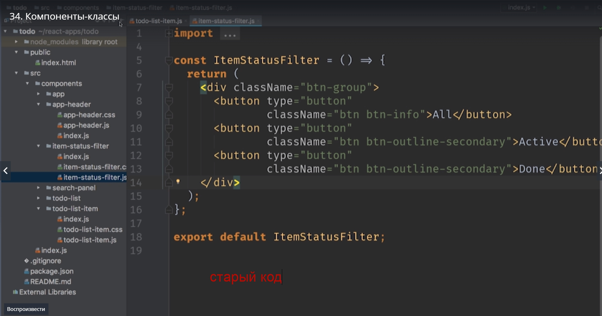

# Компоненты-классы (stateful компоненты)

В этом видио мы будем использовать синтаксис классов. 
До этого момента мы использовали функции для того что бы создавать свои компоненты.

Давайте вспомним как работает такой компонент.

Это обычная функция AppHeader которая принимает на вход объект со свойствами для компонента properties {toDo, done}. Как правило мы не используем объект properties а сразу же  дестриктурируем его и достаем нужное нам свойство что бы потом использовать в коде компонента. А возвращает эта функция react элемент.

Работать с функциями очень удобно. Они компактные и их легко использовать и тестировать. Но есть существенные ограничения.**У функций нет внутреннего состояния**. Т.е. нам некуда сохранить какие-нибудь свойства компонента которые могут изменяться во время работы программы.
Представте что нам нужно написать компонент для счетчика что бы считать количество кликов на кнопку и затем выводить это число.
Где бы вы хранили это число если вы используете функции?
В этом месте многие скажут почему бы не создать переменную и не объявить ее снаружи функции? Тогда функция может использовать эту переменную для того что бы хранить какое-то промежуточное значение.

Но конечно такой трюк не пройдет потому что все компоненты в счетчике будут использовать одно и то же значение переменной. А мы все-таки хотим иметь состояние для одного конкретного компонента.

В react есть второй тип компонентов. Компоненты основанные на классах. Классы используются когда у компонентов должно быть это внутреннее состояние. Большинство динамических интерактивных элементов будут иметь это внутреннее состояние и потому они будут компонентами классами. 
Давайте посмотрим на наше приложение и подумаем каким компонентам могут понадобится классы.

Первый и самый очевидный это **status-filter**

Ему неплохо было бы знать какая кнопка сейчас активна, что бы эту кнопку подсвечивать.
Второй хороший кандидат что бы иметь внутреннее состояние это todo-list-item, важный элемент списка.

Текущее состояние записи, является ли она важной и является ли она завершенной.

**Переделываем todo-list-item в class**

И так первое что мы сделаем. Создаем class Называем его как и компонент. И теперь для того что бы среда разработки не начала выдавать много ошибок я переименую функцию.

Второе что нам нужно сделать это наследовать в этом классе класс react-component

Теперь в класс TodoListItem не плохобы поместить какую-нибудь функцию которая будет отображать наш компонент.
И в классе такая функция будет называтся **render**

Копируем код и вставляем.

Единственная разница будет заключаться в том что теперь эта функция  render  не принимает на вход значение props.
Вместо этого все свойства можно получить через объект **this.props** это то место из которого мы можем получить текущее свойство.

Наш рефакторинг будет совсем маленьким. Мы просто возьмем названия свойств, которые до этого были объявлены в объявлении функции.

И деструктурируем их в начале нашей функции render и получим их из this.props.

и теперь эти два компонента абсолютно одинаковые.
посмотрим TodoListItem наследует React.Component. У него есть функция render которая работает точно так же как наша старая функция с одним только исключением. Вместо того что бы принимать props на вход

В классе props хранится в свойстве this.props.

и мы можем деструктурировать из них значения прям в первой строке этой функции.

Мы можем сделать этот код еще немного лучше если мы отдельно импортируем Сomponent.

Закрепим и переведем второй компонент **item-status-filter**. 

И так мы создаем класс Называем его именем нашего компонента. Наследуем (extends) React.Component. Kexit сразу импортировать компонент отдельным импортом.

Затем переносим функцию внутрь класса в котором находится функция render. Gt еносим в тело этой функции.

Ну и поскольку этот компонент не использует props нам не нужно менять тело функции. Если бы этот компонент все же использовал бы props,  то нам нужно было бы заменить обращение к props на обращение к this. И не забываем что export default мы можем поставить перед ключевым словом class.

Как решить какие компоненты использовать в своем коде? Компоненты основанные на классах или компоненты основанные на функциях? 
В своем коде я поступаю так. Если я в своем коде не вижу причин использовать компонент class, то я использую функцию. Затем если компоненту нужно работать с внутренним состоянием мы можем сделать небольшой рефакторинг и превратить компонент функцию в компонент class.

