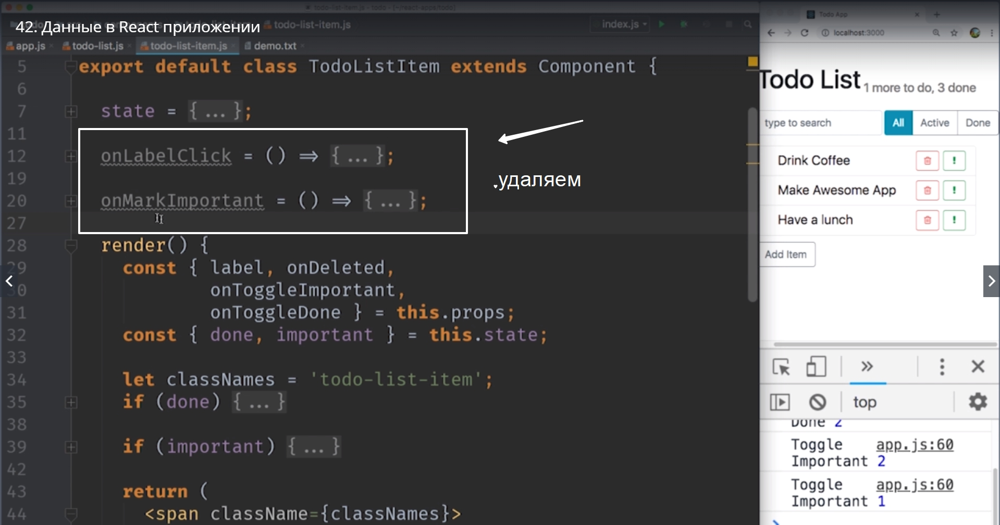

# Данные в react приложении

Сейчас сделаем этот компонент который показывает сколько еще элементов нам предстоит сделать, а сколько уже выполнено.

И как всегда перед тем как бросаться писать код давайте посмотрим на схему нашего приложения что бы придумать план как именно мы будем решать эту задачу.
и так вот схема нашего приложения

Сдесь нас интересуют две вещи. Это где в иерархии находятся те компоненты которые мы редактируем и где находятся данные которые нужны этим компонентам.

В первую очередь давайте посмотрим на **AppHeader**.

 И для того что бы сработать его компоненту или его parent-у **App** нужно знать о том какие именно элементы отмечены как **done** выполненные.
 
  А где у нас находится эта информация?

А эта информация находится в state состоянии TodoListItem

а именно в **done, important ?** совершенно в другом месте иерархии. Возникает закономерный вопрос. А каким образом мы свяжем эти два компонента **AppHeader** и **TodoListItem** которые находятся в разных частях иерархии приложения для того что бы данные из **TodoListItem**  каким-то образом попали в **AppHeder** или в **App**. 

И опять же ответ простой. **Ни как!!!**

Мы даже не будем пытаться связывать независимые компоненты. Потому что независмые компоненты это хорошо!!!!

В место этого давайте подумаем все ли хорошо с нашей моделью данных? И здесь возникает небольшая проблема. Все данные храняться у компонента **App**. Это как бы мастер, основной владелец данных. Все данные кроме параметров **done** и **important** которые оказались у нас в **TodoListItem**

В тот момент когда TodoListItem у нас был полностью независим и никакому другому компоненту эти данные, **done** и **important**, были не нужны это имело смысл.

Но теперь после того как мы написали еще немного кода  мы поняли что эти параметы, эти данные 

нужны и другим компонентам. И для того что бы наш **AppHeader** заработал, для того что бы мы могли красиво реализовать логику этого компонента вот эти параметры **done** и **important** нам нужно поднять на уровень **App** так что бы все данные, все свойства наших item были в одном месте. И тогда задача становится тривиальной (не оригинальной, банальной) если App будет знать сотояние done т.е. состояние данных каждого элемента. То он сможет обновлять наш **AppHeader** каждый раз когда состояние одного из элементов изменяется.

И так у нас есть план. Нам нужно пробросить наше кастомное событие каждый раз когда пользователь отмечает один из элементов как **done выполненное, или important важное.**

Точно так же как мы пробрасывали событие **onDeleted** от **TodoListItem ->TodoList -> App**

Сейчас мы пробросим еще два события это **onToggleDone** и **onToggleImportant**. Toggle - это тумблер,переключатель. Давайте начнем писать этот код сверху вниз начиная с **app.js**.

Для начала нам понадобится две функции которые мы будем вызывать только когда один из элементов стал **done** или **important**.

Пишем **onToggeImportant** этой функции нужно будет знать id элемента который сменил свой статус на важный. По этому в параметрах пишем **(id)**.

И вторая функция будет называться **onToggleDone** и точно также этой функции нужно знать id который сменил свой статус с **done** на **!done** с не выполненного на выполненное или наоборот. Работоспособность проверяем выводом в консоль. И естественно написать ввиде фукнции стрелок.

И как только мы увидим эти надписи в консоли это будет означать что App наш элемент на самом высоком уровне получает свои события.

И теперь передадим наши event lisener слушатель событий в элемент TodoList в функции render.

Для начала получим их из props

И теперь нам нужно вызывать эти две функции с правильными id точно так же когда мы удаляли элементы

Когда нам элемент **onToggleImportant** скажет что пользователь изменил его важность, мы вызовем **onToggleImportant с (id) элемента.** Для **onTogleDone** мы сделаем тоже самое.
**Теперь два event lisener** прошли от App к TodoList.
И последнее что нам нужно сделать это вызвать эти event lesener слушатели событий в **todo-list-item.js**. И там в функции render пишем

И затем в компонентах когда у нас возникают события которые мы раньше обрабатывали локально и обновляли наш state.

И перед тем как мы перейдем к следующему шагу. Когда элемент App yf нет обновлять свой собственный state зная что один из элементов стал done или important

Теперь почистим этот код поскольку появилось несколько классов которые мы не используем

Кроме того наши done и important не управляются внури нашего TodoListItem Они будут приходить сверху из props.

Достаем их из props

Теперь наш state вообще не используется, поэтому он нам больше не нужен

И вот в этом месте у нас больше нет state

Единственная функция которая осталась в нашем классе это функция render. И если мы хотим этот компонент класс **TodoListItem**

мы можем отрефакторить назад в компонент функцию

