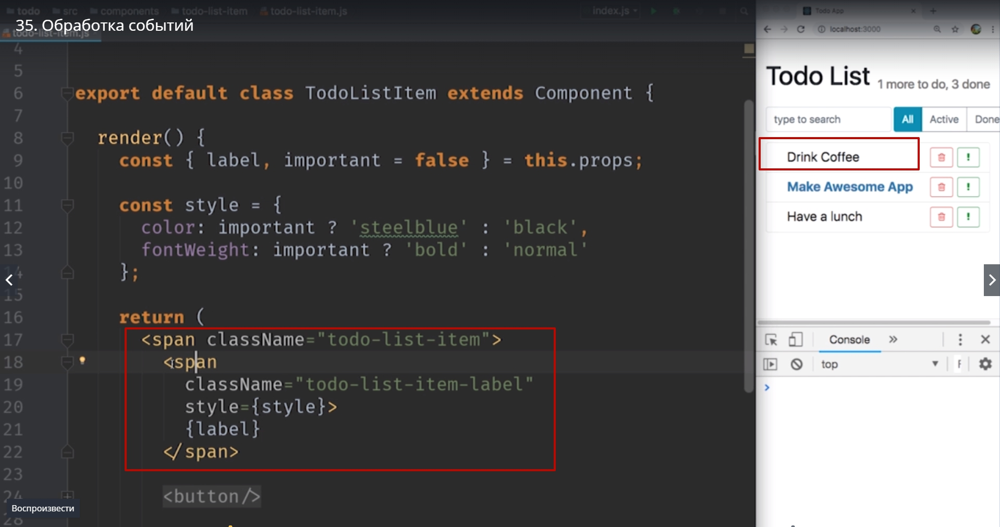
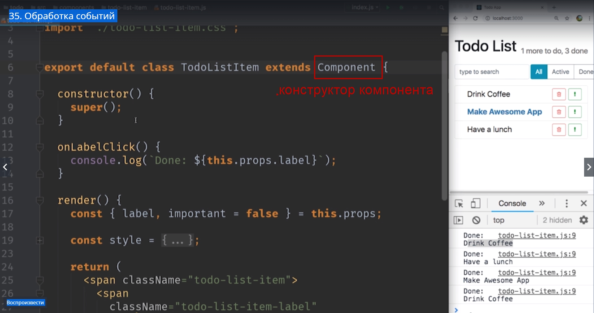
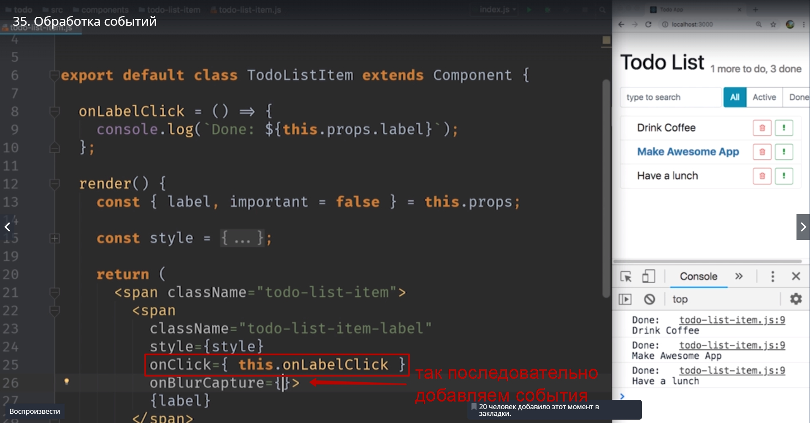

# обработка событий 

Мы дошли до того места. Мы сделаем наше приложение интерактивным и дать пользователю кликать по элементам списка что бы отмечать эти item как сделанные.
И для того что бы это сделать нам нужно научиться обробатывать событие клик. Мы посмотрим как отлавливать и получать это событие. А затем научимся как сохранять внутреннее состояние компонента т.е. сохранять информацию о том выполнена наша задача или  нет и обновлять интефейс соответственно.

Вот наш компонент todo-list-item с которым мы будем работать. Зарегестрировать обработчик событий совсем не сложно. Достаточно добавить свойство **onСlick** к нужному элементу и передать туда функцию.
Я хочу что бы при клике на сам текст Drink Coffee мы могли отмечать элемент как завершенный. Этот элемент находится в отдельном span



Мы его специально кинули в отдельный span. Поэтому мы находим этот спан, в котором находится {label}. ДОбавляем обработчик


Делее передаем функцию, не строку. И в этой функции мы можем что-нибудь полезное вывести. Например выведем в консоль.


Это делается для того что бы мы знали что мы кликнули по нужному элементу и получили нужное событие.


```
export default class TodoListItem extends Component{
    render(){
const {label, important = false} = this.props;
const style {
    color important ? 'steelblue' : 'black';
    fontWeight: important ? 'bold' : 'normal';
};

return(
    <span className="todo-list-item">
    <span className ="todo-list-item-label"
    style={style}
    onClick={()=>console.log('Done: ${label}')}>
    </span>

    //done- сделанный

    <button/>
)
    };
};

```


Вот мы получили сообщение что мы поймали нужный клик.


Все элементы отлавливают клики. И у нас теперь есть способ что-нибудь написать полезное в этой функции, а не только **Done**.

Писать код обработчика прямо вот сдесь


в JSX  довольно не удобно. Намного **удобнее будет создать отдельную функцию в классе и передать эту функцию в onClick**.

Создаем отдельную функцию и называем ее **onLabelClick** для того что бы вы понимали что именно клик на label эта функция обрабатыват. И переносим этот код


Заметьте мы передаем функцию. Мы не вызываем ее, не пишем сдесь круглые скобки(), если мы напишем круглые скобки мы передадим ничего **undefined** в **onClick**. Мы передаем саму функцию. Это имеет большое значение в JS. 

При сохранении кода выдало ошибку


>Именно по этому кстати в компонентах **class** не передается **props** в функцию **render** поскольку **props** нужен и других функциях. И поэтому **props** сохраняют в качестве свойства в классе.


Идем в наш браузер. Обновляем его для того что бы опять получить наше приложение. И теперь заходим в инструменты разработчиков для того что бы отладить эту ошибку.


И сдесь нам нужно найти наш файл.


Находим нужную строчку И поставить туда **BreackPoint**.


Кликаем по одному из item и смотрим что же собственно не так. Кликаем, срабатывает наш BreackPoint.


Эта часть смущает **this: undefined**. У нас this перестал быть собственно компонентом TodoListItem. Он стал undefined. Почему же это произошло?

Возвращаемся в код и смотрим.

Когда мы передаем функцию **this.onLabelClick**


эта функция не сохраняет связи с объектом в котором она была создана. Т.е. когда эта функция вызывается **this** пропадает. И вместо того что бы this был **TodoListItem** он становится **undefined-не определенным**. 

Но почемуже небыло ошибки в нашей предыдущей версии кода когды мы использовали **Function arrow** Функцию стрелку. 
Все дело в том что функция стрелки работает иначе и они сохраняют лексический **this** т.е. значение this внутри функции стрелки будет точно таким же как значение this  в том месте где эта функция была объявлена. Соответственно в функции **render**, **this** -это правильный объект и внутри функции стрелки он тоже был правильным.

**Но для обычных функций такое свойство не работает.**

Есть несколько способов исправить этот код.
1.-й самый не красивый это использовать функцию **bind** для того что бы намертво привязать this внутри onLabelClick к правильному значению this к собственно к объекту.


Сохраняем код и убеждаемся что все работает.


Но такой способ не очень!!! Она хороша тем что каждый раз когда мы будем вызывать функцию **render**. Внутри этой функции будет создаваться новая функция которая будет оборачивать onLabelClick


Именно так работает **bind**. Bind rf;lsq раз создает новую функцию. Т.е. каждый раз когда мы вызываем render мы создаем новую функцию  только для того что бы this внутри этой функции был правильным.

Есть намного элегантный способ добится того же эффекта. Для этого давайте добавим в наш class **constructor**


Помните, если наш класс наследует какой-то другой класс. То в конструкторе мы должны вызывать с помощью ключевого слова **super**  конструктор суперкласса т.е. конструктор компонента.



Он должен отработать в нашем констукторе.
И прямо за вызовом супер конструктора давайте напишем такой вот код **this.onLableClick**


Таким образом мы создадим функцию onLableClick не на прототипе класса как в этом случае


а на самом объекте и мы ее объявим как функцию стрелку что бы this внутри этой функции сохранялся правильно и копируем наше значение.


 и теперь нам не нужно использовать bind dyenhb onClick

 

 И есть еще 3-й способ написать этот код. Использование части языка которое еще не является частью стандарта. Это свойство называется **Поля классов** или **class filds**. Когда этот проползал войдет в стандарт. 
 сдесь мы использовали конструктор исключительно для того что бы поместить в него функцию.
 С пропоузелом class filds мы можем объявить функцию прямо в теле класса. Удаляем конструктор и на его месте пишем

 

 И этот код тоже работает.

 

 На самом объекте создается функция onLabelClick и поскольку это функция стрелка, она сохраняет значение this. Поэтому мы можем не бояться что если мы передадим эту функцию внутрь

 

 то this будет безвозвратно потерян.

 И вот таким способом мы и будем добавлять event lisener на элементы.

 

 Если вы хотите писать код немного более консервативно используйте вот такой вот подход

 

 Создавайте ваши lisener в конструкторе и используйте функцию стрелки для того что бы сохранить this.

 Давайте вспомним. Для того что бы зарегестрировать event lisener мы используем **on** и название события в верхнем регистре, в данном случае Click.
 Ну и точно таким же способом можно добавлять другие события

   

Любое событие которое мы можем использовать в DOM можно использовать и с react элементом. 
Ну и наконец мы готовы к тому что бы обрабатывать это событие правильно и отмечать наш элемент как завершенный.

