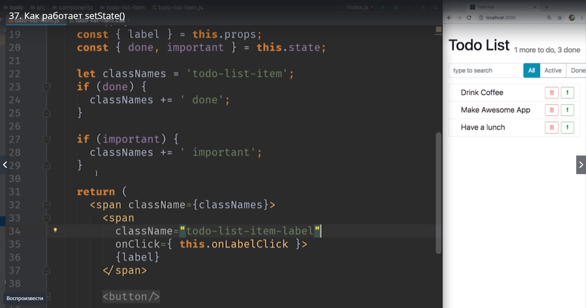

# Как работает setState()

>**setState- перевод  установить состояние**

Для того что бы понять как работает функция setState давайте добавим еще какой-нибудь элемент в наш объект state.
К примеру мы можем сделать так что бы пользователь нажимая на кнопку с восклицательным знаком устанавливать важность вашего элемента т.е. отмечать его как важный.

Давайте добавим еще один элемент **impotant** и по умолчанию он тоже будет **false**.

Теперь вернемся в нашу функцию **render** и сдесь в первую очередь вынесем important из props поскольку теперь он будет не в props а в state.

и мы получим important(важный) из state.
Теперь давайте сделаем еще одну вещь в style вместо того что бы использовать вот такую конструкцию

и формировать стиль прямо в элементе. Мы сделаем наш код немного чище и точно так же как мы добавляли **className** на **done**

добавим **className** на **important**.

в css если наш todo-list-item отмечен как **important**

то  **todo-list-item-lable** нужно отрисовать

возвращаемся в наш код и удаляем блок кода style

Добавляем еще один блок который проверяет если это важный элемент **if(important)** то тогда **classNames** присваивает еще один класс который называется **important**.

нам нужно починить ошибку!!!

Теперь при нажатии на нашу зеленую кнопку мы должны вызывать setState и устанавливать important в true.

Давайте зайдем на найдем правильную кнопку

И В атрибут добавляем onClick и в нем создаем отдельную функцию  и назовем **onMarkImpotant**

Теперь неплохо бы создать эту функцию иначе работать наш код не будет.
Создаем эту функцию в нашем todo-list-items и используем синтаксис полей классов еще раз для того что бы точно знать что внутри этой функции this никуда не подевается. Мы передаем эту функцию  как event lisener, т.е. слушатель событий,

Нам важно какое будет значение this когда эта функция будет реально вызываться.

И точно так же мы пишем **this.setState** но в этот раз мы говорим что мы хотим менять не done а **important** на истину **true**.

Обратите внимание на то как мы использовали setState. Когда мы добавили элементы к текущему state

мы не обновляли предыдущие вызовы setState

SetState принимает только ту часть state которая должна изменится. т.е. когда мы в этой функции меняем значение important

нам не нужно передавать значение done. 
Этот новый объект как бы наложится поверх существующего state, по верх существующего состояния.
Это очень удобная осовенность react которая защищает от ошибок и позволяет писать куда более чистый код.

Итог этого видео. setState принимает не полный state а только те значения которые нужно изменить, а react  в свою очередь позаботится о том что бы объеденить текущее значение с новыми.

 
