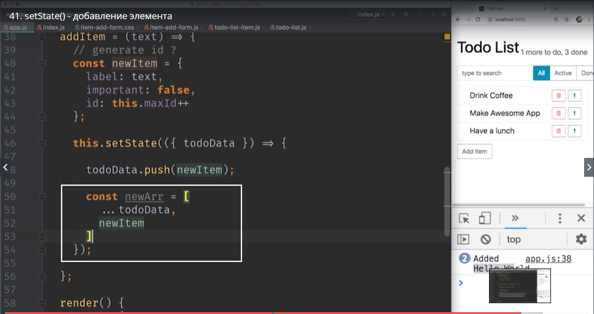

# setState() - Добавление элемента

Наши уроки которые мы посвятили удалению элемента из списка были довольно сложными. Мы скомбинировали две разных техники.
1. Это кастомный event, кастомное событие, которое мы используем для того что бы передать данные от элементов внизу иерархии к элементам вверху иерархии т.е. поднять как бы данные вверх. Мы передаем данные от listItem

когда мы его удаляем, Вверх до самого App.js

для того что бы App мог обновить свой state состояние.

2. Важная техника на которую мы посмотрели это то как обновлять state когда он немного более сложный, не просто переменные а к примеру массивывы. И мы узнали что массивы нельзя изменять. Мы можем только создавать новые массивы и для того что бы это сделать мы использовали вот такой подход

мы использовали данные из старого массива **...todoData.slice(0, idx);**,  затем опять данные из старого массива **...todoData.slice(inx+1)** для того что бы сделать новый массив без нужного элемента.

Теперь пройдемся по тем же шагам для добавления новых элементов в todo список.
Мы пока не будем делать функционал который позволит пользователю вводить текст в форму для того что бы добавлять новый элемент в элемент списка поскольку мы пока что не знаем как работать с формами. Но покрайней мере сделать кнопку при нажатии на которую мы будем добавлять новый элемент с любым вообще текстом это будет вполне полезно для того что бы закрепить материал.

Первое что нам нужно сделать это добавить новый компонент в котором будет одна кнопка **addItem**.

Это будет форма когда-нибудь которая будет добавлять новый item в список. В этой папке мне понадобится 3-ри файла.

Первый index.js который существует исключительно для того что бы импорты работали удобнее.

В item-add-form.js  создадим тот самый компонент который мы добавим. Импортируем react. **import React,{Component} from 'reacr';** не забываем {Component}. Cltcm мы немного мухлюем. Мы сделаем этот компонент state full, полное состояние. Если вы сделали компонент функцию то тоже будет работать. Мы сделаем этот компонент **class**.

Далее пишем **export default class ItemAddForm extends Component** т.е. экспортируем по умолчанию class ItemAddForm который рассширяет Component.

Внутри компонента нам нужна функция render. И в этой функции возвращаем какой-нибудь div. Незабываем дать диву **className** даем как имя класса **item-add-form.** И внутри дива создаем кнопку которая будет содержать текст **Add Item**

Теперь пробуем этот элемент пробросить через **index.js** В файле импортируем класс ItemAddForm из нашего файла с этим компонентом **item-add-form.js** и прописываем относительный путь к этому файлу для того что бы экспорт прошел нормально

И да мы забыли прописать экспорт css файла в наш файл с компонентом **item-add-form.js**.
В нем пишем **import './item-add-form.css';**.
Возвращаемся в наш **App.js** и так же импортируем **import ItenAddForm from '../item-add-form';**

и теперь давайте этот **item-add-form** где-нибудь под TodoList будем использовать

Даем правильные классы из bootstrap для кнопки.

Теперь второй шаг. Нам нужно сделать так. Когда мы нажимаем на эту кнопку наш компонент **app** получал **event**, событие, и знал что мы хотим добавить новый todoItem к списку.

И так написать этот код совсем не сложно.
Создаем событие,**event**. В **ItemAddForm** пишем onItemAdded={} и внутри пишем вызов функции которую мы еще создадим **this.addItem**.

А теперь нужно создать эту функцию.
AddItem это функция будет принимать текст, пока что мы его передавать не будем, передадим случайный. А сдесь в компоненте App vs уже будем писать код таким каким он будет в конце. Пока мы просто выведем в консоль.

После создания функции в app.js  мы возвращаемся в  item-add-form.js и делаем так что бы это событие действительно было. 

Нам нужно добавить event lisener, слушателя событий, событие клика на кнопку. Мы скажем **onClick = {() => this.props.onItemAdded('Hello World')}**

когда дойдем до работы с формами у нас сдесь будет нормальный текст а не Hello World.

Теперь наш компонент знает о том что мы хотим добавить новый Item и текст этого Item Hallo World.

Dct что нам осталось сделать это реализовать функцию **addItem**

И в этом случае ситуация немного интереснее. Эта функция на самом деле состоит из 2-х частей. Первое что нам нужно сделать это сформировать вот такой вот объект

И нам его совсем не сложно сделать. label это тот текст который у нас пришел с формой. important по умочанию пускай будет false. А вот id нам каким-то образом нужно сгенертровать самостоятельно для того что бы они были уникальными в рамках вот этой коллекции 

поэтому в функции addItem нам нужно сгенерировать id а затем нам нужно добавить в массив 

И давайте решим первый вопрос. Как сгенерировать id. НА самом деле подходов может быть много. Начиная с того что мы могли написать случайный id, получать его каждый раз random случайный id. И заканчивая тем что мы можем генерить последовательно id. Или вообще использовать какой-нибудь сторонний модуль UI id  который сгенерирует id  для нас уникально.

Мы будем генерировать id  последовательно.

Создаем поле класса **maxId = 100;**  начинаем генерить id с 100-го. Можно было 4-ку поставить. Мы не будем сильно связывать их с теми id которые уже имеются.

Чаще всего id будут генерится сервером. То что мы сейчас сделаем это исключительно для демонстрации работы react.

И так у нас есть все для того что бы создать новый элемент. 

**const newItem ={}** и перечисляем поля labal, important и id. label это текст, important это ложь, с id это this.maxId ++

И в этом месте можно подумать что мы насильно изменяем состояние класса. Насамом деле maxId++ это не состояние класса. Он не находится в объекте state

Поскольку maxId ни как не влияет на рендеринг, он не в state, он находится просто в самом классе maxId. И эти поля в maxId  мы можем менять как угодно. Итак эта операция id:this.maxId++. 

B вторая чать нашего пазла. Это как добавить этот item в массив. И помните мы не можем изменять предыдущий массив.

Cоответственно нам нужно написать **this.setState(({todoData}) =>{});** И вот в теле этой функции нам нужно вернуть новое состояние

Если бы нам можно было изменять массив который мы получили на вход. Мы могли бы сделать это водну строку

Давайте вспомним предыдушее видео когда мы удаляли. Мы брали все элементы до удаленного, а затем все элементы после удаленного

А теперь давайте мы используем абсолютно такую же технику. Абсолютно тотже spread оператор для того что бы добавить элемент к массиву. 
Новый массив у нас будет состоять из всех элементов старого массива + новый элемент.

Мы говорим **сonst newArr =** это новый массив [], который состоит из всех элементов старого массива todoDate, и нового newItem.

И теперь мы возвращаем новое состояние state.

