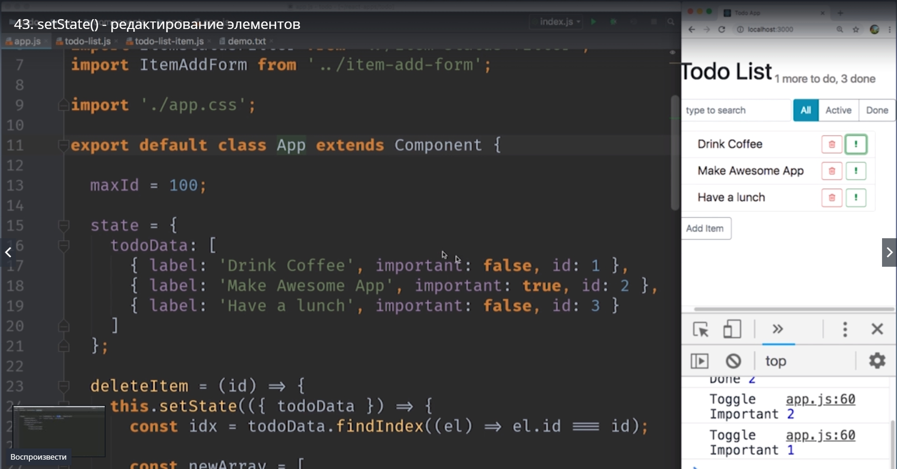
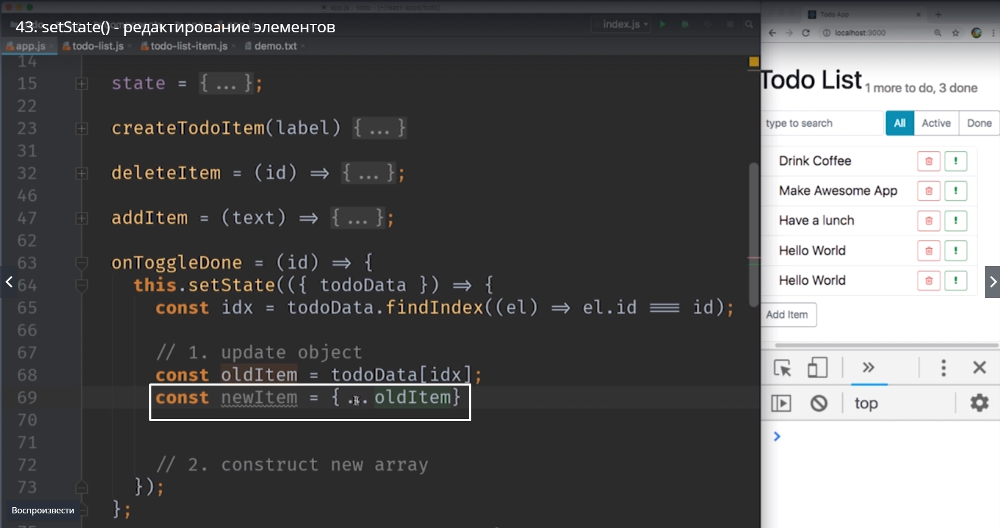

# Редактирование элементов

И так мы начали исправлять нашу ситуацию с данными. Мы передали в App два события **onToggleImportant** и **onToggleDone**

который в свою очередь может использовать для того что бы обновить свой state, свое состояние. А  именно **todoDate**

перредается в качестве **props** <реквизит, в TodoList 

А **TodoList** в качестве props передает конкретные элементы этого todoData каждому индивидуальному **TodoListItem**

И именно таким способом TodoItem будет получать информацию о том что он стал важным или он стал выполненным.

Мастером данных или их владельцем будет компонент **App**

Сдесь мы научимся что бы **App** обновлял свое состояние state когда ему приходит информация что один из элементов стал выполненным или важным done or impotant.

Давайте немного обновим наш код этого компонента

В первую очередь у каждого элемента Todo списка 

появятся новые свойства которые будут называться **done,true или false**. 

И перед тем как мы начнем. Смотрите у нас есть несколько мест в котором мы создаем элементы todo списка. Вот эти места

где мы инициализируем первые элементы что бы хоть что-то отрисовать в нашем приложении.

И вот это место где мы добавляем новый элемент newItem

Почему бы нам не сократить немножечко кода который у нас дублируется и создать отдельную функцию которая умеет создавать новый элемент для нашего todo списка.

Создаем. Пишем **createTodoItem** этой функции нужно знать только текст этого item ну или label.

Теперь везде где мы создаем элементы можем использовать эту функцию

и еще одно место где убираем дубликацию кода это в функции addItem

теперь newItem это будет вызов функции this.createTodoItem(text);

Теперь наш state создается из функции и у нас нет дублирующихся объектов.

Остался еще один вопрос. А как нам все таки onToggleDone и onToggleImportant?

Помните наше золотое правило ? Мы не можем изменять старый state.

Поэтому в функции onToggleDone пишем стрелочную потому что старый массив нам еще нужен. функцию this.setState(() =>{}) передаем в параметры старый state который мы не можем изменять todoDate.

Давайте разобъем нашу задачу на две подзадачи. 1-я задача нам нужно обновить объект в нужном месте массива.
и 2-я задача нам нужно сконструировать новый массив поскольку мы не можем изменять существующий массив. А изменение объекта, который находится внутри существующего массива тоже считается изменением текущего state. Поэтому делать это мы ни как не можем.

Как нам поступить? Давайте для начала найдем id нашего элемента

И далее этот id со старого массива запихиваем в константу.

Отлично у нас есть наш Item.

Чего мы делать не можем?  Мы не можем писать что-то вроде **OldItem.done = !OldItem.done;** потому что в этом месте 

мы присваиваем старому state какое-то новое значение, а этого делать мы не можем.
В место этого нам нужно создать новый объект который имеет все те же свойства со всеми теми же значениями что и старый объект OldItem кроме свойства done.

И сделать это очень просто использую object.spread оператор.
Первое что мы делаем это создаем **const newItem** и мы говорим что **newItem** это тоже самое что и **oldItem**

Теперь мы создали объект у которого все теже свойства что и у oldItem. А если после этого oldItem мы добавим еще одно свойство, то это свойство перезапишет соответствующее свойство которое мы скопировали до этого.

И это свойство **done** которое должно быть другим противоположное oldItem.done.

И так у нас есть новый элемент который точно такой-же как старый элемент, кроме значения done которое стало обратным.

И так теперь у нас есть новый элемент который точно такой же как старый элемент кроме значение done которое стало обратным с помощью оператора **not !**.

Старый элемент при этом мы не изменяли мы просто взяли из него ключи и значения и скопировали в новый объект.

Теперь нам нужно сконструировать новый массив. 
Давайте еще раз посмотрим как мы реализовали удаление.

Новый массив это старый массив до нужного индекса **todoDate.slice(0, idx)**. А потом старый массив с нужного индекса **todoDate.slice(idx+1)**.

А что если мы с вами возьмем этот код и скопируем в объект **newArray**. Но этот код удаляет элемент. 
А теперь на место удаленного элемента мы поставим наш **newItem**

Получается что мы создаем новый массив со всеми значениями которые были в старом массиве до того элемента который мы хотим обновить

Затем мы вставляем новый элемент, который точно такой же как старый  только с противоположным значением **done**.
И затем мы вставляем все остальные элементы из todoData которые идут после обновленного элемента.

И последнее что нам осталось сделать это вернуть новый state

Сохраняемся и проверяем работоспособность.

Теперь если мы посмотрим на схему нашего приложения 

TodoListItem теперь не отвечает не за какие данные. Все данные принадлежат компоненту App

Поскольку мы знаем что то значение которое находится в state App это окончательное и правильное решение. Больше нет ни одного места в приложении которое может содержать какое-то другое значение наших пераметров. 
Теперь у App есть вся необходимая информация что бы посчитать сколько именно item у нас в состоянии done.

Теперь снова обновим неш компонент App. И сделаем что бы в методе render AppHeader

что бы AppHeader  получал не числа которые мы ввели для того что бы показать хоть какие-то числа, а реальные значения из массива.

Как нам получить какое количество сейчас done?

Да просто. **сonst doneCount =** и количество выполненных элементов будет вот таким this.state.todoData.filter(). И в параметрах пишем условия. мы найдем все элементы todoDate которые удовлетворяют вот такому условию. Это должны быть элементы у которых done.true. **((el) =>el.done).lenght**

Заметьте filter создает новый массив поэтому му не изменяем state.todoDate. В новом массиве мы сохранили те элементы в которых есть значения done, которое true и затем мы посчитали длинну массива.

И нам осталось посчитать количество item.
**const todoCount = this.state.todoDate.lenght - doneCount** т.е. длинна всего массива минус количество выполненных.

Давайте сделаем чище этот код. Поскольку мы везде используем todoDate давайте вынесем его в качестве отдельной переменной.

И давайте не забудем про второй параметр **onToggleImportant**. Теперь нужно реализовать похожий код. И то чего не хочется делать это брать код из **onToggleDone**, копировать этот код в **ontoggleImportant** и заменять там один едиственный параметр, там где мы устанавливаем **done: !oldItem.done**. Значение done в !oldItem  должно быть другим. А весь остальной код станется одним и тем же.

Поэтому мы сделаем отдельную функцию которую мы назовем **toggleProperty()**. Эта функция будет принимать на вход массив с которым мы будем работать, id элемента который мы будем изменять, и имя property которое нам нужно изменить с true на  false или в обратную сторону.

F так же будем переиспользовать эту функцию в **onToggleImportant**.

 И немного поправить название перпеменных.

 

 Теперь эту функцию можно вызвать из setState когда нам нужно будет изменить свойства

 

 

 

 

 Мы разобрали как обновить элемент внутри массива когда нам нужно сменить свойство объекта и это самый сложный keys обновления state. Т.е. если у вас в state есть массив, внутри этого массива находяться объекты, и нам нужно изменить свойства одного объекта нужно быть очень осторожным что бы не изменить ни один элемент старого state.

 И с помощью этого блока кода

 

 мы добились этого эффекта.

 
 