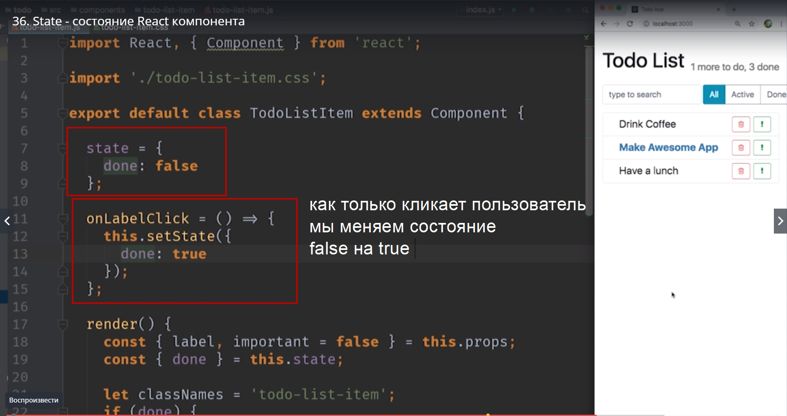

# State - состояние react компонентов.

Основная причина использовать классы вместо функций для создания компонентов. Это возможность хранить внутреннее состояние компонента.
В этом видио мы посмотрим как использовать это внутреннее состояние. Что бы позволить пользователю отмечать наши элементы списка как выполненное. Как только пользователь будет кликать по элементу списка мы будем его зачеркивать.

Делать это мы будем очень просто. Если мы добавим к span на верхнем уровне еще один класс **done**

То наш css сделает всю работу за нас.

Осталось решить как по клику пользователя добавлять этот класс к нашему span.

В react  внутреннее состояние компонента хранится в специальном поле, которое называется **state**. Его можно инициализировать в конструкторе. И выглядеть это будет вот так.

И затем state Должен быть обязательно объектом в котором мы можем сохранить любую необходимую информацию для того что бы наш компонент работал. Для нас state будет совсем маленьким. Мы хотим создать там только одно свойство **done** и оно по умолчанию будет **false**. Таким образом мы инициализируем state. Ну и конечно нужно вызвать **super constructor** если мы используем синтаксис констуктора.

Если же вы не боитесь использовать эксперементальные фичи JS и использовать тот синтаксис который еще не вошел в стандарт, то вот это определение можно вынести на уровень самого тела класса.

Таким образом мы можем избавится от конструктора. И такая инициализация практически эквивалентна инициализации в конструкторе.

Теперь мы можем написать немного кода в функции **render** для того что бы в зависимости от значения которое находится внутри **state** 

мы добавляли или не добавляли или не добавляли класс **done** к спану.

И так первое что надо сделать. Используем синтаксис деструктуризации для того что бы достать **done** из **this.state**

Теперь мы можем использовать этот **done** для того что бы сформировать список классов которые мы присвоим к нашему спану. 

Наш **span** в любом случае должен содержать **todo-list-item** в качестве своего класса. Заносим в переменную ана как минимум будет равна **todo-list-item**

И сразу же в коде ее начинаем использовать. Вызываем эту переменную.

Обновляем и смотрим что ничего не поломалось.

Теперь в зависимости от того **done** этот item или не **done**.  Мы к classNames можем добавить еще один класс который так и называется **done**

Переодически обновляем наш код и смотрим поломали или нет. 
И теперь заменим в инициализации **state** false на true для того что бы посмотреть что наш код действительно что-то делает.

И да как только мы заменили наше внутреннее состояние  и сказали что **done** присваивает **true**, наши item  отметились как выполненные.

Кажется этот код работает. Но мы хотели из менять класс только когда пользователь кликает мышкой на компоненте.
Давайте добавим последний кусок нашей мазайки на установку состояния по клику.
**В react  есть одно очень важное правило!**
После того как мы впервый раз проинициализировали **state**

его больше нельзя изменять напрямую. 
Его можно читать так как мы делали в функции **render**

Но напрямую устанавливать **state** больше нельзя.

Для того что бы установить **state** Нужно использовать специальную функцию которая называется **this.setState()**. 

И в эту функцию мы можем передать объект с изменениями которые мы хотим внести в **state**.
Что мы хотим поменят? Для начала меняем наше дефолтное состояние на false

Когда пользователь кликает на нашем label мы сменим состояние **done:true**

Теперь когда мы кликаем по label  срабатывает **onLabelClick**. Он в свою очередь выполняет **setState**, а setState говорит react что состояние этого компонента изменилось, пожалуй стоит его перерендерить, пожалуй нужно заново вызвать функцию **render**. React  вызывает render и render возвращает новую структуру для нашего компонента. 
В нашей маленькой структуре мы меняем только один маленький аспект **className**

React запускает свой алгоритм и находит что у этого элемента изменился класс. И react обновляет только этот маленький параметр в DOM дереве и после этого наш элемент на страничке получает новый класс и теперь он выглядит зачеркнутым. Мы можем поклацать по другим элементам для того что убедиться

