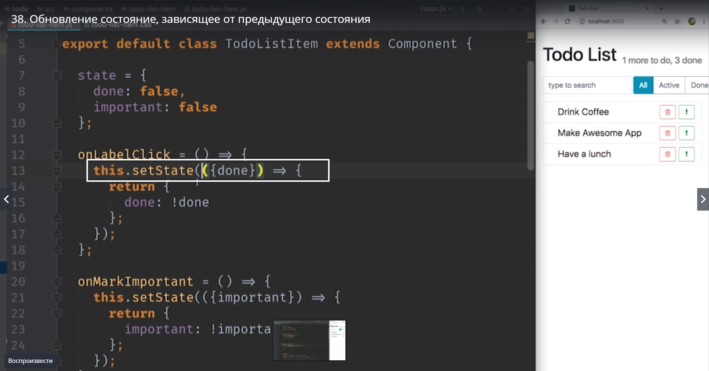

# Обновление состояния, зависящее от предыдущего состояния.

Давайте сделаем наше приложение еще немного дружественнее для пользователя. Мы разрешим пользователю менять состояние с важной назад на не важную. 
Смотрите если мы кликнем на эту кнопку


то назад состояние кнопки не вернется. Оно так и останется важным. Это происходи потому что мы вызываем setState  и всегда говорим ему **important : true** не зависимо от того какой **state** был до этого.


Мы научимся как переключать с true на false и в обратную сторону.
Наверняка хочется написать вот так


Использовать ! для того что бы повернуть в обратную сторону  с true на false и в обратную сторону. 
Но такой код не верный. Дело в тои что функция **setState** иногда может работать асинхронно. Не всегда, не каждый раз, но в некоторых случаях setState является асинхронной функцией. И поэтому безомасней считать что тот **state** который вы устанавливаете, он устанавливается не моментально, а может быть установлен позже. 
И таким образом когда пользователь кликает на кнопку и мы вызываем **onMarkImportant**


В этот момент значение **this.state** еще может быть не обновленным. 


т.е. возможно еще есть какой-нибудь кусочек state который не был присвоин this.state.
Зачем react так поступает? React делает это для оптимизации производительности. К примеру react может объеденять несколько вызовов setState и потом перерисовать элемент один раз или реализовывать другие очень интересные оптимизации. К примеру дать более высокий приоритет на перерисовку тем элементам которые сейчас видны на экране. Другими словами мы не можем расчитывать когда мы вызываем setState наш текущий state уже в самом свежем последнем состоянии.

Как же быть?
Что бы исправить это нам нужно вызвать setState немного иначе. Вместо того что бы передавать в функцию новое состояние. Вот эту дельту которую мы хотим обновить.


мы передадим в setState еще одну функцию которая в свою очередь принимает наш текущий state. 
Когда мы передаем в setState функцию


что этот код, этот state, нужно выполнить только тогда, когда наш текущий state уже будет в его финальном состоянии и его можно будет использовать для того что бы вычислить новый state. т.е. всегда когда вы вычисляете новый state, в зависимости какое текущее значение нашего state,  нам нужно использовать вот такую форму


setState принимает функцию **(state)** , в функции получаем наш текущий **state** и возвращаем точно такой же объект как раньше

```
return{
    impotant: !state.impotant
}

```


Сохраняем наш код и смотрим.


Этот код безопасен для react. Jy Осегда будет исполняться корректно. 
Этот аспект react который может стать причиной ошибок которые будет очень тяжело поймать, поскольку они будут проявляться не всегда. 

setState работае асинхронно не всегда. И код который написан неправильно, код который напрямую устанавливает state, чаще всего будет срабатывать корректно, но иногда он будет давать нам те самые ошибки которые очень-очень сложно отловить.

Давайте дадим пользователю еще изменять и выполненность задач.


Изменим наш код. Только мы из state деструктурируем **({done})**


И в теле функции мы говорим что мы возвращаем объект **done** в котором **done** это **не done** т.е. мы меняем его на притивоположное значение.


Давайте повторим еще раз поскольку это действительно один из самых-самых важных аспектов react. В этом месте react разработчики которые только-только начинают писать код очень часто допускают ошибки.
Поэтому повторимся еще раз.
***Если ваше новое состояние ни как не зависит от предыдущего состояния. Вы можете использовать setState и передавать внутрь объект.****
Если же состояние зависит от предыдущего. R примеру вы хотите изменить значение с true на false или обратно c false на true. Или вы хотите увеличить счетчик на еденичку. Или сделать любое другое действие основанно на текущем значении state, а не которое полностью незвисимо, нам обязательно нужно использовать вот эту форму setState



Передавать внутрь этой функции другую функцию, которая будет вызвана тогда когда state готов.


