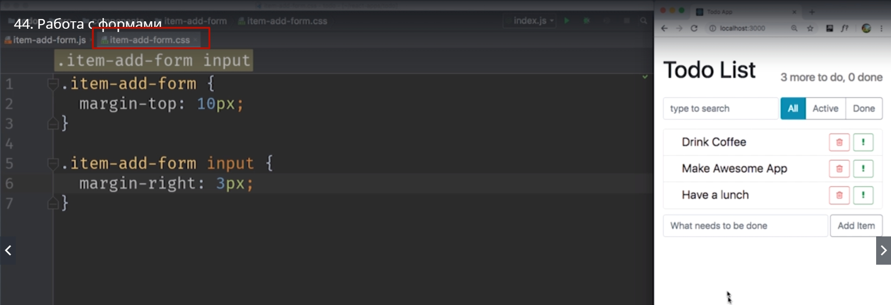
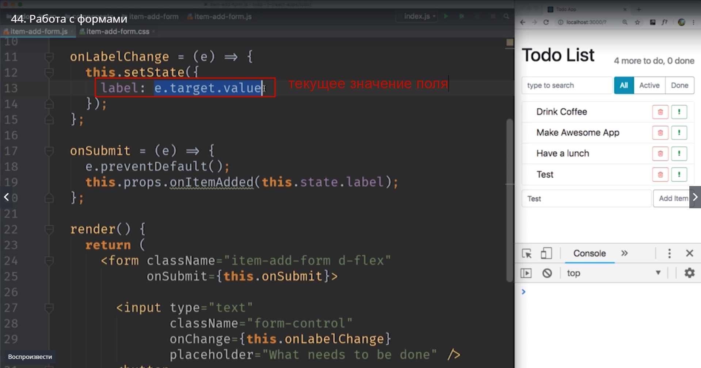

# Работа с формами

Пришло время добавить самый последний элемент. А именно форму для добавления нового item.

До этого мы сделали кнопку для добавления. Однако она добавляет элементы с одинаковым названием.

Давайте добавим поле для ввода нового названия, и сделаем так что бы пользователь мог эти самые названия редактировать.

И для того что бы сделать, нам нужно разобраться как работают в react формы.
Для начала давайте сделаем что бы наш div был на самом деле формой.


И добавим в этот элемент еще один input




Теперь в эту форму можно вводить какие-нибудь значения.

Оставшийся вопрос? Как сделать так что бы вводимое значение наш react компонент узнавал как самое свежее значение в этой форме. И именно для этого мы добавили слушателя событий event lisener.


Давайте теперь добавим функцию **onLabelChange**. "nf функция будет вызываться каждый раз когда наш input изменяется.


К примеру как пользователь нажал несколько кнопок и допечатал несколько символов.

Кстати если в том видео где мы добавляли кнопку для создания новых item вы создали этот компонент


Как компонент функцию. Сейчас самое время превратить его в компонент class. Поскольку для того то бы сохранять текущее значение формы нам потребуется state.

Создаем функцию. Пока эта функция не будет делать ничего, просто выводить что-то в консоль.

```
onLabelChange = () => {
console.log('.');
};


```

Начинаем писать какие любо значения. Смотрим что счетчик увеличивается, а значит каждый раз когда я нажимаю какую нибудь букву, дописываю хоть что-нибудь в текстовое поле эта функция вызывается


Отлично. Наш event событие работает.

И так как достать событие которое сейчас есть в input?
Каждый event licener, т.е. каждая функция


принимает на вход принимает специальный объект который называется **event**. Этот объект содержит в себе информацию о том какое именно событие  наступило и детали этого самого события. К примеру для события **onMouseMuth** это event  будет содержать информацию о том какие координаты мышки. А для события **onChange** из этого event


мы легко сможем вытащить для начало свойство target, в переводе цель, тот самы input  который изменяется, а затем через свойство value мы можем получить его текущее значение


Давайте теперь начнем печатать что-нибудь в input, b посмотрим что начнет отображаться в консоли.


т.е. наше текущее значение полностью печатается в консоли.


Как видите для каждой буквы которую я ввожу **onLabelChange** и вот это выражение **(e.target.value)** содержит текущее значение поля ввода. 

Давайте теперь сохраним это значение в state. Для начала проанализируем state. И скажем что label с самого начала это пустая строка.


И как только у нас появляется событие. Как только label изменяется мы используем **event** **onLabelChange**. Удаляем наш вызов в консоль и пишем вызов state  а имеено **this.setState()** и в этот раз поскольку наш state не зависит от предыдущего state, мы можем просто передать туда объект **label: e.target.value**


Кстати теперь мы можем делать интересные штуки. Например, мы можем вывести значение этого label прямо на форме и показывать его в тот же момент когда мы печатаем.


Но нам не нужен  такой эффект.

Нам нужно передать значение label


в тот момент когда пользователь submit-ит , размещает в эту форму. Т.е. когда он нажимает на кнопку **add Item** либо нажимает Enter в форме.

Для того что бы правильно обработать отправку формы нам нужен **eventOnSubmit**.
Как мы знаем форму можно отправить несколькими способами. Можно мышкой кликнуть на кнопку addItem, а можно нажать Enter пока мы находимся в поле ввода. Многие начинающие разработчики совершают эту ошибку. Для обработки формы они добавляют событие **onClick** на саму кнопку add Item. 
Мы тоже так делали в тот момент когда у нас небыло формы.
Обрабатывать результаты этой формы нужно в событии **onSubmit**.
Добавляем в форму событие **onSubmit** и вызовем функцию которую так и назовем **this.onSubmit**


Давайте создадим нашу функцию **onSubmit** которая принимает event


теперь если мы написали наш код правильно, то пользователь сможет добавить свой собственный item.
То что мы пишем добавляется но тут же исчезает. Если вы заметили в тот момент когда мы нажимаем Enter, сразу буквально через доли секунды, после того как item появляется, моя страница перезагружается.

Так что же сдесь происходит? Дело в том что изначально в браузерах формы были созданы для того что бы отправить данные на сервер и перерисовать новую страницу т.е. фактически отправка формы отправляет наш браузер на другую страницу. И это совершенно не то чего мы хотим по singglePageAplication в SingglePage приложении. Поскольку в нашем приложении не нужно перезагружать страницу для того что бы обработать форму. Мы ее можем обработать и так.

Для того что бы отменить перезагрузку страницы мы можем использовать объект event который получает наш **eventLisener**. У объекта **event** есть специальный метод который называется **preventDefault()**. 


Этот говорит браузеру когда этот event **e** будет обрабатываться действие по умолчанию т.е. **Default** выполнять не нужно.Для формы по умолчанию это именно отправка данных на сервер и перезагрузка страницы. 
Соответственно если мы скажем **preventDefaulf** браузер не будет перезагружать страницу.


ВКРАЦЕ ПОВТОРИМ.
Для того что бы получать текущее значение input


мы используем событие onChange


И каждый раз когда это значение input меняется мы вызываем нашу собственную функцию


и использую объект event **e** мы достаем из него текущее значение поля.



Затем нам нужно добавить event  onSubmit для того что бы отловить тот момент когда пользователь отправляет форму


Это может произойти когда пользователь нажимает Enter в поле формы или когда он кликает на кнопки в форме. и тогда мы говорим preventDefault для того что бы страница браузера не обновлялась. И далее мы передаем значение из нашего label из нашего поля ввода


Ну и затем компоненты выше по иерархии знают что нужно сделать когда пользователь создает новый item


