# ECMAScript 2019

# ключевые слова let и const

Они пришли на замену старому **war** которое раньше применялось для создания и объявления переменных. Современные среды разработки даже подсвечивают **war** как **warning** предупреждение. 

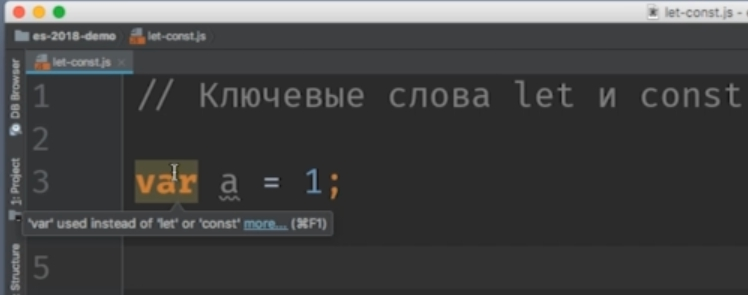

давайте посмотрим как писать код с использованием **let** и
**const**.

lдлятого что бы создать переменную, то что будет изменяться, мы используем **let**

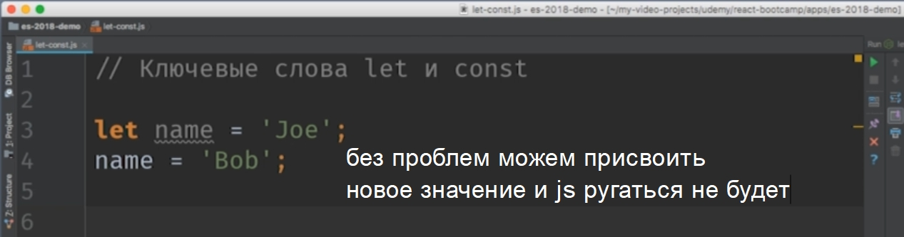

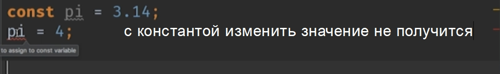

Стоит более детально остановится на ток как именно работают в js rj станты. Если вы работаете с числами, булевыми значениями или строками то тут все просто. Константа означает что значение переменной нельзя изменять.

Но если вы работаете с объектами, массивами то тут ситуация немножко интереснее.

```
const name = ['Peter','Bob'];
```
Слово **const** означает что мы не можем присвоить новое значение для имени массива **name**. Но мы можем изменять содержимое этого массива.

```
const names = ['Peter','Bob'];

names.push('Jeny');
сonsole.log(names);
```
При добавлении нового имени у нас не возникает ни каких проблем.

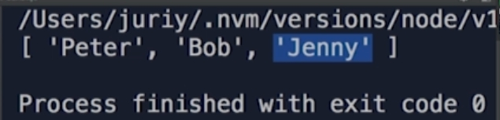

но если мы попытаемся присвоить что - то 

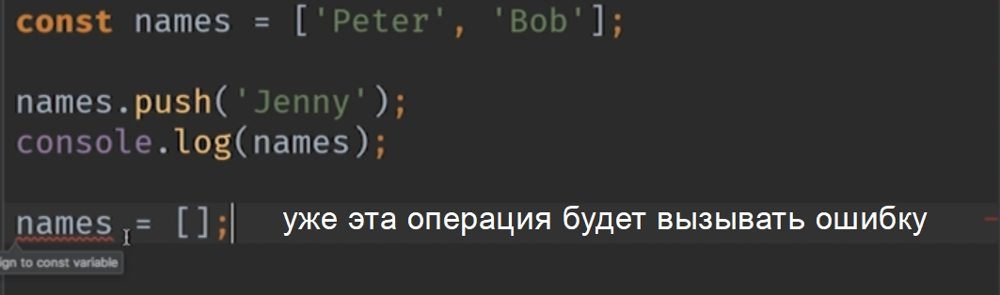

потому что мы пытаемся изменить константное значение.

С объектами принцып точно такой же. Если у нас есть константный объект

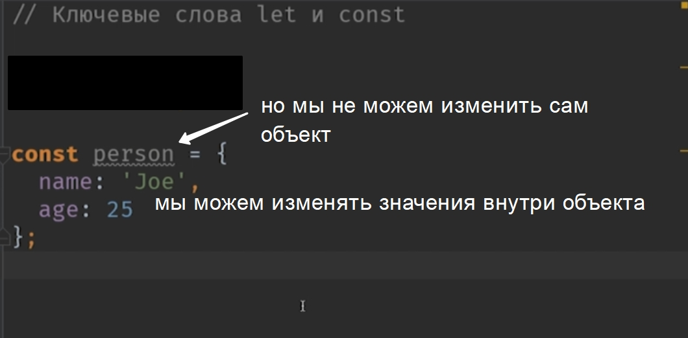

т.е.
```
person.name = ['Bob']; // т.е. такая операция будет абсолютно валидна

person = ['Alice']; а такая уже невалидна, потому что person у нас является константой и присвоить новое значение мы не можем
```
В современном JS является хорошей практикой использовать ключевое слово **const** везде где можно обойтись без **let**.
Некоторые делают так, сначала объявляют константу, а если потом оказывается что значение константы все - таки нужно изменить, то меняем объявление с **const** на **let**

Чем же был плох **war** что от него решили избавиться?
Проблемой в том что областью видимости переменных объявленных с помощью **war** была вся функция. В то время как **const** и **let**  видны только в рамках блока кода где они  объявлены.


за праделами блока кода эта переменная уже не видна.

Из - за такой мелочи некоторые блоки кода вели себя скажем так весьма оригенально.

```
for(var i = 0; i < 3; i++){
    setTimeout(function(){
        console.log(i)
    },i*100);
}

```
Уменя код не запускался потому что ругался на то что нельзя запускать функцию в цикле. Для игнора поставил коментарий строкой выше и вывел не в консоле а в браузере

```
for(var i = 0; i < 3; i++){ // eslint-disable-next-line
  setTimeout(function(){
      document.write(i)
  },i*100);
}

```
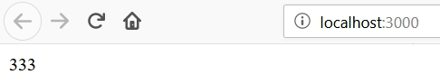

выводит 3 тройки вместо 0 1 2.

Совершенно не тот результат который мы ожидали. 

Существует лишь один адрес памяти в которой содержится это значение i 

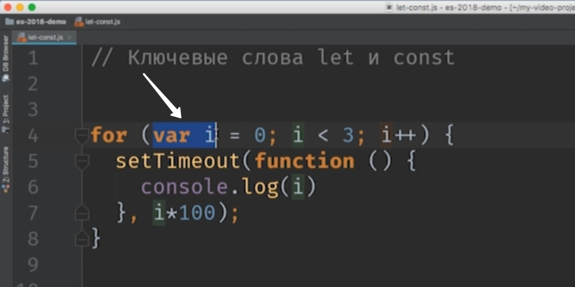

Соответственно через 100 милисекунд, когда будет выводится значение первый раз, значение i уже будет равно 3. Потому что к тому моменту цикл закончит свою работу. Через 200 милисекунд мы запустим функцию которая выведет значение из абсолютно тогоже места в памяти. И это значение все равно будет 3. Ну и точно так же сработает 3-я функция.

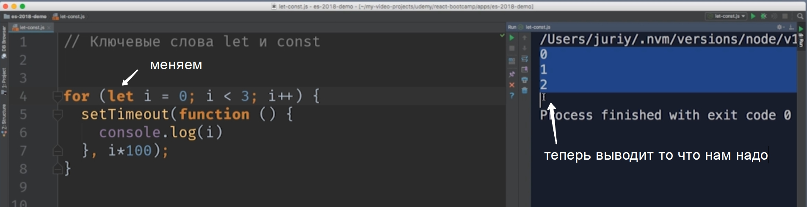

Дело в том, что поскольку облость видимости **let** это блок кода

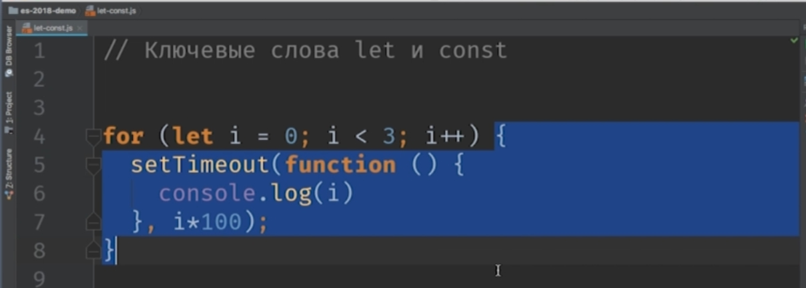

в каждой итерации цикла создается новая переменная т.е. новый адрес памяти который и будет использоватся внутри функции.


****


#  arrow-функции

Как вы знаете в JS функция является объектом. Это очень удобно.
Функции можно передавать в качестве аргументов в другие функции. Можно присваивать их как значение переменным. Можно возвращать как результат из других функций.
Эта особенность JS позволяет писать очень элегантный код. но до **ECMAScript 2015**  код выглядел несколько не уклюже из - за того что для объявление функции нужно было использовать ключевое слово  function 

```
function square(x){ // нужно было использовать function
    return x*x     // и кроме того для того что бы вернуть значение нужно было использовать ключевое слово return
}

```
В **ECMAScript 2015** ввели новый упрощенный синтаксис для функций который выглядит немного компактнее и красивее. 

Эта осовенность языка называется **Функция стрелки** или **Arrow functions**
Создать такую функцию достаточно просто. Нужно указать список аргументов в скобках, а затем поставить стрелочку которая состоит из знака  = и >.

```
const sq = (x) => x*x; // компектнее не правда ли  
 сonsole.log(sq(3)); // теперь эту функцию можно использовать как обычную функцию
```

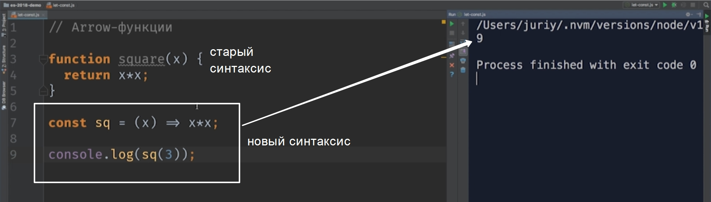

и даже эту функцию можно еще сократить. Если данная функция принимает один, и только один параметр.

```
const sq = x => x*x; 
```

Теперь напишем немного кода что бы посмотреть на сколько  удобно использовать функцию стрелки. Давайте предположим что у нас есть массив который состоит из нескольких строк в которых записаны числа.

```
const arr = ['1', '2', '3']; 
```

А теперь посмотрим как при помощи функции стрелок можно преобразовать этот массив строк в числа, а затем найти максимальное не четное число.

```
const arr = ['1', '2', '3'];
сonst res = arr.map((el) => parseInt(el))

```
ntgthm у нас есть массив чисел. С помощью функции **map** мы пробежались по каждому элементу массива. Далее создается новый массив заменяя прежние элементы на то что нам возвращает функция внутри **((el) => parseInt(el))** el gh нимает элемент массива и через parseInt возврашает этот же элемент только в виде числа.

Что нам стоит сделать после этого?

```
const arr = ['1', '2', '3'];
сonst res = arr.map((el) => parseInt(el))
.filter((num) => num%2)
.reduce((max,value) => Math.max(max,value),0);
console.log(res);
```
Далее исполюзуем функцию **.filter**. Она снова пробежится по элементам массива  и те элементы массива для которых вернется **true** jyb останутся. Внутри прописываем Функцию строелку которая уже примет число (num). И если число остаток от деления этого числа на 2 будет не четное число то его следует оставить. За тем использую функцию **reduce** для того что бы найти максимальное значение. Она прибежится по каждому элементу массива и выполнит функцию которую я сейчас передам. Первыф параметр это максимальное значение, второй значение. И далее передаем что функция должна возвращать новый максимум т.е. если больше чем пердыдущий максимум и в параметрах так же указываем максимум и значение. B после всего этого мы должны указать с какого числа он начал проверку.

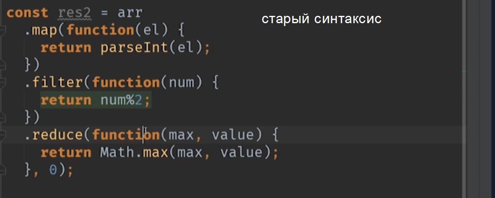

Функция стрелки не обязательно должна состоять из одгой строки.

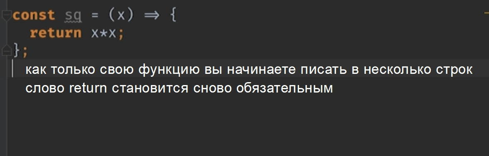

Но самая классная особенность функции стрелок заключается в том что они сохраняют значение ключевого слова **this**.

xn  вывведет данная функция

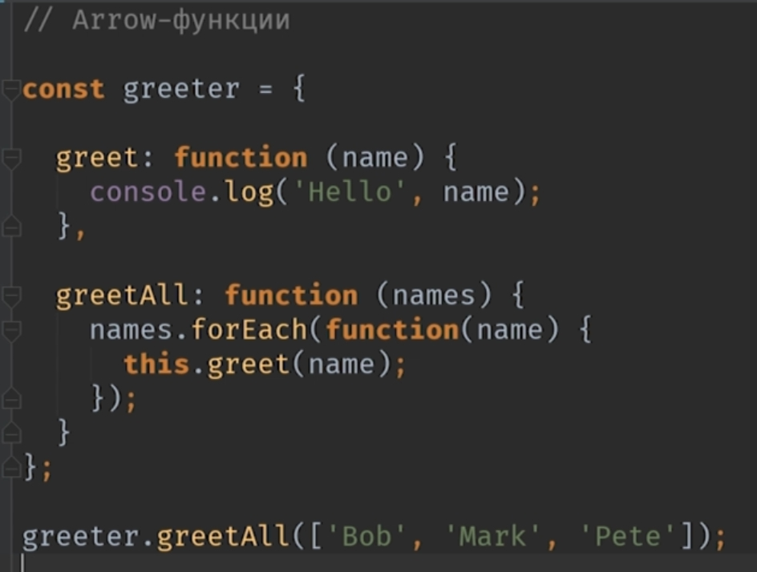

выведет сообщение об ошибке

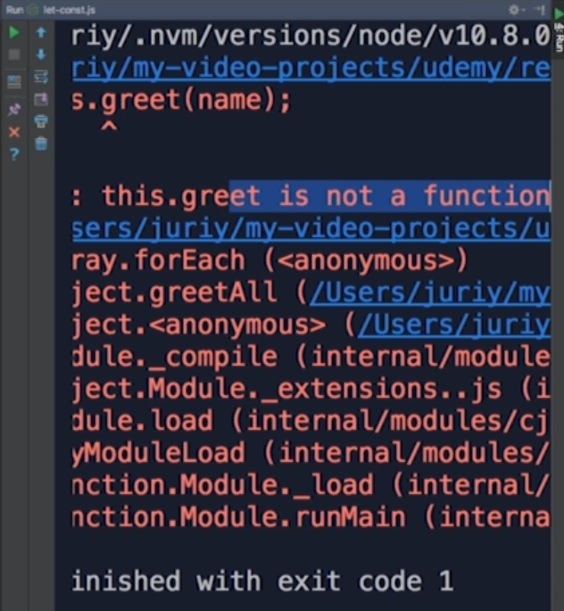

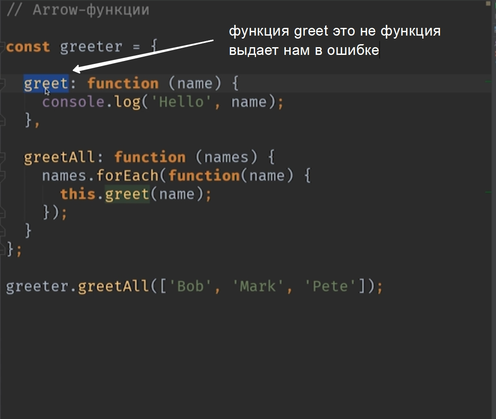

Все очень просто. когда мы вызываем greetAll это все еще наш объект this 

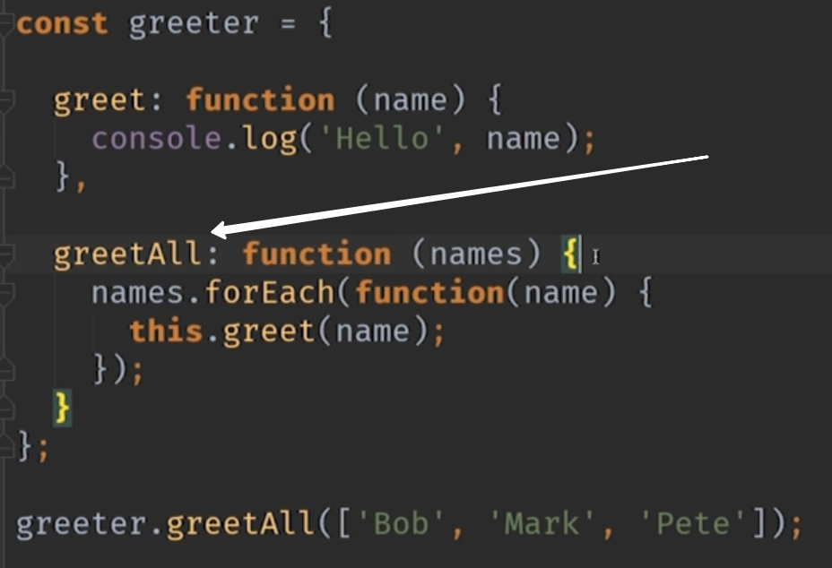

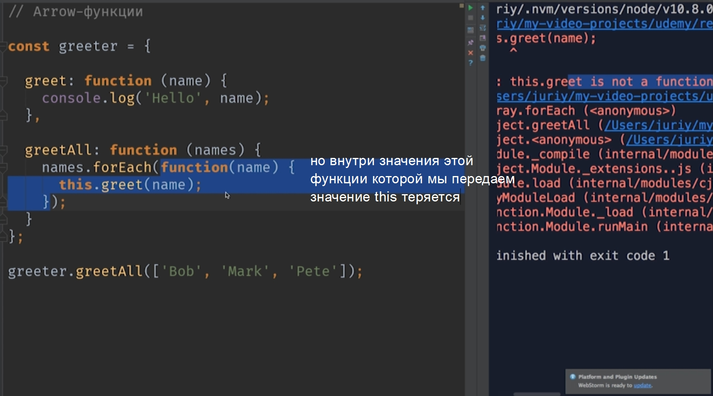

По этому это уже не будет объект greeter CjjndtncndtyyСофункцию greet vs здесь найти не сможем, но как только мы заменим эту функцию на функцию стрелку Ситуация существенно упроститься потому что функция стрелки сохраняет значение лексического this 

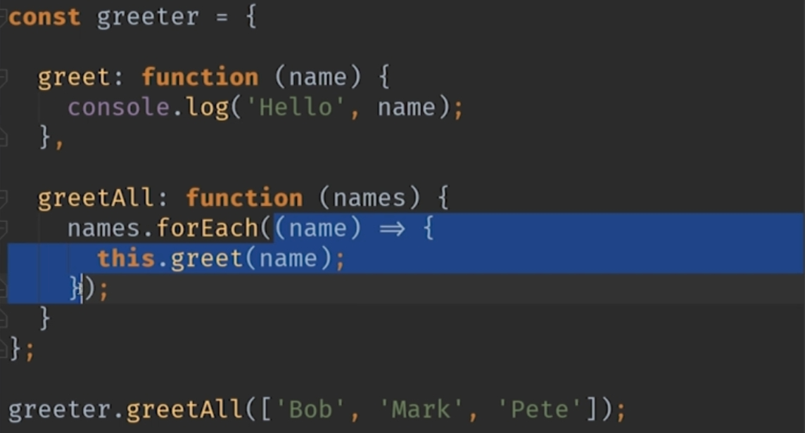

т.е. внутри функции стрелки this будет ровно тоже  чем в том месте гда мы его объявляем т.е. внутри функции greetAll 

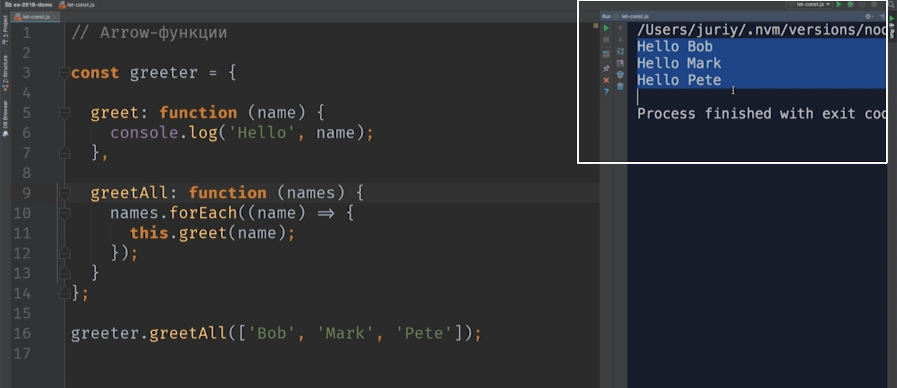

Функции стрелки позволяют избежать многих ошибок. Очень удобно что бы передавать их в качестве аргумента другим функциям. Или для того что бы регестрировать ее как обработчик событий eventListener vjue ошибится.

Есть еще несколько незначительных отличий между обычными функциями и функциями стрелками о которых нужно помнить.

1. у функции стрелок нем свойство protoType. Он используется для объектно ориентированного программирования, для того что бы добавлять туда новые функции.
2. 


****
<br/><br/><br/><br/><br/><br/>

# параметры по-умолчанию

 когда вы создаете функции часто бывает так что не все параметры обязательны. Для удобства можно давать параметры по умолчанию. Вот к примеру функция которая подключается к базе mySql 
 ```
 connectToDb('localhost', 3306);
 ```
 Чаще всего mySql запущен на порту 3306 это дефолтный порт для mySql соответственно пользователи вашей функции будут передавать это значение в вашу функцию.
 Соответственно ее можно упростить и не заставлять ваших пользователей каждый раз передавать это самое очевидное значение и установить его параметром по умолчанию.

 В старых версиях JS если параметр был опциональным, то код что бы его установить был похожим на такой.

 

 У нас есть два значение count и start мы сравниваем его со значением undefined. Если эти значение действительно undefined, не null а именно undefined то мы присваиваем значение по умолчанию.

 Этот код плох сразу по двум причинам. Во первых блоки которые устанавливали значение по умолчанию они дублировались в каждой функции. Во вторых эnjn код не семантический т.е. вместо того что бы  передавать смысл того чего мы хотим достичь. А смысл установить значение по умолчанию если параметра нет.
 Мы здесь вместо этого описываем механику того что мы делаем для нашей цели.
 После обновления объявлять значения по умолчанию для опциональных параметров стало совсем просто.

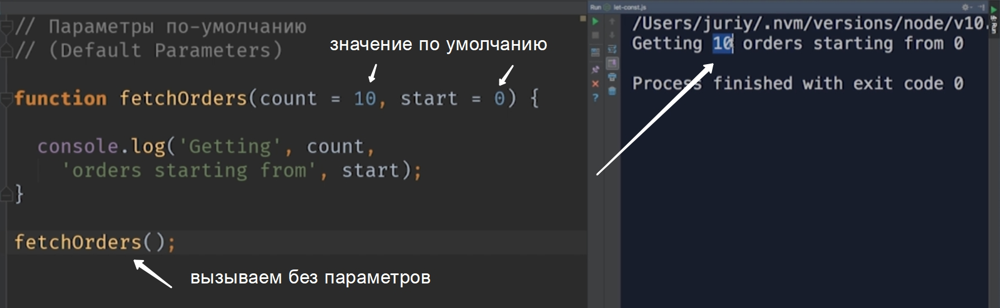

Но если мы передадим все же параметр

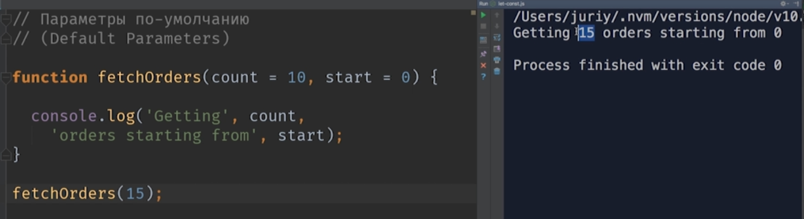

то то значение которое мы передадим, перезапишет значение по умолчанию. 
Соответственно второй аргумент мы тоже можем передать и тогда значение по умолчанию не будет использоваться.

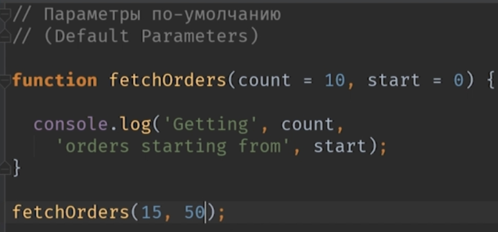

Значение по умолчанию не обязательно присваивать.

Чаще всего значения по умолчанию будут идди последними в вашей функции. Почему? JS ghпсваивает значения слево на право

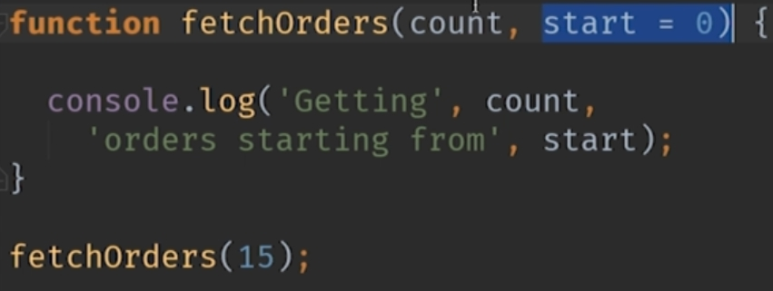

если мы сделаем параметр по умолчанию первый

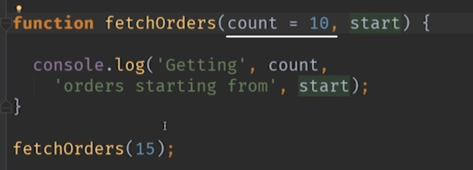

ТО в каких случаях он будет реально срабатывать?

Он будет срабатывать если вы вызываете функцию без параметров, то тогда первый count будет иметь значение по умолчанию 10, а второй останется undefined. 
KbЛибесли мы в явном виде в качестве первого параметра передадим undefined.

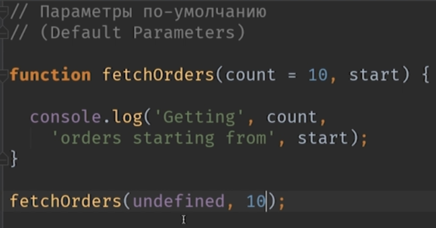

если значение null задается обычным значением

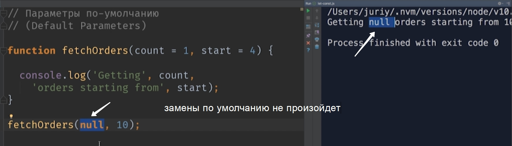

**Только undefined  заменяется на значение по умолчанию**

Значение по умолчанию могут иметь совоершенно любой тип это могут быть числа, булево значение, строки, функции или объекты.

**Функция которая по умолчанию имеет объект**

```
function findProducts(opts{minPrice:10, maxPrice: 20}){
    console.log(opts);
    
 findProducts();   
}
```
Cоответственно если мы вызовем эту функцию без аргументов вообще, то значение по умолчанию будет присвоено первмому аргументу.

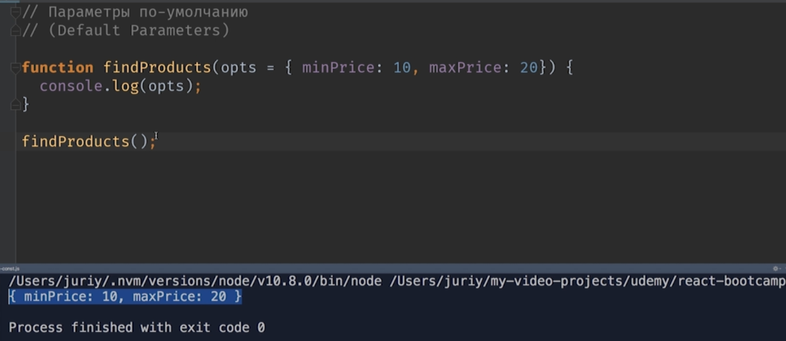

то тем неменее если мы передадим какой-нибудь объект, даже пустой

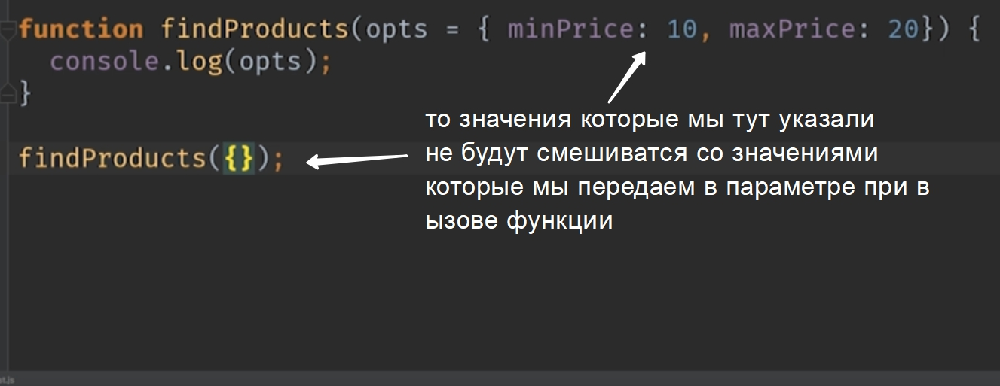

т.е. либо будет использоваться полностью вот этот объект

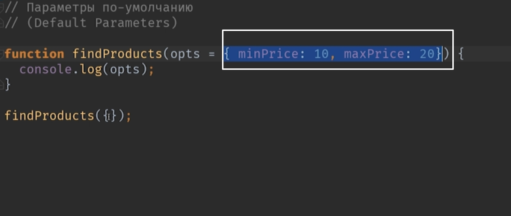

Либо будет использоватся тот объект который мы передаем в параметрах при вызове функции.

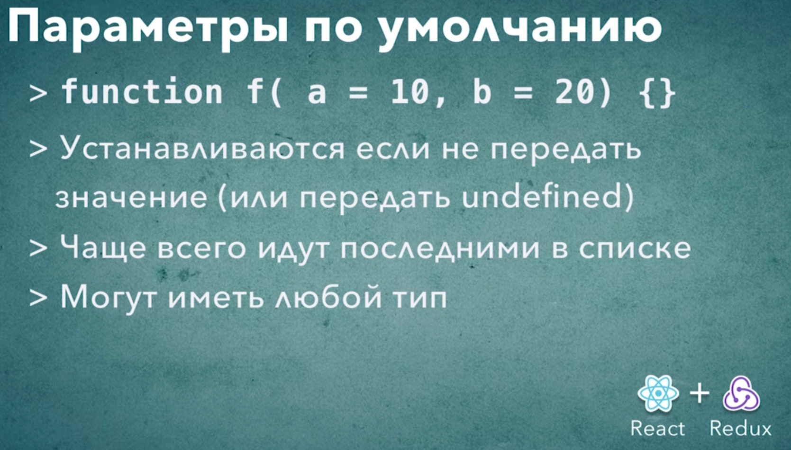

****
<br/><br/><br/><br/><br/><br/><br/>


# Rest параметр

Как вы знаете в JS в функцию можно передать любое к-во аргументов независимо от того сколько параметров вы объявили в этой функции. Это дает возможность писать интересные функции которые работают с переменным количеством параметров.
К примеру можно написать функцию которая будет находить максимальное число, из списка, тех которые вы передали.

```
max(1, 3);
max(1, 2, 3, 4, 5);

```
b такая функция смоглабы работать как с двумя параметрами, так и тремя, или четырьмя или с пятью.

До ECMAScripr 2015 что бы реализовать такой код необходимо было использовать объект arguments.
Т.е. функция могла выглядеть приблезительно так


В первую очередь нам нужно было добыть все эти аргументы. Нет смысла их объявлять поскольку вы не знаете сколько в действительности их будет roneTime. YfН нужно было использовать массив arguments. Проблема заключалась в том что arguments это вовсе не массив!!! ЭТО ПСЕВДОМАССИВ!!!! 

```
max(1, 3);
max(1, 2, 3, 4, 5);

function max(){
// pseudo-array
var numbers = Array.prototype.sice.call(arguments);
}
```

И для того что бы сконвертировать его в обычный массив необходимо было написать вот такую не красивую строку кода  которую вы часто могли встречать в старом JS. Соответственно что бы исправить  этот недостаток  и сделать работу с переменным количеством аргументов немного удобной в ECMAScript 2015 добавили еще одно нововведение. Оно называется **rest параметр** 
Это особый параметр функции который групперует в массив, настоящий массив все те аргументы которые небыли присвоены обычным параметром. И используя новый синтаксис Функцию, что выше, можно было бы написать так.

```
max(1, 3);
max(1, 2, 3, 4, 5);

function max(...numbers){

}
```
Теперь не зависимо от того сколько чисел  мы передадим в функцию, они все будут сгруппированы в массиве **numbers**.

Давайте проэксперементируем.

```
function max(...numbers){
console.log(numbers);
}

max(1, 2, 3); //вызываем эту  функцию и пропишем допустим 3 параметра
```
Теперь давайте попробуем вызвать эту функцию с одним аргументом

```
function max(...numbers){
console.log(numbers);
}

max(1); 
```

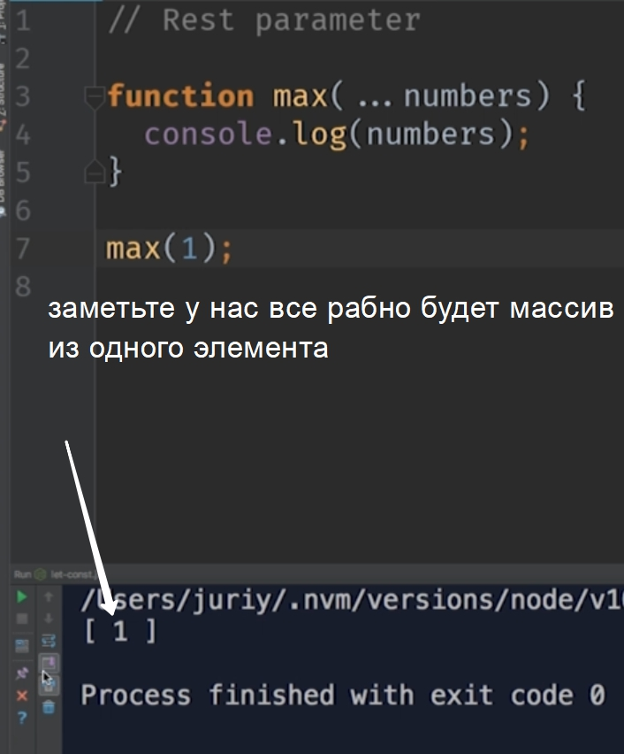

Не смотря но то что у нас аргумент 1 будет не число, а массив который содержит единственное число.
Но и самая лучшая особенность **rossarguments** Это то что если не будет аргументов вообще.

```
function max(...numbers){
console.log(numbers);
}

max(); // в numbers выведет пустой массив
```

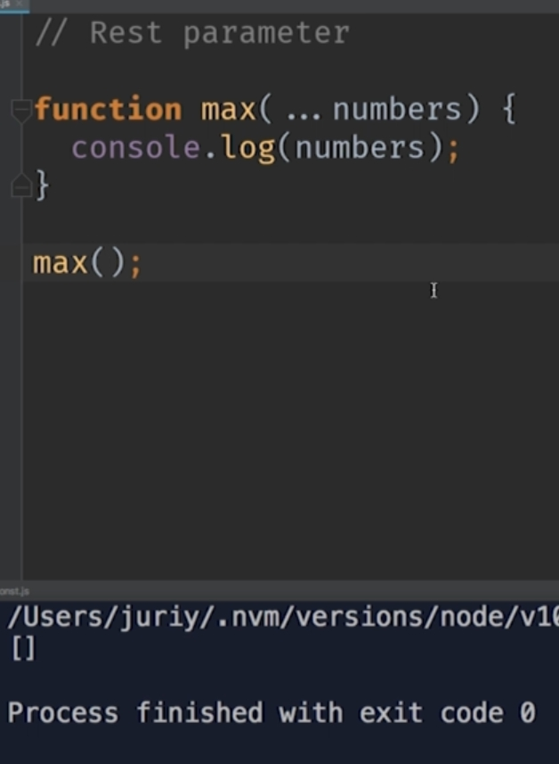

т.е. это не будет **undefined** и нам не нужно писать код который будет проверять **defined**  он  или **undefined**.Все равно будет массив даже если аргументов там нет.

Перед rest параметром могут идти обычные параметры функции
и выглядеть еэто будет приблизительно вот так.

```
function max(a, b,  ...numbers){
console.log(numbers);
}

max(1, 2, 3); // то аргумент 1 пойдет в а, аргумент 2 пойдет в b, а 3 будет единственным элементом массива numbers
```
```
function max(a, b,  ...numbers){
console.log(numbers);
}

max(1, 2,); // и если на numbers не хватит аргумента, на выведет пустой массив
```

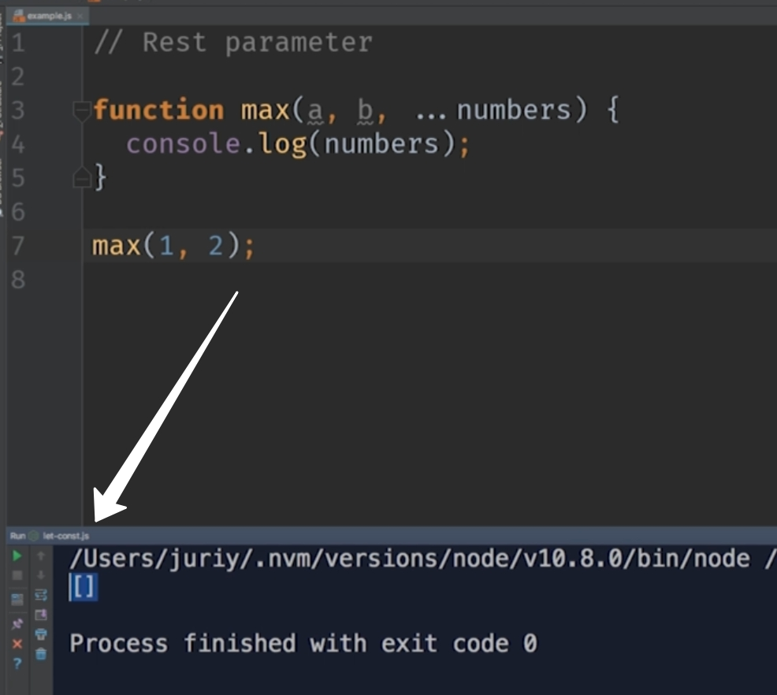

Есть всего лишь 2-ва ограничения при работе с rest парематрами.
>**1. rest параметр обязан идти последним в функции**

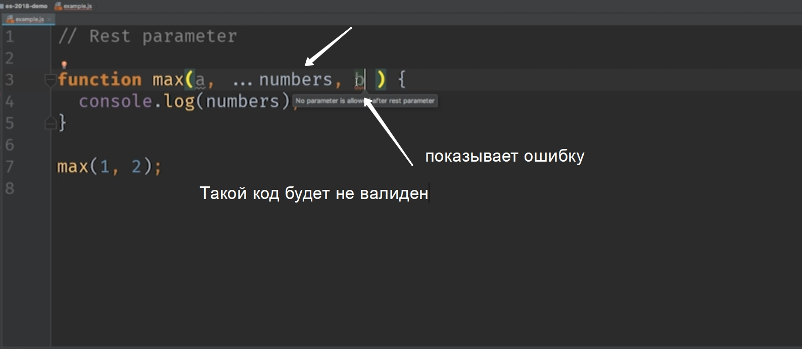

>**2. Нельзя иметь больше одного rest параметра**

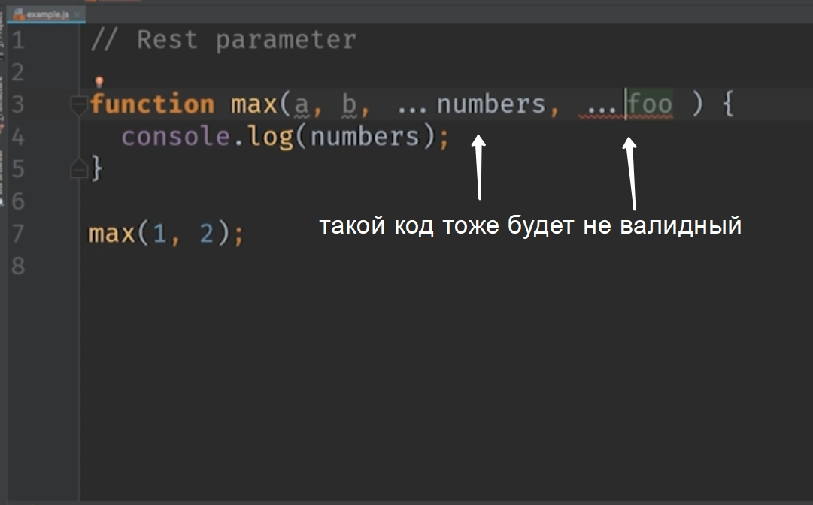

Rest параметр это довольно удобное нововведение, которое решает проблему псевдомассивом arguments и делает ваш код более понятным.

****
<br/><br/><br/><br/><br/><br/>


# spread оператор для массивов

spread оператор похож на rest оператор функции. Но в то время как rest параметр собирает несколько независимых оргументов в массив. spread  делает обратное действие, расскладывает массив на список независимых элементов которые затем можно передать в функцию  или использовать в другом массиве.

```
const arr = [1, 2, 3];
Math.max()
```
Предположим у нас есть массив чисел и мы хотим найти максимальное из них. Мы знаем что во встроенном объекте **Math** есть метод **max** который принимает набор аргументов и который позволяет достать из них максимальное число. Но проблема в том что **Math.max()** не умеет работать с массивом.
Для того что бы решить эту проблему и найти с помощью этого метода  максимум из этих чисел в массиве мы могли использовать метод **aply**. И выглядел бы код примерно вот так

```
const arr = [1, 2, 3];

Math.max.aply(Math, )
```
Мы передавали объект Math который будет контекстом this,  а затем передевали массив const arr = [1, 2, 3]; который станет сриском аргументов для вот этой функции Math.max.aply(Math, arr);
присваиваем переменной и выводим.

```
const arr = [1, 2, 3];

const res = Math.max.aply(Math, arr);
console.log(res);
```

Но этот код можно написать лучше используя **spread operator** который доступен в ECMASript 2015.

```
const arr = [1, 2, 3];

const res = Math.max(...arr);
console.log(res);
```
Знак троеточия и есть **spread** оператор. Spread оператор извлечет значение из массива и передаст их как значение в функцию Math.max.aply(... arr);
 
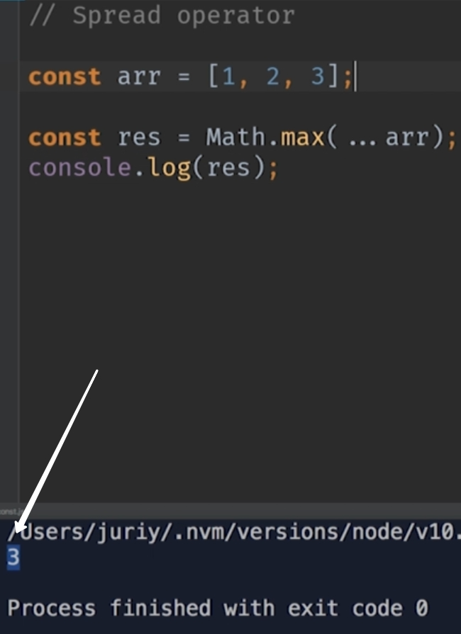

Но **spread** оператор этим не ограничивается. Давайте добавим еще массив.

```
const arr1 = [1, 2, 3];
const arr2 = [4, 7, 1];

const res = Math.max(...arr);
console.log(res);
```
Мы хотим найти максимум из 2-х масивов просто вторым аргументом тоже передаем spread оператор и второй массив.

```
const arr1 = [1, 2, 3];
const arr2 = [4, 7, 1];

const res = Math.max(...arr1, ...arr2);
console.log(res);
```

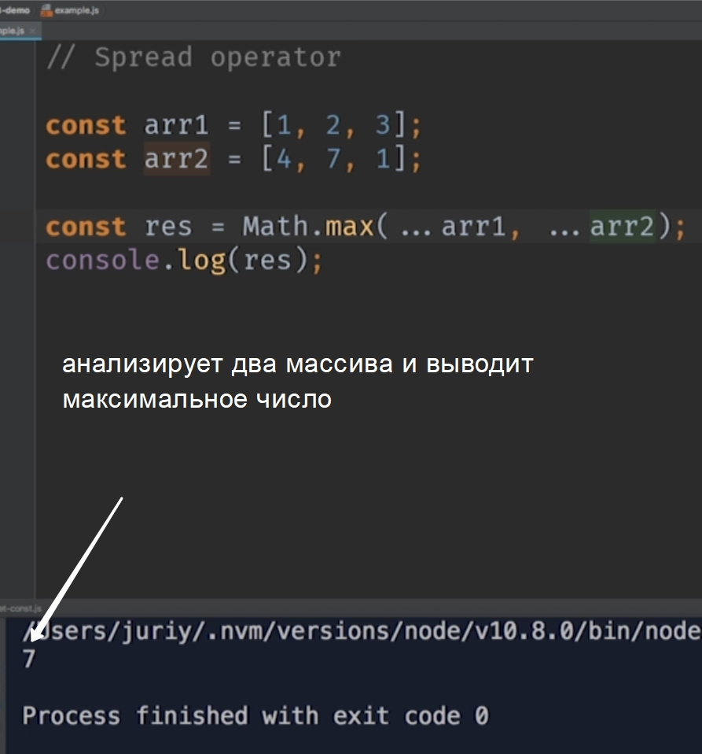

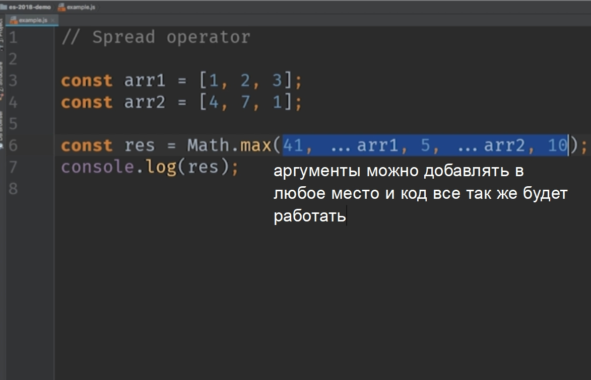

**spread** оператор не заменим при создании массивов

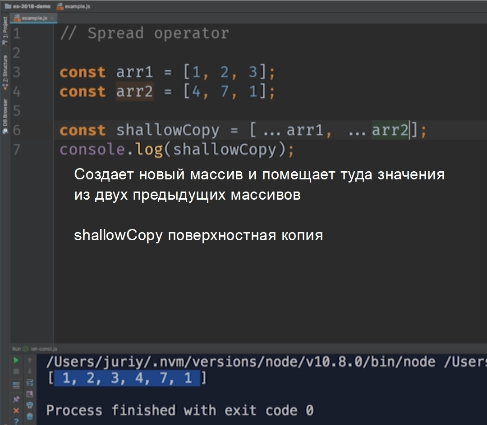

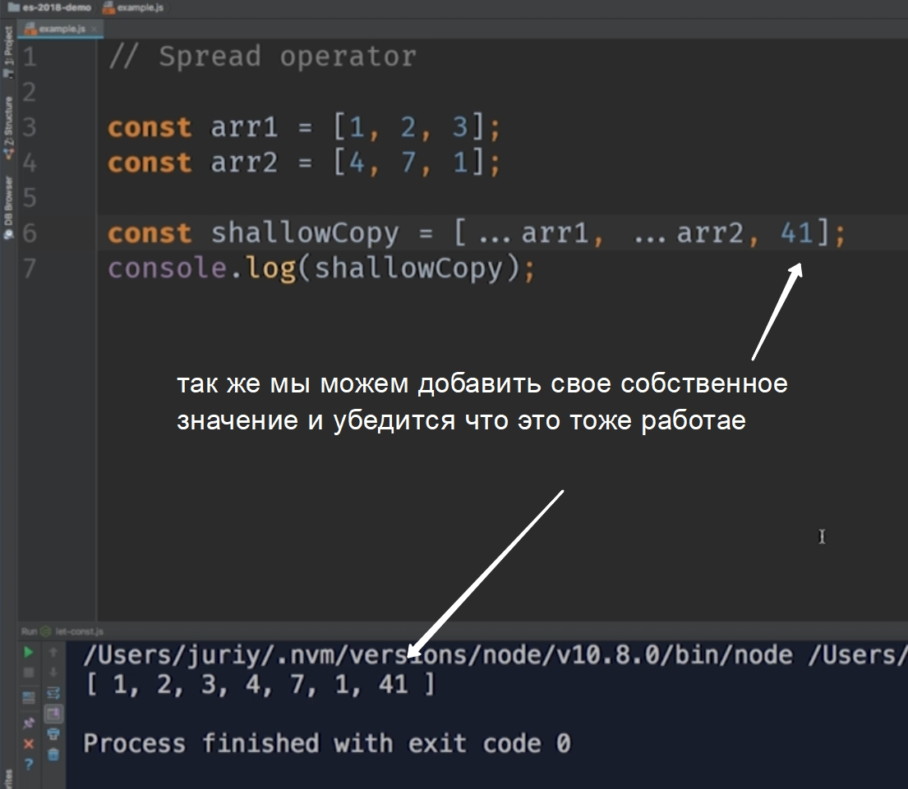

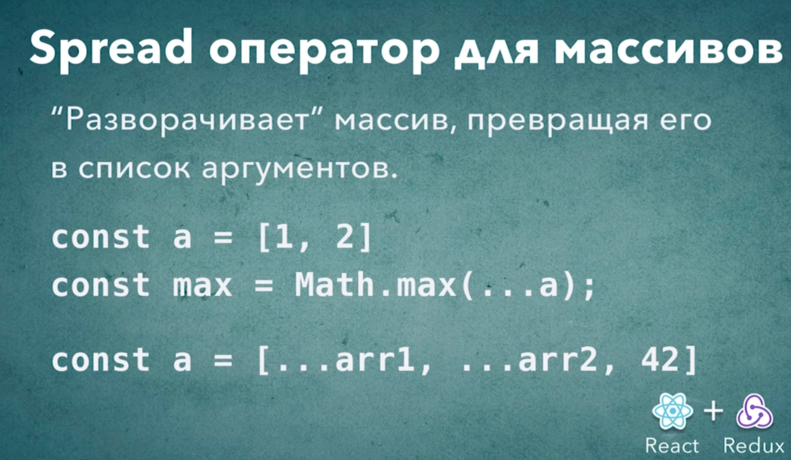

****
<br/><br/><br/><br/><br/><br/>


# деструктуризация объектов

Синтаксис может выглядеть немного не обычно с первого взгляда, но уже через несколько часов использования вы будете удивляться. Как вы раньше жили без этих возможностей. И так деструкторизация позволяет вам лаконично достать структуру из какой-нибудь значение из какой-нибудь структуры данных, массива или объекта.
Сейчас мы рассмотрим работу с объектами. А с массивами поработаем чуть позже.

Вот простой пример

```
const person = {
    firstName: 'Peter',
    lastName:  'Smith',
    age:27
};
```

У нас есть объект person  и три его свойства firstName, lastName, age. Предположим нам нужно сохранить значение firstName, lastName в отдельные переменные что бы не писать везде название объкта. 
В старых версиях JS это решалось вытаскиванием каждой отдельной переменной из объекта т.е. код выглядел приблизительно вот так

```
const person = {
    firstName: 'Peter',
    lastName:  'Smith',
    age:27
};

const firstName = person.firstName;
const lastName = person.lastName;
```

Если использовать синтаксис диструктуризации то тоже самое можно сделать на много лаконичнее. 
**Синтаксис диструкторизации**

```
const person = {
    firstName: 'Peter',
    lastName:  'Smith',
    age:27
};

const {firstName, lastName} = person; // перечисляем константы которые мы хотим достать из этого объекта и после знака = пишем название объекта
console.log(firstName, LastName);
```
т.е. мы только что создали две константы firstName, LastName
и сохранили в них значение из аналогичных свойств person. Важно заметить что когда вы используете такой синтаксис, название ваших констант firstName и lastName, будут совпадать с названием полей в объекте.

Конечно объект может иметь внутреннюю структуру.

```
const person = {
    name:{ 
     firs: 'Peter',
    last:  'Smith'   // firstName и lastName могут содержаться внутри внутреннего объекта name
    },
    age:27
};

const {firstName, lastName} = person;
console.log(firstName, LastName);
```
И как же нам быть теперь с нашей деструктуризацией. Ответ очень прост. Деструктуризация потдерживает и такой синтаксис. Синтаксис станет немножко сложнее, но и эту структуру мы можем деструктурировать.

```
const person = {
    name:{ 
     first: 'Peter',
    last:  'Smith'   // firstName и lastName могут содержаться внутри внутреннего объекта name
    },
    age:27
};

const { name: {first, last}} = person;
console.log(first, Last); // пераметры вывода должны быть точно такими же как названия в объекте.
```
мы видим что эти константы const { name: {first, last}} = person; созданы. мы достали их из объекта person по пути name first last. 
Т.е. здесь мы не создаем новую константу с названием **name**
const { **name:** {first, last}} = person;
Этот **name** в диструктуризации указывает как бы путь. Зайди в объект, найди там вложенный объект **name** и в нутри него достань значение **first** и **last** и сохрани их в соответствующих константах.

Заметьте что давать имена константам точно такие же как назывались свойства объекта может быть не всегда удобно.
К примеру когда мы изменили нашу структуру объекта, положили first и  last  в поле name. Мы полностью теряем контекст. Что такое first? Что такое last? мы больше не знаем что это относилось к имени человека. Может быто это было последнее место работы или что-нибудь еще в этом духе.

Используя синтаксис деструктуризации вы можете переименовать те свойства которые вы достаете из объекта. 

Можно сказать что поле first

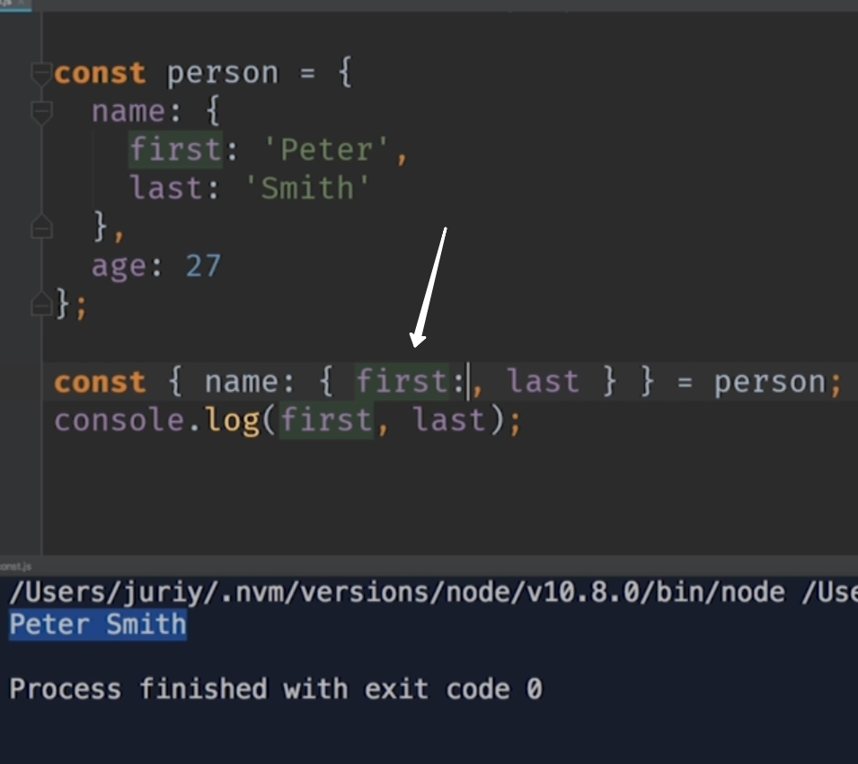

которое мы достаем из объекта будет сохранено в константу которая будет называтся firstName как раньше, а last в констанку которая называется lastName.

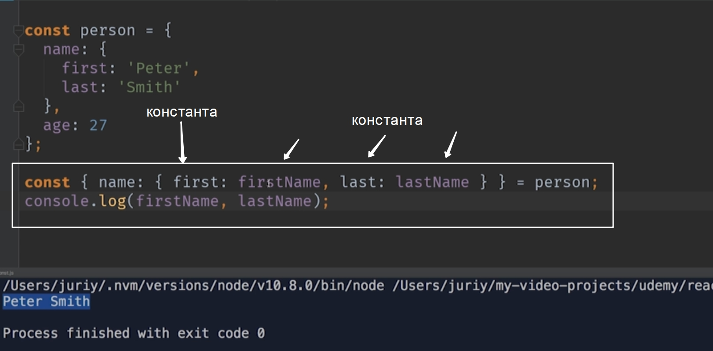

Еще одно очень удобное свойство деструктуризации это возможность указать значение по умолчанию

```
const{role = 'user'} = person; // к примеру мы скажем что в объекте может быть  свойство role и скажемчто если этого свойства нет то тогда свойство role будет иметь значение user. И попытаемся достать это свойство из начего person
console.log(role);
```

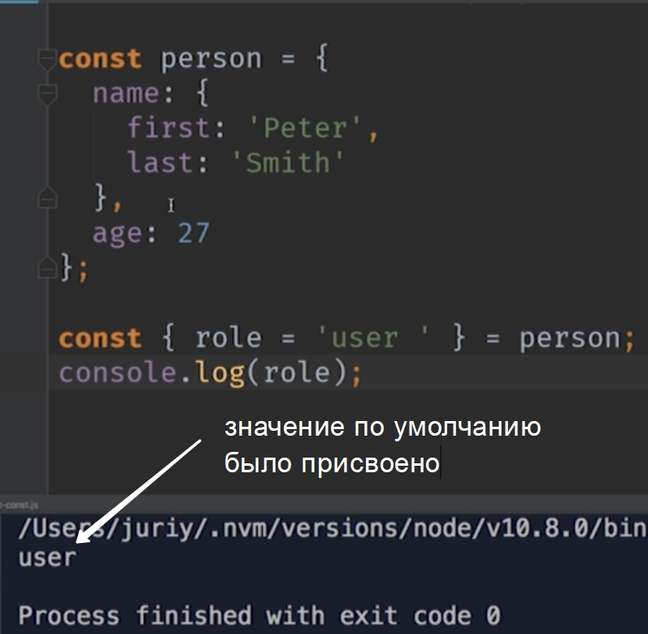

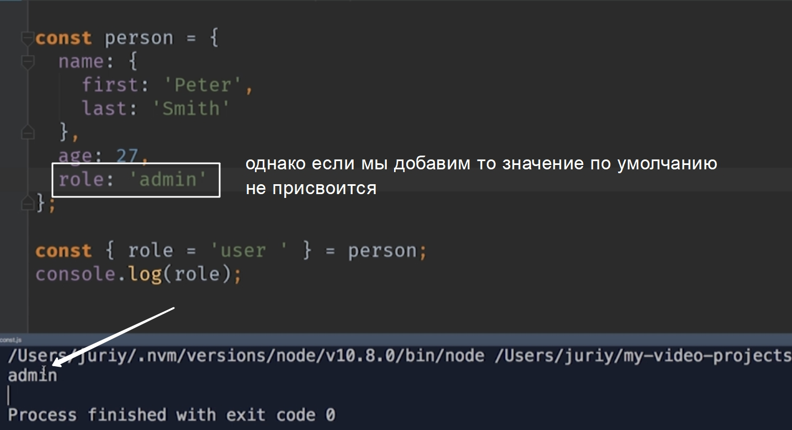

К сожалению такая техника не будет хорошо работать если свойство по умолчание вложенное.

К примеру такой код выдает ошибку

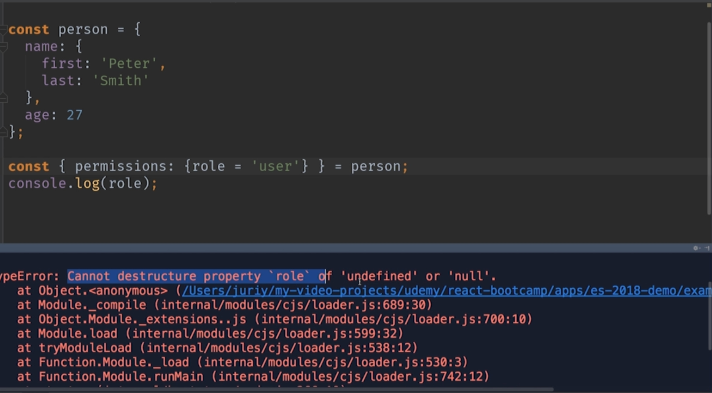

Это ограничение можно обойти если вы дадите всему permissions объект по умолчанию.

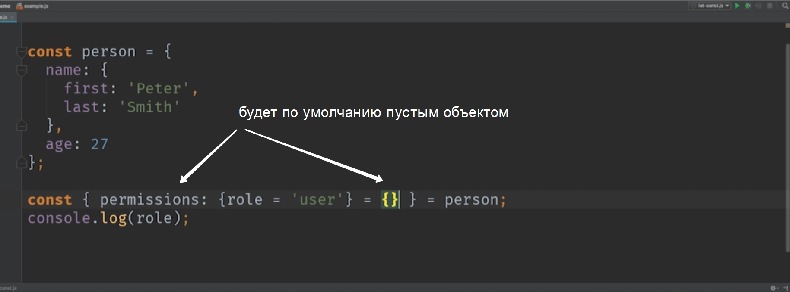

т.е. мы комбинируем 2-ва синтаксиса

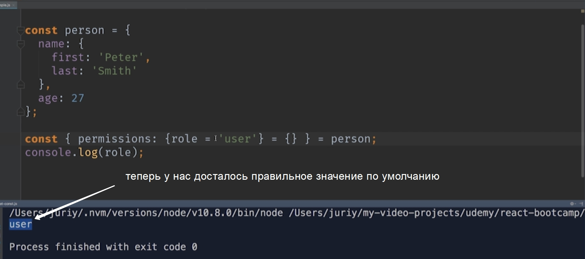

Смотрим еще раз что произошло. Мы говорим давайте достаним из объекта permissions значение role, но если объекта permissions нет то вот его значение по умолчанию = {}, т.е. пустой объект.
Затем из этого объекта по умолчанию = {} vs достанем значение role.

А теперь давайте рассмотрим одно из самых полезных применений деструктуризации.

**Деструкторизация аргументов функции**
Предположим у вас есть функция которая подключается к сетевому сервису. 
Для подключения нужно передать несколько аргументов (host, port, имя пользователя). И некоторые аргументы могут иметь значение по умолчанию. Некоторые могут быть обциональными. 
И вместо того что бы заставлять пользователей запоминать порядок этих параметров, мы решаем что будет удобнее всего передать в функцию объект options

```
function connect (options){ // типичный патрн для JS

}
// и затем пользователь который будет вызывать эту функцию от будет передавать нужное options

connect({
    host:'localhost',
    port: 1829,
    user: 'peter'
});

```

Каким-то образом пользователь узнает какие именно опции ожидает данная функция.
Если вы писали такой код то знаете что сразу за этим как правило идет мучительная обработка опции внутри функции connect

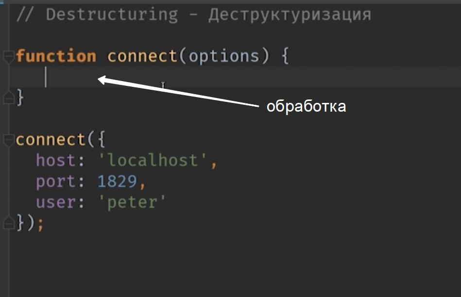

т.е. вы проверяете каждую отдельную опцию и проверяете undefined она или не undefined. Присваиваете значение по умолчанию и т.д. Т.е. как правило писать этот код довольно не приятно.

Использую синтаксис деструктуризации, опции и их параметры по умолчанию можно указать прямо тут на месте параметра функции.

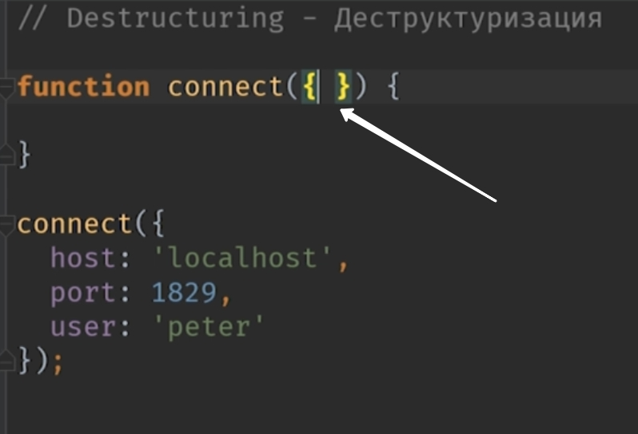

Ставим фигурные скодки тем самым говоря мы будем деструктурировать то что идет в качестве первого аргумента. И пишем какие у нас будут орции по умолчанию.

```
function connect({
host = 'localhost',
port = 12345,
user = 'guest',}){

}

connect({
    host: 'localhost',
    port: 1829,
    user: 'peter'
});
```
И теперь когда пользователь который будет использовать эту функцию, он прочитает этот код прямо не заглядывая в тело функции. Он может сказать Ок эта функция принимает три параметра в опциях

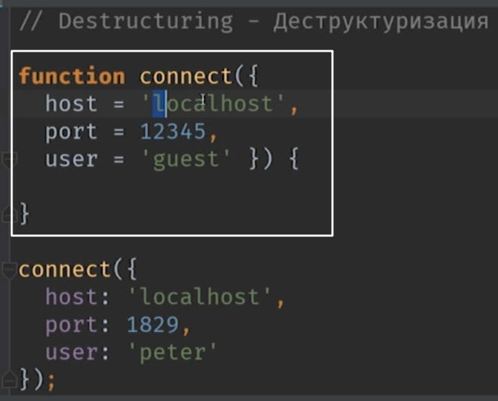

и у этих параметров есть какие-то значения по умолчанию. Читать такое определение функции на много проще. Фактически такой параметр функции можно не документировать,

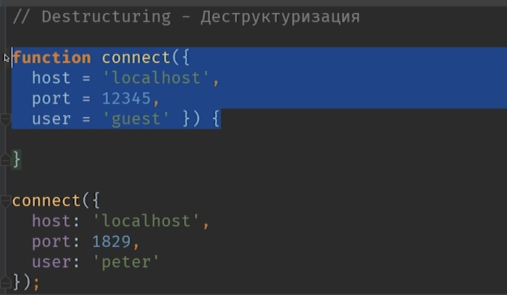

Вся документация находится прямо здесь.

Запускаем.

```

function connect({
host = 'localhost',
port = 12345,
user = 'guest',}){
console.log('user:', user, 'port:', port, 'host', host,); // выводим то что мы получаем
}

connect({}); // для начало запускаем нашу функцию с пустым объектом options

```

Теперь если мы укажем что одно из значений 

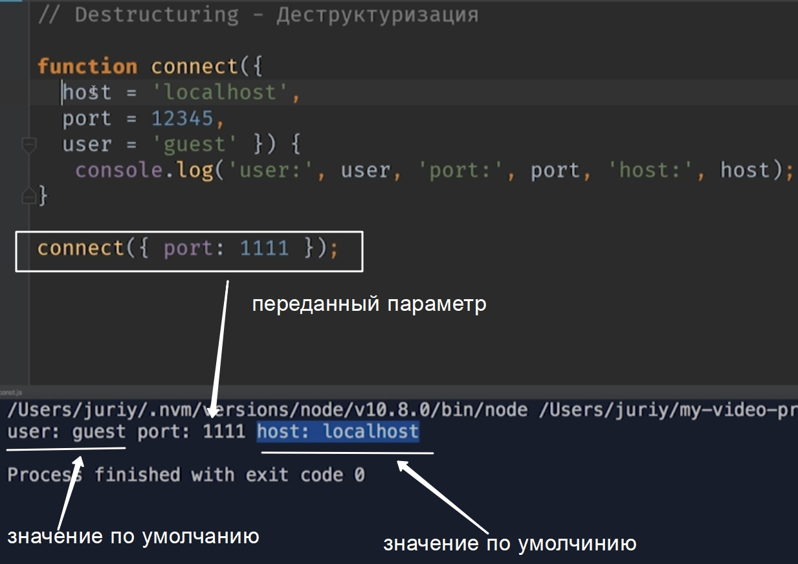

только порт получит значения которые мы передали, тем немение user и host  получат значения по умолчинию


Смотрите если вызвать эту функцию без параметров вообще то будет ошибка

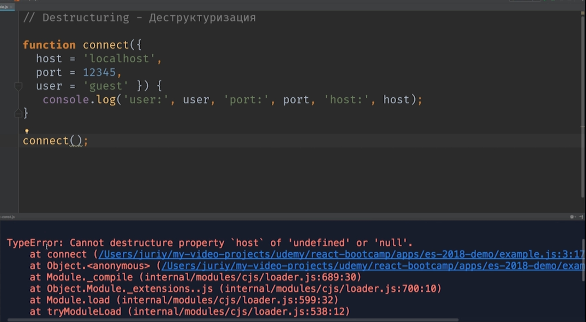

В ошибке говориться что у нас не получилось дестректурировать объект когда объекта небыло вообще.

Но мы можем присвоить значение по умолчанию которое можно будет потом дестректурировать. Т.е. мы скажим что по умолчанию, если объекта небыло вообще то объект будет пустым, и тогда мы можем вызывать эту функцию без параметров, и все значения опций будут записаны по умолчанию

```
function connect({
host = 'localhost',
port = 12345,
user = 'guest',} = {}){ // присваиваем значение по умолчанию = {}
console.log('user:', user, 'port:', port, 'host', host,); // выводим то что мы получаем
}

connect();
```

Таким элегантным способом мы съэкономили как минимум 10-ть строк кода. Ведь нам теперь не нужно получать каждую отдельную опцию из объекта, затем проверять ее на undefined а затем присваивать ей значение по умолчанию. Новая функция сама себя документирует. Теперь мы точно знаем какие поля могут передаваться в объекте и какие будут использоваться значения по умолчанию. 

**rest element**

он работает точно так же как rest элемент в функции собирая в отдельный объект которые не были присвоены элементам.

Синтаксис выглядит приблезительно так. Предположим у нас есть объект словарик где в качестве ключей названия животных, а в качестве значений то как эти животные говорят.

```
const dict = {
    duck: 'quack',
    dog: 'wuff',
    mouse: 'squeak'
};
```

Теперь мы можем как обычно деструктурировать этот объект


```
const dict = {
    duck: 'quack',
    dog: 'wuff',
    mouse: 'squeak'
};

const {duck} = dict;
console.log(duck);
```

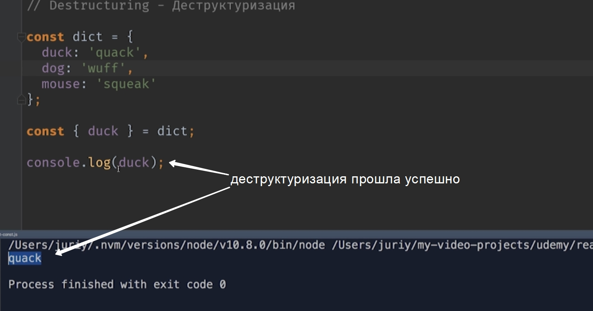


```
const dict = {
    duck: 'quack',
    dog: 'wuff',
    mouse: 'squeak'
};

const {duck, ... atherAnimals} = dict;// а теперь если после duck мы захотим добавим ... а затем название константы которую мы хотим создать atherAnimals. То теперь в этот объект попадкт все те значения которые не были дестректурированы в этом выражении
console.log(atherAnimals);
```
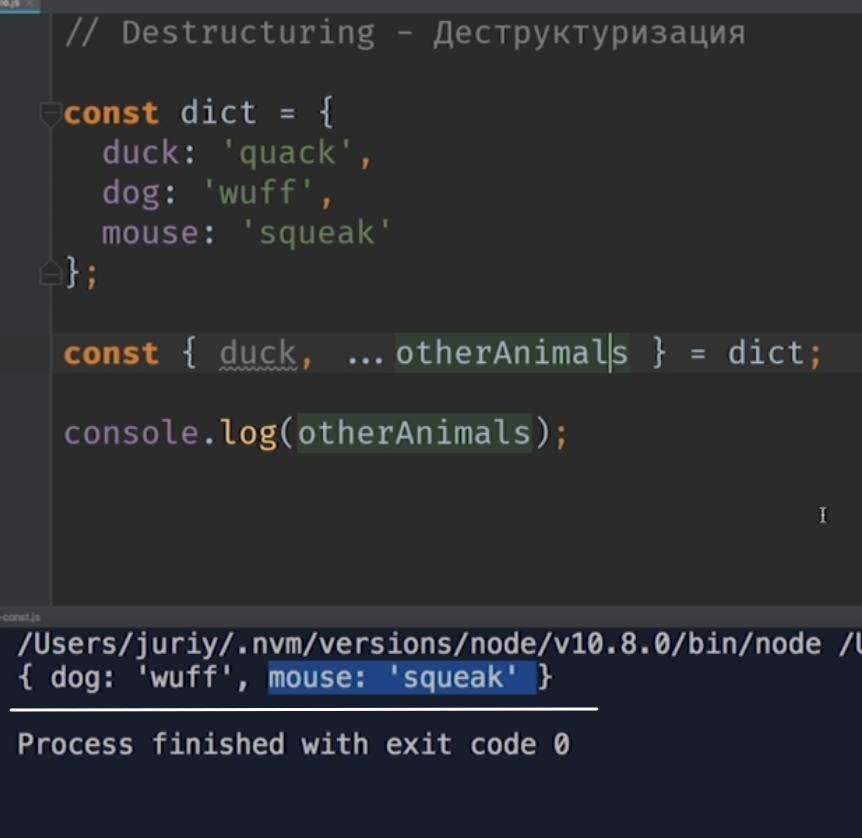

Gh вила использования rest  элементов точно такие же как и для rest  параметров. Rest  элемент должен быть последним в списке и на одном уровне может быть максимум 1-н rest  элемент

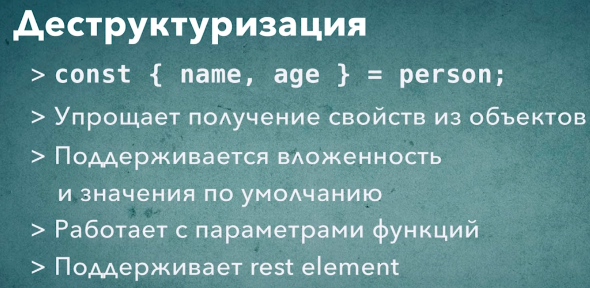

****
<br/><br/><br/><br/><br/><br/>

# деструктуризация массивов

Давайте рассмотрим как деструктуризация работает с массивами
```
const fib = [1, 1, 2, 3, 5, 8, 13];
const [a, b, c] = fib; // достаем первые 3-ри числа
console.log(a, b, c); //Выводим первые три константы числа Фибоначчи
```

После того как вы освоили синтаксис для объектов, синтаксис работы с массивами вам покажется очень простым. Предположим у нас есть массив чисел const fib = [1, 1, 2, 3, 5, 8, 13]; Это числа Фибоначчи.
Если нам нужно достать первые 3-ри числа. Давайте назовем их a,b,c. Мы можем использовать вот такой синтаксис const [a, b, c] = fib; который похож на синтаксис диструктуризации для объектов. Выводим в консоль или в браузер и убеждаемся что этот синтаксис действительно работает.

***При деструктуризации массивов некоторые значения в массиве можно пропускать.***
К примеру если вам нужно достать второе и четвертое значение. Это можно сделать таким способом.

```
const fib = [1, 1, 2, 3, 5, 8, 13];
const [,a, , b] = fib;// запятая означает что мы пропускаем здесь значение, затем ставим первую константу которумы хотим создать. Следующее значение должно быть 4-е. Значит ставим еще одну запятую и послее нее создаем еще одну константу. 
console.log(a, b); 
```

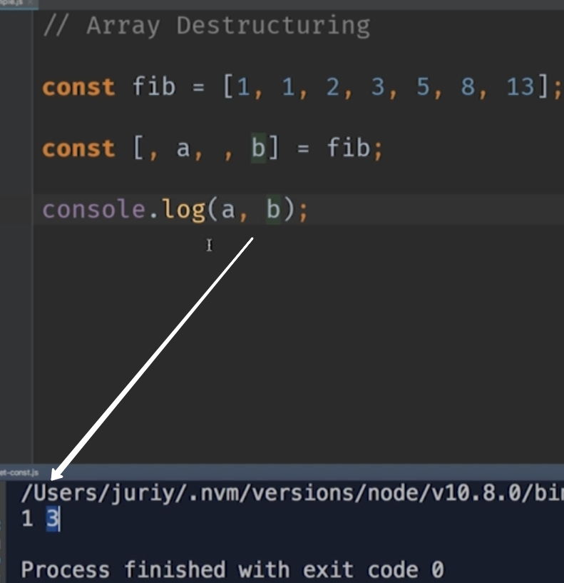

***Если у нас есть многомерный массив***
 
 ```
const line [[10,17],[14,7]];
 ```
 Crf;tv вот такой массив который состоит из 2-х точек, это координаты х и у. 
 Мы тоже можем из него достать значения используя синтаксис похожий на синтаксис диструктуризации для объектов.

 Давайте предположим что мы хотим сохранить эти числа каждое в собственной константе. Что бы это сделать мы описываем как бы форму массива которую мы хотим получать.

 ```
const line = [[10,17],[14,7]];

const [[p1x, p1y],[p2x, p2y]] = line; // чтобы это сделать мы описываем форму массива которую хотим получить. Т.е. внешний массив и два массива вложенных в него [[] , []]. Во вложенных массивах пишем где мы хотим сохранить наши значения

console.log(p1x, p1y, p2x, p2y);
 ```

 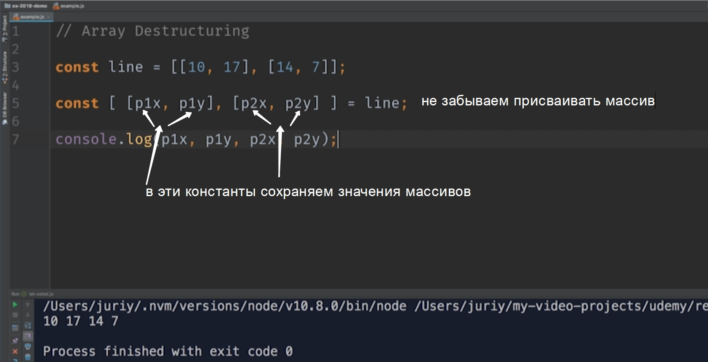

Как видите такой синтаксис тоже работает.

***Параметры по умолчанию тоже поддерживаются***
Если к примеру у нас есть массив с 2-мя именами, а мы попытаемся его диструктуризировать в 3-ри константы, то 3-я константа может получить значение по умолчанию.

```
const people = ['chris' , 'sandra'];

const [a, b, c = 'guest'] = people; // присвоение значение по умолчанию такое же как и у объектов

console.log(a, b, c);
```
 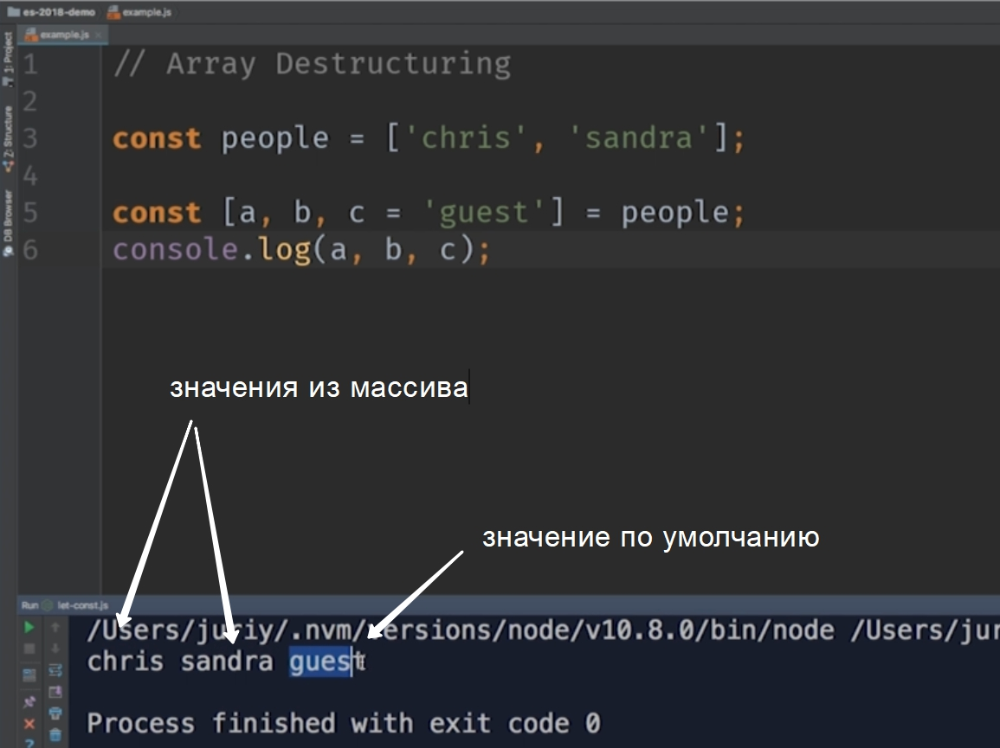

 Давайте добавим в массив еще одно значение.

 ```
const people = ['chris' , 'sandra', 'bob'];

 ```
и теперь можно посмотреть как работают rest  элементы.

Работают они точно так же как и для объектов.

```
const people = ['chris' , 'sandra', 'bob'];

const [a, ...others] = people; // в а = пойдет значение chris, а в others = будут записаны остальные значения 'sandra', 'bob'
console.log(others);
```

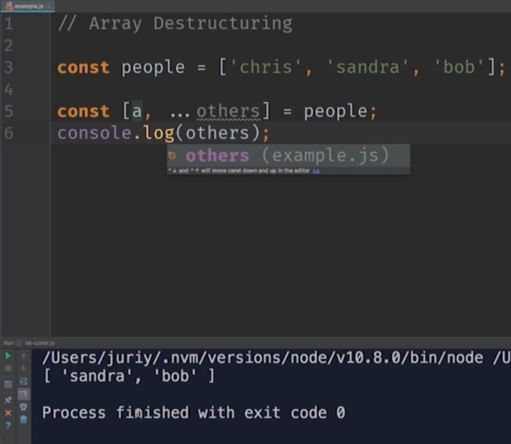

***Если функция принимает массив в качестве аргумента то его тоже можно деструктуризировать прямо в объявлении функции.*** Работает это точно так же как и в деструктуризации объектов.

Предположим что у нас есть такой объект где в качестве ключей у нас имена зверей и в качестве значений то как эти звери говорят.
И скажем мы хотим найти всех тех зверей которые говорят squeak.


```
const dict = {
   duck:     'quack',
   dog:       'wuff',
   mouse:   'squeak',
   humster: 'squeak'
};
```

Давайте попробуем скомбинировать наши знания arrow функции и деструктуризации массивов для того что бы написать этот код красиво с точки зрения ECMAScript. 
в первую очередь нам нужно получить все ключи и значения объекта одновременно.
Делаем это при помощи функции Object.entries()."nf функция принимает объект и она возвращает двух мерный массив. Там будут все ключи и значения. Каждый элемент массива это массив ключ => значение.

```
const dict = {
   duck:     'quack',
   dog:       'wuff',
   mouse:   'squeak',
   humster: 'squeak'
};

сonst res = Object.entries(dict);
console.log(res);
```

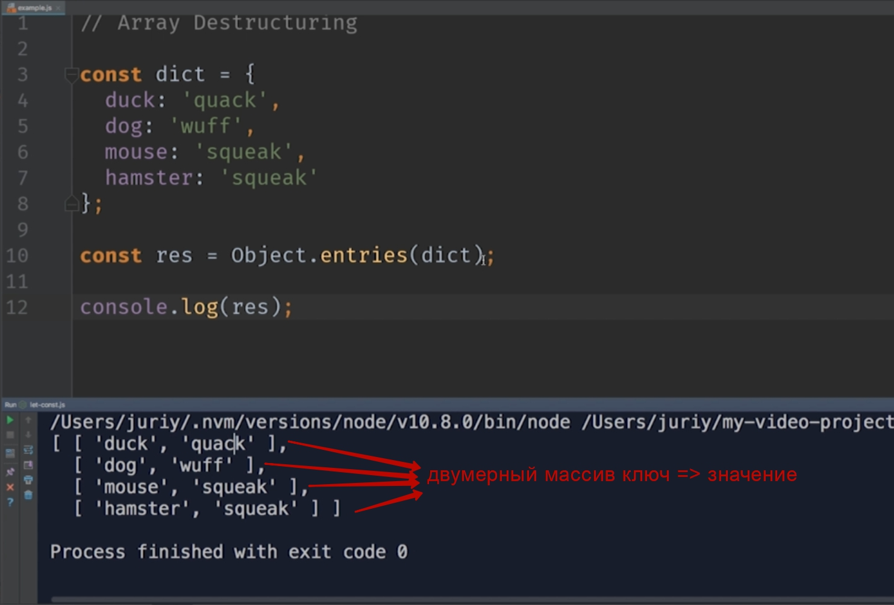


И как же нам разобрать эту структуру данных так что бы  найти все ключи у которых значение squeak.

Теперь давайте используем функцию filter для того что бы найти те элементы у которых второй элемент в массиве это squeak

```
const dict = {
   duck:     'quack',
   dog:       'wuff',
   mouse:   'squeak',
   humster: 'squeak'
};

сonst res = Object.entries(dict);
.filter((arr)=> arr[1] === 'squeak'); // Если вложенный массив с индексом 1  squeak то мы оставляем этот элемент в массиве
console.log(res);

```

Мы принимаем массив на вход .filter((arr)=>), потому что вот наши значения

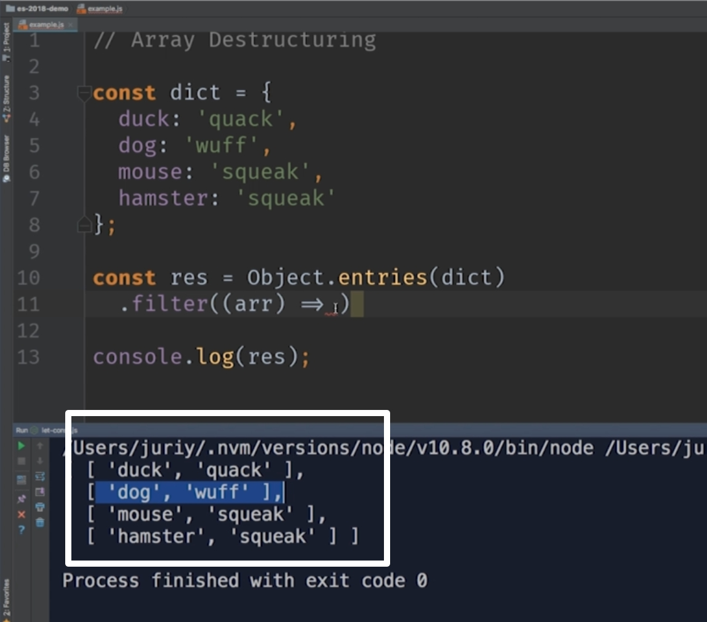

Каждое значение это массив.

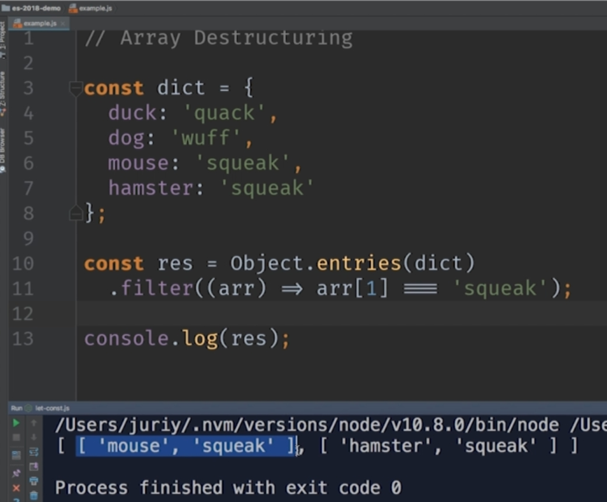

Но этот код можно написать еще лучше. Учитывая то что мы знаем как работает деструктуризация, мы можем диструктурировать вот этот параметр .filter(**(arr)**=> arr[1] === 'squeak'); прямо на месте. В место того что бы писать arr  мы можем написать key, value

```
const dict = {
   duck:     'quack',
   dog:       'wuff',
   mouse:   'squeak',
   humster: 'squeak'
};

сonst res = Object.entries(dict);
.filter(([key, value])=> value === 'squeak'); // и вот теперь наша функция немного понятнее
// мы понимаем что мы получаем ключ и значение и мы хотим что бы значение было squeak, но мы не используем значение ключа. key  мы можем удалить и деструктуризация все равно сработает.
console.log(res);
```

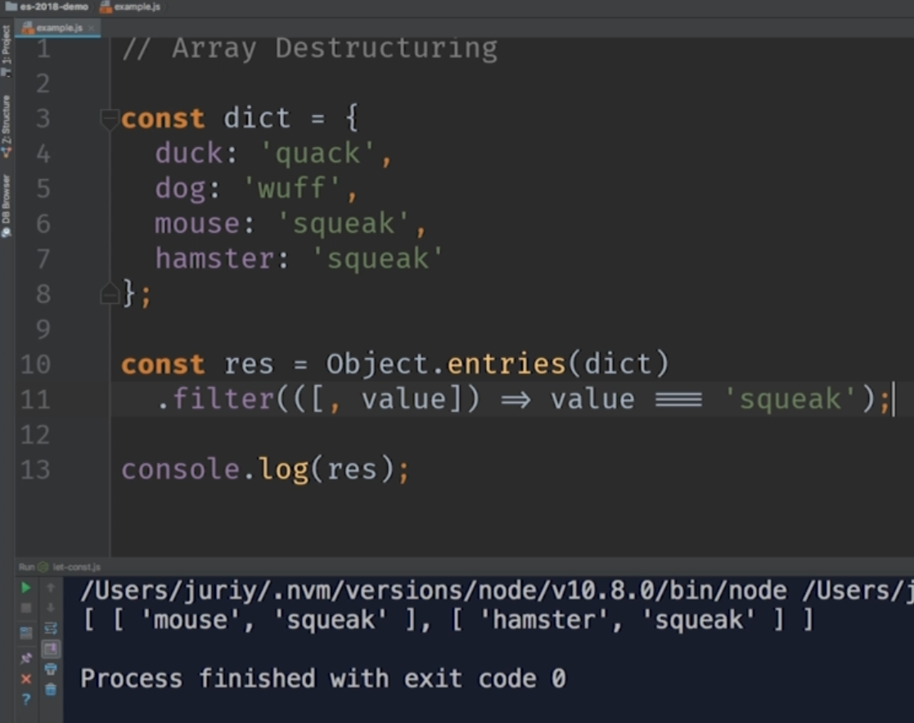

 И так же мы можем из массива достать только ключи.

 ```
const dict = {
   duck:     'quack',
   dog:       'wuff',
   mouse:   'squeak',
   humster: 'squeak'
};

сonst res = Object.entries(dict);
.filter(([key, value])=> value === 'squeak'); 
.map(([key]) => key);
console.log(res);
 ```

 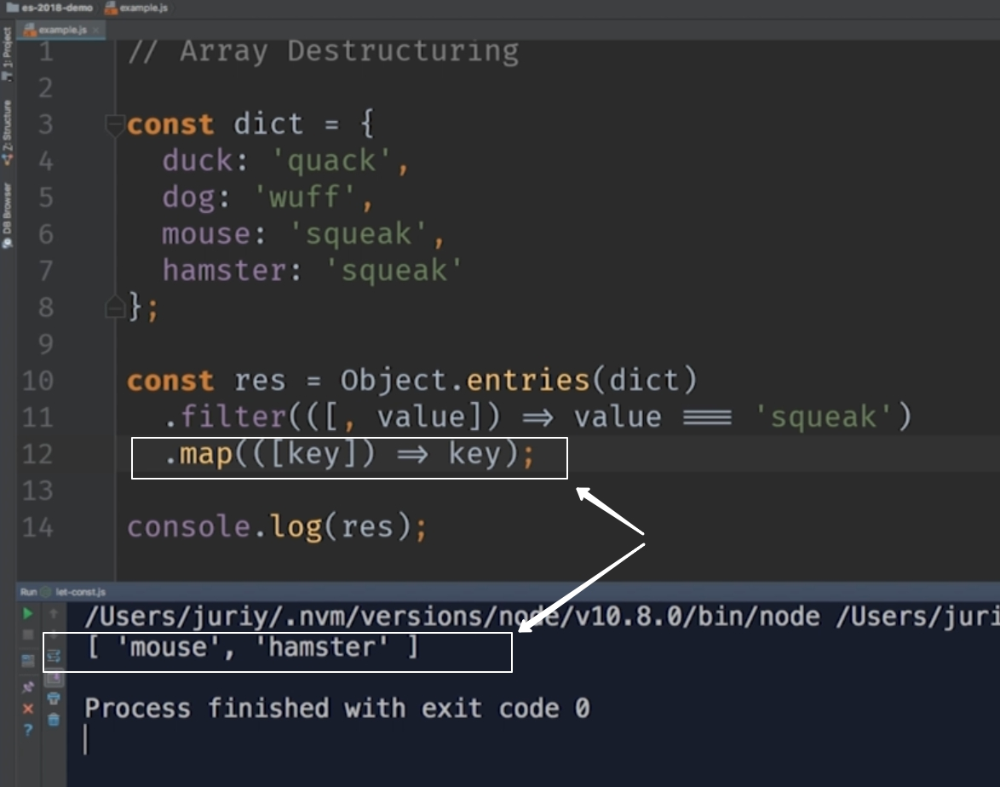

 ***Давайте посмотрим на более сложный пример***


 Cинтаксис деструктуризации позволяет вам комбинировать деструктуризацию для массивов и деструктуризацию для объектов. возьмем вот этот пример

  ```
const shape = {
    type: 'segment',
    coordinates:{
        start:[10, 15],
        end: [17, 15]
    }
};

 ```

 у нас естьобъект внутри которого есть массив. Предположим что мы хотим снова получить координаты этих точек. start и end x и у.

 Мы можем использовать сперва синтаксис деструктуризации для объекта.

 ```

const shape = {
    type: 'segment',
    coordinates:{
        start:[10, 15],
        end: [17, 15]
    }
};

const{coordinates:{start:[startX, startY],  end: [endX, endY]}} = shape; // внутри start и end  мы описываем константы в которые мы хотим сохранить элементы массива
console.log(startX, startY, endX, endY);

 ```

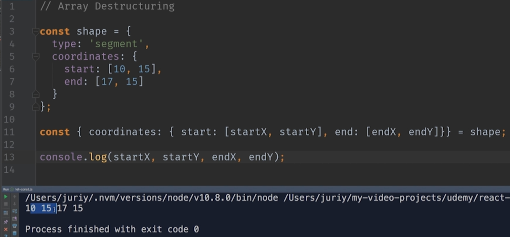

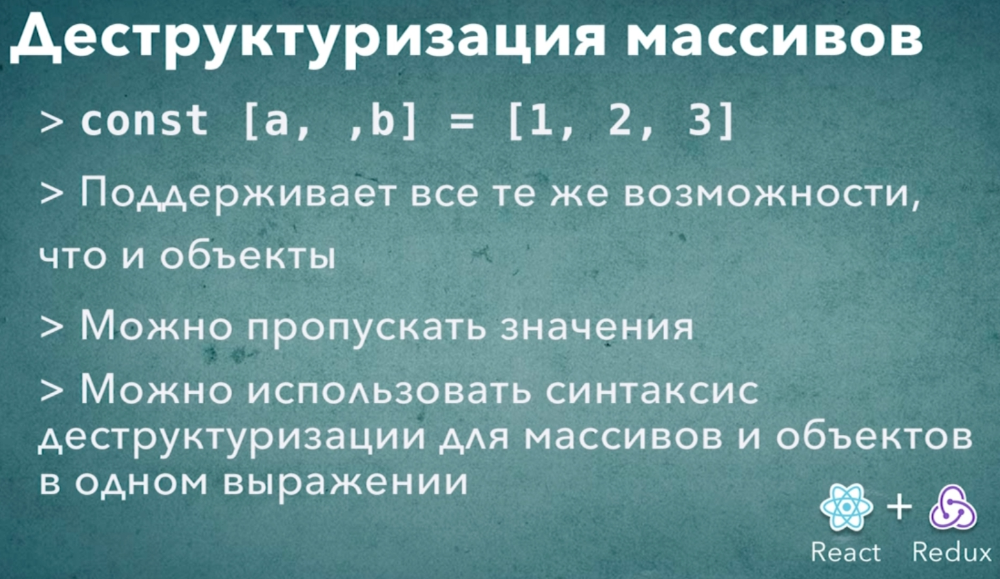

 ****
<br/><br/><br/><br/><br/><br/>


# шаблонные строки (template strings)

еще немного синтаксического сахара в JS. В этот раз для строк. Мы часто пишем код, что в примере чуть ниже, который собирает строку из подстрок и значений переменных.

```
const user = 'Bob';
const num = 17;
const txt = 'Hello, '+ user + ' you have ' + num + ' letters in your inbox '

console.log(txt);

```

В ECMAScript 2015 появилась новая возможность которая называется ***шаблонные строки или template strings***. И эта возможность позволяет писать код намного более элегантно.

Пишем такой же код с использованием ECMAScript 2015.

```
const user = 'Bob';
const num = 17;
const txt = 'Hello, '+ user + ' you have ' + num + ' letters in your inbox '

// создаем  новую шаблонную строку template literal 

const txt2 = `Hello ${user} you have ${num}  letters in your inbox`; // cоздаем с использованием не кавычек а с использованием символа бэктик русская ё. пишем строку как обычно, но как только нам нужно добавить переменную ставим ${} и в скобках пишем имя переменной

console.log(txt2);

```

Кроме того что мы можем использовать значения переменных мы можем поставить в place holder любое выражение в JS которе вернет какое нибудь значение.

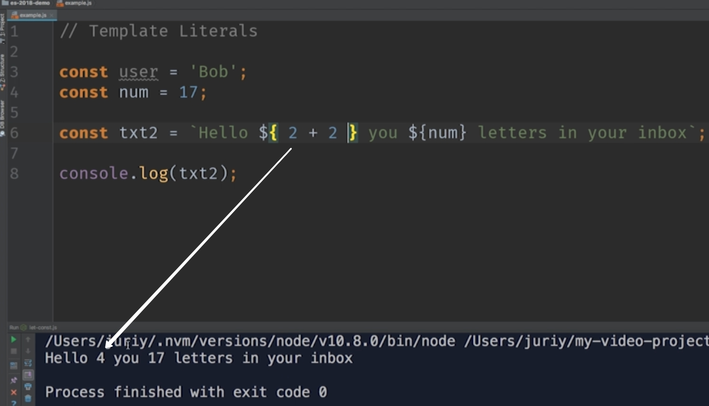

В такой строке кроме переменных можно поставить результат вызова функции. Выведем текущую дату.

```
const txt3 = `Now is ${Date.now()}`;
console.log(txt3);
```

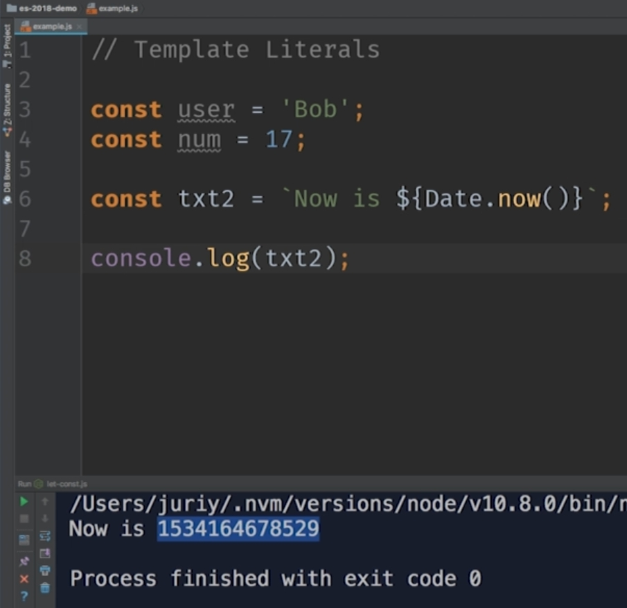

еще один аспект где tamplate literals помогает это **многострочный код**. Это когда нужно сделать строку из набра строк. 
Как правило этот код в JS до 2015 выглядел приблизительно вот так

```
const html = 
'<ul>'+
'<li>Item One</li>'+
'<li>Item Tow</li>'+
'<ul/>';
// здесь приходилось разбивать строки на подстроки и затем плюсиком конкотеноровать их в одну строку 
```

Если вы используете template literals такойже код можно написать намного элегантнее

```
const templateHtml = ` // если вы ставите бэктики ``  то разрыв строки можно ставить прямо в строке. Строка не будет закончена до следующего бэктика

<ul>
<li>Item One<li/>
<li>Item Tow<li/>
<ul/>
`;
console.log(templateHtml);
```
Особенно класно этот синтаксис использовать если вам нужно скопировать блок кода из какого нибудь другого языка и вставить в ваш JS файл. Просто создаем пустую строку и просто вставляем тот код который мы хотим получить. Нам не нужно в ручную разбивать каждую строчку на подстрочку, окружать каждую строчку кавычками и конкотенировать строки.

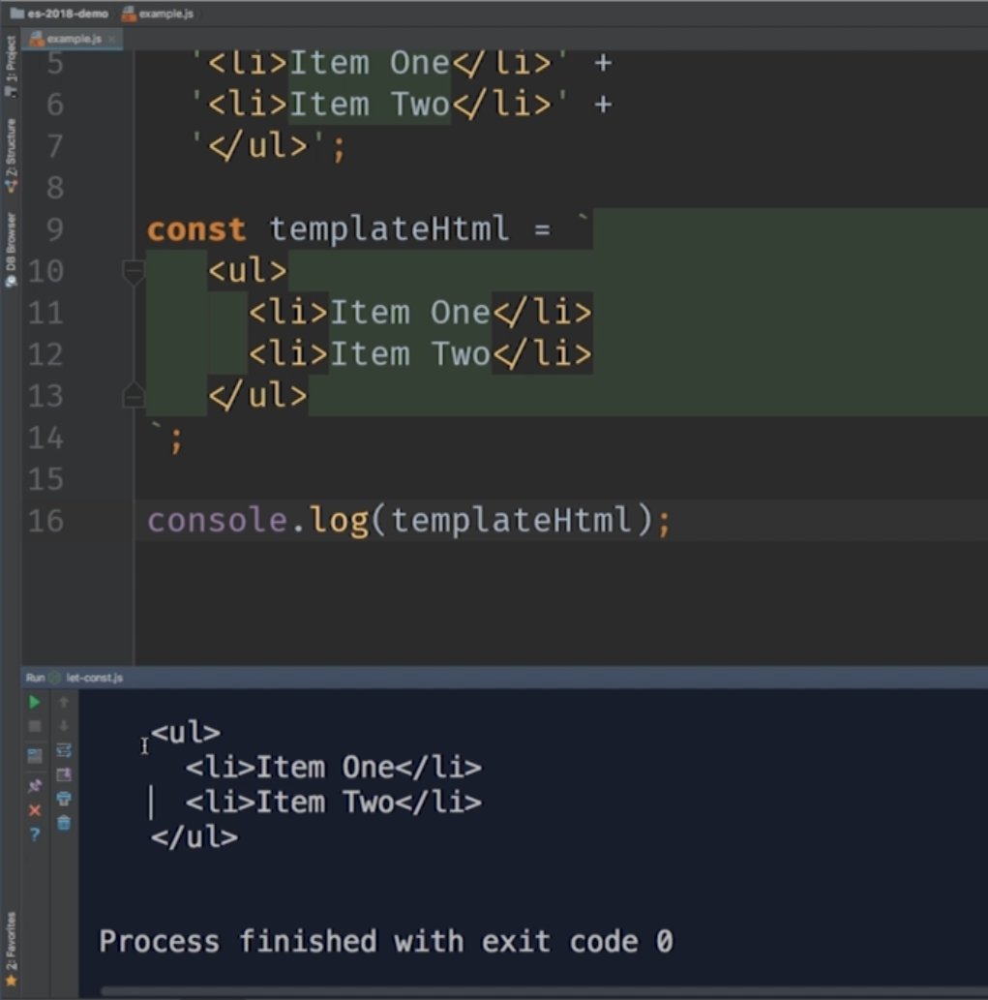

Ну и конечно мы можем комбинировать многострочные литералы с какими нибудь значениями с JS

```
const items = ['tea','coffee'];

const templateHtml = ` 
<ul>
<li>${items[0]}<li/>
<li>${items[1]}<li/>
<ul/>
`;
console.log(templateHtml);
```

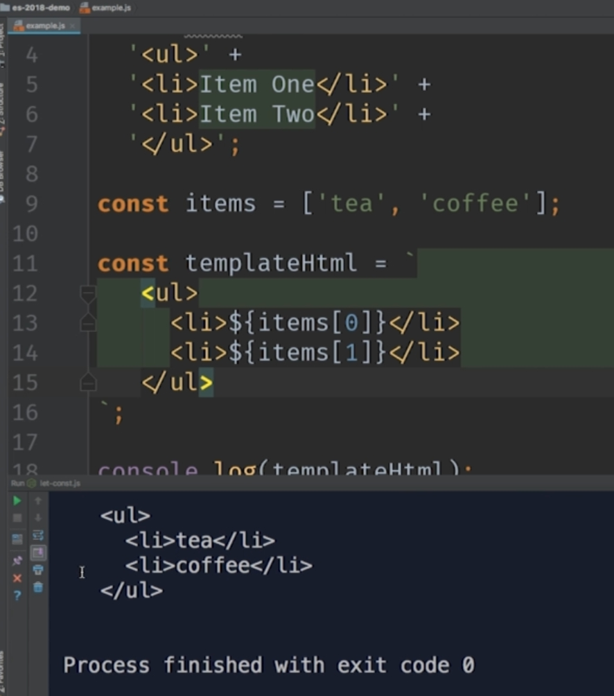

template literal это очень удобное маленькое нововведение

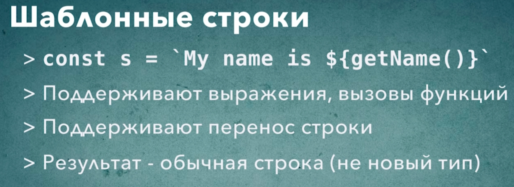

****
<br/><br/><br/><br/><br/><br/>

# объекты 

В ECMAScript 2015 объекты получили много внимания от дизайнеров языка.

Начнем с упрощенного синтаксиса для создания новых объектов.

Gh дположим в своем коде вы вычислили координаты х и у для какой нибудь точки. 
Теперь вы хотите создать объект точка который будет содержать два этих свойства х и у.

В ECMAScript 5 и в предыдущих версиях JS способ сделать это был вот такой.

```
const x = 10;
const y = 30;

const point = { // мы создавали point
    x: x,         // а затем писали что  свойство х будет                    иметь значение х
    y:y           // а свойство у будет иметь значение у
};

```

В ECMAScript 2015 этот синтаксис можно сократить и написать просто вот так.

```
const x = 10;
const y = 30;

const p = {
    x,y
};
```
Эта сокращенная запись которая полностью эквивалентна предыдущей записи. Т.е. свойсто х имеет значение х, свойство у имеет значение у.
Если имя переменно и имя свойства совпадают, то вот такую сокращенную запись довольно удобно использовать в вашем коде.

Улучшился синтаксис для создания методов. 
Методами мы называем функции которые пренадлежат некоторым объектам.

К прамеру в ECMAScript 5 для того что бы создать метод, нам нужно было объявить новое свойство и присвоить ему свойство которое выполняло то что мы хотели

```
const x = 10;
const y = 30;

const point = { 
    x: x,                 
    y:y  

    draw: function(){
//...
}         
};

```

В новом синтаксисе мы можем упростить создание функции. Для того что бы написать новую функцию достаточно написать имя функции, затем поставить круглые скобки в которые нужно передавать какие-нибудь параметры и далее тело функции

```
const x = 10;
const y = 30;

const p = {
    x,
    y,

    draw(ctx){
        //...
    }
};

```

этот синтаксис существенно проще который был раньше. Он позволяет в теле объекта объявлять функцию не добавляя при этом ключевое слово function.

Заметьте это не функция стрелка arrow function, Это обычная функция которая написана более лаконичным синтаксисом в ECMAScript 2015.

При создании объктов можно использовать значения ключей которые вычисляются динамически.

Предположим что у нас есть константа которая называется prefix, даем ей значение.


```
const prefix ='_blah_';// теперь если мы хотим создать новый объект мы можем использовать эту константу для того что бы определять ключи объекта. для этого мы ставим квадратные скобки

const data = {
[prefix + 'name']:'Bob',
[prefix + 'age']: 23
};
console.log(data);

```
Если мы выведем на экран результат этого кода мы увидим что вот этот вот ключик [prefix + 'name']:'Bob', он будет _blah_name и [prefix + 'age']: 23 будет _blah_age

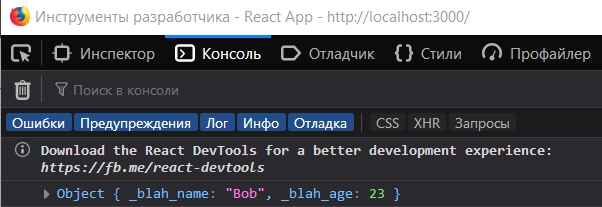


В ECMAScript 2015 появилась новая функция которая позволяет лаконично копировать свойства из одного объекта в другой.
Давайте посмотрим на вот такой пример.

```
const defaults ={

    host: 'localhost',
    dbName: 'blog',
    user: 'admin'
};

const opts = {
    user: 'john',
    pasaword: 'utopia'
};

```

Предположим у нас есть два объекта один из них который хранит опции по умолчанию 

const defaults ={

    host: 'localhost',
    dbName: 'blog',
    user: 'admin'
};

А второй объект хранит опции которые мы получили от пользователя.

const opts = {
    user: 'john',
    pasaword: 'utopia'
};

Мы хотим создать объект который будет объединять опции из первого объкта и из второго объекта. При этом естественно те опции которые передал пользователь имеют более высокий приоритет. 
Если пользователь передал опцию что user это john, эта опция должна перезаписать опцию user: 'admin'. И password должен оказаться в результирующем объекте не смотря на то что в defaults его нет.

Для того что бы реализовать этот функционал в более старой версии JS в ECMAScript 5 приходилось писать код который будет копировать опции из одного объекта в другой.

В ECMAScript 2015 появилась новая функция которая называется **Object.assign()**.Эта функция принимает несколько объектов.
1-й объект этот тот объект который получит све необходимые значения, а после него можно передать один или несколько объектов свойства которых мы будем использовать для того что бы перезаписать свойства первого объекта, первого в списке аргументов, в нашем случае defaults.

```
const defaults ={

    host: 'localhost',
    dbName: 'blog',
    user: 'admin'
};

const opts = {
    user: 'john',
    pasaword: 'utopia'
};

Object.assign(defaults,opts);
console.log(defaults);
```

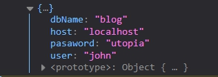

ну или с курса


И результат такой какой мы хотели.
У нас здесь есть дефолтные свойства и поверх них записаны те свойства которые передал пользователь, которые мы передали в объекта opts.

На самом делает не совсем то что мы хотели потому что он перезаписывает объект defaults. Мы же не хотим изменять дефолтное свойство. 

Выходим из этого положения.

Что бы не изменять объект defaults в нашем коде мы можем слево еще один аргумент, пустой объект.

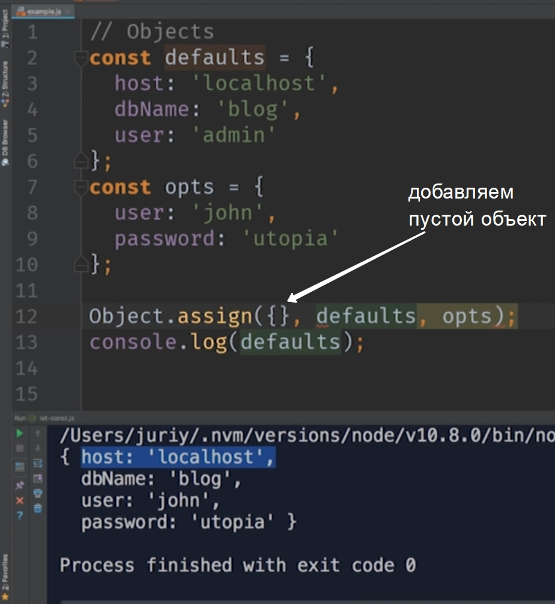
  
  Теперь в этот пустой объект будут скопированы значения из defaults, а затем все значения из opts, т.е. свойства копируются по очереди из объектов слево на право. Таким образом значения из opts будут перезаписывать те значения которые возможно были в defaults т.е. opts будут иметь более высокий преоритет.

```
const opts = {
    user: 'john',
    pasaword: 'utopia'
};

Object.assign({},defaults,opts);
console.log(defaults);


```

И еще следует знасть что Object.assign возвращает этот первый аргумент {}, т.е. тот объект который мы заполняем. т.е. мы можем взять результат и получть его из Object.assign и в следующей строке вывести его в консоли

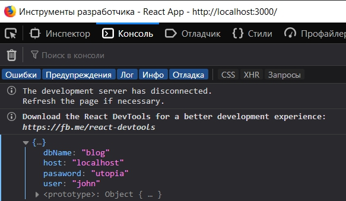

B вот теперь мы имеем именно тот результат который мы хотели. Объекты defaults и opts остались не тронутыми и в результате у нас появился новый объект res  который имеет все свойства из defaults и все свойства из opts.

Object.assign очень удобно использовать для того что бы создвать поверхностые копии объектов или shallow copy в английской терминологии.

Давайте скажем что у нас есть вот такой объект

```

const person = {
    name: 'Bob',
    friends: ['Mark','Jacob']
};

const shallowCopy = Object.assign({},person);
console.log(shallowCopy); 

```
Давайте скажем что мы хотим сделать shallowCopy. В ECMAScript 2015 это можно сделать при помощи 1-й строки кода Object.assign({},person);. Таким образом в объекте shallowCopy есть все теже значения которые были в орегинальном объекте person.

Если мы изменяем какой либо из объектов то все эти изменения происходят и в shallowCopy.

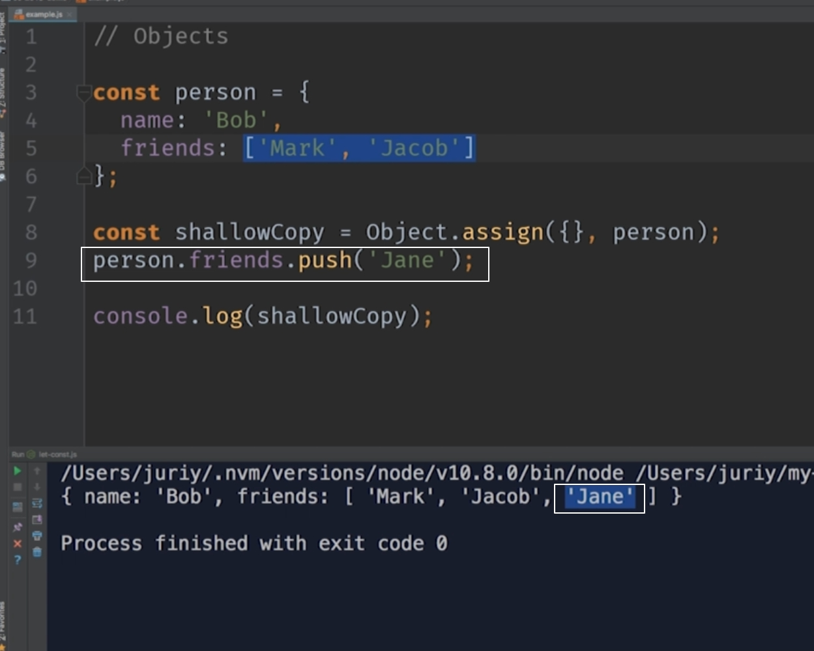

В версии 2018 года появился еще более лаконичный способ копировать свойства объектов. Этот способ называется **ObjectSpreadOperator**.
Так же появились еще несколько новых методов которые связаны с объектами. Появился метод **SetPrototypeOff** который позволяет установить объекту прототип и еще ключевое слово **super** которое упрощает доступ к прототипу объекта

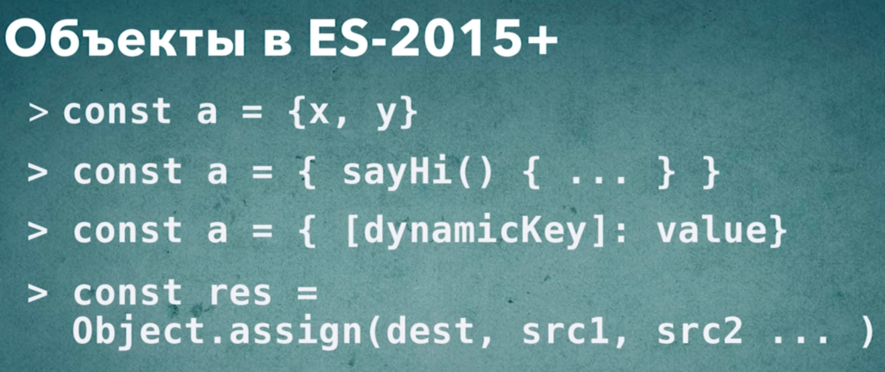

****
<br/><br/><br/><br/><br/><br/>


# Оператор Object Spread

В EcmaScript 2018 стандарт расширили, добавили в потдержку **Spread оператора** и для объектов.
Object Spread оператор работает точно также как функция **Object asign**, но код выглядит более лаконично.
Давате вернемся к нашему примеру.

```

 const defaults ={
 host:'localhost',
 dbName: 'blog',
 user: 'admin'
 };
    
 const opts = {
    user:'john',
    password: 'utopia'
 };

```

Есть набор опций по умолчания,**const defaults**, и есть набор опций которые передал пользователь,**const opts**.
Нам нужно создать третий объект который будет объеденять эти два,**const defaults и const opts**. Но объеденяя таким образом что опция которую передал пользователь имеет более высокий приоритет. Соответственно в результирующем объекте 

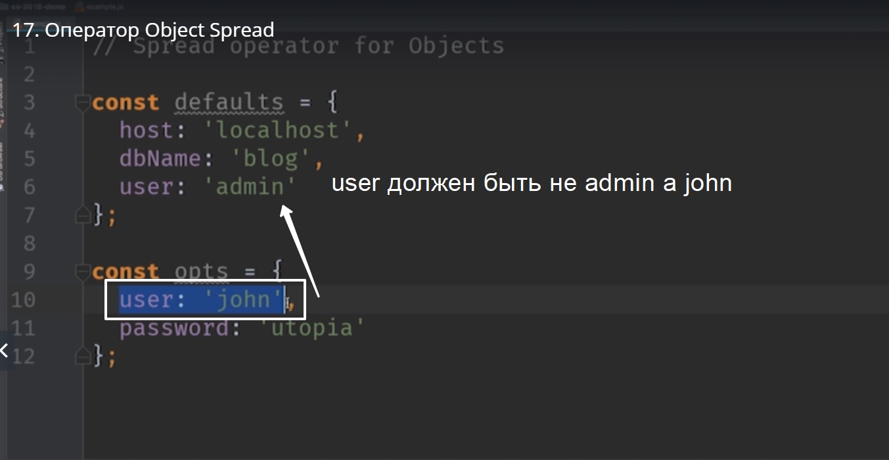

Эта та опция которую передал пользователь.

Напомню, с помощью **Object.assign**  этот код можно реализовать вот так

```

 const result = Object.assign({},defaults,opts);

```

Первый параметр в Object.assign это объект в который будем записывать наше свойство. А следующие объекты ***defaults и  opts - Это источники свойств***. При этом свойства будут записываться слево на право. Соответственно если в opts  есть какие-нибудь такие же свойства как и в defaults, то свойство из opts  перезапишет то что было в defaults.
Но при помощи ***Object Spread*** оператора этот код можно написать еще лаконичнее.

Создаем новую переменную, хотя он создает константу,**const res** и затем мы говорим что это будет новый объект **={}**. Ntgthm Т этот объект мы добавляем все свойства из **...defaults** и затем все свойства из **...opts** таким вот образом троеточием.

```

 const res = {...defaults, ...opts};

```

 Очень похоже на то как работает spread оператор в пассивах, только в массивах spread jgthfnjh расскрывает массив на список аргументов. А в Object естественно раскрывается на список кючей значений которые будут присвоены другому объекту.

 Давайте запустим этот код и убедимся что он работает.

```

 const defaults ={
 host:'localhost',
 dbName: 'blog',
 user: 'admin'
 };
    
 const opts = {
    user:'john',
    password: 'utopia'
 };
 
 const res = {...defaults, ...opts};
  console.log(res);

```

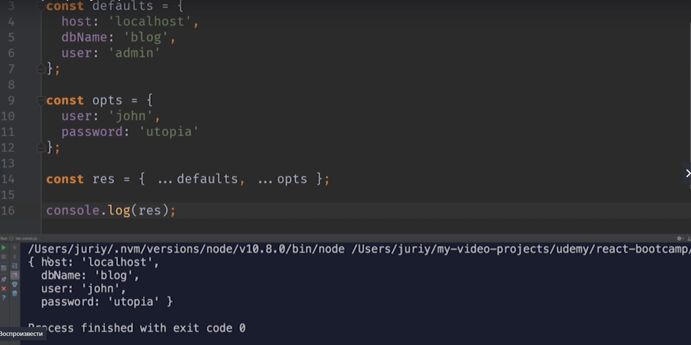


И действительно, наши опции содержат именно те значения которые мы хотели host остался по умолчанию, dbName остался по умолчанию, user и  password записался из пользовательских опций.
Вот таким образом работает spread оператор.

Но чем spread оператор действительно хорош, так это тем что его можно комбинировать с любым другим синтаксисом который работает при создании объектов.

Предположим что у нас есть какая-нибудь **const port = 8080;** Который мы хотим добавить к нашему объекту. Мы можем просто добавить ее в объект, смотри на 3-й парамерт константы res

```

 const defaults = {"host": 'localhost'...};
 const opts = {"user":'john'...};
 const port = 8080;
 const res = { ...defaults, ...opts, port}; //мы добавили константу port к нашему объекту
 console.log(res);

 ```

 Помните это **Short Hend** сокращенный синтаксис добавления свойств. Это тоже самое что написать 

 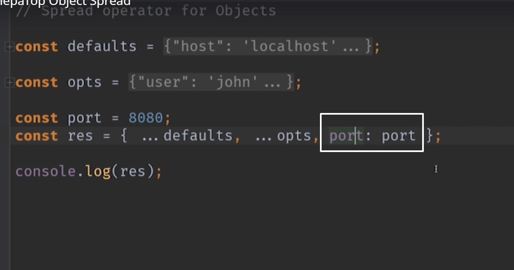

 Но если у нас свойство совпадает с именем переменной то мы можем использовать сокращенную запись.

 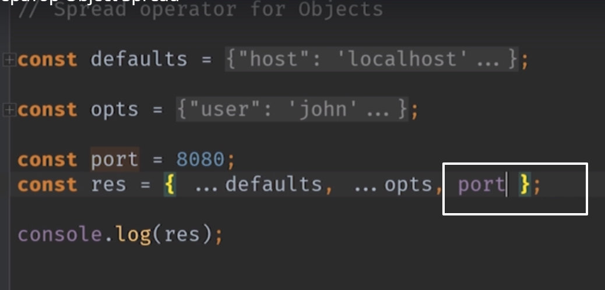

 Точно так же мы можем добавить какой-нибудь метод в этот объект. 
 Добавим метод **Connect**

 ```

const defaults = {"host": 'localhost'...};
 const opts = {"user":'john'...};
 const port = 8080;
 const res = {
 ...defaults, 
 ...opts, 
 port, //мы добавили константу port к нашему объекту
 connect(){

 }
 }; 
 console.log(res);

 ```
Сдесь мы тоже можем использовать сокращенный синтаксис и вот таким вот способом **connect(){}** добавить новую функцию. 
Таким образом мы комбинируем свойства из других объектов , добавляем новые свойства, и определяем новые методы. 
Как видите **Object Spread** оператор наиболее гибкий и лаконичный по сравнению с функцией Object.assign. 
C развитием библиотек вроде react или redux  которые работают с неизменяемыми объектами данных, этот синтаксис очень удобно использовать для того что бы создавать **shallow copy**  мелкие копии объектов и возможно немного их изменять в процессе.

 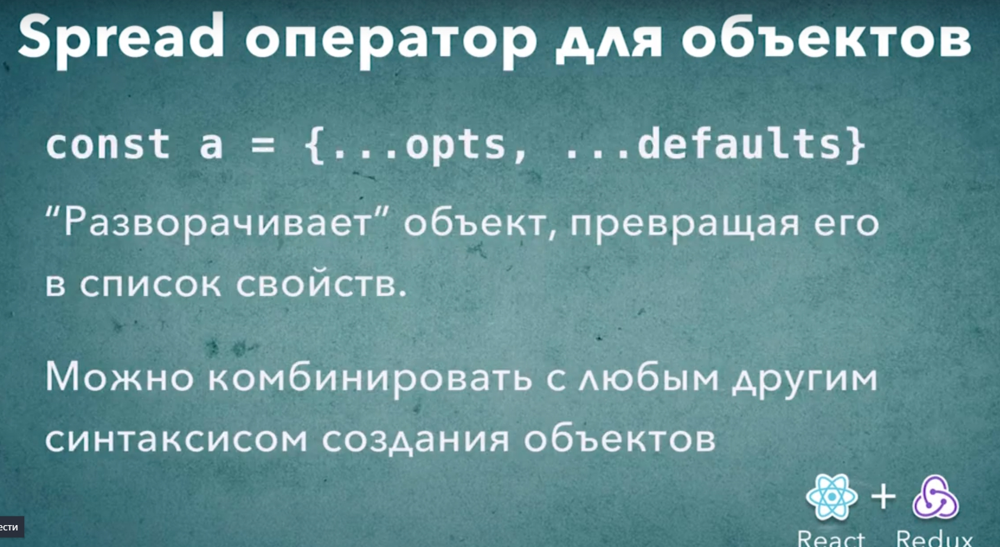

 <br/><br/><br/><br/><br/><br/><br/><br/>

 # prototype

 Прототипы это фундоментальная часть языка. Без их понимания не возможно понять синтаксис классов в JS.
 Давайте представим себе что у нас есть много-много объектов которые описывают животных

 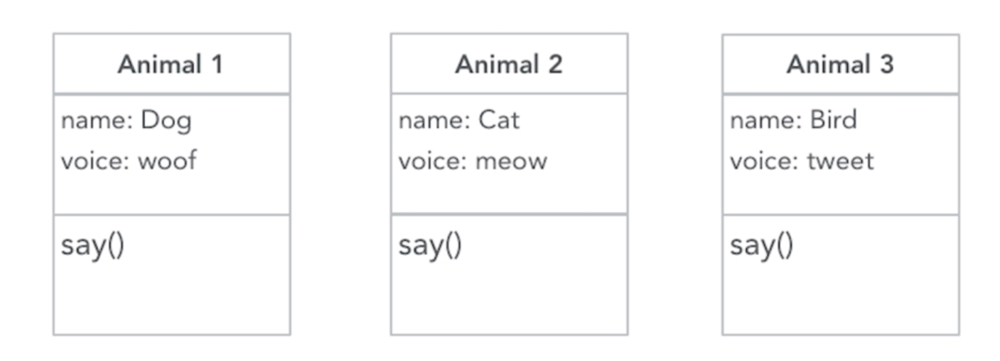

И у каждого животного есть функция **say** которая будет использовать **name** и **voce** для того что бы вывести приветственное сообщение. 
Как видите имена и голос у каждого животного разные. Но функция **say** у них абсолютно одинаковая. 
Если эти функции абсолютно одинаковые, то возникает вопрос: А действительно ли нам нужно хранить эти функции на каждом индивидуальном животном? Или их можно как-нибудь вынести в другое место? К примеру в другой объект. И затем сделать так, что бы каждый объект животного мог использовать эту общую функцию, а не держать каждый свою собственную копию.
Давайте теперь назовем этот объект прототипом каждого из животных.

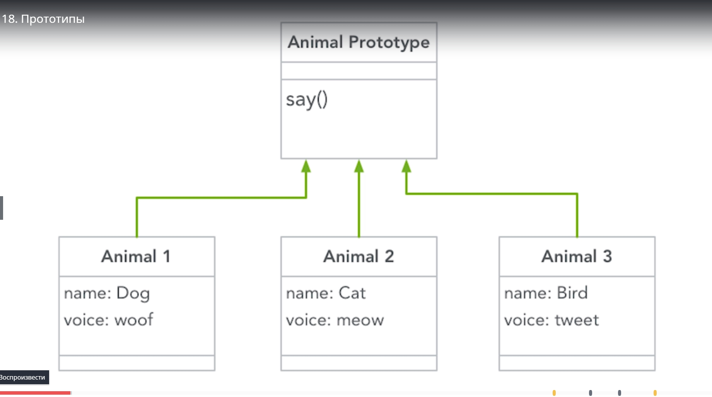

Т.е. **animal prototype** будет прототипом сабаки, кота и птицы.

Теперь давайте скажем что мы устанавливаем такое правило. Когда JS движок пытается найти в объекте какое-нибудь свойство, то он в первую очередь будет есть ли это свойство в самом объекте.

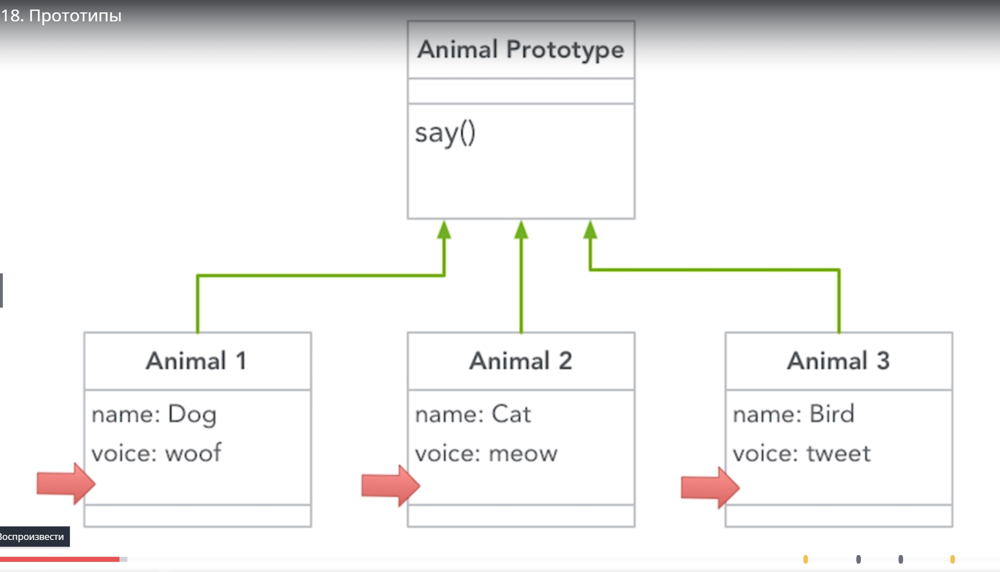

 т.е. если это свойство есть. Свойство это может быть все что угодно, это может быть обычное поле, строка, число или функция. Т.е. если это свойство есть то все ок, поиск на этом закончен.
 Но если этого свойства нет то JS не будет сразу останавливатся, а будет проверять есть ли у нашего объекта прототип

 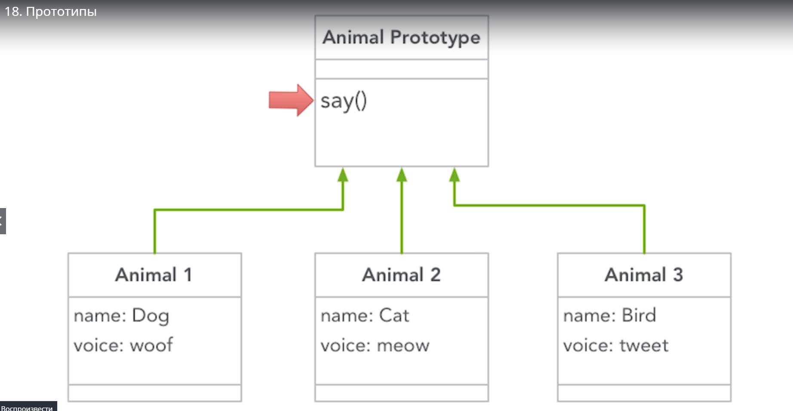

 и если этот прототип есть то JS будет переходить на прототип и искать это свойство там повторять процедуру поиска.
 Но мы только что говорили что прототип это обычный объект и он хранит обычные свойства. И значения этих свойств могут быть функции, строки, числа все что угодно. Но суть в том что эти свойства помогут переиспользовать другие объекты. Но поскольку сам протопип является обычным объектом то у него может быть свой собственный прототип.

 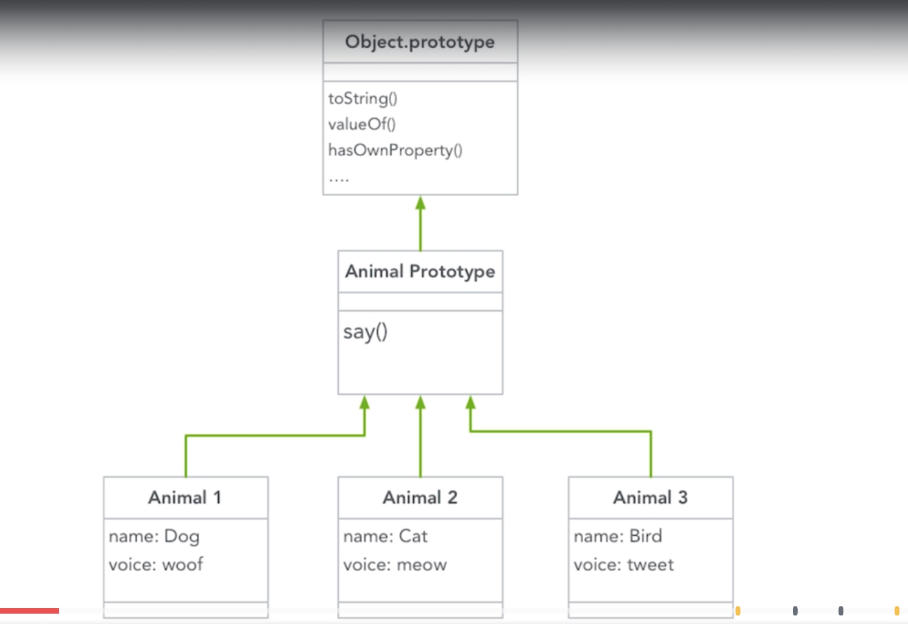

 И тогда если JS не найдет нужного свойства даже в на прототипе, посмотрим есть ли у него прототип, и затем у следующего прототипа прототип и т.д пока мы не найдем объект у которого нет прототипа. И если свойства которое мы ищем нет и там, то мы вернем **undefined**
 
 Такая структура называется цепочкой прототипов. И когда мы вызываем метод или читаем значение JS будет искать значение именно так снизу вверх. От самого объекта вверх по цепочке прототипов пока свойство не будет найдено или цепочка не закончится.
  Это все что нужно знать как прототипы работают. Все остальное это детали JS.

  А теперь посмотрим как эти детали работают в коде. Создадим эту нарисованную схему. и начнем с первого варианта где небыло протатипа. Где у каждого объекта копия функции say.

   

  Вот как будет выглядеть наш код. Будем рассматривать 2-ва объекта.

```
const dog = {
    name: 'dog',
    voice: 'woof',
    say: function(){
        console.log(this.name, 'goes', this.voice);
    }
};

const cat = {
    name: 'cat',
    voice: 'meow',
    say: function(){
        console.log(this.name, 'goes', this.voice);
    }
};


 ```

  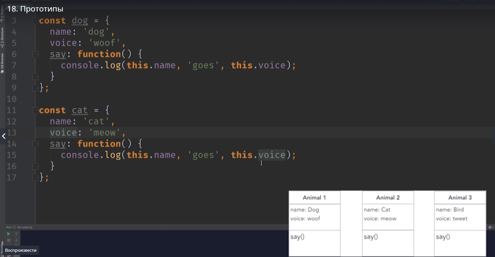

  У каждого из этих объектов есть функция say, которая использует поля объекта name, voice, для того что бы вывести это самое сообщение. проверяем как работает этот код вызываем
   dog.say(); 
  cat.say();

```
const dog = {
    name: 'dog',
    voice: 'woof',
    say: function(){
        console.log(this.name, 'goes', this.voice);
    }
};

const cat = {
    name: 'cat',
    voice: 'meow',
    say: function(){
        console.log(this.name, 'goes', this.voice);
    }
};

dog.say(); 
  cat.say();
 ```

 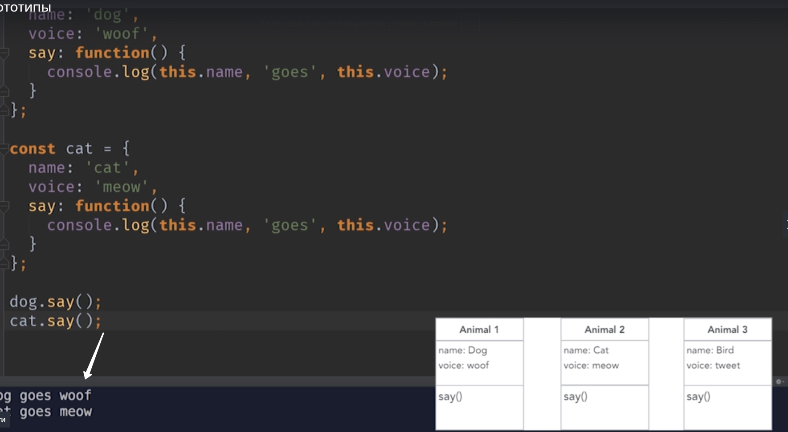

Теперь попробуем этот код улучшать. Для начала вынесем нашу функцию **say** В отдельный объект. Теперь у нас не будет копии функции. Функция определана в другом объекте. Назовем этот объект **Animal**
  
```
const animal = {
    say: function(){
        console.log(this.name, 'goes', this.voice);
}


const dog = {
    name: 'dog',
    voice: 'woof',
};

const cat = {
    name: 'cat',
    voice: 'meow',
    
    }
};

dog.say(); 
  cat.say();

 ```

т.е. мы удалили функцию из dog и  cat  и поставил ее в объект animal. 
И если мы попробуем запустить этот код, то естественно он не запуститься, потому что dog и cat  ничего не знают про animal т.к. ни какой связи между ними нет.
Есть несколько способов становить связь. Мы будем использовать функцию которая тоже появилась в EcmaScript 2015.
Она называется **Object.setPrototypeOf**. И так для dog пишем связь.


```
const animal = {
    say: function(){
        console.log(this.name, 'goes', this.voice);
}


const dog = {
    name: 'dog',
    voice: 'woof',
};
Object.setPrototypeOf(dog, animal);// теперь animal это прототип объекта dog

const cat = {
    name: 'cat',
    voice: 'meow',
};
Object.setPrototypeOf(cat, animal);// тоже самое для cat


dog.say(); 
  cat.say();

 ```
И cat в качестве своего прототипа будет иметь animal.

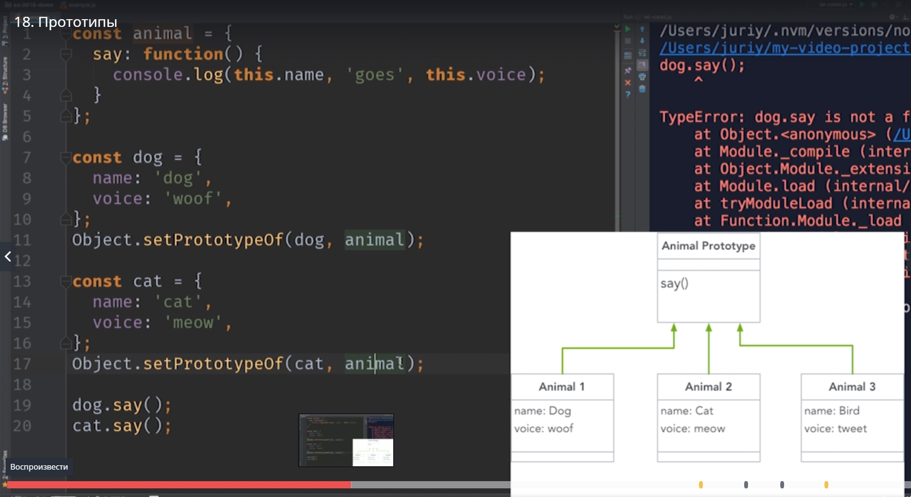

Если мы снова запустим наш код, то мы увидим что он работает точно так же как он работал раньше

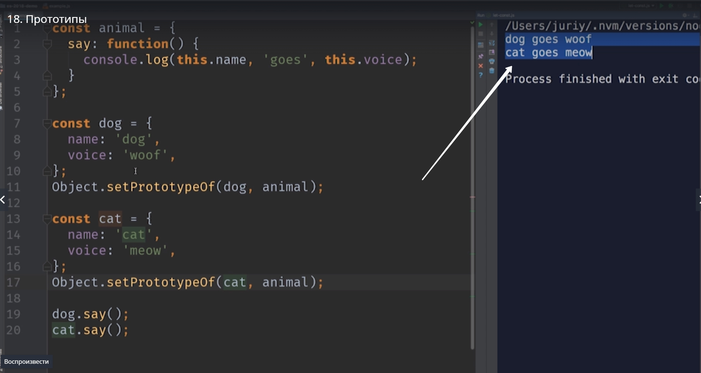

Мы добились того что dog и cat не имеют своих копий функций. Они переиспользуют функцию, делегируют вызов этой функции объекту animal. 
Осталась только одна маленькая проблема. Метод Object.setPrototypeOf очень плохо сказывается на производительности вашего приложение. Взляните на страницу [Object.setPrototypeOf](https://developer.mozilla.org/ru/docs/Web/JavaScript/Reference/Global_Objects/Object/setPrototypeOf). Это поломает оптимизацию движка и сделает код существенно медленнее. Поэтому этот метод не использовать вообще.

Есть более хорошие способы создать эту прототипную связь и этот способ это **Object.create** которая создает пустой объект с заданным прототипом.
Давайте для начала проверим что это будет работать на **dog**. 

```
const animal = {
    say: function(){
        console.log(this.name, 'goes', this.voice);
    }
};

const dog = Object.create(animal);
dog.name = 'Dog';
dog.voce = 'woof';

dog.say();


 ```

 **const dog** это объект который мы создаем при помощи **Object.create**. И **Object.create** принимает на вход объект который будет прототипом того объекта который мы создаем. т.е. мы говорим что мы будем создавать пустой объект **Object.create()** с прототипом **Object.create(animal)**. Едиственный нюанс, dog это пустой объект которому нужно вернуть его свойства.
 т.е. мы можем сказать что **dog.name = 'Dog';**
 и **dog.voice ='woof';**

 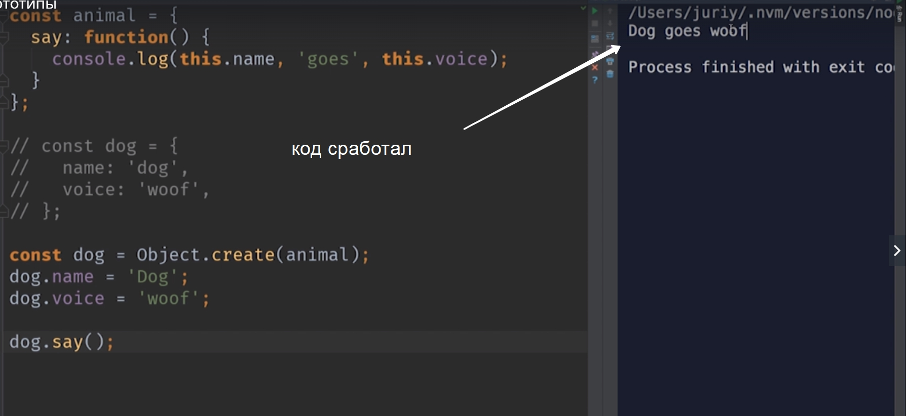

 ***Код сработал отлично. Потому что dog является прототипом объекта animal***

 Соответственно когда JS будет искать say. Сначала он попробует найти на самом объекте dog

 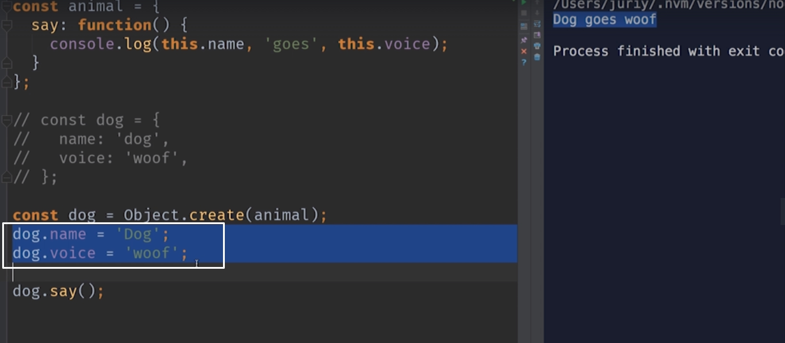

 Если там этого свойства не будет. Он посмотрит и скажет. У объекта dog есть прототип animal и вот уже у него есть усть свойство say

 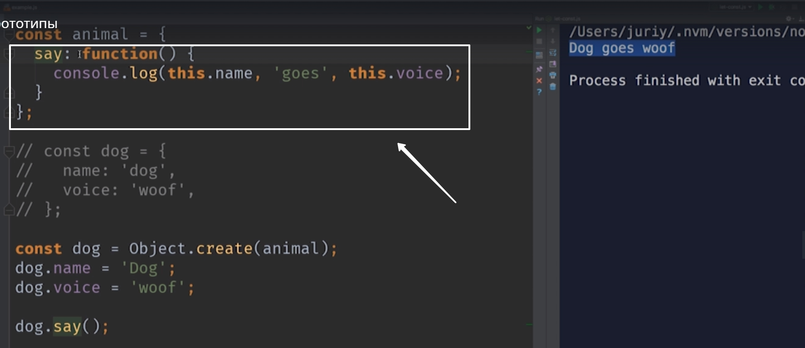

 Вот она эта функция и  давайте ее вызовем.

 А теперь давайте сделаем этот код еще немного лючше и вынесем логику создания нового животного в установке этой прототипной связи

 ```
 const dog = Object.create(animal);
 ```
 в отдельную функцию для того что бы нам легче было создавать новых животных. Назовем эту функцию **createAnimal** На вход передаем **name** и **voice**.

 ```
const animal = {
    say:function(){
console.log(this.name, 'goes', this.voice);
    }
};

function createAnimal(name, voice){
    const result = Object.create(animal);
    result.name = name;
    result.voice = voice;
    return result;
}

// и так мы вынесли всю нашу логику создания животного в отдельную функцию.
// Далее мы просто создаем животных

сonst dog = createAnimal('Dog', ''woof);
const cat = createAnimal('Cat', 'meow');

dog.say();
cat.say();

 ```


 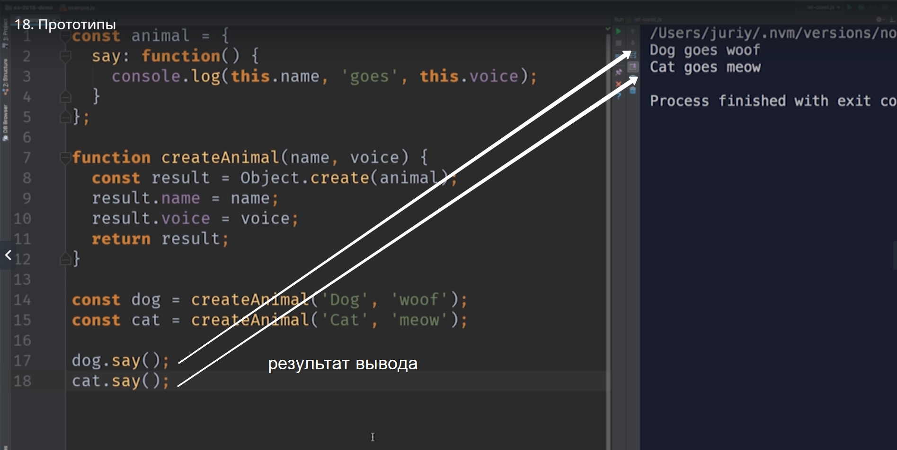

 мы провели маленький рефакторинг. Мы не поломали тот код который у нас существовал. Вынесли процесс создания нового животного в отдельную функцию. 
 Так вот то что мы с вами только что сделали. Мы фактически создали функцию конструктор. Мы используем ее для того что бы создавать новые объекты с заданным прототипом. А в JS создание новых объектов это одно из самых часто используемых и необходимых действий. По этому еще с самой первой версии языка есть ключевое слово **New**. Оно помогает упростить этот код еще немного.
 Еще раз переписываем этот код.
 ***В первую очередь переименовываем createAnimal в в просто Animal c большой буквы. Это обычный код convention в мире JS. Если у нас есть функция которая создает новые объекты,функция конструктор, то ее принято называть с большой буквы***.
  А теперь давайте используем ключевое слово new.

   ```
const animal = {
    say:function(){
console.log(this.name, 'goes', this.voice);
    }
};

function Animal(name, voice){
    const result = Object.create(animal);
    result.name = name;
    result.voice = voice;
    return result;
}

сonst dog = new Animal('Dog', ''woof);
const cat = new Animal('Cat', 'meow');

dog.say();
cat.say();

 ```

 Когда мы начинаем использовать эту функцию ключевым словом new, JS начинает оптимизирует для нас несколько моментов.
 Во первых нам не нужно вручную создавать новый пустой объект

 ```
const result = Object.create(animal);

 ```
JS сделает это за нас. И этот объект внутри функции конструктора будет называться **this**. Во-вторых нам не нужно его возвращать

```
return result;

```
потому что новый объект возвращается из конструктора когда мы вызываем его с ключевым словом **new**  автоматически.

  ```
const animal = {
    say:function(){
console.log(this.name, 'goes', this.voice);
    }
};

function Animal(name, voice){
    const result = Object.create(animal);
    this.name = name;
    this.voice = voice;
}

сonst dog = new Animal('Dog', ''woof);
const cat = new Animal('Cat', 'meow');

dog.say();
cat.say();

 ```
 Единственный оставшийся вопрос. Это каким же все таки образом JS  будет знать что прототипом новых объектов которые мы создаем через эту функцию 

 ```
function Animal(name, voice){
    const result = Object.create(animal);
    this.name = name;
    this.voice = voice;

 ```

 будет именно объект Animal?

 И тут тоже все просто. В JS  у каждой обычной функции, arrow функции не считаются, есть свойство **prototype**.
 Это просто пустой объект который будет использоваться как прототип для новых объектов которые мы создаем с этой функцией. **Animal.prototype**  это изначально пустой объект, но почему бы нам не взять нашу функцию **say** и не записать в этот объект? получается вот что

   ```
function Animal(name, voice){
    const result = Object.create(animal);
    this.name = name;
    this.voice = voice;
}

Animal.prototype.say = function(){
console.log(this.name, 'goes', this.voice);
};// Это прототип


// а это объекты которые мы создаем
сonst dog = new Animal('Dog', ''woof);
const cat = new Animal('Cat', 'meow');

dog.say();
cat.say();

 ```

  


<br/><br/><br/><br/><br/><br/><br/><br/><br/>

# Классы

Классы это синтаксический сахар. Нововведение которе добавили в Ecmascript 2015.
Класс это некий чертеж по которому создаются объекты в языках вроде Java, C++, C#. И класс это одно из самых базовых понятий ООП. И хоть JS построен не на классах, а на прототипах, тысячи программистов пришли к патерну для ООП кода и назвали его классом.

  ```
function Animal(name, voice){
    const result = Object.create(animal);
    this.name = name;
    this.voice = voice;
}

Animal.prototype.say = function(){
console.log(this.name, 'goes', this.voice);
};// Это прототип


// а это объекты которые мы создаем
сonst dog = new Animal('Dog', ''woof);
const cat = new Animal('Cat', 'meow');

dog.say();
cat.say();

 ```

 Мы его рассмотрели в прототипах. 
 Этот паттерн не очень хорош по двум причинам.
 1. Этот код показывает нам детали того как мы формируем связи между объектами вместо того что бы показывать смысл. А смысл тут очень простой. У всех объектов типа **Animal**  должно быть **имя(name)**, и **голос(voice)**. Кроме того у всех объектов должно быть функция say rj орая использует эти значения (this.name, 'goes', this.voice);.
 2. Причина это наследование и управление цепочками прототипов. Работая с прототипами на прямую код для вызова выше по цепочке прототипов выглядел слишком сложно и слишком громоздко. И создатели решили добавить понятие **class**.
   Классы не добавляют ни каких новых структур данных. Они просто делают работу с прототипами намного более интуитивной. Тот код который мы сейчас напишем дас нам точно такую же структуру конструктор и объект прототип, как в примере выше.

```
class Animal{
    consrtructor(name, voice){
        this.name = name;
        this.voice = voice;
    }
    say(){
 console.log(this.name, 'goes', this.voice);   
}
}


 ```

 пишем ключевое слово **class** затем даем имя **Animal**,  Открываем **{}** и в теле класса создаем функцию конструктор, **constructor(){}**.
 **constructor**- это специальное имя, оно должно быть именно таким. Это имя аналогично функции конструктор которую мы писали ранее. соответственно она будет принимать параметры **(name, voice)**. Далее в теле конструктора пишем куда будут присваиваться эти значения, в данном случае полям объекта **this.name = name;this.voice = voice;**.
 Затем нам нужно добавить функцию **say**. И сделать это очень просто. Мы просто пишем название функции **say(){}**. Как позволяет синтаксис создания объектов, точно так же и влассе можно написать название  функции, поставить круглые скобки и затем написать тело функции. **console.log(this.name, 'goes', this.voice);**.
 Этот код эквивалентен предыдущему. Но он чище и читается легче.

 Давайте теперь представим что нам нужно создать новый сласс **Bird**. И в моем коде животное которое еще может быть может летать. **class Bird extends Animal{}**
 Что говорит ключевое слово **extends**? Оно говорит что классы **Bird** и **Animal** , будут стоять в цепочке прототипов.
 Если мы создадим новую птицу **const duck = new Bird('Duck', 'quack');**.
 Теперь вернемся к тому что делает слово **extends**. Jyj Онздает вот такую структуру. у нас есть объект **duck**, его прототипом будет **Bird.prototype** а его прототипом будет **Animal.prototype** и для того что бы завершить картину его прототипом будет **Object.prototype** и его прототипом будет **null**.

 ```
//classes

class Animal {
    constructor(name, voice){
        this.name = name;
        this.voice = voice;
    }
    say(){
    console.log(this.name, 'goes', this.voice);
}
}


// duck -> 
Bird.prototype -> 
Animal.Prototype -> 
Object.prototype -> null

class Bird extends Animal{

}

const duck = new Bird('Duck','quack');

 ```

 Вы заметили что мы создали duck и сразу передали значение ('Duck','quack') передал такие же значения которые передавал в Animal.
 Все дело в том что в JS мы не указываем явно конструктор, то наш класс наследует конструктор своего супер класса, а супер класс в нашем случае это **Animal** это высший класс в цепочке прототипов.

 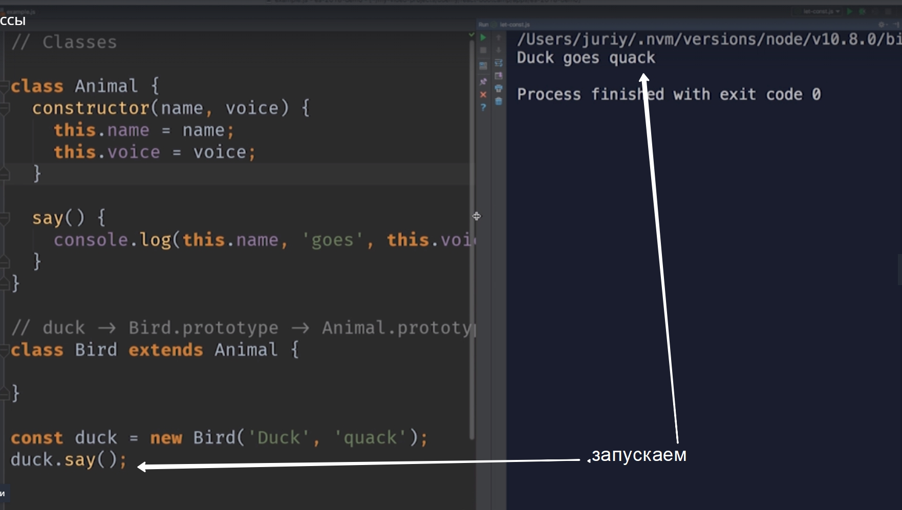

 Наш код сработал отлично!!!

 Но что если мы хотим добавить дополнительные возможности в конструктор Bird

 ```
//classes

class Animal {
    constructor(name, voice){
        this.name = name;
        this.voice = voice;
    }
    say(){
    console.log(this.name, 'goes', this.voice);
}
}


// duck -> 
Bird.prototype -> 
Animal.Prototype -> 
Object.prototype -> null

class Bird extends Animal{
constructor(name, voice, canFly){
    super(name, voice);
    this.canFly = canFly;
}
}

const duck = new Bird('Duck','quack', true);
duck.say();

 ```

 мы можем создать **constructor(){}** и сдесь в этом конструкторе, если класс Bird наследует какой-нибудь еще класс Animal, мы обязательно должны вызвать конструктор **super** класса при помощи ключевого слова **super**. 
 В параметры конструктора надо что-то передать!!! **(name,voice, canFly)**. Третьим параметром мы добавляем переменную **canFly** xn  бы наш конструктор не был абсолютно безполезным.
 В **super** в его параметрах передаем **name** и **voice** которые пойдут выше конструктору **Animal**. Т.е. после этого эти значения будут установлены на нашем объекте.
 И в конце концов мы скажем **this.canFly = canFly;** 
 В const duck третьим параметром прописываем true  для того что бы вернул истину.
 **Вызываем duck.say();**

 Есть одно правило если мы наследуем класс, то нам обязательно нужно вызвать **constructor** до того как мы впервый раз используем ключевое слово **this**

 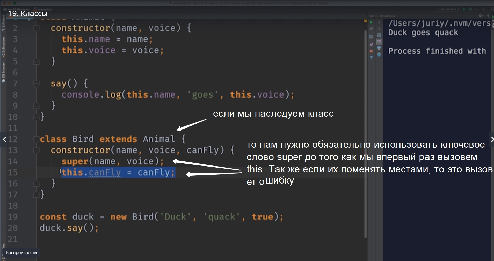

 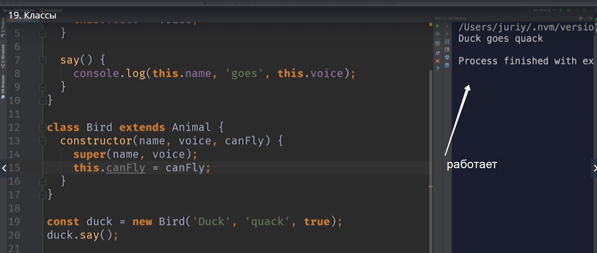

 Ключевое слово **super**  очень удобное, оно дает доступ не только к супер конструктору, но и к любому методу который объявлен в супер классе

 ```
 say(){
    console.log(this.name, 'goes', this.voice);
}
```

К примеру используя слово **super**  мы можем о, атиться к методу **say** который мы объявили в **Animal**. Теперь при создании новой утки мы будем использовать этот метод.

 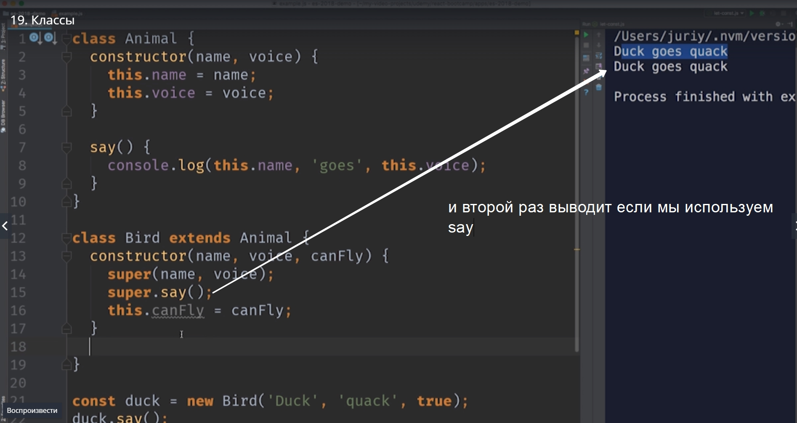

 Tckb Ееобходимо мы можем переопределить полностью функцию **say** lkz класса **Bird**. 
 Для этого мы просто создаем в теле **Bird**  функцию которая называется точно так же 

  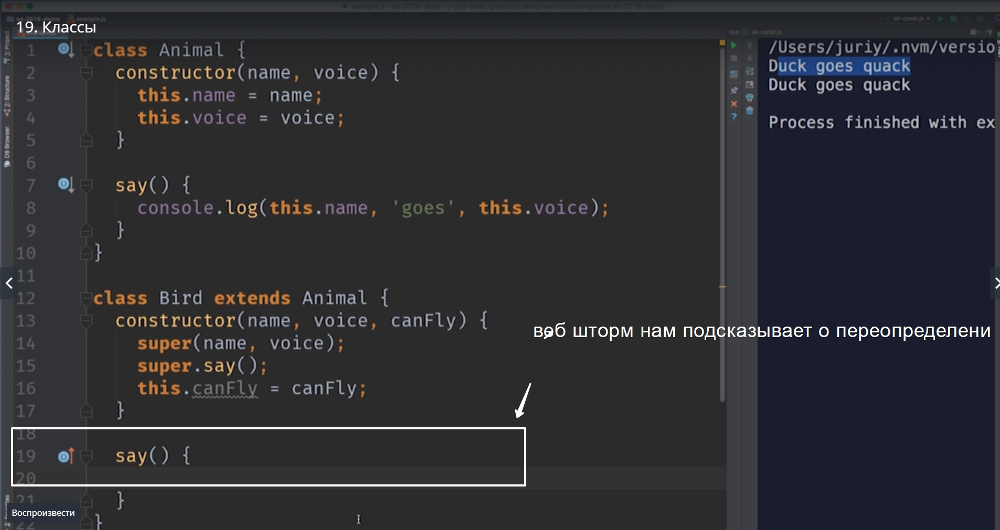

  Предположим что наши птицы будут угрюмыми и они будут говорить

   ```
 say(){
    console.log('Birds don\'t like to talk');
}
```

полный вариант

 ```
//classes

class Animal {
    constructor(name, voice){
        this.name = name;
        this.voice = voice;
    }
    say(){
    console.log(this.name, 'goes', this.voice);
}
}


// duck -> 
Bird.prototype -> 
Animal.Prototype -> 
Object.prototype -> null

class Bird extends Animal{
constructor(name, voice, canFly){
    super(name, voice);
    super.say();
    this.canFly = canFly;
}
}

say(){
    console.log('Birds don\'t like to talk');
}

const duck = new Bird('Duck','quack', true);
duck.say();

```

Запускаем и видим интересный эффект.


НО если мы **super**  заменим на **this** 

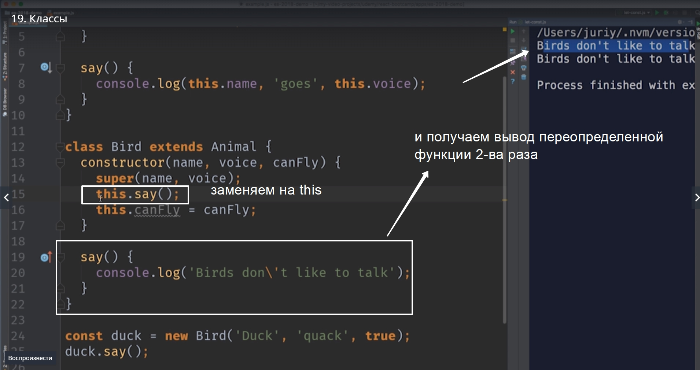

Выводится один раз из конструктора, а второй раз из собственного метода.

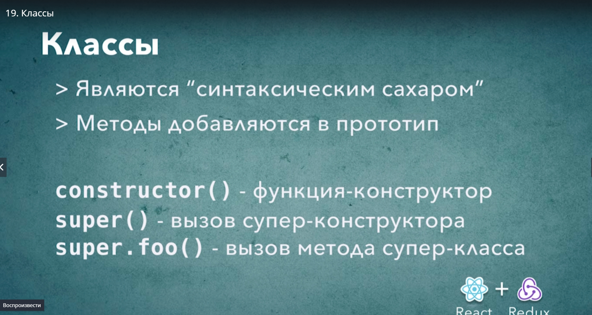

<br/><br/><br/><br/><br/><br/><br/><br/><br/>


# Cвойства классов

Класс **propierties** тот класс ктороый мы с вами сейчасс рассмотрим. На момент записи не являются частью стандарта. Раз не является стандартом то и не писал


<br/><br/><br/><br/><br/><br/><br/><br/><br/>

# Модули в JS

В Ecmascript 2015 , л представлен стандарт для JS модулей.
Давайте представим что наша программа состоит из десятков а возможно даже сотню файлов и один из этих файлов **mymath.js** который представляет переиспользуемые функции для математических операций 

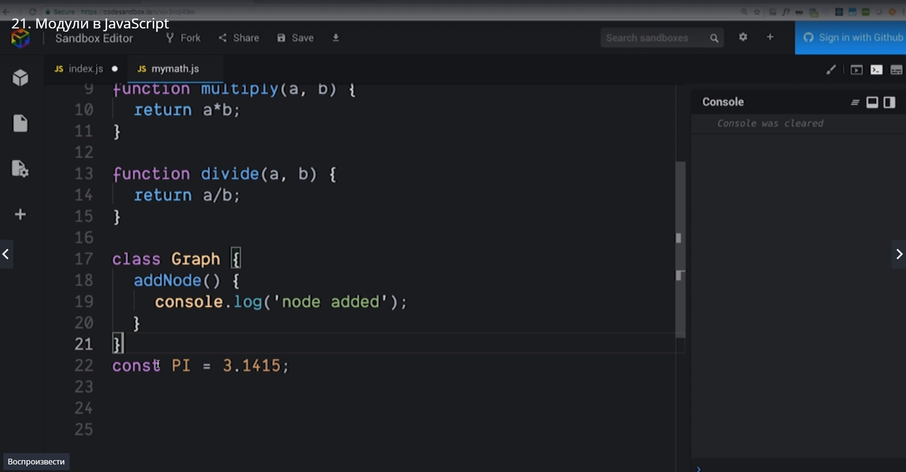

который отвечает за графы **Graph** и потенциальные несколько констант. Например **const PI = 3.1415** может понадобится в других частях программы. 

Как нам теперь из этого файла сделать Модуль? Т.е. как сказать что мы собирается экспортировать наружу все эти свойства этого файла.
Это сделать на самом деле очень просто. Мы пишем в файле следующую директиву **export** и в фигурных скобках пишем что экспортируем.

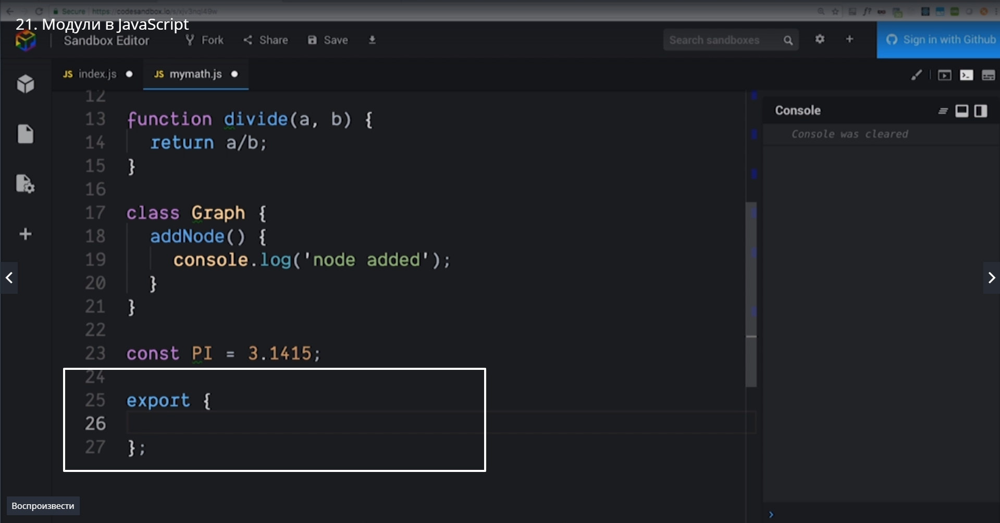

в ней перечисляем какие функции экспортируем.

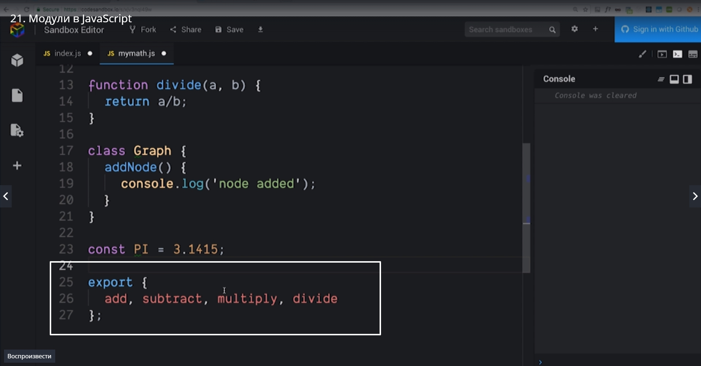

Предположим class Graph и  const PI vs решили не экспортировать. Это внутренние тела нашего класса и мы не хотим делится ими с окружающим миром.

Как нам теперь получить эти функции в другом классе.

Мы переходим в нужный нам файл. Пишем **import{}** и в теле пишем те функции которые хотим экспортировать. Далее пишем откуда мы хотим экспортировать **from'./'** и указываем путь к файлу.

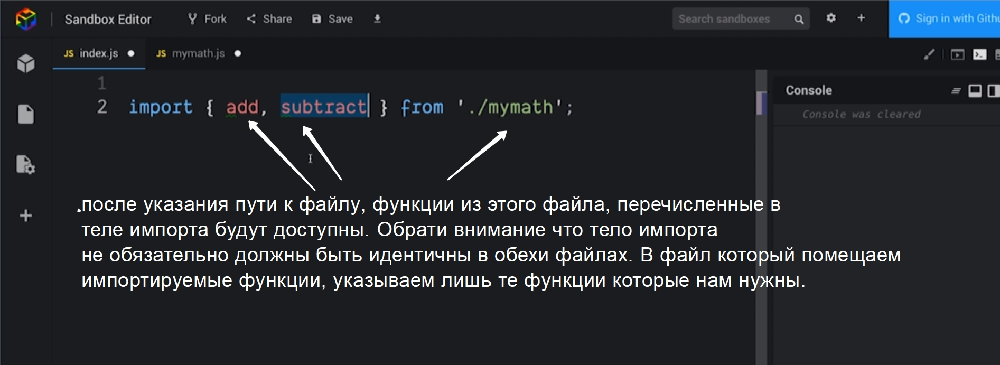

После этого мы можем использовать в скулпе эти функции

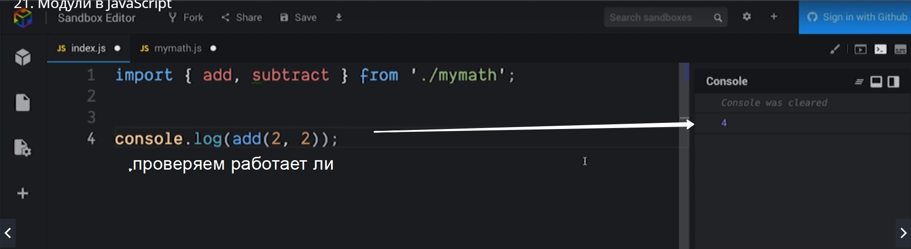

т.е. мы сказали что наш файл **index.js** зависит от файла **mymath**. И из файла **mymath** мы хотим получить функцию которая будет называтся **add** и затем использовать эту функцию в нашем файле. Точно так же функция **subtruct**. 
Так же мы можем экспортировать константу.

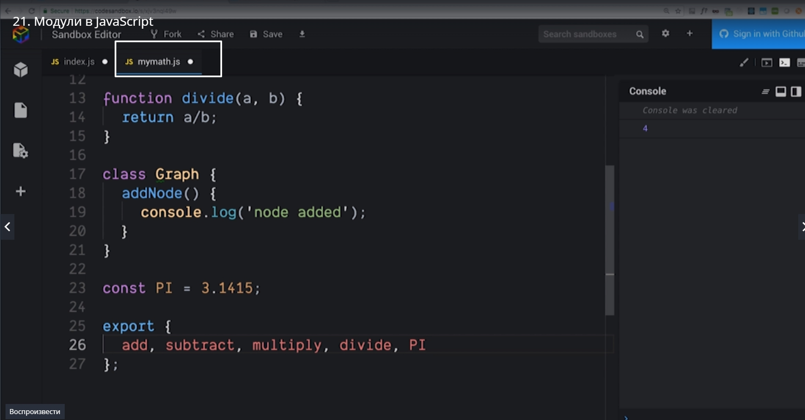

и далее дописываем в index.js в список того что мы хотим получить.

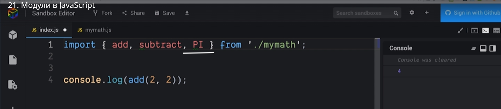

Далее мы можем вывести ее на экран

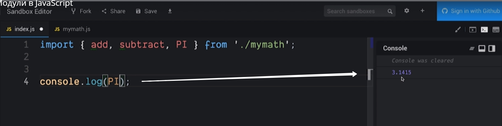

С каждой стороны и с стороны импорта и со стороны экспорта, то что вы импортируете можно переименовывать. Делается это с помощью **as**.

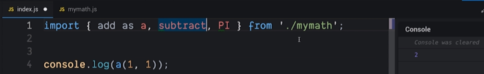

И точно так же с другой стороны экспорта.

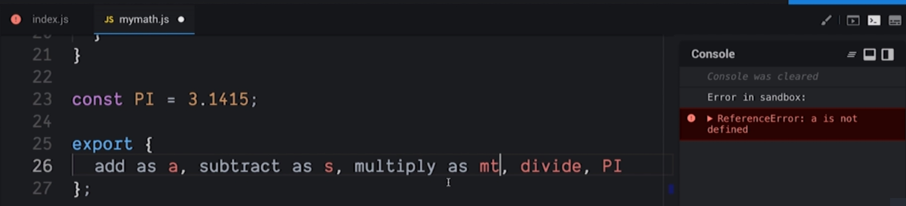

теперь для всех внешних файлов экспорты будут называться a,s,mt.

Предположим что вы хотите импортировать все что есть в файле mymath.js. Это делается с помощью звездочки

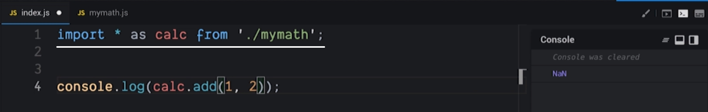

Кроме экспорта с именами файл может представить один дефолтный экспорт у которого не будет имени. Это то что будет экспортироваться по умолчанию. 
Для того что бы создать такой экспорт пишем в экспортируемом файле **export default и далее пишем то что хотим экспортировать в нашем случае класс Graph**

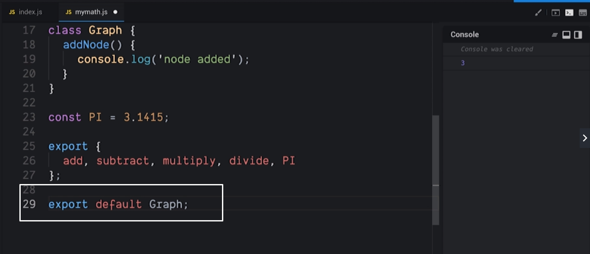

Как нам тогда получить этот экспорт в index.js

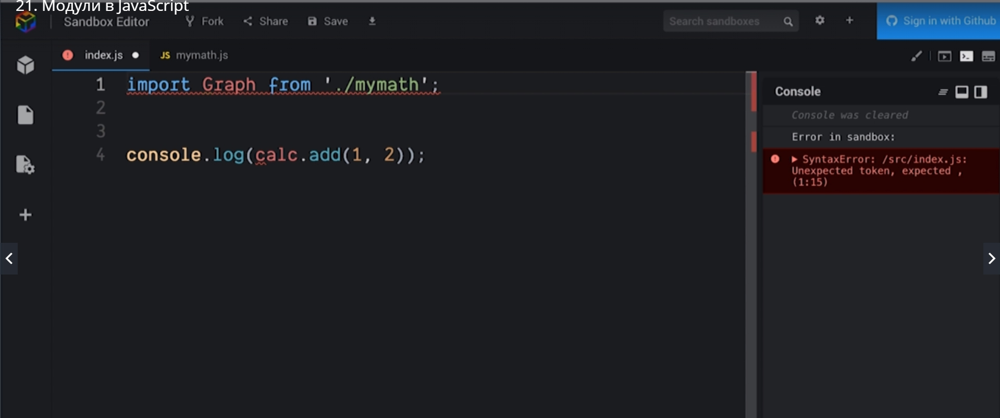


Мы не ставим в фигурные скобки если экспорт идет по умолчанию то мы просто пишем имя той переменной которую мы хотим сохранить

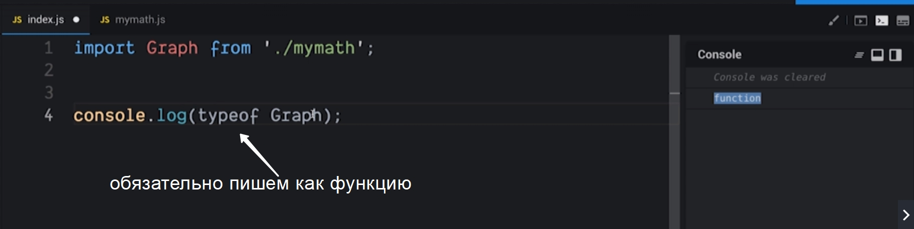

Ну и конечно если со стороны импорта мы можем переименовать нам не нужно писать as, мы просто говорим то что хотим...

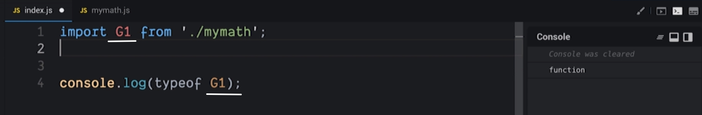

Мы можем миксовать между собой default импорт и экспорт, и именованый импорт и экспорт.

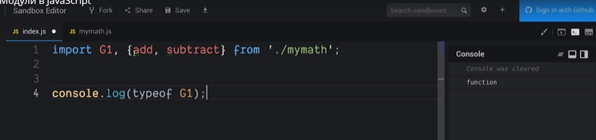

Это абсолютно валидный синтаксис.

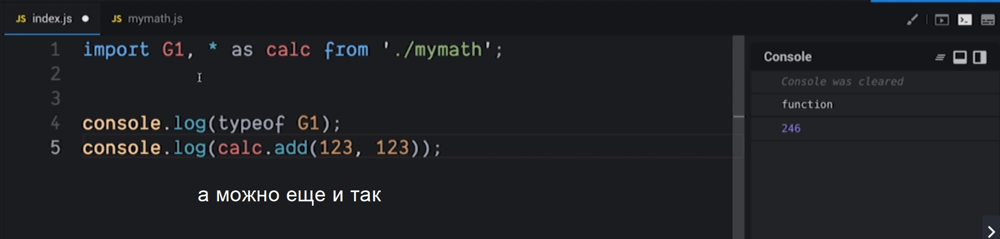

Еще раз посмотрим на сторону файла который у нас экспортирует

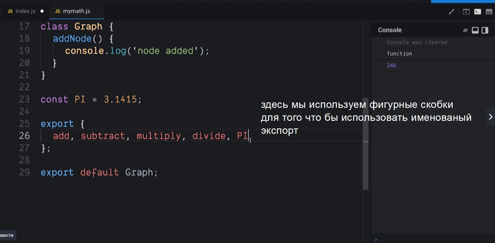

И с словом **export default** что-нибудь экспортировать по умолчанию.

**export default** не обязательно ставить последней строкой. мы можем взять **export default** и поставить его прямо перед определением класса. К примеру чаще всего наши файлы будут экспортировать одну функцию или один класс, и это очень удобный паттерн.


Таким образом в одной строке мы и объявляем класс и сразу же его экспортируем.
Думаю мы не можем останавливаться на том что мы не можем иметь два default свойства. Они на то и default что бы быть одним. Если мы попробуем это сделать то JS выдаст ошибку.
В некоторых случаях бывает что нам не нужно ипортировать какое-то конкретное значение из модуля, а нужно запустить тот код который в нем написан. Такое бывает когда модуль необходим ради своих side эффектов т.е. побочных эффектов. Этот модуль может делать что-то полезное ничего не экспортируя.
Тогда мы можем написать **import './sideeffect';**

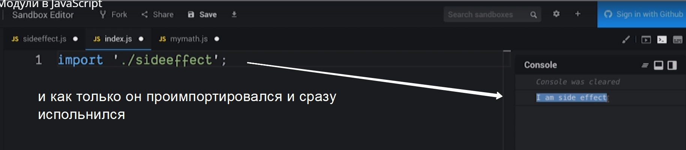

Некоторые инструменты сборщики вроде WebPack могут использовать такой синтаксис

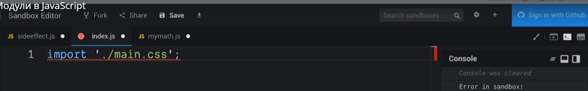

 что бы сказать нашему файлу: я завишу от какого нибудь ресурса. Например от этого кусочка css файла. После этого сборщик будет знать, что бы запустить этот файл нужно впустить в проект код из файла main.css. Мы можем подключать другие файлы. Но нужно помнить что это поведение и типы файлов оно специфично для конкретного сборщика который мы будем использовать. WebPack может потдерживать любые типы файлов. С другой стороны в NodeJS попытка импортировать картинку выдаст нам ошибку.

 Теперь рассмотрим **Глобальные зависимости глобальной библиотеки**

 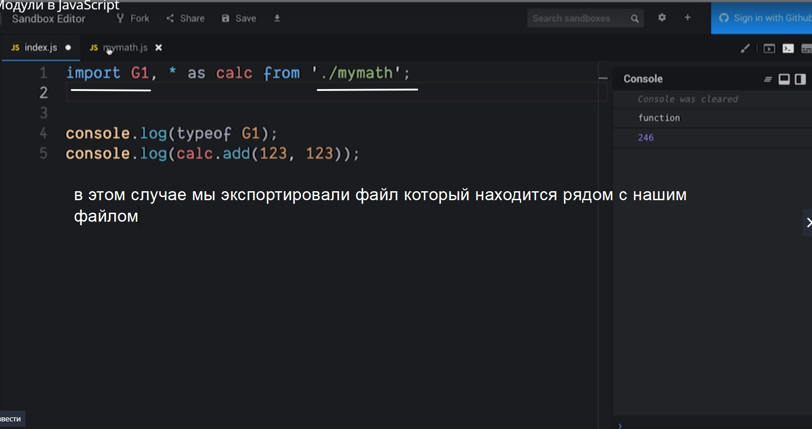

 т.е. он лежит в той же папке в файловой системе.

 Если же у нас есть библиотеки которую мы установили к примеру через npm, к примеру react, то синтаксис импорта будет отличаться.
 Так он нашел библиотеку one-liner-joke и установил как зависимость на проект.
 Давайте посмотрим как такую зависимость получить в наш файл. И здесь синтаксис точно такой же

 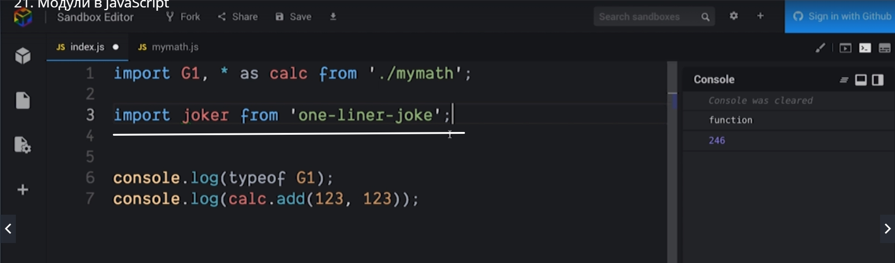

 Обратите внимание на то что в то время как импортировать из файла мы используем относительный путь ./mymath.
 Но для библиотеки которая установлена как зависимость мы используем просто ее название

 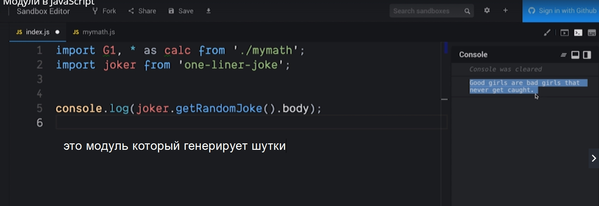

 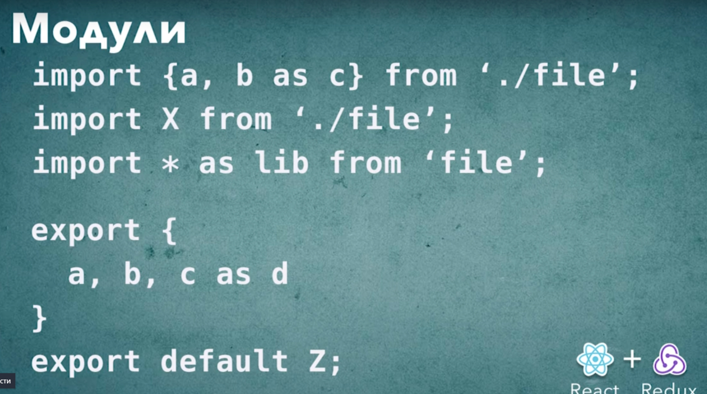   

