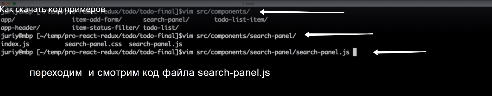

# Как скачать код примеров?

Что бы лючше понять как именно работает react, нужно писать как можно больше кода самостоятельно. Но есть репозиторий на разных этапах разработки каждого проекта.

[https://github.com/Juriy/pro-react-redux](https://github.com/Juriy/pro-react-redux)

Gh дположим я работаю с первым приложением и мне стало интересно какая будет финальная версия.

Можно посмотреть, поредактировать код. 
А если вы хотите запустить этот код. Не забудьте первым делом написать **npm install** И дать NodeJS скачать необходимые зависимости.

После установки всех зависимостей мы можем ввести **npm start**.

 Эта команда запустит WebPack, Соберет проект и покажет проект из той папки которую мы выбрали.

 

 

 