# Настройка среды разработки

NodeJs должен быть уже установлен. Для проверки в консоле пишем **$node -v** в Windows пишем без доллара. Должна появится версия которая используется на нашем компьютере.

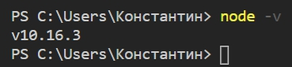

Для того что бы создать новый react проект мы должны скачать и настроить несколько инструментов которые будут преобразовывать react код, написанный на языке **JSX** в JavaScript Который будет понятен браузеру. Но и кроме того делать несколько дополнительных вещей.
Сделать это можно двумя способами.
1. Простой с использованием утилиты **create react App**. Этот инструмент создаст для вас характерную структуру файлов и папок, скачает все необходимые утилиты и настроит их таким образом что бы вам сразу можно было писать код.
2. Способ более сложный. Сделать все тоже самое только собственно ручно.

Наш первый шаг это установить утилиту **create react App** для этого мы исполняем команду **npm i -g create-react-app**.
Буквально через пару секунд npm установит утилиту.

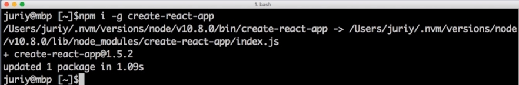

Теперь **creat react app** будет доступен через командную строку.
Давайте создадим отдельную папку для проекта который мы будем делать. Создаем **mkdir react-apps**. Переходим **cd react-apps**. Далее создаем наше новое приложение. Запускаем утилиту **creat-react-app** прямо из командной строки и передаем ей название приложения которое мы хотим сделать.

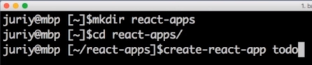

create react app создаст отдельную папку для нашего приложения которое будет точно так же называться. В нашем случае **todo**.

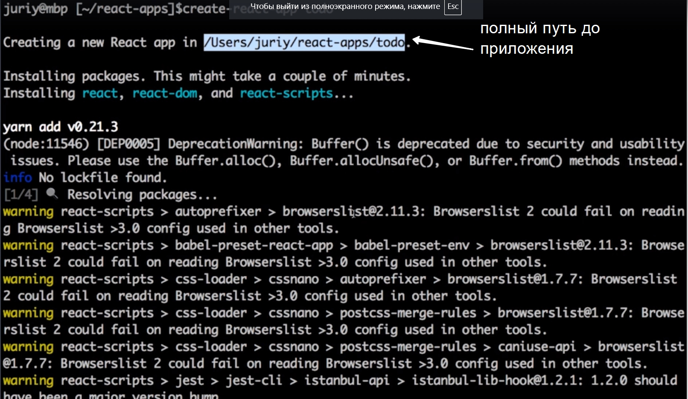

Создание пустого react проекта займет какое-то время. Потому что create react app скачает и сконфигурирует все необходимые утилиты.

Приблизительно так будет выглядеть экран после установки.

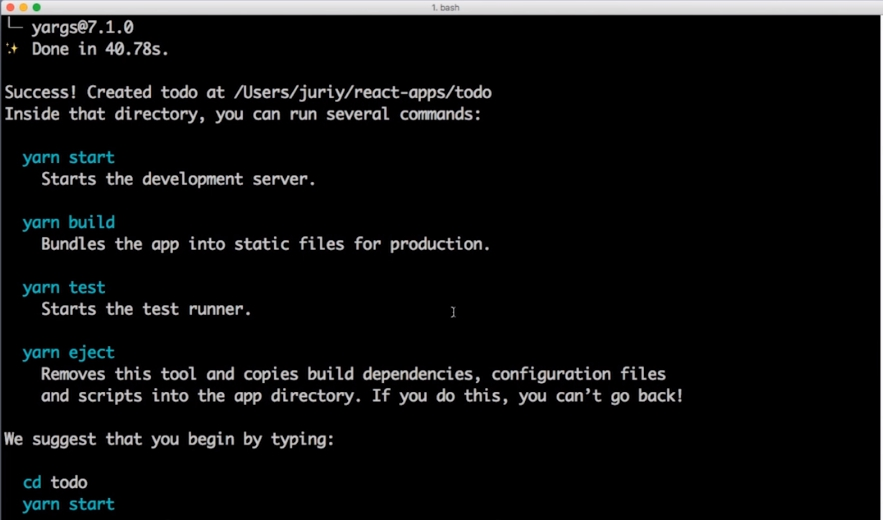

Давайте теперь зайдем в ту папку которую создал create react app. **cd todo/** после смотрим ее содержимое **ls**. Мы видим что у нас в этой папке есть несколько файлов. Далее прям в этой папке запускаем следующую команду **npm start**

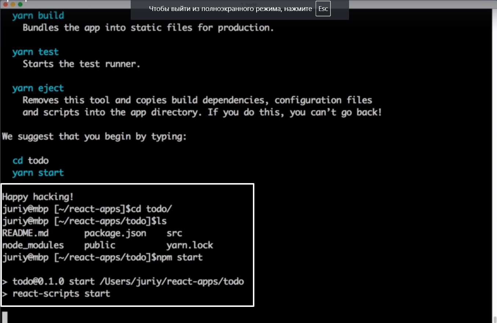

Запускается браузер.

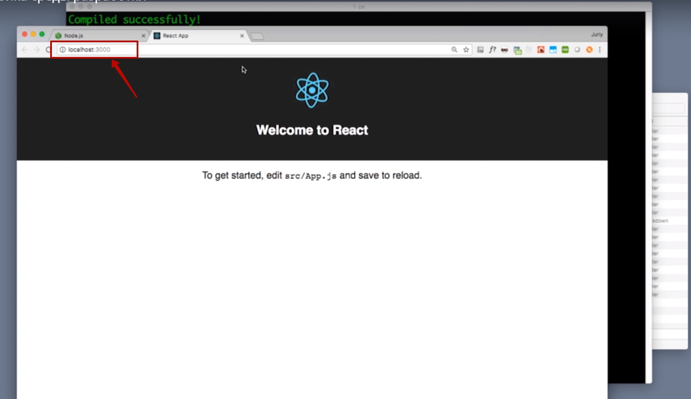

В консоле мы видим сообщение 

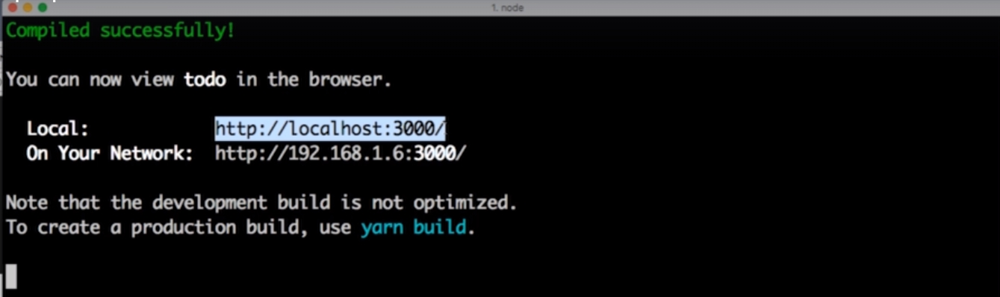

Теперь давайте попробуем открыть наш проект в одной из сред разработки.

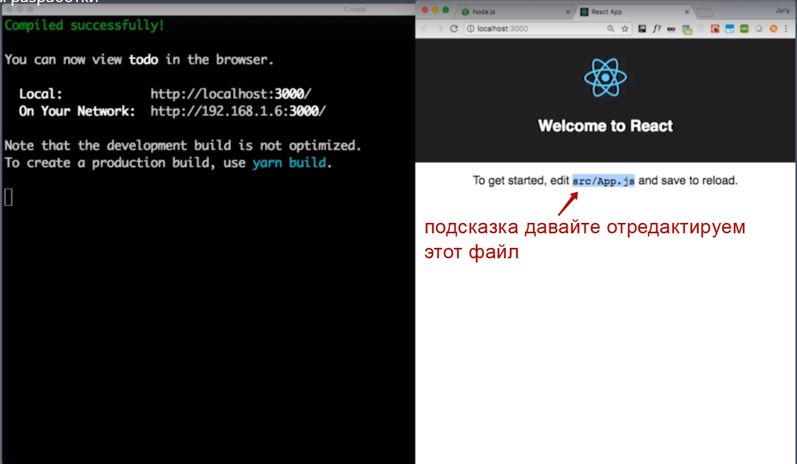

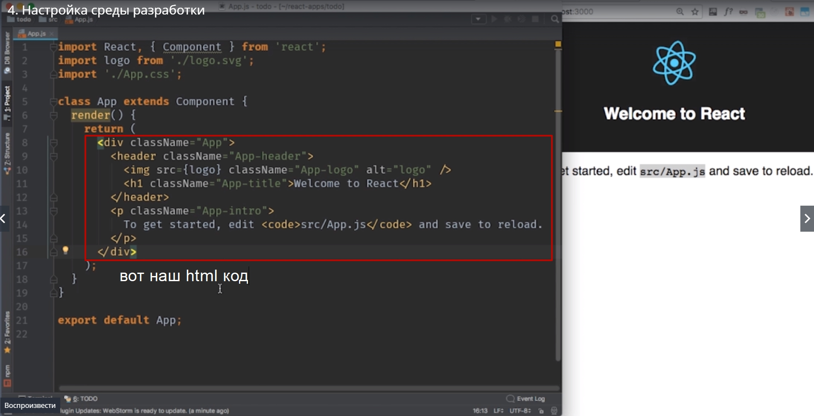

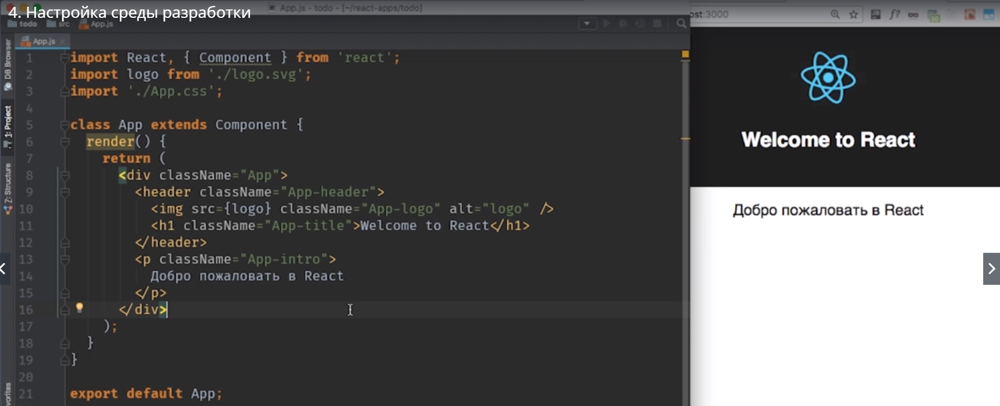

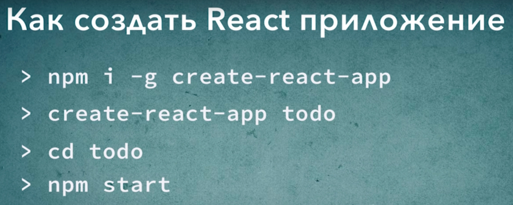