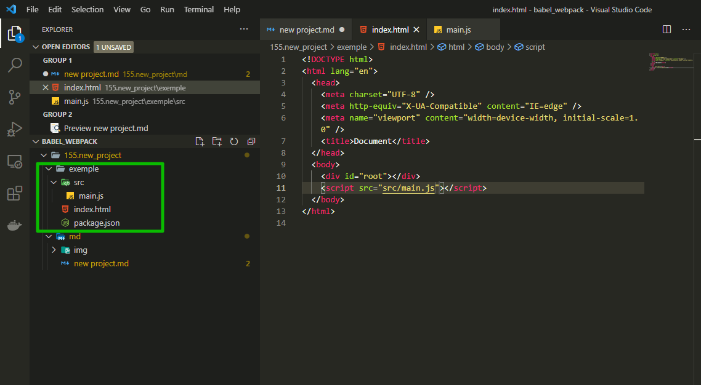
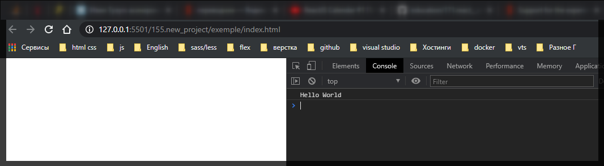

# new project

```shell
npm init -y
```

Создаю папку **src** и в ней **main.js**. В нем пишу простенький код для того что бы проверить что наш инструмент будет собирать и что-нибудь преображать.

```js
class App {
  run() {
    const name = 'World';
    console.log(`Hello ${name}`);
  }
}
const app = new App();
app.run();
```

Если сделал все правильно то все пройдет успешно. Заметьте что этот синтаксис во всю использует синтаксис **ECMAScript2015**. Если запустить этот код в более поздней версии то произойдет ошибка.

Теперь создаю еще один файл **index.html**



```html
<!DOCTYPE html>
<html lang="en">
  <head>
    <meta charset="UTF-8" />
    <meta http-equiv="X-UA-Compatible" content="IE=edge" />
    <meta name="viewport" content="width=device-width, initial-scale=1.0" />
    <title>Document</title>
  </head>
  <body>
    <div id="root"></div>
    <script src="src/main.js"></script>
  </body>
</html>
```

```json
{
  "name": "exemple",
  "version": "1.0.0",
  "description": "",
  "main": "index.js",
  "scripts": {
    "test": "echo \"Error: no test specified\" && exit 1"
  },
  "keywords": [],
  "author": "",
  "license": "ISC"
}
```


