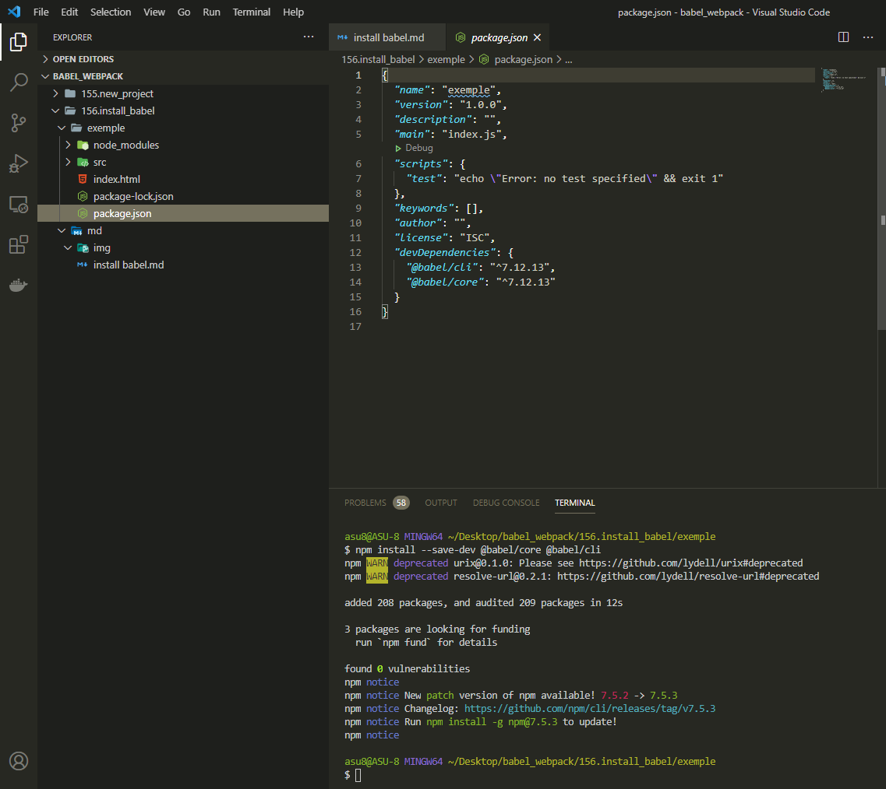
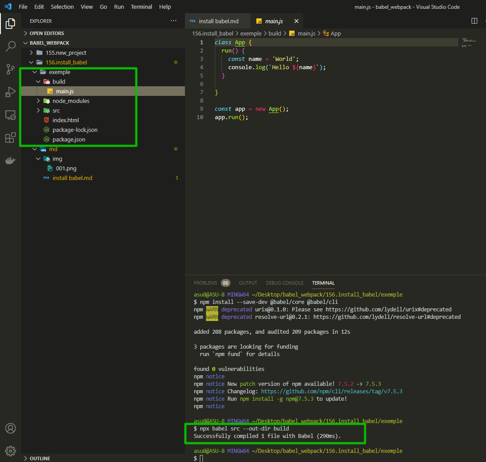

# Установка Babel

Теперь когда у нас есть тестовый проект мы можем преобразовать его таким образом что бы этот код мог запускаться на более старых версиях браузера. Например на тех браузерах которые не потдерживают классы, не потдерживают объявления **const** или **template literal**.

Для этого устанавливаю **Babel**

```shell
npm install --save-dev @babel/core @babel/cli
```

Давайте более детально посмотрим на аспекты этой команды.

- **--save-dev** - говорит о том что зависимости которые мы устанавливаем будут использоваться исключительно для разработки.
- **@babel/core** - вот такой вот формат имени пакета. Это относительно новая возможность **babel** которая называется **name space** или пространство имен. Эта возможность позволяет лучше структурировать пакеты.



Теперь скажем что **babel** нужно трансформировать файлы.

```shell
npx babel src --out-dir build
```

- **src** папка где лежит нужный файл для транспиляции
- **--out-dir** флаг с помощью которого создается папка в которую кладется транспилированный файл
- **build** указываю название папки в которую кладутся транспилированные файлы. Название может быть любым



Как видно на скриншоте преобразование файла не произошло.

Все дело в том что **babel** это модульный компилитор. Для того что бы он начал преобразовывать наш код нам нужно указать какие аспекты языка мы хотим преобразовывать. Это очень удобная особенность которая позволяет настроить поведение **babel** примерно таким образом как нужно для проекта.

Преобразование смотри далее
