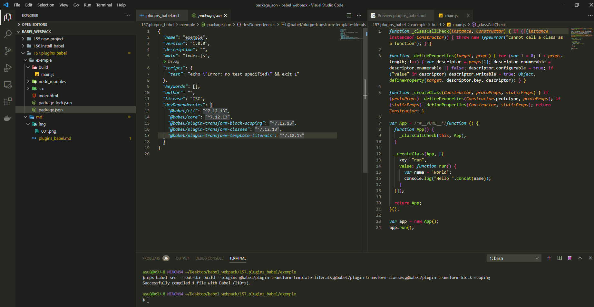

# Плагины Babel

И так **babel** это модульный компилятор. Для каждого преобразования, для каждой конструкции языка которую будет преобразовывать **babel** нужно установить отдельный **plugin**.

К примеру для преобразования шаблонных строк нужно установить

```shell
npm install --save-dev @babel/plugin-transform-template-literals
```

Теперь для преобразования babel нужно указать какой **plugin** использовать.

```shell
npx babel src  --out-dir build --plugins @babel/plugin-transform-template-literals
```


Как видите теперь код преобразовался.

Все плагины [https://babeljs.io/docs/en/plugins](https://babeljs.io/docs/en/plugins)

Для закрепления устанавливаю еще два плагина.

```shell
npm install --save-dev @babel/plugin-transform-classes @babel/plugin-transform-block-scoping
```

И запускаю

```shell
npx babel src  --out-dir build --plugins @babel/plugin-transform-template-literals,@babel/plugin-transform-classes,@babel/plugin-transform-block-scoping
```



Этот файл полностью совместим со старыми браузерами. Конечно этими тремя плагинами мы покрыли только часть преобразований.
