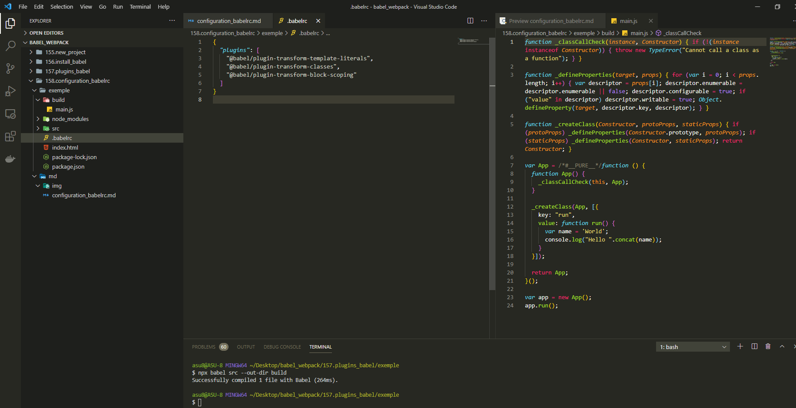

# Конфигурация .babelrc

Babel потдерживает несколько форматов конфигурационных файлов это могут быть **JSON** файлы или **JS** файлы.

**JSON** файлы распространены намного больше по этому я работаю с ними.

Конфигурационый файл называется **.babelrc**. Имя файла начинается с точки, это важно. Внутрь этого файла помещаю обычный **json** объект. Внутри этого объекта указываю параметры конфигурации.

Первым параметром указываю **plugins** т.е. это список тех плагинов которые будет использовать **babel**. Это будет массив в который мы передаем строки с название плагинов.

```json
{
  "plugins": [
    "@babel/plugin-transform-template-literals",
    "@babel/plugin-transform-classes",
    "@babel/plugin-transform-block-scoping"
  ]
}
```

обратите внимание. Внутри этого файла используется синтаксис **JSON**

Запускаю и проверяю.

```shell
npx babel src --out-dir build
```



Если интересно копнуть глубже и прочитать детали какие именно аспекты **babel** можно сконфигурировать и как работает конфигурация для немного более сложных проектов, то эту информацию можно найти на официальной страничке **babel** [https://babeljs.io/docs/en/configuration](https://babeljs.io/docs/en/configuration) обширная статья которая описывает разные аспекты конфигурации этого движка.
