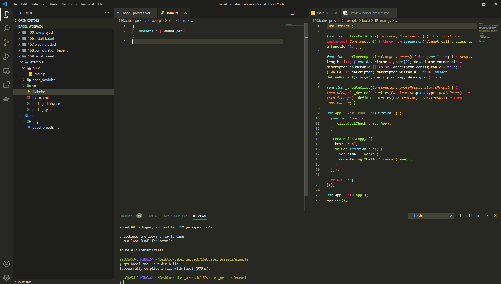
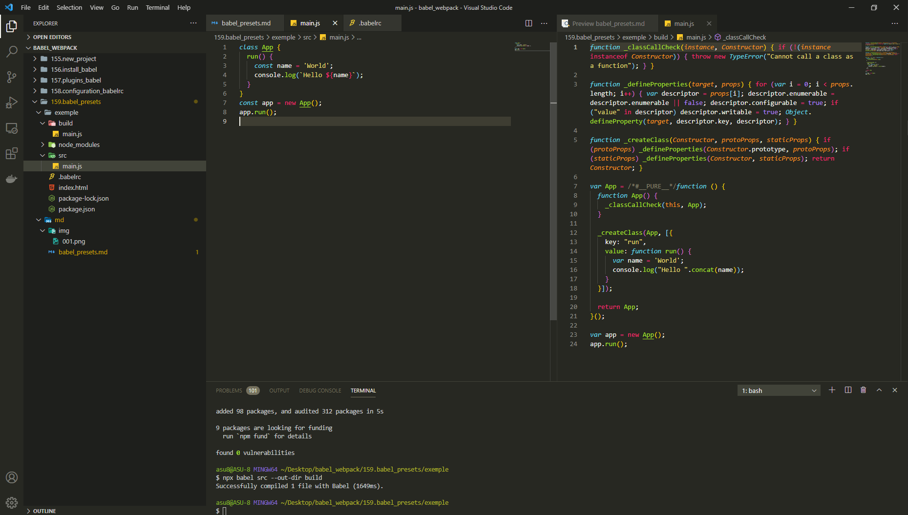
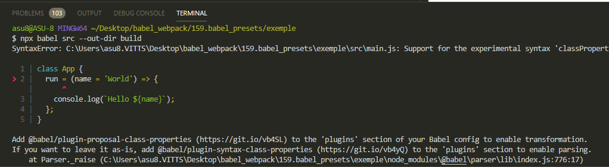
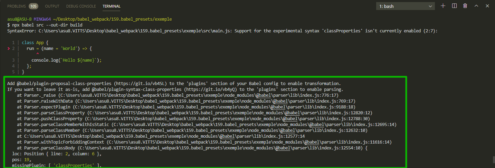
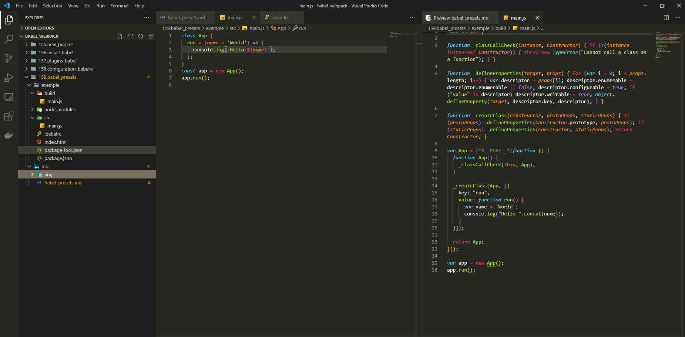

# Babel Presets

**Если в конфигурации перечислить все плагины то получится список примерно из 30 плагинов**.

Хранить и потдерживать такой список совершенно не удобно.

У **Babel** есть еще один механизм который называется **presets**. Если перевести на русский то это что-то вроде предопределенные настройки.

Это просто заранее сконфигурированный список плагинов который можно передать в **babel** что бы не перечислять плагины вручную. [https://babeljs.io/docs/en/babel-preset-env](https://babeljs.io/docs/en/babel-preset-env)

Этот **preset** содержит в себе все плагины для того что бы потдержать самый свежий стандарт **ECMAScript**.

Эксперементальные возможности в этом **preset** не учитываются.

Установим и сконфигурируем.

```shell
npm install --save-dev @babel/preset-env
```

```json
{
  "presets": ["@babel/preset-env"]
}
```

Эту запись можно сократить

```json
{
  "presets": ["@babel/env"]
}
```

перезапускаю

```shell
npx babel src --out-dir build
```



Все работает точно так же.

Еще немного поэксперементируем и добавим новый синтаксис. Добавлю фуункцию стрелку и параметр по умолчанию.

```js
// src/main.js
class App {
  constructor() {
    this.run = (name = 'World') => {
      const name = 'World';
      console.log(`Hello ${name}`);
    };
  }
}
const app = new App();
app.run();
```

Если бы мы добавлялибы плагинами то мне необходимо сейчас было бы добавить еще два плагина. Один для потдержки функции стрелок а второй для потдержки параметров по умолчанию. Но благодаря **@babel/preset-env** они уже подключены.

```shell
npx babel src --out-dir build
```

Вообще не понимаю. Пол дня отвозился. Завершил проект. Заново установил **preset**. И вуаля все заработало.



**Эксперементальные возможности**.

К примеру поля классов

```js
class App {
  run = (name = 'World') => {
    console.log(`Hello ${name}`);
  };
}
const app = new App();
app.run();
```

**2021** это все еще не является частью стандарта.



Но **babel** идет даже дальше, он определяет какой синтаксис мы используем, и он нам подсказывает.



Он подсказывает что добавте вот этот плагин **@babel/plugin-proposal-class-properties** в секцию плагинов вашей конфигурации для того что бы включить эту трансформацию.

```shell
npm install --save-dev @babel/plugin-proposal-class-properties
```

Опять не работало!!! Оказывается в **.babelrc** я писал **preset** вместо **presets**. Однако в примерах выше видно что я писал именно **presets**.... Капец

```json
{
  "presets": ["@babel/preset-env"],
  "plugins": ["@babel/plugin-proposal-class-properties"]
}
```

Перезапускаю

```shell
npx babel src --out-dir build
```


