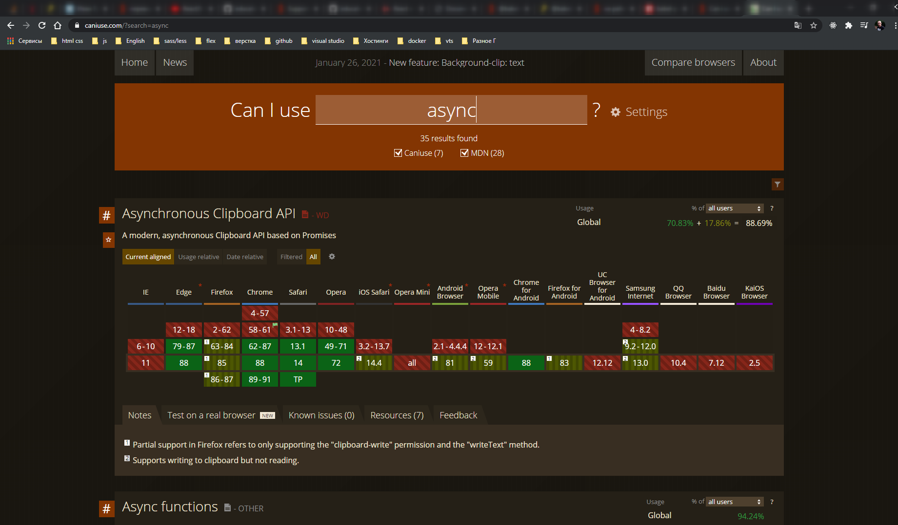
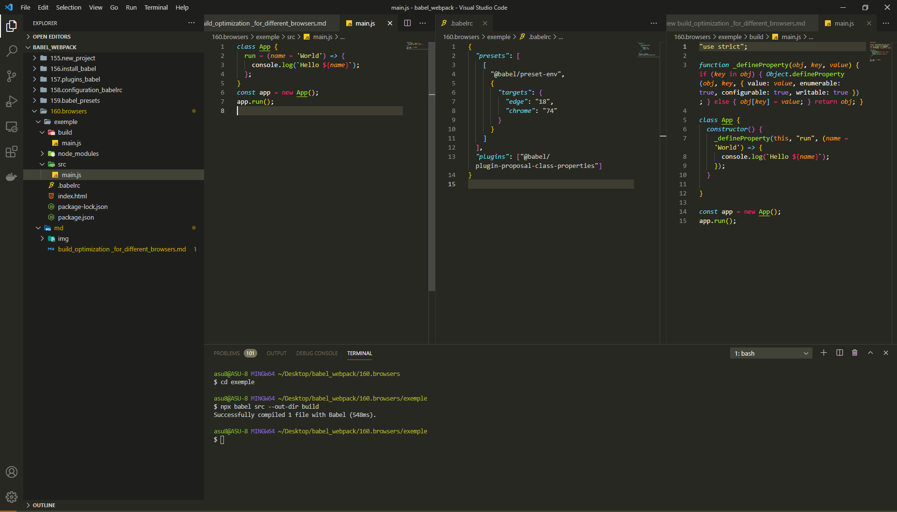
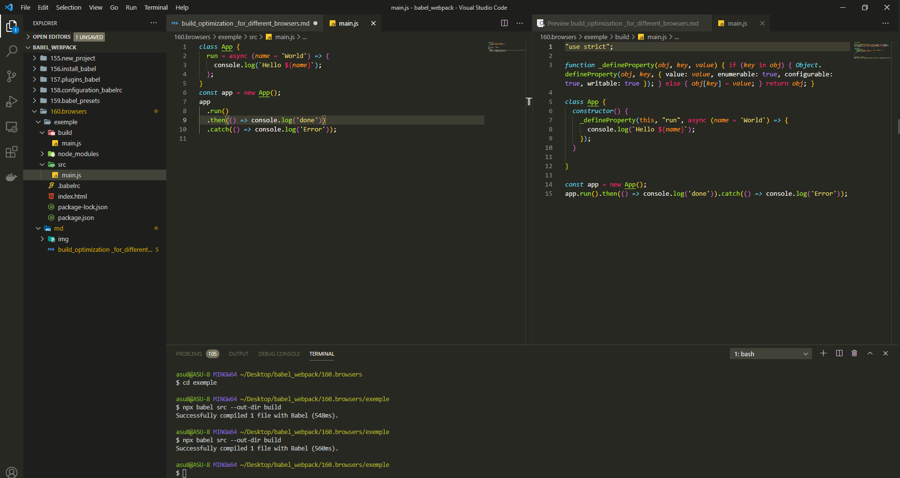
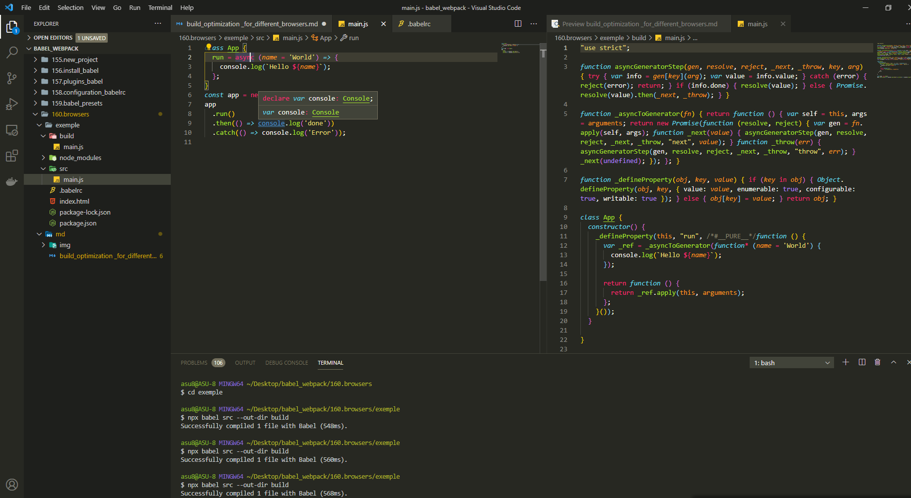
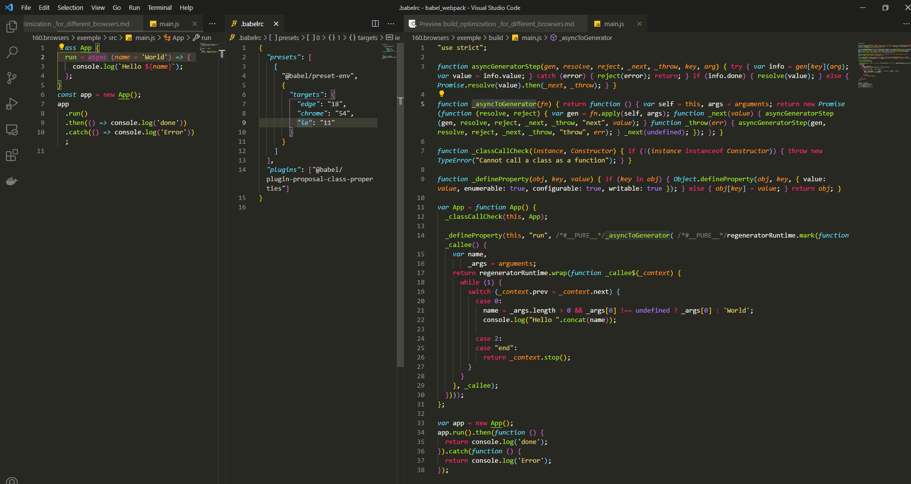

# Оптимизация сборки для конкретных браузеров

Если сейчас посмотреть на конфигурационный файл **.babelrc**

```js
{
  "presets": ["@babel/preset-env"],
  "plugins": ["@babel/plugin-proposal-class-properties"]
}
```

По умолчанию **preset-env** трансформирует абсолютно все аспекты языка. Но вот вопрос. Всегда ли это нужно?

Намного лучше будет трансформировать только тот код который ваши целевые браузеры действительно не смогут понять. К примеру только эксперементальные возможности и самые свежие кострукции которые уже стали частью стандарта, но еще не успели войти в новую версию браузеров.

[https://caniuse.com/?search=async](https://caniuse.com/?search=async)



Если ваше приложение расчитано на потдержку более свежих версий, то преобразовывать код асинхронных функций не нужно.

С другой стороны **EnternetExplore** который все еще широко используется в корпоративной среде, не потдерживает **async** функции по этому для этого браузера все еще нужно будет превратить их в обычные функции.

Трансформировать все не нужно!!! Сначало стоит понять контекст в котором мы работаем и изучить те браузеры которые собираетесь потдерживать.

Но тут возникает еще один вопрос. К примеру вы определились какие браузеры хотите потдержать. Но теперь из этого списка браузеров как-то нужно получить список тех трансформаций которые нужны в **.babelrc**. Это совсем не простая задача учитывая сколько в мири браузеров.

Потдержка конкретных версий браузеров.

В **.babelrc** помимо **presets** мы можем указать дополнительные свойства. Если мы ходим в **preset** передать дополнительные параметры, то я **preset** помещаю в массив, где первым элементом будет сам **preset**, а второй параметр будет объект с настройками для этого **preset**. И параметр отвечающий за список потдерживаемых браузеров называется **targets** цели. И здесь мы можем указать конкретные версии конкретных браузеров.

```json
{
  "presets": [
    [
      "@babel/preset-env",
      {
        "targets": {
          "edge": "18",
          "chrome": "74"
        }
      }
    ]
  ],
  "plugins": ["@babel/plugin-proposal-class-properties"]
}
```

Теперь если посмотреть на тот код который мы написали в **main.js**.

```js
class App {
  run = (name = 'World') => {
    console.log(`Hello ${name}`);
  };
}
const app = new App();
app.run();
```

Поля классов не потдерживаются. Это еще не стандарт.

```shell
npx babel src --out-dir build
```



Наш **@babel/preset-env** не только трансформирует некоторые конструкции синтаксиса **JS**, он умеет определять какие именно части языка нужно трансформировать основываясь на тех браузерах которые вы передадите в этот пресет. Внутри **@babel/preset-env** есть табличка со списком тех возможностей которые потдерживаются теми или иными браузерами. И затем зная какие браузеры вы хотите потдержать **@babel/preset-env** будет выбирать те трансформации которые нужны.

Теперь проведем небольшой эксперемент

```js
class App {
  run = async (name = 'World') => {
    console.log(`Hello ${name}`);
  };
}
const app = new App();
app
  .run()
  .then(() => console.log('done'))
  .catch(() => console.log('Error'));
```

```shell
npx babel src --out-dir build
```

Код не должен изменится по скольку современные браузеры потдерживают асинхронные функции.



Ну а теперь продолжим эксперемент и скажем что в **.babelrc**

```json
{
  "presets": [
    [
      "@babel/preset-env",
      {
        "targets": {
          "edge": "18",
          "chrome": "54"
        }
      }
    ]
  ],
  "plugins": ["@babel/plugin-proposal-class-properties"]
}
```

```shell
npx babel src --out-dir build
```



Кода стало существенно больше. **Babel** начал использовать **\_asyncToGenerator** для иметации работы асинхронной функции. Для того что бы съэмитировать работу этой функции используется синтаксис генераторов.

Идем дальше

```json
{
  "presets": [
    [
      "@babel/preset-env",
      {
        "targets": {
          "edge": "18",
          "chrome": "54",
          "ie": "11"
        }
      }
    ]
  ],
  "plugins": ["@babel/plugin-proposal-class-properties"]
}
```

**"ie": "11"** не потдерживает даже синтаксис генераторов.



Теперь вместо генераторов используется вспомогательная библиотека **regeneratorRuntime**.
