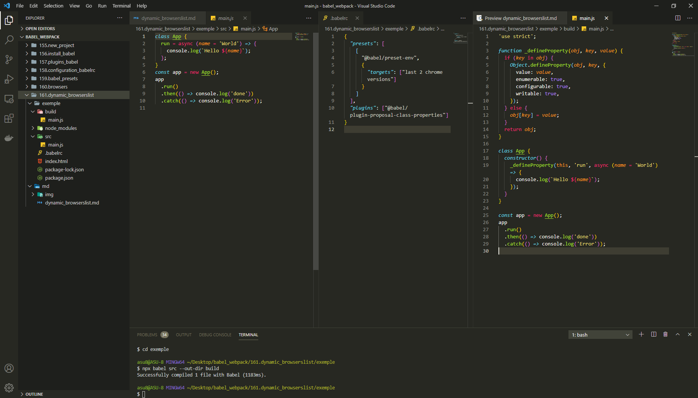
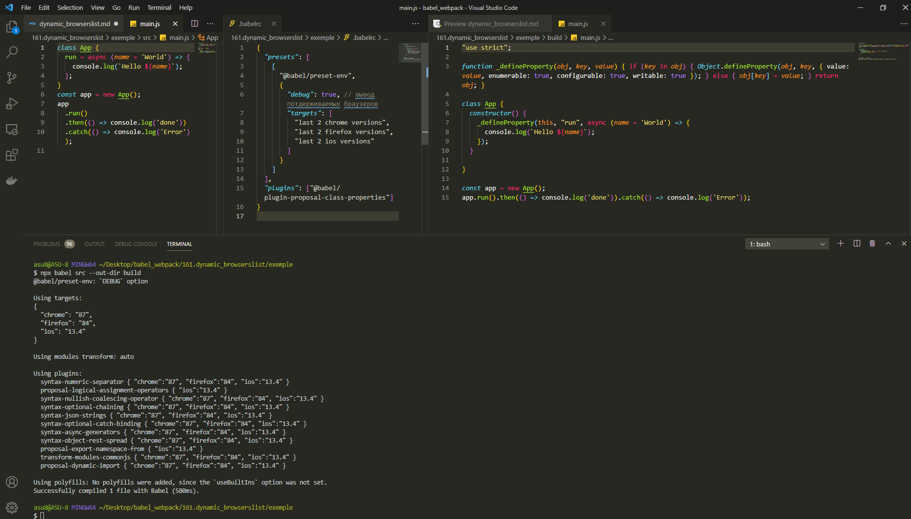
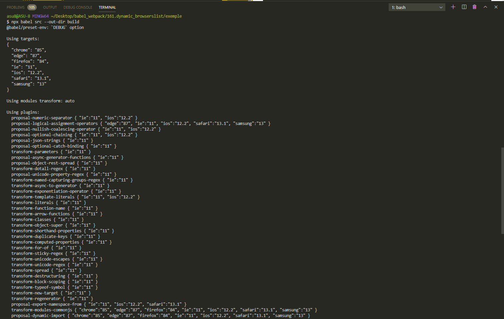

# Динамический выбор браузеров (browserslist)

Возможности **"@babel/preset-env"** не заканчиваются на выборе конкретных браузеров.

В качестве целевой платформы в **targets** можно указать выражение которое будет испольняться динамически и выбирать за вас нужные браузеры по каким-нибудь признакам.

К примеру можно указать выражение последнии две версии **chrome**.

Теперь **targets** это будет массив.

```json
{
  "presets": [
    [
      "@babel/preset-env",
      {
        "targets": ["last 2 chrome versions"]
      }
    ]
  ],
  "plugins": ["@babel/plugin-proposal-class-properties"]
}
```

```shell
npx babel src --out-dir build
```



Самое интересное, по мере того как будут выходить новые версии **chrome** это выражение **"targets": ["last 2 chrome versions"]** будет давать разные результаты и мы будем автоматически потдерживать только новые версии и опускать потдержку для тех версий которые нам больше не интересны.

Эти выражения можно комбинировать. Можно добавить другие выражения в наш массив. Каждое выражение будет рассширять список браузеров которые мы потдерживаем.

```json
{
  "presets": [
    [
      "@babel/preset-env",
      {
        "targets": [
          "last 2 chrome versions",
          "last 2 firefox versions",
          "last 2 ios versions"
        ]
      }
    ]
  ],
  "plugins": ["@babel/plugin-proposal-class-properties"]
}
```

И перед тем как запустить компиляцию хотелось бы узнать какие же браузеры мы потдерживаем. Добавим **debug** в значении **true**.

```json
{
  "presets": [
    [
      "@babel/preset-env",
      {
        "debug": true, // вывод потдерживаемых браузеров
        "targets": [
          "last 2 chrome versions",
          "last 2 firefox versions",
          "last 2 ios versions"
        ]
      }
    ]
  ],
  "plugins": ["@babel/plugin-proposal-class-properties"]
}
```

```shell
npx babel src --out-dir build
```



Появился список потдерживаемых браузеров. Так же выводится список плагинов которые были использованы при трансформации кода. Рядом с каждым плагином выводится версия браузера для которого он применен.

Есть другие способы определить какие браузеры будут потдерживаться. Можно зайти на сайт **browserl.ist** и указать выражение которое мы используем.

Кстати browserslist [https://www.npmjs.com/package/browserslist](https://www.npmjs.com/package/browserslist) это и есть та библиотека которая отвечает за выбор браузеров. Читай документацию.

Далее мы можем указать вот такое выражение.

```json
{
  "presets": [
    [
      "@babel/preset-env",
      {
        "debug": true, // вывод потдерживаемых браузеров
        "targets": ["> 0.3%"]
      }
    ]
  ],
  "plugins": ["@babel/plugin-proposal-class-properties"]
}
```

Т.е. выбрать браузеры у которых количество пользователей больше чем **0.3%**.



Дальше к примеру мы не хотим потдерживать **ie**

```json
{
  "presets": [
    [
      "@babel/preset-env",
      {
        "debug": true, // вывод потдерживаемых браузеров
        "targets": ["> 0.3%", "not ie > 0"]
      }
    ]
  ],
  "plugins": ["@babel/plugin-proposal-class-properties"]
}
```

Не смотря на то что эта возможность **@babel/preset-env** довольно интнресная. Довольно интнресно играться этими выражениями, пробовать разные варианты, разные комбинации. Но нужно не забывать что использовать такие выражения в реальных проектах не всегда хорошая идея.

Лучшим подходом будет указать конкретные версии браузеров.

> Одна из главных ошибок которые совершают начинающие команды. Если ваша команда не пользуется каким-нибудь браузером и даже не знает о существовании какого-нибудь браузера это совершенно не означает что этот браузер не заслуживает потдержки
