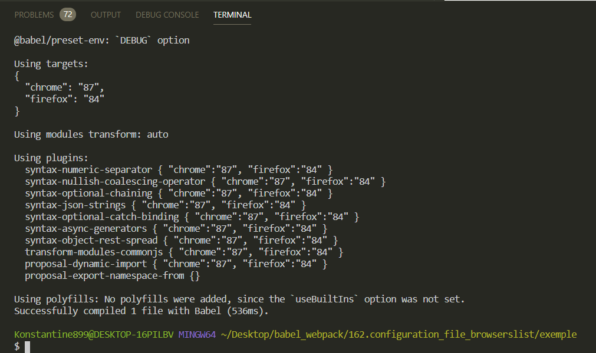
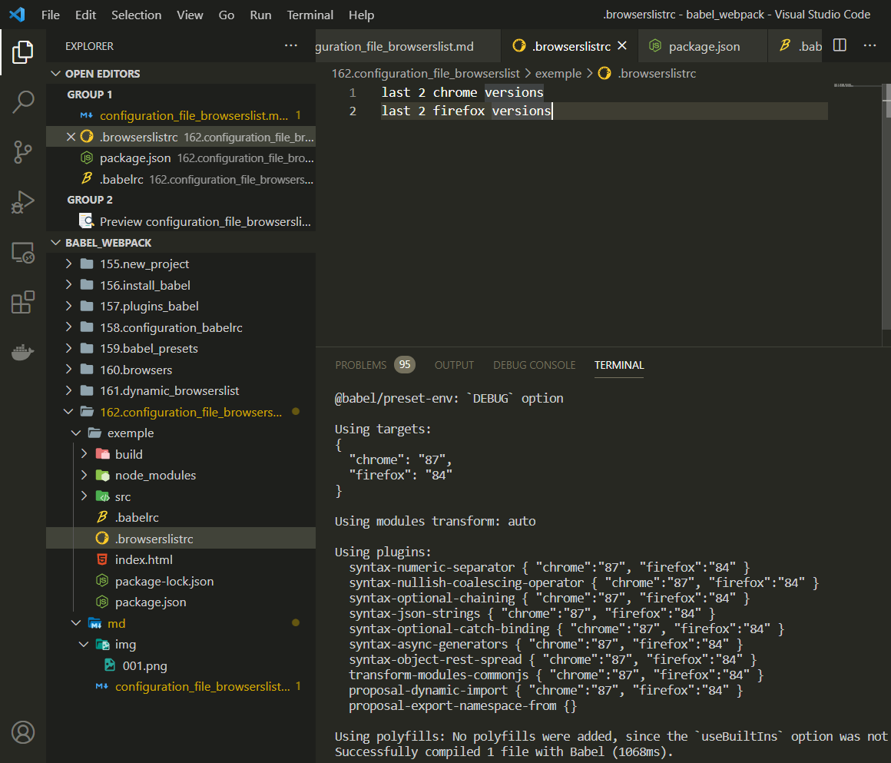
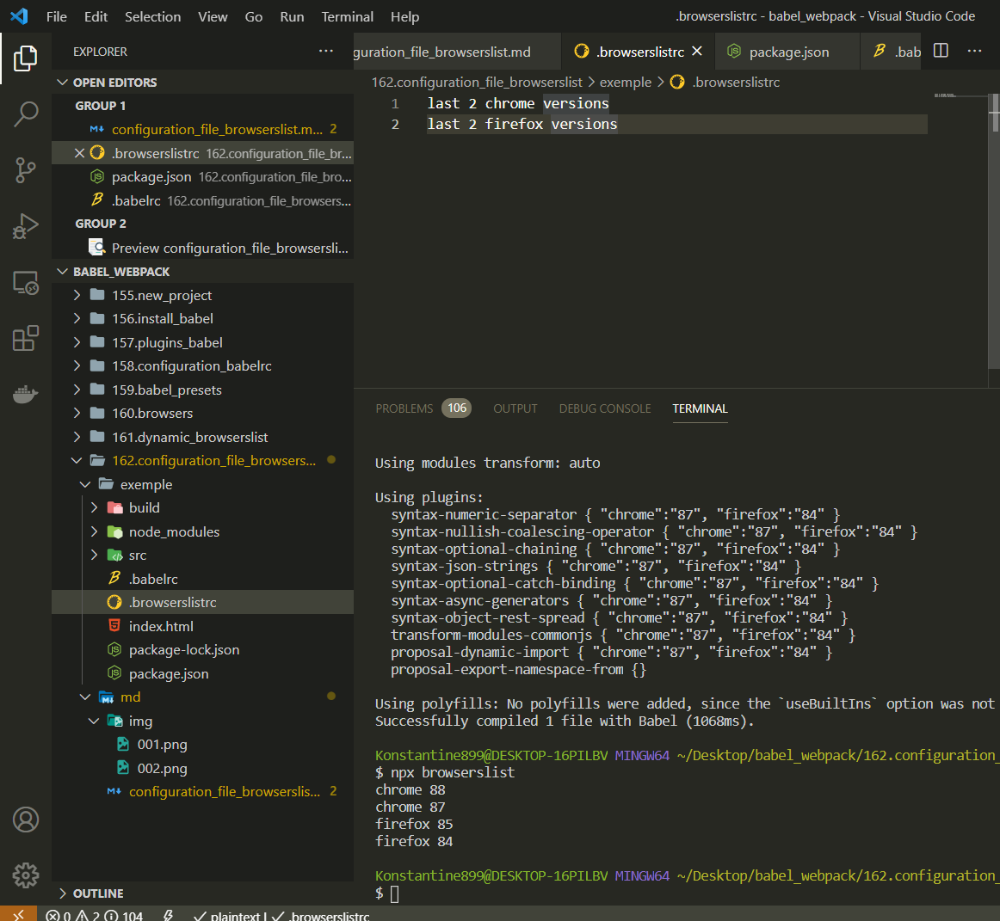
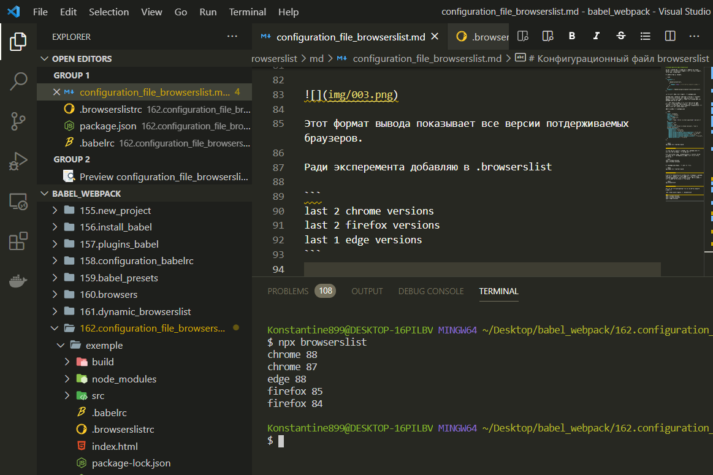

# Конфигурационный файл browserslist

Держать конфигурацию о браузерах в **.babelrc** не всегда удобно. Есть еще несколько файлов в которые можно добавить ту же самую конфигурацию.

В **.babelrc** убираю **targets**.

```json
{
  "presets": [
    [
      "@babel/preset-env",
      {
        "debug": true // вывод потдерживаемых браузеров
      }
    ]
  ],
  "plugins": ["@babel/plugin-proposal-class-properties"]
}
```

Первое место куда можно добавить это **package.json**.

**package.json** традиционно описывает свойства и требования для конкретного проекта. Этот файл зародился в среде **NodeJS**. И одним из атрибутов стандартной конфигурации для **package.json** был атрибут ...

По - сути список браузеров это точно такой же атрибут проекта, он описывает список платформ на которых будет работать это приложение. Только благодаря **browserslist** этот список может быть более динамичным.

Список браузеров в **package.json**

```json
{
  "name": "exemple",
  "version": "1.0.0",
  "description": "",
  "main": "index.js",
  "scripts": {
    "test": "echo \"Error: no test specified\" && exit 1"
  },
  "keywords": [],
  "author": "",
  "license": "ISC",
  "browserslist": ["last 2 chrome versions", "last 2 firefox versions"],
  "devDependencies": {
    "@babel/cli": "^7.12.13",
    "@babel/core": "^7.12.13",
    "@babel/plugin-proposal-class-properties": "^7.12.13",
    "@babel/plugin-transform-block-scoping": "^7.12.13",
    "@babel/plugin-transform-classes": "^7.12.13",
    "@babel/plugin-transform-template-literals": "^7.12.13",
    "@babel/preset-env": "^7.12.13"
  }
}
```

```shell
npx babel src --out-dir build
```



Но если вам не нравится модифицировать **package.json** есть еще один способ указать эти же параметры.

В корне проекта создаю **.browserslistrc** и в нем по одному выражения на строку указываю браузеры которые мы хотим потдержать.

```text
last 2 chrome versions
last 2 firefox versions
```

И в **package.json** удаляю что было до этого.

```shell
npx babel src --out-dir build
```



В качестве дополнительного бонуса если мы указали в **package.json** или в **.babelrc** мы можем запустить в самом проекте команду **browserslist**. Эта команда выведет список браузеров которые будут потдерживаться этим **build**.

```shell
npx browserslist
```



Этот формат вывода показывает все версии потдерживаемых браузеров.

Ради эксперемента добавляю в **.browserslist**

```
last 2 chrome versions
last 2 firefox versions
last 1 edge versions
```


