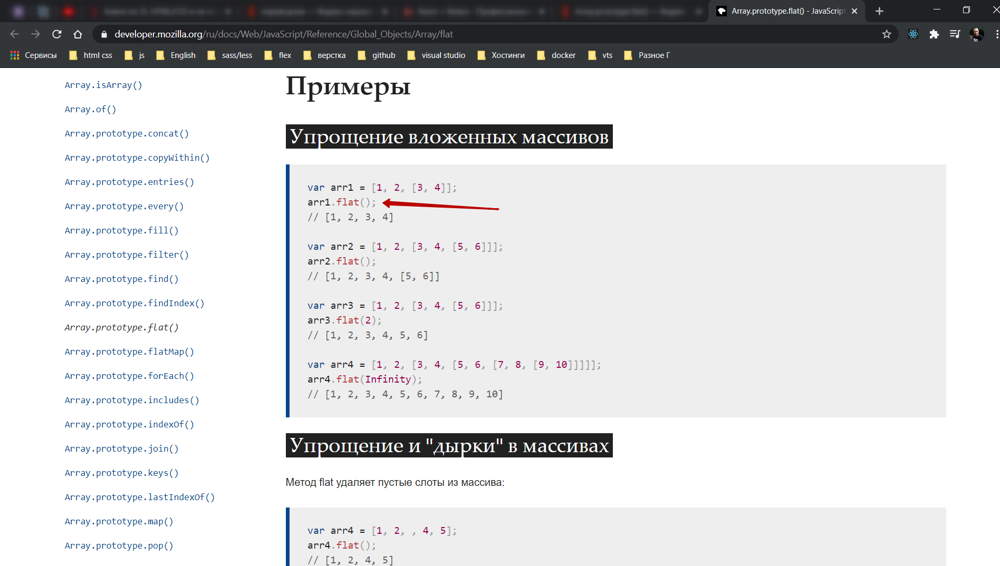
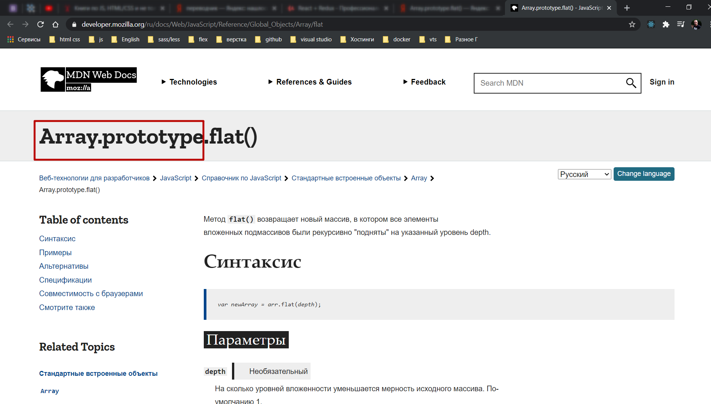
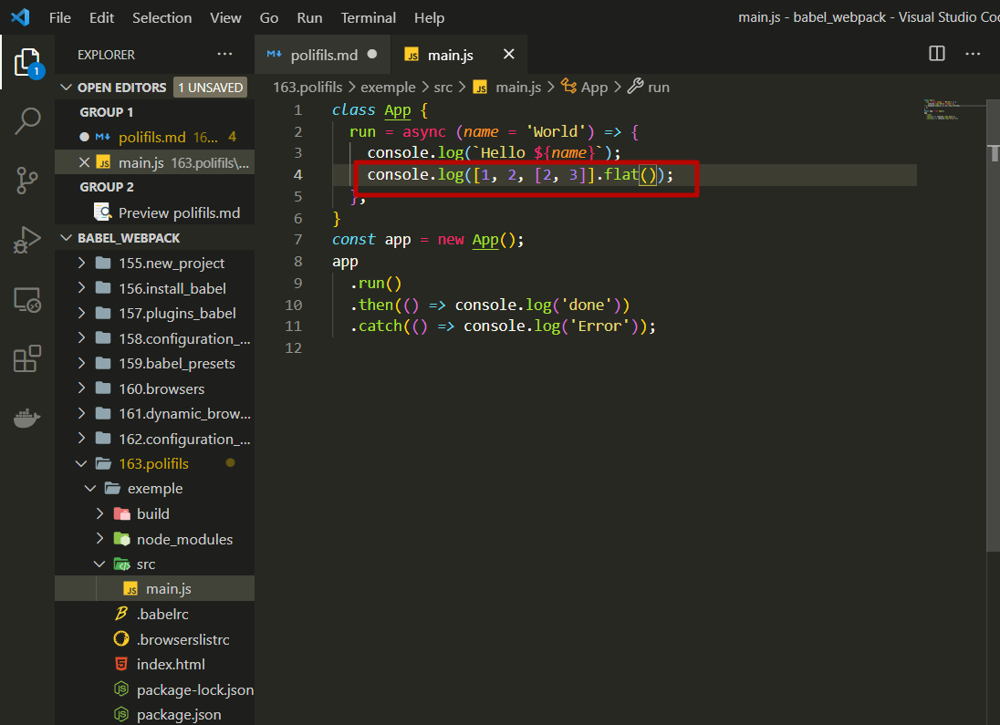
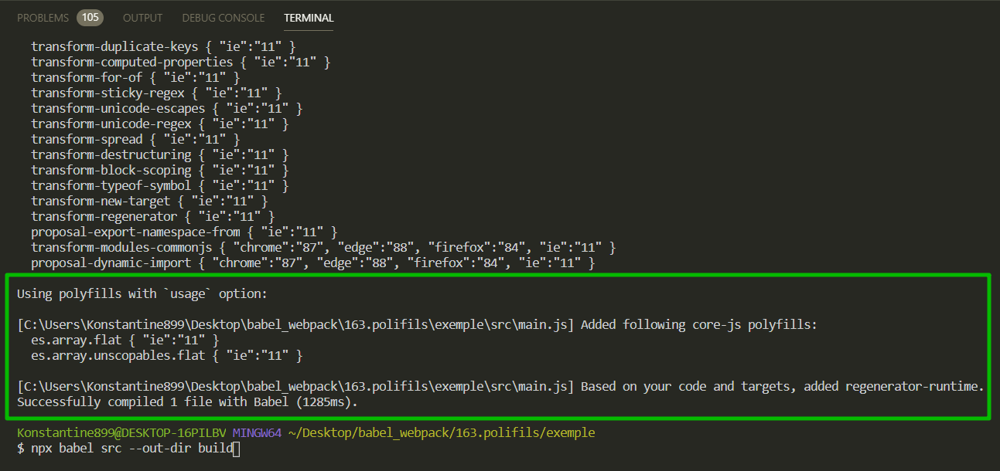
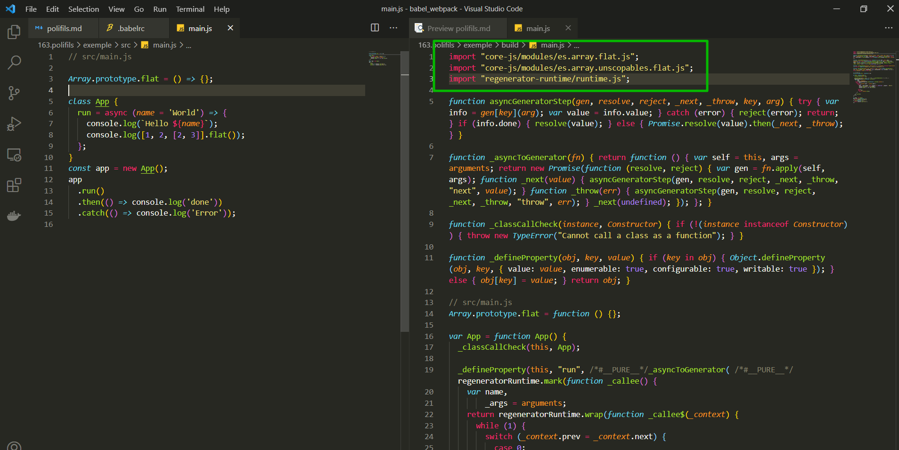
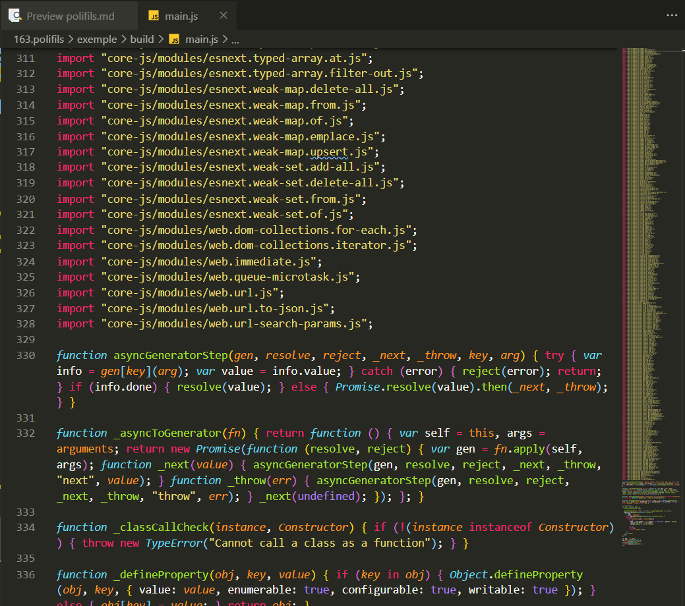

# polifils

Когда обновляется стандарт **ECMAScript** то многое нововведения языка это новые стандартные функции а не новый синтаксис. Пример такой функции это **Array.prototype.flat()** [https://developer.mozilla.org/ru/docs/Web/JavaScript/Reference/Global_Objects/Array/flat](https://developer.mozilla.org/ru/docs/Web/JavaScript/Reference/Global_Objects/Array/flat) которая относительно не давно появились в стандарте **ECMAScript**. Эта функция позволяет уменьшить размерность массива, сделать его немного более плоским. Например с двумерного массива сделать одномерный.

Суть в том что это нововведение языка, эта новая часть стандарта она не добвляет ни какого нового синтаксиса. Единственное что появляется это новая функция



которая определена в объекте **Array.prototype**



Сответственно для того что бы мы могли использовать эту функцию в коде и могли писать что-то вроде



```js
// src/main.js
class App {
  run = async (name = 'World') => {
    console.log(`Hello ${name}`);
    console.log([1, 2, [2, 3]].flat());
  };
}
const app = new App();
app
  .run()
  .then(() => console.log('done'))
  .catch(() => console.log('Error'));
```

Нам не нужно будет преображать этот синтаксис в какой-нибудь другой. Потому что с точки синтаксиса здесь все **Ok**.

Мы создаем новый двумерный массив и вызываем на нем функцию.

Только вот проблема. Данная функция доступна не во всех браузерах!!

Решить эту проблему довольно просто, поскольку **JS** это динамический язык мы можем изменять совершенно любые стандартные функции и добавлять свои собственные функции.

Для того что бы добавить это поведение мы могли бы определить самостоятельно функцию **Array.prototype.flat = () =>{}**

```js
// src/main.js

Array.prototype.flat = () => {};

class App {
  run = async (name = 'World') => {
    console.log(`Hello ${name}`);
    console.log([1, 2, [2, 3]].flat());
  };
}
const app = new App();
app
  .run()
  .then(() => console.log('done'))
  .catch(() => console.log('Error'));
```

Т.е. написать свою собственную реализацию функции, на тот случай если в браузере нет стандартной реализации.

Конечно если бы это был настоящий код, мы бы сначало проверили бы что функции **flat()** действительно нет на объекте Array.prototype, но а затем добавляли бы ее **flat()** к **Array.prototype**.

Вот этот код

```js
Array.prototype.flat = () => {};
```

который добавляет новую стандартную функцию, новую глобальную функцию, и называется **polyfill**.

Точно так же как и сдругими стандартными аспектами языка мы не хотим вручную работать с **polyfill**.

Есть отличная библиотека которую использует **babel**. Эта библиотека называется **core-js**. Если ваш код использует не только новый синтаксис языка, но и и вот такие вот новые функции

```js
Array.prototype.flat = () => {};
```

Эта библиотека сделает так что бы эти фуункции были доступны.

Установка **core-js**

```shell
npm install core-js
```

Но а теперь в файле конфигурации **.babelrc** добавляю конфигурацию.

```json
{
  "presets": [
    [
      "@babel/preset-env",
      {
        "corejs": 3.8, // Указываю версию библиотеки
        "useBuiltIns": "usage", // это означает то что babel попытается найти те места в коде которые используют новые функции языка и подключить только нужные polyfills
        "debug": true // вывод потдерживаемых браузеров
      }
    ]
  ],
  "plugins": ["@babel/plugin-proposal-class-properties"]
}
```

К примеру прямо сейчас в нашем файле **.browserslistrc**

```
last 2 chrome versions
last 2 firefox versions
last 1 edge versions
```

Данные функции уже потдерживают функцию **flat()**. Соберем проект и посмотрим на добавленные **polyfills**.

```shell
npx babel src --out-dir build
```

Кароче у меня пишет что **polyfills** не были добавлены.

Для того что бы проверить добавляю потдержку **Enternet Explorer**.

В **.browserslistrc**

```
last 2 chrome versions
last 2 firefox versions
last 1 edge versions
last 1 ie versions
```

```shell
npx babel src --out-dir build
```



Так как я преобразую в **ie** то код выходит слишком громоздкий т.е. преобразуются **async** функция. Однако этот код нам не нужен. Смотри на **require...**

Из этого

```js
// src/main.js

Array.prototype.flat = () => {};

class App {
  run = async (name = 'World') => {
    console.log(`Hello ${name}`);
    console.log([1, 2, [2, 3]].flat());
  };
}
const app = new App();
app
  .run()
  .then(() => console.log('done'))
  .catch(() => console.log('Error'));
```

вот в это

```js
'use strict';

require('core-js/modules/es.array.flat.js');

require('core-js/modules/es.array.unscopables.flat.js');

require('regenerator-runtime/runtime.js');

function asyncGeneratorStep(gen, resolve, reject, _next, _throw, key, arg) {
  try {
    var info = gen[key](arg);
    var value = info.value;
  } catch (error) {
    reject(error);
    return;
  }
  if (info.done) {
    resolve(value);
  } else {
    Promise.resolve(value).then(_next, _throw);
  }
}

function _asyncToGenerator(fn) {
  return function () {
    var self = this,
      args = arguments;
    return new Promise(function (resolve, reject) {
      var gen = fn.apply(self, args);
      function _next(value) {
        asyncGeneratorStep(gen, resolve, reject, _next, _throw, 'next', value);
      }
      function _throw(err) {
        asyncGeneratorStep(gen, resolve, reject, _next, _throw, 'throw', err);
      }
      _next(undefined);
    });
  };
}

function _classCallCheck(instance, Constructor) {
  if (!(instance instanceof Constructor)) {
    throw new TypeError('Cannot call a class as a function');
  }
}

function _defineProperty(obj, key, value) {
  if (key in obj) {
    Object.defineProperty(obj, key, {
      value: value,
      enumerable: true,
      configurable: true,
      writable: true,
    });
  } else {
    obj[key] = value;
  }
  return obj;
}

// src/main.js
Array.prototype.flat = function () {};

var App = function App() {
  _classCallCheck(this, App);

  _defineProperty(
    this,
    'run',
    /*#__PURE__*/ _asyncToGenerator(
      /*#__PURE__*/ regeneratorRuntime.mark(function _callee() {
        var name,
          _args = arguments;
        return regeneratorRuntime.wrap(function _callee$(_context) {
          while (1) {
            switch ((_context.prev = _context.next)) {
              case 0:
                name =
                  _args.length > 0 && _args[0] !== undefined
                    ? _args[0]
                    : 'World';
                console.log('Hello '.concat(name));
                console.log([1, 2, [2, 3]].flat());

              case 3:
              case 'end':
                return _context.stop();
            }
          }
        }, _callee);
      })
    )
  );
};

var app = new App();
app
  .run()
  .then(function () {
    return console.log('done');
  })
  .catch(function () {
    return console.log('Error');
  });
```

Появилось три новых строчки

```js
require('core-js/modules/es.array.flat.js');

require('core-js/modules/es.array.unscopables.flat.js');

require('regenerator-runtime/runtime.js');
```

Импортирую функцию **flat()** и еще дву функции. Это и есть реализация **polyfill** дополнительных функций которых еще нет в нашем браузере.

Нужно заметить что **babel** использовал функцию **require** для того что бы подключить эти модули. Этот метод используется в **NodeJS** и реже в браузерах.

В нашем коде не нужно использовать **require** поскольку мы совсем скоро подключим **webpack** который будет заниматься обработкой модулей. А **webpack** отлично работает со стандартным синтаксисом **import**. Это довольно просто исправить. Мы можем сказать что выражение **import** не нужно трансформировать. Для этого достаточно добавить еще один параметр в конфигурацию.

В **.babelrc**

```json
{
  "presets": [
    [
      "@babel/preset-env",
      {
        "corejs": 3.8, // Указываю версию библиотеки
        "useBuiltIns": "usage", // это означает то что babel попытается найти те места в коде которые используют новые функции языка и подключить только нужные polyfills
        "debug": true, // вывод потдерживаемых браузеров
        "modules": false // запрет трансформации import
      }
    ]
  ],
  "plugins": ["@babel/plugin-proposal-class-properties"]
}
```

```shell
npx babel src --out-dir build
```



Теперь только **import**.

Второй вариант значения для **"useBuiltIns": "usage"** это **"useBuiltIns": "entry"**.**@babel/preset-env** не будет пытаться проанализировать какие **polyfill** вы используете. В место этого в главном файле вашего проекта **@babel/preset-env** добавит абсолютно все **polyfills** которые нужны тем браузерам которые мы собираемся потдерживать.

```json
{
  "presets": [
    [
      "@babel/preset-env",
      {
        "corejs": 3.8, // Указываю версию библиотеки
        "useBuiltIns": "entry", // @babel/preset-env не будет пытаться проанализировать какие polyfill вы используете
        "debug": true, // вывод потдерживаемых браузеров
        "modules": false // запрет трансформации import
      }
    ]
  ],
  "plugins": ["@babel/plugin-proposal-class-properties"]
}
```

Посмотрим как это работает. Для начало необходимо добавить волшебную строку в **main.js** что бы **@babel/preset-env** знал куда же именно нужно добавлять **polyfills...** **import 'core-js';**

```js
// src/main.js

import 'core-js';

class App {
  run = async (name = 'World') => {
    console.log(`Hello ${name}`);
    console.log([1, 2, [2, 3]].flat());
  };
}
const app = new App();
app
  .run()
  .then(() => console.log('done'))
  .catch(() => console.log('Error'));
```

Когда мы запустим сборку **babel** заменит вот эту строку **import 'core-js';** на список **polyfill** которые нужны для наших браузеров.

```shell
npx babel src --out-dir build
```

И в консоли и в файле сборки показывается **328** импортированных и добавленных полифилов.



Как ни трудно догадатся рекомендованный способ работы с полифилами **"useBuiltIns": "usage"**

```json
{
  "presets": [
    [
      "@babel/preset-env",
      {
        "corejs": 3.8, // Указываю версию библиотеки
        "useBuiltIns": "usage", // это означает то что babel попытается найти те места в коде которые используют новые функции языка и подключить только нужные polyfills
        "debug": true, // вывод потдерживаемых браузеров
        "modules": false // запрет трансформации import
      }
    ]
  ],
  "plugins": ["@babel/plugin-proposal-class-properties"]
}
```

```js
// src/main.js

class App {
  run = async (name = 'World') => {
    console.log(`Hello ${name}`);
    console.log([1, 2, [2, 3]].flat());
  };
}
const app = new App();
app
  .run()
  .then(() => console.log('done'))
  .catch(() => console.log('Error'));
```
