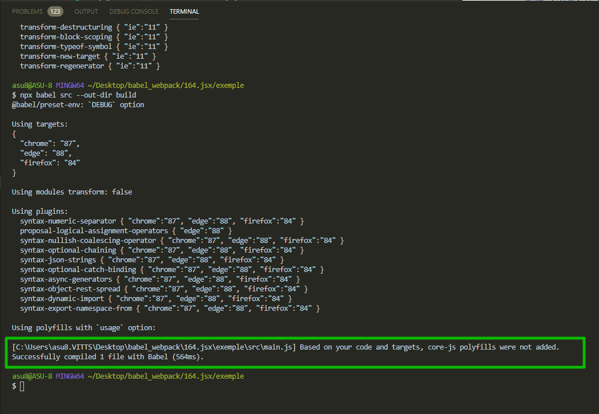
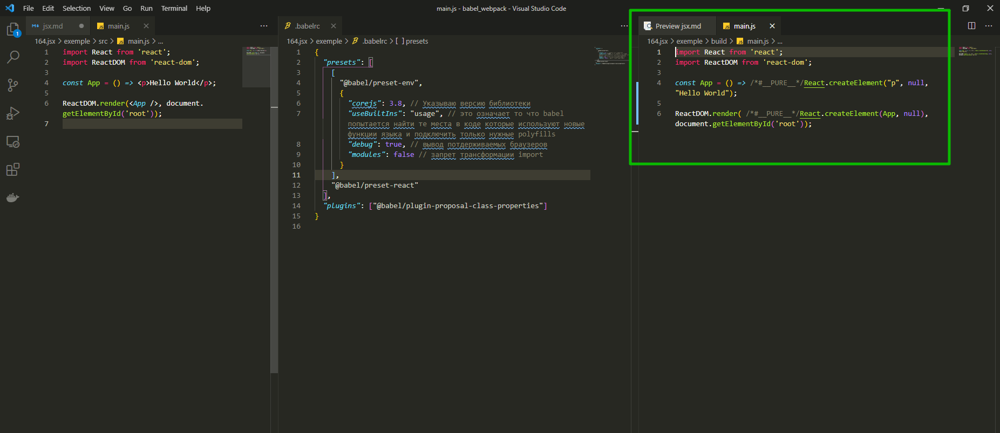

# Работа с JSX

Посмотрим как трансформировать не только **ECMASCript** код, но и **JSX** код т.е. наш **React** код.

Переписываю **main.js**

```jsx
import React from 'react';
import ReactDOM from 'react-dom';

const App = () => <p>Hello World</p>;

ReactDOM.render(<App />, document.getElementById('root'));
```

Если мы попробуем запустить этот код, то у нас ничего не получится. Стандартный **JS** движок с этим синтаксисом не справится.

Для того что бы это приложение можно было бы запустить этот код в браузере мы его преобразуем в стандартный синтаксис **JS**. Ведь у **React** есть свой стандартный **JS APi** который можно использовать в место **JSX**.

Устанавливаем **React** и **ReactDOM** они нам понадобятся позже для того что бы запускать это приложение.

Импортирую необходимые библиотеки.

```shell
npm install react react-dom
```

Но для того что бы трансформировать этот код в **JS** код нам понадобится еще один пресет и называется он **@babel/preset-react**.

```shell
npm install --save-dev @babel/preset-react
```

Этот пресет содержит несколько плагинов которые позволяют **babel** обрабатывать **JSX** код. Все что нам нужно будет сделать это добавить этот пресет к списку в **.babelrc**

```json
{
  "presets": [
    [
      "@babel/preset-env",
      {
        "corejs": 3.8, // Указываю версию библиотеки
        "useBuiltIns": "usage", // это означает то что babel попытается найти те места в коде которые используют новые функции языка и подключить только нужные polyfills
        "debug": true, // вывод потдерживаемых браузеров
        "modules": false // запрет трансформации import
      }
    ],
    "@babel/preset-react"
  ],
  "plugins": ["@babel/plugin-proposal-class-properties"]
}
```

```shell
npx babel src --out-dir build
```



Прежде чем продолжить с **jsx** обратите внимание на один интересный момент. Мы используем **polyfills** с опцией **usage**. Мы добавляем полифилы которые действительно используются в нашем коде. Но прямо сейчас наш код не использует ни каких таких функций и по этому ни один **polifill** не будет добавлен к результирующему файлу.

Давайте вернемся к коду и посмотрим на что же теперь похож наш **main.js** в папке **build**.



Как видите у нас здесь темперь нет **JSX** кода. У нас есть все те же **import**. Но **jsx** заменился на вызовы **React.createElement**.

Пока что этот код не заработает в браузере потому что нам нужно добавить потдержку ключевого слова **import** а этим мы займемся позже.

Но а пока что вы видели на сколько просто добавить потдержку **react** к нашему проекту.

Для этого достаточно установить новый пресет который называется **@babel/preset-react** и добавить его к нашему списку **presets** в файле **.babelrc**. После этого **babel** начинает понимать синтаксис **jsx** и заменять этот синтаксис на стандартный синтаксис **JS** на вызовы **React.createElement** к примеру.
