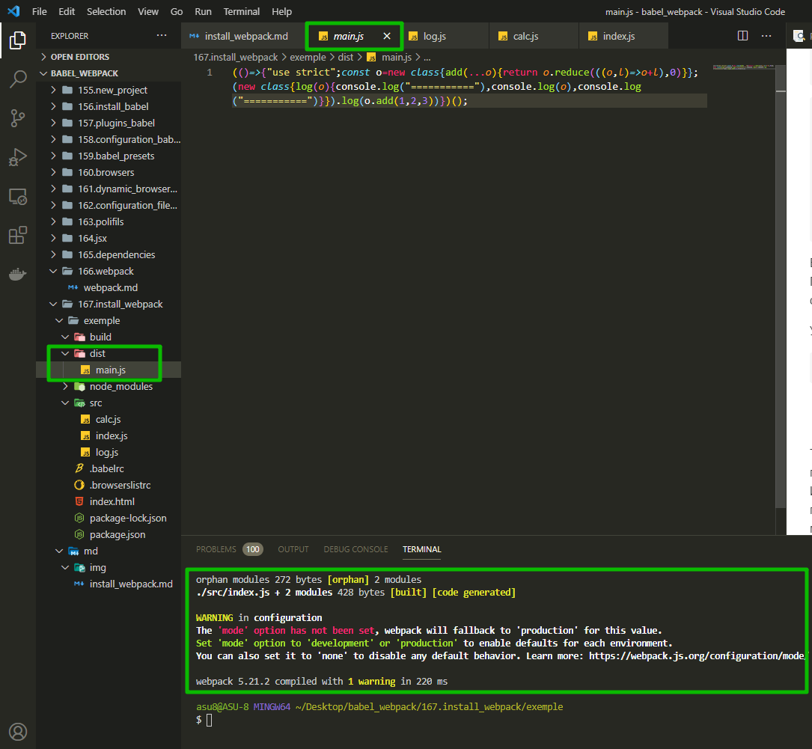
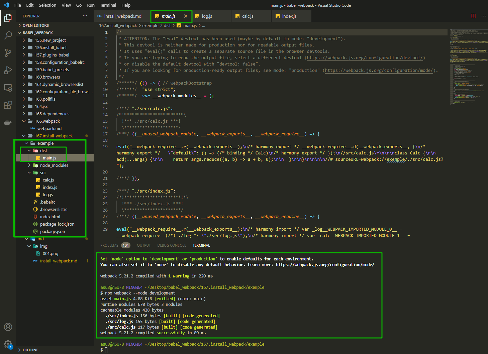
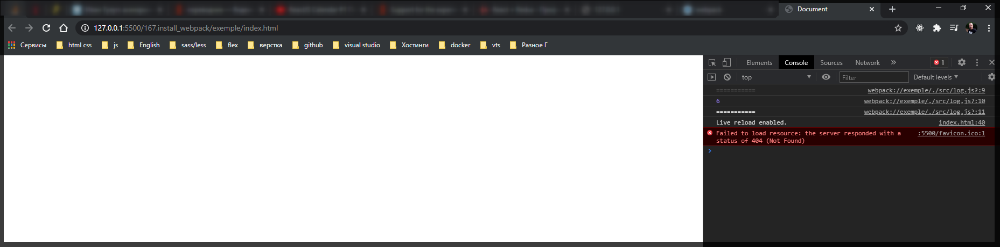

# Установка Webpack

Перед тем как установить **Webpack** давайте создадим небольшое приожение в котором будет несколько модулей. Удаляю те файлы которые мы использовали для тестирования **babel** это **src/main.js**

И я начну писать приложение точно так же как мы это делали в **create-react-app**.

В **src** создаю файл **index.js** который будет являться точкой входа в приложение. И так же еще пару модулей **calc.js** и **log.js**

```js
//src/calc.js

export default class Calc {
  add(...args) {
    return args.reduce((a, b) => a + b, 0);
  }
}
```

```js
//src/log.js

export default class Log {
  log(msg) {
    console.log('===========');
    console.log(msg);
    console.log('===========');
  }
}
```

```js
// src/index.js

import Log from './log';
import Calc from './calc';

const calc = new Calc();
const log = new Log();

log.log(calc.add(1, 2, 3));
```

Если мы сейчас попробуем запустить этот код в браузере, то у нас ничего не получится. Поскольку потдержка ключевого слова **import** в браузерах ограничена. Браузеры не могут самостоятельно загружать нужные модули. Поэтому нам понадобится **webpack**.

Установка **webpack**

```shell
npm install --save-dev webpack webpack-cli
```

- **webpack** - это само ядро приложения
- **webpack-cli** это небольшая обертка которая позволяет вызывать **webpack** из консоли.

Теперь я могу запустить **webpack**. Нам даже не понадобится ни какой конфигурации. В нашем проекта стандартная структура директорий. У нас есть папка **src** и в ней есть файл **index.js**. Именно этот файл **webpack** будет использовать в качестве точки входа в качестве первого файла по которому он будет искать остальные необходимые модули. Поскольку он называется **index.js** мы можем просто в консоли

```shell
npx webpack
```



Файл **main.js** в папке **dist** это результат работы **webpack**. Этот файл готов к тому что бы его добавить на web-страницу и передать в браузер для исполнения. В этом файле больше нет **import**. Вместо них подставлен код необходимых модулей.
В нем содержится минифицированный **js**.

Если мы посмотрим в консоль то увидим предупреждение. В нем говорится что webpack искал опцию которая называется **mode**. Он хочет знать в каком режиме мы будем работать. В режиме production или **development**. По скольку мы ничего не передали то webpack по умолчанию взял значение **production**. По этому в **dist/main.js** минифицирован.

Для режима разработки передаю

```shell
npx webpack --mode development
```



И убеждаюсь что сгенерированный файл работает.

```html
<!DOCTYPE html>
<html lang="en">
  <head>
    <meta charset="UTF-8" />
    <meta http-equiv="X-UA-Compatible" content="IE=edge" />
    <meta name="viewport" content="width=device-width, initial-scale=1.0" />
    <title>Document</title>
  </head>
  <body>
    <div id="root"></div>
    <script src="./dist/main.js"></script>
  </body>
</html>
```



Сгенерированный файл работает.
