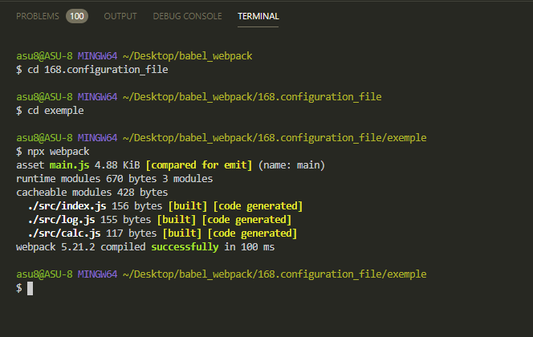
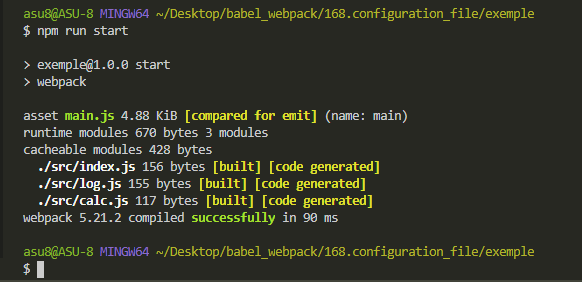

# Файл конфигурации Webpack

**Webpack** это относительно сложный инструмент с относительно сложной конфигурацией. По этому и дальше работать с командной строкой будет весьма не удобно.

Гораздо удобнее работать с отдельным конфигурационным файлом. Для **webpack** этот файл называется **webpack.config.js**. Но его можно назвать как угодно и потом передавать в качестве файла конфигурации и затем передавать имя файла конфигурации в качестве параметра в командной строке.

Заметьте это именно **JS** файл в отличие от **.babelrc** который был обычным **JSON** файлом. Отличия в том что в **webpack.config.js** вы можете исполнить совершенно любой **JS** код который реализует совершенно любую дополнительную логику.

Второй важный факт который нужно помнить что **webpack** работает не в браузере а в среде **NodeJS**. Соответственно когда вы пишите код в этом файле вы можете использовать совершенно любые функции библиотеки доступные в **NodeJS**.

Из файла **webpack.config.js** нам нужно экспортировать объект с конфигурацией. Но по скольку этот файл исполняется в среде **NodeJS** мы будем использовать не стандартный синтаксис **export default**. Вместо этого мы будем использовать синтаксис экспорта **NodeJS**.

```js
//webpack.config.js
module.exports = {};
```

Передаю тот параметр который **webpack** просил передавать

```js
//webpack.config.js
module.exports = {
  mode: 'development',
};
```

```shell
npx webpack
```



И для запуска проекта редактирую **package.json**

```json
{
  "name": "exemple",
  "version": "1.0.0",
  "description": "",
  "main": "index.js",
  "scripts": {
    "start": "webpack"
  },
  "keywords": [],
  "author": "",
  "license": "ISC",
  "devDependencies": {
    "@babel/cli": "^7.12.13",
    "@babel/core": "^7.12.13",
    "@babel/plugin-proposal-class-properties": "^7.12.13",
    "@babel/plugin-transform-block-scoping": "^7.12.13",
    "@babel/plugin-transform-classes": "^7.12.13",
    "@babel/plugin-transform-template-literals": "^7.12.13",
    "@babel/preset-env": "^7.12.13",
    "@babel/preset-react": "^7.12.13",
    "webpack": "^5.21.2",
    "webpack-cli": "^4.5.0"
  },
  "dependencies": {
    "core-js": "^3.8.3",
    "react": "^17.0.1",
    "react-dom": "^17.0.1"
  }
}
```


