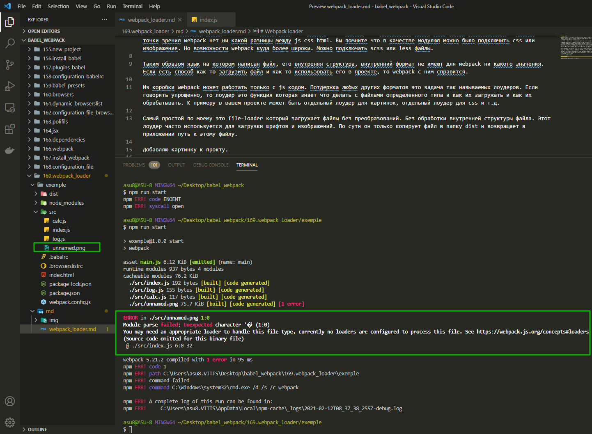
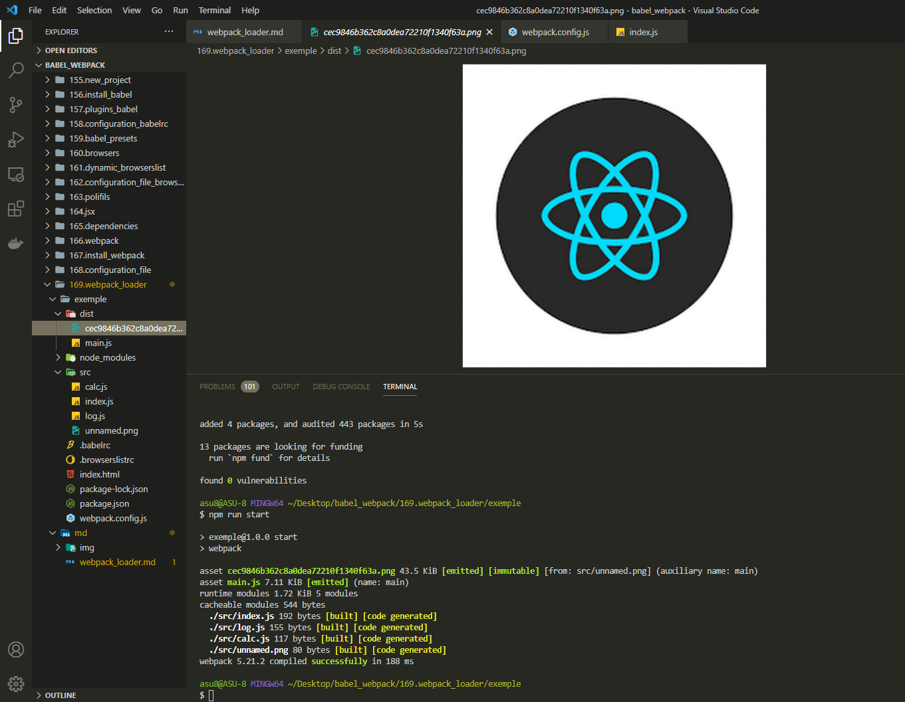
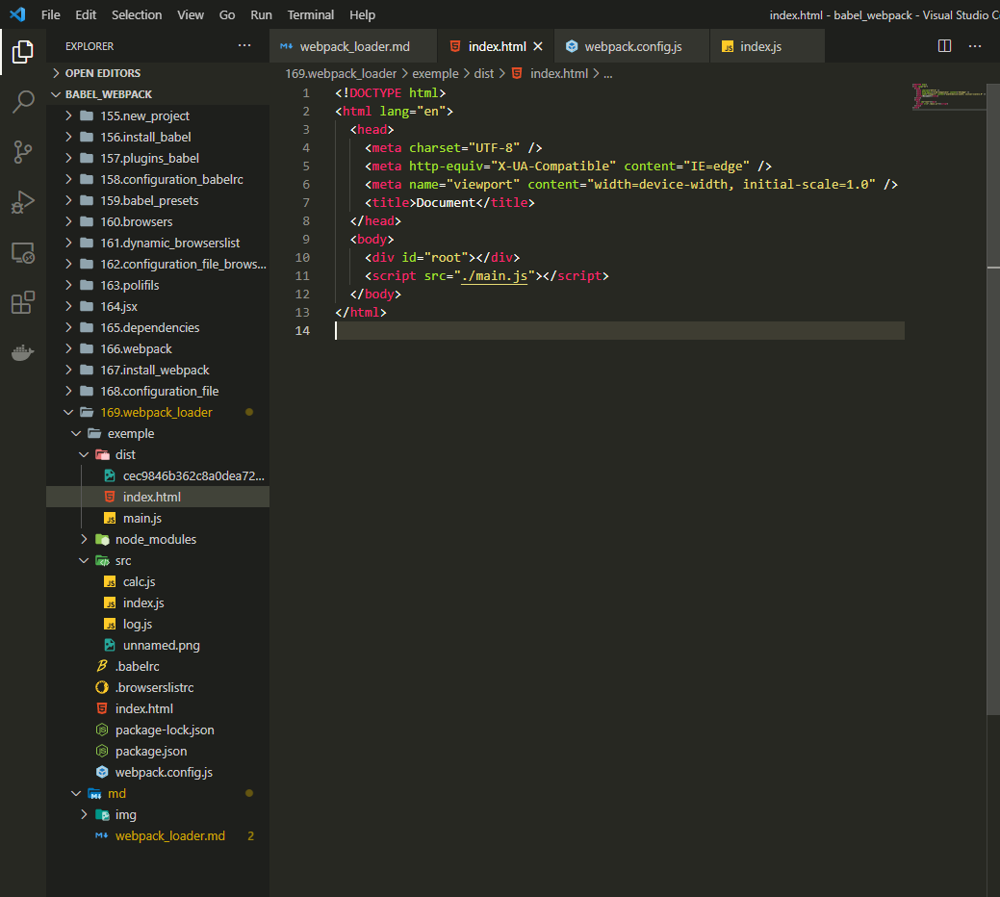
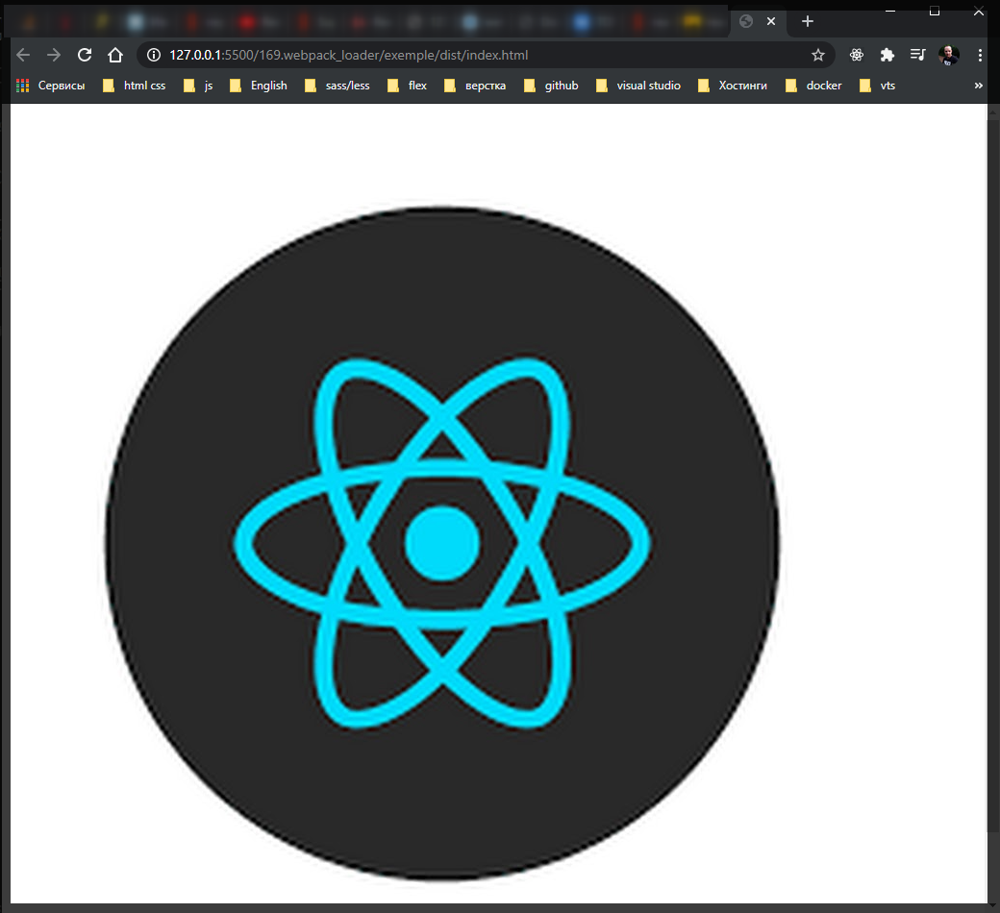

# Webpack loader

**Webpack** отличается от большинства инструментов которые работают с модульным кодом. Основное отличие в том что большинство систем разделяют понятия ресурсов и модулей и обрабатывают их по разному. Ресурсы это файлы с которыми почти ничего делать не нужно вроде **html** или **css** файлов картинок или шрифтов.

Но а модули с другой стороны это динамические файлы вроде **js** которые могут загружать другие модули или подгружать ресурсы.

Но **Webpack** работает иначе. У **webpack** любой файл это модуль. Это значит что совершенно любой файл может учавствовать в сборке. С точки зрения **webpack** нет ни какой разницы между **js** **css** **html**. Вы помните что в качестве модулюя можно было подключить **css** или изображение. Но возможности **webpack** куда более широки. Можно подключать **scss** или **less** файлы.

Таким образом язык на котором написан файл, его внутреняя структура, внутренний формат не имеют для **webpack** ни какого значения. Если есть способ как-то загрузить файл и как-то использовать его в проекте, то **webpack** с ним справится.

Из коробки **webpack** может работать только с **js** кодом. Потдержка любых других форматов это задача так называемых лоудеров. Если говорить упрощенно, то лоудер это функция которая знает что делать с файлами определенного типа и как их загружать и как их обрабатывать. К примеру в вашем проекте может быть отдельный лоудер для картинок, отдельный лоудер для **css** и т.д.

Самый простой по моему это **file-loader** который загружает файлы без преобразований. Без обработки внутренней структуры файла. Этот лоудер часто используется для загрузки шрифтов и изображений. По сути он только копирует файл в папку **dist** и возвращает в приложении путь к этому файлу.

Добавляю картинку к прокту.



Webpack не знает как обработать этот файл. Он сообщает нам что у нас нет **loader** для того что бы обработать этот файл. И дает ссылку на документацию как сконфигурировать **loader**.

Скачиваю **loader**

```shell
npm install --save-dev file-loader
```

Конфигурировать файлы в **webpack.config.js** мы будем внутри блока **module** и внутри него добавляю еще один блок **rules**.

```js
//webpack.config.js
module.exports = {
  mode: 'development',

  module: {
    rules: [],
  },
};
```

Это коллекция правил как обрабатывать модули.

Для того что бы **webpack** научить обрабатывать **png** файлы нам нужно добавить правило которое скажет что для png файлов мы будем использовать **file-loader**. Правило это обычный объект. Свойство **test:** это регулярное выражение которое позволяет выбрать только те файлы которые нужно обработать этим лоудером. После чего нужно указать свойство **use:** Это массив каждый элемент которого описывает лоудер и его конфигурацию. Часто бывает так что один файл обрабатывается сразу несколькими лоудерами. Лоудер указываю в объекте.

```js
//webpack.config.js
module.exports = {
  mode: 'development',

  module: {
    rules: [
      {
        test: /\.png$/,
        use: [{ loader: 'file-loader' }],
      },
    ],
  },
};
```



Этот файл получил друго имя, но именно так работает **file-loader**. Он переименовывает файлы для того что бы файлы с одинаковыми именами которые находятся в разных папках и имеют разное содержимое, что бы они не конфликтовали между собой.

Теперь когда мы в нашем проекте импортируем изображения мы получим путь к этому изображению по отношению к директории **dist**.

Для того что бы проверить что эта сборка работает Давайте пока что без react напишем немного кода который отобразит эру картинку на нашей странице.

```js
// src/index.js

import Log from './log';
import Calc from './calc';

import img from './unnamed.png';

const calc = new Calc();
const log = new Log();

log.log(calc.add(1, 2, 3));

const el = document.createElement('img');
el.src = img;
document.body.appendChild(el);
```

Если мы сделали все правильно, то в теле нашего документа появится новый тег **img** у которого **src** будет указывать на картинку.

теперь еще один маленький но важный момент!! Webpack будет считать что файлы которые нужны для работы нашего приложения будут находится в папке **dist** и все пути ко всем файлам в коде будут рассчитываться от этой папки. Поэтому для того что бы все работало корректно нам нужно скопировать наш **index.html** в папку **dist** и поправить путь к **main.js**

```html
<!DOCTYPE html>
<html lang="en">
  <head>
    <meta charset="UTF-8" />
    <meta http-equiv="X-UA-Compatible" content="IE=edge" />
    <meta name="viewport" content="width=device-width, initial-scale=1.0" />
    <title>Document</title>
  </head>
  <body>
    <div id="root"></div>
    <script src="./main.js"></script>
  </body>
</html>
```

Позже копирование автоматизирую.




