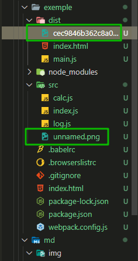
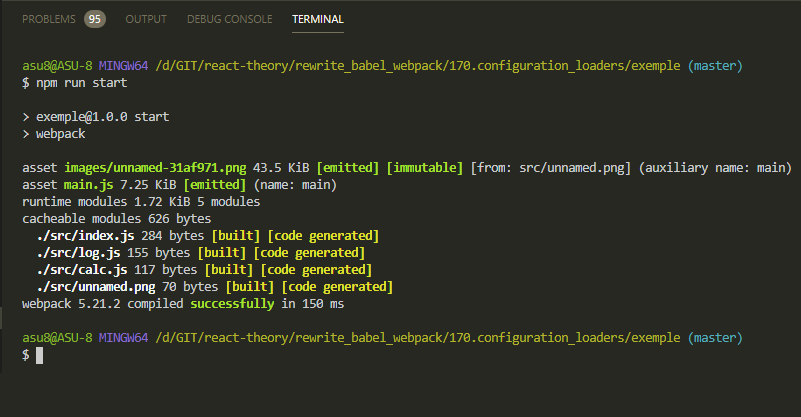
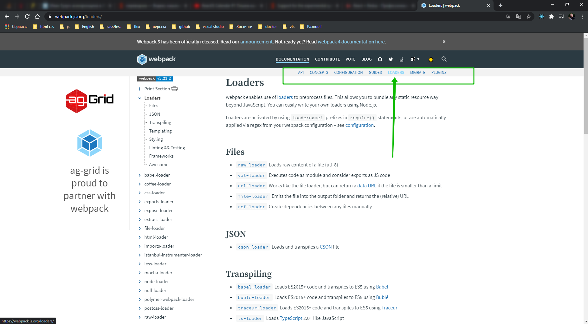

# Конфигурация Loader`ов

Кроме собственно подключение **webpack loaders** можно конфигурировать, указывать как именно они будут работать.

Прямо сейчас **file-loader** заменяет имя файла.

```js
//webpack.config.js
module.exports = {
  mode: 'development',

  module: {
    rules: [
      {
        test: /\.png$/,
        use: [{ loader: 'file-loader' }],
      },
    ],
  },
};
```



Мы можем конфигурировать это поведение и сделать название файлов более читабельным. Ну и кроме того давайте сделаем так что бы все файлы картинок хранились в папке **images** внутри папки **dist**.

Для этого мы установим несколько дополнительных опций. Установим конфигурацию в **file-loader**. В объект **{ loader: 'file-loader' }** вторым параметром передаю **options:{}** это обычный объект, ключ это название опции, ну а значение это значение. Мы скажем **outputPath: 'images'**.

```js
//webpack.config.js
module.exports = {
  mode: 'development',

  module: {
    rules: [
      {
        test: /\.png$/,
        use: [
          {
            loader: 'file-loader',
            options: {
              outputPath: 'images',
            },
          },
        ],
      },
    ],
  },
};
```

Таким образом **file-loader** будет знать что все изображения нужно положить в папку **images**. Если этой папки не существует в **dist**, эта папка создасться автоматически.

Вторую опцию которую мы передадим будет **name:** и здесь в качестве имени мы передадим паттерн который будет динамически интерпретирован **webpack**. Этот паттерн будет состоять из нескольких блоков **'[name]'** это оригинальное имя файла без расширения. Затем мы поставим дефис и скажем что мы хотим **'[name]-[sha1:hash:7].[ext]'**

```js
//webpack.config.js
module.exports = {
  mode: 'development',

  module: {
    rules: [
      {
        test: /\.png$/,
        use: [
          {
            loader: 'file-loader',
            options: {
              outputPath: 'images',
              name: '[name]-[sha1:hash:7].[ext]',
            },
          },
        ],
      },
    ],
  },
};
```



таким образом мы сконфигурировали немного другое поведение для этого **loader**.

Совершенно очевидно что те настройки которые применяются для одного лоудера, не будут иметь ни какого смысла для другого лоудера. По этому настройки не универсальные, у каждого лоудера они свои. И запоминать все конечно нет ни какого смысла. Все в документации [https://webpack.js.org/loaders/](https://webpack.js.org/loaders/)



В левом меню список популярных лоудеров. Однако есть некоторые лоудеры которых нет в официальной документации.

Изучи лоудеры для того что бы в последующем более гибко настроить работу.
