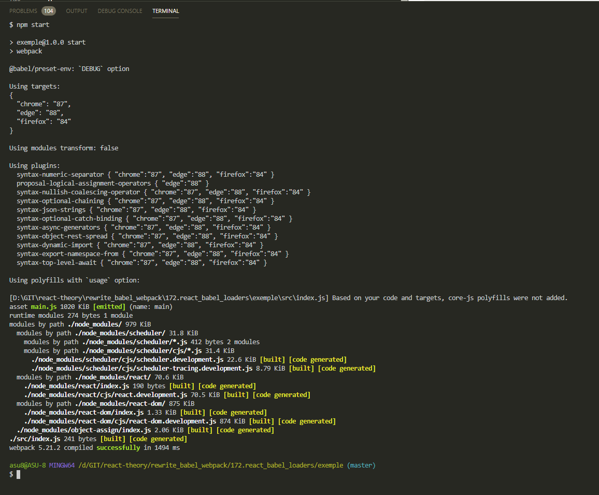
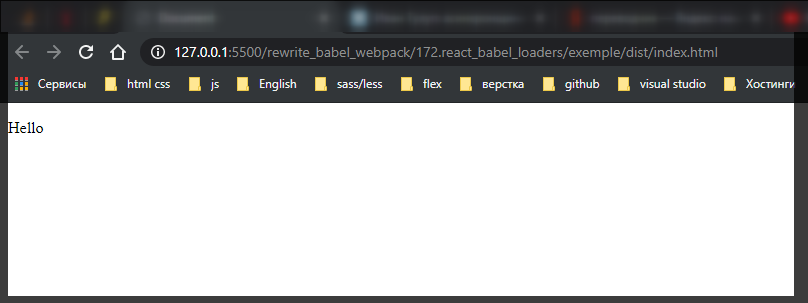

# React Babel loaders

Мы рассмотрели **file-loader** самый простой. Он только переименовывает файлы и премещает их.

Но в основном лоудеры работают по другому. Они преображают код, они транспилируют, они пререводят из одного языка в другой, преобразуют форматы, анализируют сжимают и много еще чего интерестного.

Давайте теперь посмотрим на пример лоудера который все же преобразует файлы. Рассмотрим как **babel** и **webpack** работают вместе. Сделать это не сложно. Нужно установить лоудер и указать какие файлы нужно обрабатывать. Ну а все детали конфигурации **babel** автоматически загрузит из файла **.babelrc**.

Устанавливаю

```shell
npm install --save-dev babel-loader
```

Теперь внимание!!! Указываю первым правилом в блоке **rules**. Как правило **JS** самая главная часть нашего приложения, по этому блок с конфигурацией **JS** будет первым блоком.

```js
//webpack.config.js
module.exports = {
  mode: 'development',

  module: {
    rules: [
      {
        test: /\.js$/,
        use: [{ loader: 'babel-loader' }],
      },

      // картинки
      {
        test: /\.(png|jpg|jpeg|gif|ico)$/,
        use: [
          {
            loader: 'file-loader',
            options: {
              outputPath: 'images',
              name: '[name]-[sha1:hash:7].[ext]',
            },
          },
        ],
      },
      // Шрифты
      {
        test: /\.(ttf|otf|eot|woff|woff2)$/,
        use: [
          {
            loader: 'file-loader',
            options: {
              outputPath: 'fonts',
              name: '[name].[ext]',
            },
          },
        ],
      },
    ],
  },
};
```

Теперь абсолютно все **js** файлы которых коснется **webpack** будут проходить через **babel-loader**. **Здесь есть один маленький но очень важный нюанс!!** В случае с js файлами нам нужно только преобразовывать файлы самого проекта, но ни как не файлы библиотек, те файлы которые мы загружаем из папки **node_modules**. По этому для этого правила мы добавим исключение.

```js
//webpack.config.js
module.exports = {
  mode: 'development',

  module: {
    rules: [
      {
        test: /\.js$/,
        exclude: /node_modules/, // исключение для обработки
        use: [{ loader: 'babel-loader' }],
      },

      // картинки
      {
        test: /\.(png|jpg|jpeg|gif|ico)$/,
        use: [
          {
            loader: 'file-loader',
            options: {
              outputPath: 'images',
              name: '[name]-[sha1:hash:7].[ext]',
            },
          },
        ],
      },
      // Шрифты
      {
        test: /\.(ttf|otf|eot|woff|woff2)$/,
        use: [
          {
            loader: 'file-loader',
            options: {
              outputPath: 'fonts',
              name: '[name].[ext]',
            },
          },
        ],
      },
    ],
  },
};
```

Теперь можно написать немного **JSX** кода. Удаляю файлы **calc.js** и **log.js**.

```js
//index.js
import React from 'react';
import ReactDOM from 'react-dom';

const App = () => <p>Hello</p>;

ReactDOM.render(<App />, document.getElementById('root'));
```

И перед тем как собрать наше приложение давайте не забудем что для того что бы React начал работать нам нужен **div** с **id** **root** в нашем **html**.

```html
<!DOCTYPE html>
<html lang="en">
  <head>
    <meta charset="UTF-8" />
    <meta http-equiv="X-UA-Compatible" content="IE=edge" />
    <meta name="viewport" content="width=device-width, initial-scale=1.0" />
    <title>Document</title>
  </head>
  <body>
    <div id="root"></div>
    <script src="./dist/main.js"></script>
  </body>
</html>
```



Как видите в консоли нет ошибок. Смотрю в браузере



Теперь у меня есть минимальная webpack конфигурация которая уже умеет собирать react проект. Конечно есть еще масса аспектов которые мы можем добавить к конфигурации, но это отличное начало.
