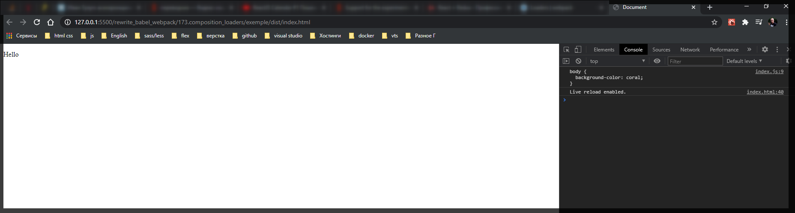
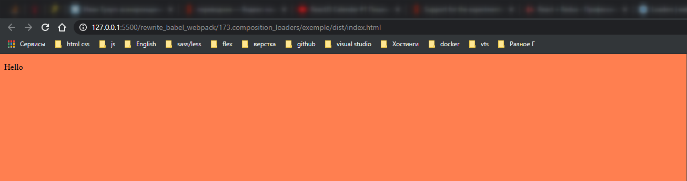

# Композиция loader`ов

По своей идеологии лоудеры в **webpack** похожи на утилиты командной строки в **linux**. Вместо того что бы пытаться покрыть все возможные сценарии использования одной супер мощной утилиты. Разработчики создают несколько не больших утилит, а затем собирают из них сложные команды передавая из них данные из одной утилиты в другую.

Авторы лоудеров для **webpack** следуют такому же принципу. Намного проще писать и потдерживать лоудеры которые специализируются на одной не большой задаче чем писать огромный лоудер который умеет делать почти все.

Рассмотрим **css-loader**. Это отличный пример **loader** который специализируется на одной конкретной задаче. Его оснавная задача загружать **css** т.е парсить **css** код, находить модули и зависимости, шрифты, изображения и д.р **css** файлы. **css-loader** при этом не знает о том где именно и как будет использоваться **css**.

Есть несколько способов добавления **css**. Например непосредственно на **html** странице в блоке **style**.

Кроме того можно вынести все **css** определения во внешний файл и добавить его на **html** страницу при помощи тега **link**.

Но в некоторых случаях разработчикам нужно получить доступ к **css** прямо из **js**. Это имеет смысл если вы например работаете с **Angular**.

Сам по себе css лоадер не реализует ни одну из этих стратегий. Он занимается исключительно парсингом **css**, а добавлением **css** в контекст нашего приложения занимаются отдельные **loader`ы** которые реализуют одну из этих стратегий.

Создаю в src файл **main.css**

```css
body {
  background-color: coral;
}
```

И в index.js подключаю css

```js
//index.js
import React from 'react';
import ReactDOM from 'react-dom';

import './main.css';

const App = () => <p>Hello</p>;

ReactDOM.render(<App />, document.getElementById('root'));
```

Если я сейчас запущу **build** то он свалится поскольку **webpack** не будет знать что делать с файлом **css**, посколку у меня не сконфигурировано правило.

```shell
npm install --save-dev css-loader
```

Возвращаюсь в **webpack.config.js** и добавляю еще одно правило.

```js
//webpack.config.js
module.exports = {
  mode: 'development',

  module: {
    rules: [
      {
        test: /\.js$/,
        exclude: /node_modules/, // исключение для обработки
        use: [{ loader: 'babel-loader' }],
      },

      // картинки
      {
        test: /\.(png|jpg|jpeg|gif|ico)$/,
        use: [
          {
            loader: 'file-loader',
            options: {
              outputPath: 'images',
              name: '[name]-[sha1:hash:7].[ext]',
            },
          },
        ],
      },
      // Шрифты
      {
        test: /\.(ttf|otf|eot|woff|woff2)$/,
        use: [
          {
            loader: 'file-loader',
            options: {
              outputPath: 'fonts',
              name: '[name].[ext]',
            },
          },
        ],
      },
      //css
      {
        test: /\.(css)$/,
        use: [{ loader: 'css-loader' }],
      },
    ],
  },
};
```

Теперь как наш **build** как минимум сработает. **Webpack** будет знать что делать с **css** файлами, но **css** файлы не появятся на странице.

Возвращаюсь в **index.js** и пишу вот такой код.

```js
//index.js
import React from 'react';
import ReactDOM from 'react-dom';

import css from './main.css';

console.log(css.toString());

const App = () => <p>Hello</p>;

ReactDOM.render(<App />, document.getElementById('root'));
```



Стили не поменялись. Но тем не менее мы смогли получить текст **css** фрагмента в консоль.

Для того что бы все стили применились необходимо подключить **style-loader**.

```shell
npm install --save-dev style-loader
```

И добавляю к конфигурации. Обратите внимание что блок **rules** это массив и значит в него можно передавать несколько объектов.

```js
//webpack.config.js
module.exports = {
  mode: 'development',

  module: {
    rules: [
      {
        test: /\.js$/,
        exclude: /node_modules/, // исключение для обработки
        use: [{ loader: 'babel-loader' }],
      },

      // картинки
      {
        test: /\.(png|jpg|jpeg|gif|ico)$/,
        use: [
          {
            loader: 'file-loader',
            options: {
              outputPath: 'images',
              name: '[name]-[sha1:hash:7].[ext]',
            },
          },
        ],
      },
      // Шрифты
      {
        test: /\.(ttf|otf|eot|woff|woff2)$/,
        use: [
          {
            loader: 'file-loader',
            options: {
              outputPath: 'fonts',
              name: '[name].[ext]',
            },
          },
        ],
      },
      //css
      {
        test: /\.(css)$/,
        use: [{ loader: 'style-loader' }, { loader: 'css-loader' }],
      },
    ],
  },
};
```

```jsx
//index.js
import React from 'react';
import ReactDOM from 'react-dom';

import './main.css';

const App = () => <p>Hello</p>;

ReactDOM.render(<App />, document.getElementById('root'));
```



Порядок лоудеров имеет значение. Сначало срабатывает самый последний лоудер, затем он передает результат предпоследнему и т.д.
