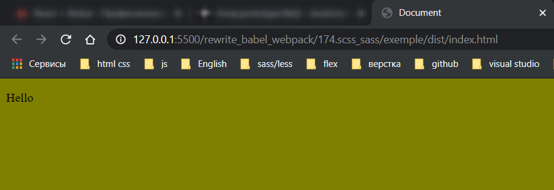

# Препроцессоры SASS и SCSS

В проекте переименовываю **css** файлы в **scss** и меняю **import** в файлах.

```jsx
//index.js
import React from 'react';
import ReactDOM from 'react-dom';

import './main.scss';

const App = () => <p>Hello</p>;

ReactDOM.render(<App />, document.getElementById('root'));
```

Более того **webpack** сейчас не сможет обработать этот файл потому что то регулярное выражение которое мы написали для **css** файла оно не подходит для **scss** файла.

пишу переменную в **scss**

```scss
$body-color: olive;

body {
  background-color: $body-color;
}
```

После того как на странице поменяется стиль, это будет означать что **scss** работает.

Для этого нужно установить нужные зависимости. В случае с **SASS** и **SCSS** нам не будет достаточно только **sass-loader**. Нам понадобится еще один модуль который называется **node-sass**.

```shell
npm install --save-dev node-sass sass-loader
```

**node-sass** зависит от **sass-loader**. **node-sass** это собственно сам движок который производит эти преобразования из **scss** в **css**.

После установки зависимостей возвращаюсь в **webpack.config.js**. Здесь есть два варианта. Мы можем обновить блок с **css** и зделать так что бы он потдерживал **scss** вместо **css**, но тогда мы потеряем потдержку самого **css**.

Конечно в реальных проектах очень редко бывает так что вы в одном и том же проекте используете и **css** и **scss**.

Но часто бывает так что вы кроме своего собственного кода используете сторонние библиотеки и вот они могут использовать и подключать свой **css**.

По этому в нашем проекте для того что бы сделать его более гибким оставляю потдержку **css**.

Но так же добавлю блок правил для **scss**.

```js
//webpack.config.js
module.exports = {
  mode: 'development',

  module: {
    rules: [
      {
        test: /\.js$/,
        exclude: /node_modules/, // исключение для обработки
        use: [{ loader: 'babel-loader' }],
      },

      // картинки
      {
        test: /\.(png|jpg|jpeg|gif|ico)$/,
        use: [
          {
            loader: 'file-loader',
            options: {
              outputPath: 'images',
              name: '[name]-[sha1:hash:7].[ext]',
            },
          },
        ],
      },
      // Шрифты
      {
        test: /\.(ttf|otf|eot|woff|woff2)$/,
        use: [
          {
            loader: 'file-loader',
            options: {
              outputPath: 'fonts',
              name: '[name].[ext]',
            },
          },
        ],
      },
      //css
      {
        test: /\.(css)$/,
        use: [{ loader: 'style-loader' }, { loader: 'css-loader' }],
      },
      //scss
      {
        test: /\.(s[ca]ss)$/,
        use: [
          { loader: 'style-loader' },
          { loader: 'css-loader' },
          { loader: 'sass-loader' },
        ],
      },
    ],
  },
};
```

```shell
npm run start
```


