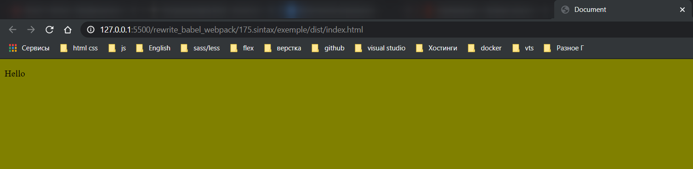

# Упрощение синтаксиса webpack.config.js

Все дело в том что в прошлых уроках мы использовали саму полную форму **use**. Мы передавали объект в котором указывался отдельно **loader** и **options**. Но мы можем сократить этот синтаксис и сделать его намного компактнее. К примеру когда мы используем один **loader** и у этого **loader** нет дополнительных опций, дополнительной конфигурации. Мы можем не использовать блок **use** вообще, а вместо него сразу поставить название **loader**. Смотри блок **js**.

```js
//webpack.config.js
module.exports = {
  mode: 'development',

  module: {
    rules: [
      {
        test: /\.js$/,
        exclude: /node_modules/, // исключение для обработки
        loader: 'babel-loader',
      },

      // картинки
      {
        test: /\.(png|jpg|jpeg|gif|ico)$/,
        use: [
          {
            loader: 'file-loader',
            options: {
              outputPath: 'images',
              name: '[name]-[sha1:hash:7].[ext]',
            },
          },
        ],
      },
      // Шрифты
      {
        test: /\.(ttf|otf|eot|woff|woff2)$/,
        use: [
          {
            loader: 'file-loader',
            options: {
              outputPath: 'fonts',
              name: '[name].[ext]',
            },
          },
        ],
      },
      //css
      {
        test: /\.(css)$/,
        use: [{ loader: 'style-loader' }, { loader: 'css-loader' }],
      },
      //scss
      {
        test: /\.(s[ca]ss)$/,
        use: [
          { loader: 'style-loader' },
          { loader: 'css-loader' },
          { loader: 'sass-loader' },
        ],
      },
    ],
  },
};
```

Теперь посмотрим на блок где мы загружаем **css** и обрабатываем **scss**. В этом случае в блок **use** мы можем передавать просто строки если у **loader** нет дополнительных опций. Мы можем не создавать вложенные объекты а просто передавать названия **loader`ов** которые мы хотим использовать.

```js
//webpack.config.js
module.exports = {
  mode: 'development',

  module: {
    rules: [
      {
        test: /\.js$/,
        exclude: /node_modules/, // исключение для обработки
        loader: 'babel-loader',
      },

      // картинки
      {
        test: /\.(png|jpg|jpeg|gif|ico)$/,
        use: [
          {
            loader: 'file-loader',
            options: {
              outputPath: 'images',
              name: '[name]-[sha1:hash:7].[ext]',
            },
          },
        ],
      },
      // Шрифты
      {
        test: /\.(ttf|otf|eot|woff|woff2)$/,
        use: [
          {
            loader: 'file-loader',
            options: {
              outputPath: 'fonts',
              name: '[name].[ext]',
            },
          },
        ],
      },
      //css
      {
        test: /\.(css)$/,
        use: ['style-loader', 'css-loader'],
      },
      //scss
      {
        test: /\.(s[ca]ss)$/,
        use: ['style-loader', 'css-loader', 'sass-loader'],
      },
    ],
  },
};
```

Обратите внимание что если все же позже нам понадобится передать к примеру только в **sass** **loader** дополнительные **options**, то мы можем для **sass-loader** сделать объект и здесь добавить опции только для этого **loader**. При этом остальные **loader** оставить ввиде обычных строк.

```js
//webpack.config.js
module.exports = {
  mode: 'development',

  module: {
    rules: [
      {
        test: /\.js$/,
        exclude: /node_modules/, // исключение для обработки
        loader: 'babel-loader',
      },

      // картинки
      {
        test: /\.(png|jpg|jpeg|gif|ico)$/,
        use: [
          {
            loader: 'file-loader',
            options: {
              outputPath: 'images',
              name: '[name]-[sha1:hash:7].[ext]',
            },
          },
        ],
      },
      // Шрифты
      {
        test: /\.(ttf|otf|eot|woff|woff2)$/,
        use: [
          {
            loader: 'file-loader',
            options: {
              outputPath: 'fonts',
              name: '[name].[ext]',
            },
          },
        ],
      },
      //css
      {
        test: /\.(css)$/,
        use: ['style-loader', 'css-loader'],
      },
      //scss
      {
        test: /\.(s[ca]ss)$/,
        use: [
          'style-loader',
          'css-loader',
          { loader: 'sass-loader', options: {} },
        ],
      },
    ],
  },
};
```

Но пока нашему **sass-loader** не требуется ни каких дополнительных опций. Таким образом ваш **webpack.config.js** можно сделать компактным и более читабельным.

```shell
npm run start
```


