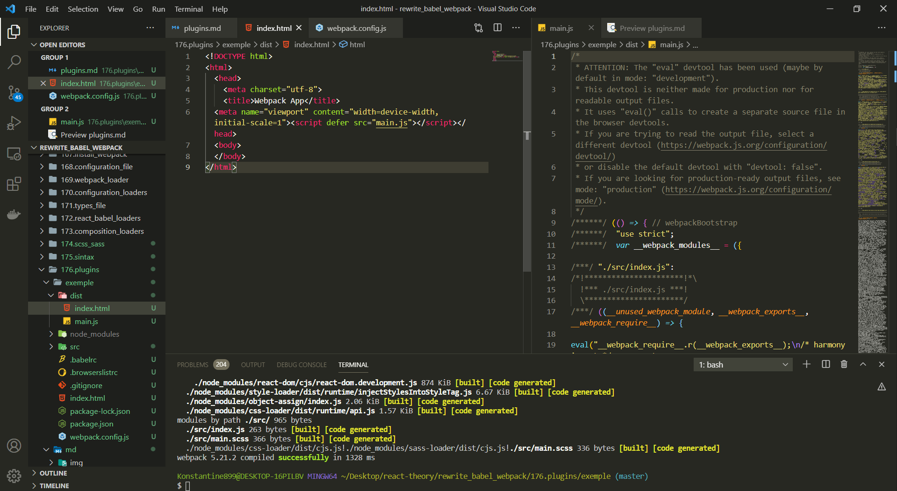
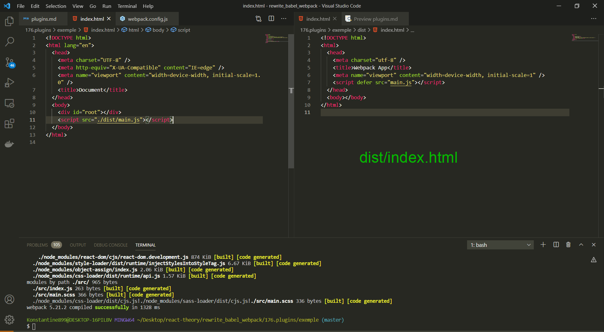
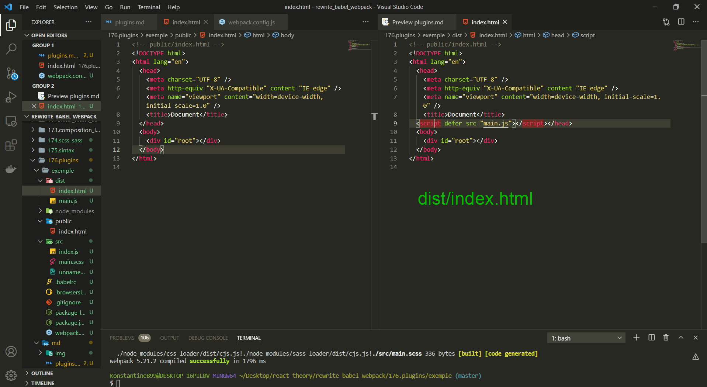
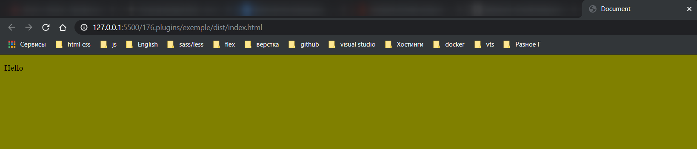

# Плагины

**loader`ы** в **webpack** отвечают за трансформацию и за загрузку модулей.

Но а плагины позволяют выполнять действия которые касаются не одного конкретного модуля, а всего проекта. Например можно собрать все маленькие изображения из проекта и объеденить и объеденить их в один **sprite**, что бы загружать один файл вместо десятка мелких файлов.

Можно собрать все фрагменты **css** из всего проекта и соханить в один оптимизированный **css** файл.

Бывают и другие плагины которые не изменяют результирующие файлы, но позволяют проанализировать упакованное приложение. Один из популярных плагинов [https://github.com/webpack-contrib/webpack-bundle-analyzer](https://github.com/webpack-contrib/webpack-bundle-analyzer).

Он позволяет понять почему наш **bundle** внезапно начал много весить. Полезный плагин для анализа и оптимизации приложения.

Повторюсь чем же отличаются **loader`ы** от **plugins**.

**Loader`ы** работают с конкретным файлом с конкретным модулем.

Плагины работают со всем приложением.

Для того что бы начат знакомство с плагинами мы автоматизируем единственный не автоматизированный шаг в нашей сборке. Это копирование **index.html**.

У нас в корне проекта есть **index.html**. И перед тем как запустить приложение мы должны в ручную скопировать его в папку **dist**, поскольку все наши файлы, все наши пути расчитываются по отношению к папке **dist**. А так же в ручную нужно поправлять путь к **main.js**. Сейчас наш **build** собирает все кроме главного **html** файла.

Я бы хотел при запуске сборки проекта получить папку **dist** готовую к тому что бы отправить ее на сервер, при этом не выполнять ни каких шагов в ручную.

Ну и конечно же в **webpack** есть плагин который автоматизирует эту задачу.

```shell
npm install --save-dev html-webpack-plugin
```

После установки можно его добавить к нашему файлу конфигурации.

Для того что бы добавить плагины нам нужно создать отдельный блок на верхнем уровне в объекте **module.exports** который называется **plugins:[]**. Ну и по скольку плагинов в одном проекте бывает несколько то **plugins** указываю как массив в который передаю объекты с плагинами.

> **Обратите внимаение. Плагины конфигурируются не так же как loader. Для loader мы просто указывам их название. В случае с плагином нам нужно импортировать плагин в наш webpack.congig.js. В результате импорта я получаю класс плагина и далее я просто передаю новый объект этого класса.**

```js
//webpack.config.js
const HtmlWebpackPlugin = require('html-webpack-plugin');

module.exports = {
  mode: 'development',

  module: {
    rules: [
      {
        test: /\.js$/,
        exclude: /node_modules/, // исключение для обработки
        loader: 'babel-loader',
      },

      // картинки
      {
        test: /\.(png|jpg|jpeg|gif|ico)$/,
        use: [
          {
            loader: 'file-loader',
            options: {
              outputPath: 'images',
              name: '[name]-[sha1:hash:7].[ext]',
            },
          },
        ],
      },
      // Шрифты
      {
        test: /\.(ttf|otf|eot|woff|woff2)$/,
        use: [
          {
            loader: 'file-loader',
            options: {
              outputPath: 'fonts',
              name: '[name].[ext]',
            },
          },
        ],
      },
      //css
      {
        test: /\.(css)$/,
        use: ['style-loader', 'css-loader'],
      },
      //scss
      {
        test: /\.(s[ca]ss)$/,
        use: ['style-loader', 'css-loader', 'sass-loader'],
      },
    ],
  },
  plugins: [new HtmlWebpackPlugin()],
};
```

Для проверки удаляю полность директорию **dist**.

```shell
npm run start
```



Сборка произошла успешно. Если открыть сгенерированный **index.html** то мы увидим несколько вещей.

Первый момент, этот **html** это не тот **html** который был в нашей корневой директории



Отличаются **title**, Так же в **dist/index.html** отсутствует **div id="root"** который нужен для того что бы наше react приложение работало.

Произошло это потому что **html-webpack-plugin** не будет копировать файл **index.html** из корневой директории. Вместо этого он будет создавать новый файл в котором он будет генерировать теги **script** которые будут ссылаться на наш **build**.

Для того что бы использовать наш **index.html** нужно передать не большой объект с конфигурацией.

И в случае с плагинами конфигурация работает немного иначе чем для **loader`ов**.

Для того что бы передать конфигурацию плагина, нам нужно передать объект в конструктор **template: 'index.html'**.

Можно пойти на шаг дальше и сдалать наш проект как в **create-react-app** т.е. структуру папок. Создаю папку **public** и помещаю туда **index.html**. И обновляю путь **./public/index.html**

```js
//webpack.config.js
const HtmlWebpackPlugin = require('html-webpack-plugin');

module.exports = {
  mode: 'development',

  module: {
    rules: [
      {
        test: /\.js$/,
        exclude: /node_modules/, // исключение для обработки
        loader: 'babel-loader',
      },

      // картинки
      {
        test: /\.(png|jpg|jpeg|gif|ico)$/,
        use: [
          {
            loader: 'file-loader',
            options: {
              outputPath: 'images',
              name: '[name]-[sha1:hash:7].[ext]',
            },
          },
        ],
      },
      // Шрифты
      {
        test: /\.(ttf|otf|eot|woff|woff2)$/,
        use: [
          {
            loader: 'file-loader',
            options: {
              outputPath: 'fonts',
              name: '[name].[ext]',
            },
          },
        ],
      },
      //css
      {
        test: /\.(css)$/,
        use: ['style-loader', 'css-loader'],
      },
      //scss
      {
        test: /\.(s[ca]ss)$/,
        use: ['style-loader', 'css-loader', 'sass-loader'],
      },
    ],
  },
  plugins: [
    new HtmlWebpackPlugin({
      template: './public/index.html',
    }),
  ],
};
```

И последний шаг. в **./public/index.html** удаляю тег **script**. **html-webpack-plugin** достаточно умный что бы выставить его самостоятельно.

```html
<!-- public/index.html -->
<!DOCTYPE html>
<html lang="en">
  <head>
    <meta charset="UTF-8" />
    <meta http-equiv="X-UA-Compatible" content="IE=edge" />
    <meta name="viewport" content="width=device-width, initial-scale=1.0" />
    <title>Document</title>
  </head>
  <body>
    <div id="root"></div>
  </body>
</html>
```

Перезапускаю сборку и смотрю на результат.




