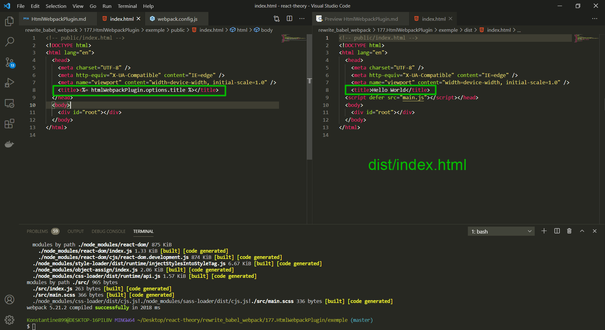

# HtmlWebpackPlugin использование шаблонов

А теперь еще один очень важный и интересный аспект. Этот файл который мы передаем **HtmlWebpackPlugin**, он работает не как статический **html** файл, а как шаблон. Т.е. **HtmlWebpackPlugin** сможет динамически его интерпретирует и заменять определенные блоки этого файла **index.html** на какие-нибуть выражения или значения каких-нибудь переменных.

Самый простой пример, прямо из документации, это **title**. Мы можем динамически устанавливать **title** для нашего приложения.

```js
//webpack.config.js
const HtmlWebpackPlugin = require('html-webpack-plugin');

module.exports = {
  mode: 'development',

  module: {
    rules: [
      {
        test: /\.js$/,
        exclude: /node_modules/, // исключение для обработки
        loader: 'babel-loader',
      },

      // картинки
      {
        test: /\.(png|jpg|jpeg|gif|ico)$/,
        use: [
          {
            loader: 'file-loader',
            options: {
              outputPath: 'images',
              name: '[name]-[sha1:hash:7].[ext]',
            },
          },
        ],
      },
      // Шрифты
      {
        test: /\.(ttf|otf|eot|woff|woff2)$/,
        use: [
          {
            loader: 'file-loader',
            options: {
              outputPath: 'fonts',
              name: '[name].[ext]',
            },
          },
        ],
      },
      //css
      {
        test: /\.(css)$/,
        use: ['style-loader', 'css-loader'],
      },
      //scss
      {
        test: /\.(s[ca]ss)$/,
        use: ['style-loader', 'css-loader', 'sass-loader'],
      },
    ],
  },
  plugins: [
    new HtmlWebpackPlugin({
      title: 'Hello World',
      template: './public/index.html',
    }),
  ],
};
```

И теперь для того что бы использовать значение этой переменной в **index.html**. Я перейду в **index.html** и в **title** пропишу вот такое выражание.

```html
<!-- public/index.html -->
<!DOCTYPE html>
<html lang="en">
  <head>
    <meta charset="UTF-8" />
    <meta http-equiv="X-UA-Compatible" content="IE=edge" />
    <meta name="viewport" content="width=device-width, initial-scale=1.0" />
    <title><%= htmlWebpackPlugin.options.title %></title>
  </head>
  <body>
    <div id="root"></div>
  </body>
</html>
```

```shell
npm run start
```



У вас может возникнуть естественный вопрос. Зачем это все нужно если **title** и так можно было указать в **html** документе. Мы собственно ничего не получили, только усложнили конфигурацию.

Но все дело в том что в момент исполнения этой конфигурации мы находимся в **NodeJS**. и затем мы можем использовать совершенно любые переменные которые доступны в окружении, которые доступны в момент **build**.

например использую это удобное свойство мы можем добавить к нашему **index.html** файлу информацию о том когда именно был создан этот **build**. Эта команда может быть очень полезна команде тестировщиков которой важно знать какую именно версию приложения они тестируют.

Для этого добавляю свойство **buildTime:** и в качестве значения устанавливаю **new Date().toString()**.

```js
//webpack.config.js
const HtmlWebpackPlugin = require('html-webpack-plugin');

module.exports = {
  mode: 'development',

  module: {
    rules: [
      {
        test: /\.js$/,
        exclude: /node_modules/, // исключение для обработки
        loader: 'babel-loader',
      },

      // картинки
      {
        test: /\.(png|jpg|jpeg|gif|ico)$/,
        use: [
          {
            loader: 'file-loader',
            options: {
              outputPath: 'images',
              name: '[name]-[sha1:hash:7].[ext]',
            },
          },
        ],
      },
      // Шрифты
      {
        test: /\.(ttf|otf|eot|woff|woff2)$/,
        use: [
          {
            loader: 'file-loader',
            options: {
              outputPath: 'fonts',
              name: '[name].[ext]',
            },
          },
        ],
      },
      //css
      {
        test: /\.(css)$/,
        use: ['style-loader', 'css-loader'],
      },
      //scss
      {
        test: /\.(s[ca]ss)$/,
        use: ['style-loader', 'css-loader', 'sass-loader'],
      },
    ],
  },
  plugins: [
    new HtmlWebpackPlugin({
      title: 'Hello World',
      buildTime: new Date().toString(),
      template: './public/index.html',
    }),
  ],
};
```

Теперь мы можем использовать в нашем шаблоне эту строку в теле **html** документа.

```html
<!-- public/index.html -->
<!DOCTYPE html>
<html lang="en">
  <head>
    <meta charset="UTF-8" />
    <meta http-equiv="X-UA-Compatible" content="IE=edge" />
    <meta name="viewport" content="width=device-width, initial-scale=1.0" />
    <title><%= htmlWebpackPlugin.options.title %></title>
  </head>
  <body>
    <div>Время сборки проекта <%= htmlWebpackPlugin.options.buildTime %></div>
    <div id="root"></div>
  </body>
</html>
```


Конечно в идеальном варианте можно было бы добавить немного больше служебной информации к примеру на каком сервере был сделан этот **build** и хэш коммита в **git** из которого этот **build** собственно произошел. Ищи данную информацию на официальном сайте в разделе по плагину **HtmlWebpackPlugin**.

В **production** совершенно пользователю не важно когда был сделан этот проект. Режимы сборки проекта смотри далее.
