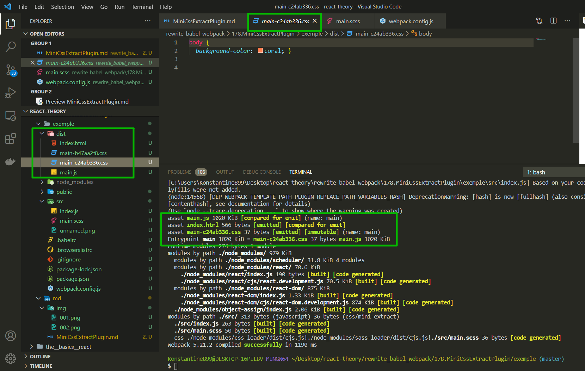

# MiniCSS Extract Plugin (как вынести css В отдельный файл)

В прошлых уроках мы научились как конфигурировать загрузку **css**. Но в наших цепочках **css-loader** последним стоит **style-loader**. Этот **style-loader** сохраняет **css** код в **js** файле, а затем, во время исполнения, он добавляет блоки **style** на страницу.

Эта стратегия отлично подходит для разработки. Но для **production** **build** она не подходит. В реальных проектах **css** файл нужно вынести в отдельный файл и загрузить его при помощи тега **link**.

Поможет нам в этом деле [https://github.com/webpack-contrib/mini-css-extract-plugin](https://github.com/webpack-contrib/mini-css-extract-plugin). Это плагин который есть почти в каждом **webpack** **build**, в том числе в **create-react-app** он тоже используется. Этот **webpack** **plugin** делает то что нам нужно. Он извлекает **css** файлы в отдельные файлы, а затем добавляет ссылки на эти файлы в **html** документ.

```shell
npm install --save-dev mini-css-extract-plugin
```

Добавляю **plugin** к нашему конфигу.

Импортирую **const MiniCssExtractPlugin = require('mini-css-extract-plugin');** И далее точно так же как и для **HtmlWebpackPlugin** мы создаем новый объект new **HtmlWebpackPlugin** и сохраняю его в массиве **plugins**. В этом случае порядок определения плагинов не имеет.

```js
//webpack.config.js
const HtmlWebpackPlugin = require('html-webpack-plugin');
const MiniCssExtractPlugin = require('mini-css-extract-plugin');

module.exports = {
  mode: 'development',

  module: {
    rules: [
      {
        test: /\.js$/,
        exclude: /node_modules/, // исключение для обработки
        loader: 'babel-loader',
      },

      // картинки
      {
        test: /\.(png|jpg|jpeg|gif|ico)$/,
        use: [
          {
            loader: 'file-loader',
            options: {
              outputPath: 'images',
              name: '[name]-[sha1:hash:7].[ext]',
            },
          },
        ],
      },
      // Шрифты
      {
        test: /\.(ttf|otf|eot|woff|woff2)$/,
        use: [
          {
            loader: 'file-loader',
            options: {
              outputPath: 'fonts',
              name: '[name].[ext]',
            },
          },
        ],
      },
      //css
      {
        test: /\.(css)$/,
        use: ['style-loader', 'css-loader'],
      },
      //scss
      {
        test: /\.(s[ca]ss)$/,
        use: ['style-loader', 'css-loader', 'sass-loader'],
      },
    ],
  },
  plugins: [
    new HtmlWebpackPlugin({
      title: 'Hello World',
      buildTime: new Date().toString(),
      template: './public/index.html',
    }),
    new MiniCssExtractPlugin(),
  ],
};
```

Кроме добавления самого плагина нам нужно обновить список лоудеров. Нам больше не понадобится **style-loader** который мы использовали до этого. Вместо него мы подставим лоудер который идет в комплекте с **MiniCssExtractPlugin** т.е. прописываю **MiniCssExtractPlugin.loader** вместо **style-loader**.

```js
//webpack.config.js
const HtmlWebpackPlugin = require('html-webpack-plugin');
const MiniCssExtractPlugin = require('mini-css-extract-plugin');

module.exports = {
  mode: 'development',

  module: {
    rules: [
      {
        test: /\.js$/,
        exclude: /node_modules/, // исключение для обработки
        loader: 'babel-loader',
      },

      // картинки
      {
        test: /\.(png|jpg|jpeg|gif|ico)$/,
        use: [
          {
            loader: 'file-loader',
            options: {
              outputPath: 'images',
              name: '[name]-[sha1:hash:7].[ext]',
            },
          },
        ],
      },
      // Шрифты
      {
        test: /\.(ttf|otf|eot|woff|woff2)$/,
        use: [
          {
            loader: 'file-loader',
            options: {
              outputPath: 'fonts',
              name: '[name].[ext]',
            },
          },
        ],
      },
      //css
      {
        test: /\.(css)$/,
        use: [MiniCssExtractPlugin.loader, 'css-loader'],
      },
      //scss
      {
        test: /\.(s[ca]ss)$/,
        use: [MiniCssExtractPlugin.loader, 'css-loader', 'sass-loader'],
      },
    ],
  },
  plugins: [
    new HtmlWebpackPlugin({
      title: 'Hello World',
      buildTime: new Date().toString(),
      template: './public/index.html',
    }),
    new MiniCssExtractPlugin(),
  ],
};
```

```shell
npm run start
```


Замечательно. Плагин работает.

Точно так же как и остальные плагины **MiniCssExtractPlugin** можно конфигурировать. Можно передать опции в конструктор. Например в этой конфигурации можно указать каким будет имя файла который мы сохраним. Не задавай имя **main.css** потому что этот файл будет агресивно кэшироваться браузерами. И если мы захотим обновить наш **css** и он будет тоже называться **main.css**, браузеры наших клиентов будут считать что файл не поменялся и не будут пытаться перезагрузить его с сервера. Соответственно обновить этот файл для наших пользователей будет настоящей проблемой. Но если мы добавим к имеи **hash**, то все будет норм.

```js
//webpack.config.js
const HtmlWebpackPlugin = require('html-webpack-plugin');
const MiniCssExtractPlugin = require('mini-css-extract-plugin');

module.exports = {
  mode: 'development',

  module: {
    rules: [
      {
        test: /\.js$/,
        exclude: /node_modules/, // исключение для обработки
        loader: 'babel-loader',
      },

      // картинки
      {
        test: /\.(png|jpg|jpeg|gif|ico)$/,
        use: [
          {
            loader: 'file-loader',
            options: {
              outputPath: 'images',
              name: '[name]-[sha1:hash:7].[ext]',
            },
          },
        ],
      },
      // Шрифты
      {
        test: /\.(ttf|otf|eot|woff|woff2)$/,
        use: [
          {
            loader: 'file-loader',
            options: {
              outputPath: 'fonts',
              name: '[name].[ext]',
            },
          },
        ],
      },
      //css
      {
        test: /\.(css)$/,
        use: [MiniCssExtractPlugin.loader, 'css-loader'],
      },
      //scss
      {
        test: /\.(s[ca]ss)$/,
        use: [MiniCssExtractPlugin.loader, 'css-loader', 'sass-loader'],
      },
    ],
  },
  plugins: [
    new HtmlWebpackPlugin({
      title: 'Hello World',
      buildTime: new Date().toString(),
      template: './public/index.html',
    }),
    new MiniCssExtractPlugin({
      filename: 'main-[hash:8].css',
    }),
  ],
};
```

```shell
npm run start
```


Эксперемент. Изменяю scss

```scss
$body-color: coral;

body {
  background-color: $body-color;
}
```

```shell
npm run start
```




Ссылка в собранном **html** поменялась

```html
<!-- public/index.html -->
<!DOCTYPE html>
<html lang="en">
  <head>
    <meta charset="UTF-8" />
    <meta http-equiv="X-UA-Compatible" content="IE=edge" />
    <meta name="viewport" content="width=device-width, initial-scale=1.0" />
    <title>Hello World</title>
    <script defer src="main.js"></script>
    <link href="main-c24ab336.css" rel="stylesheet" />
  </head>
  <body>
    <div>
      Время сборки проекта Sun Feb 14 2021 17:42:29 GMT+0300 (Москва,
      стандартное время)
    </div>
    <div id="root"></div>
  </body>
</html>
```

> **MiniCssExtractPlugin Удобно использовать в production сборках. Если вы собираетте для разработки, то обычный style-loader будет отлично работать.**
