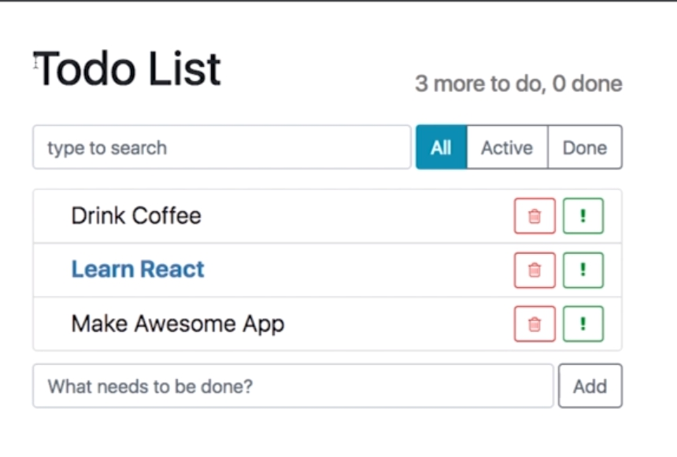
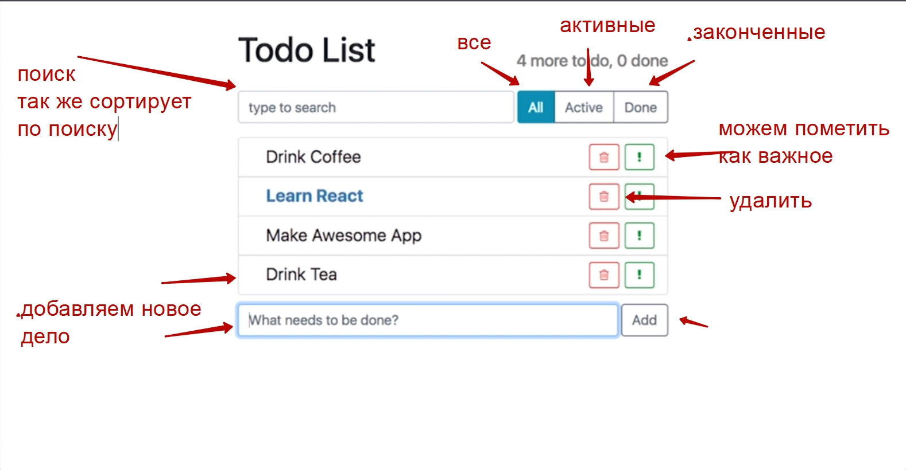
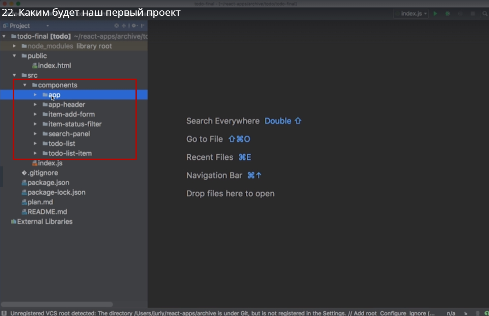
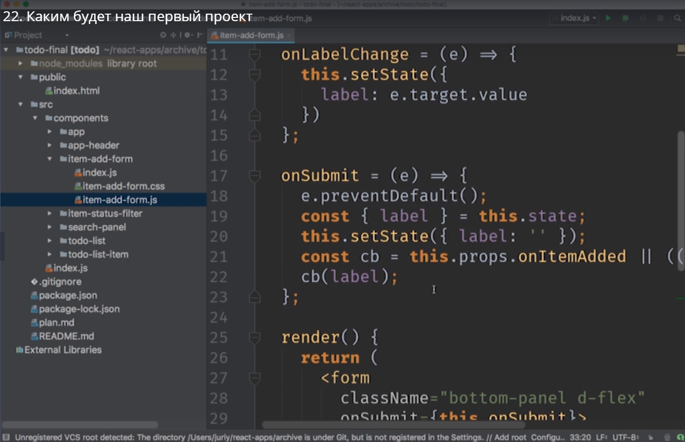
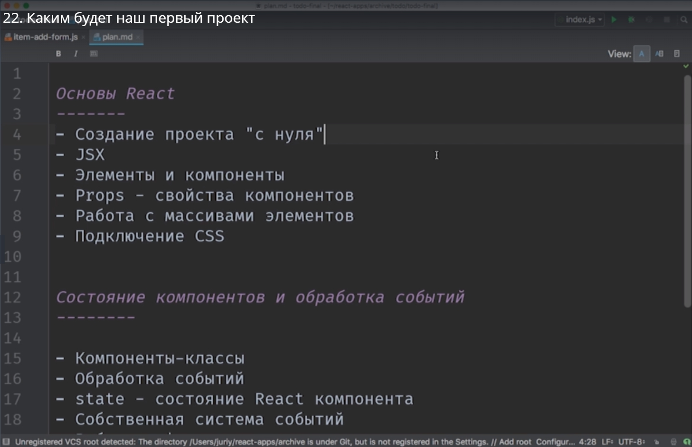
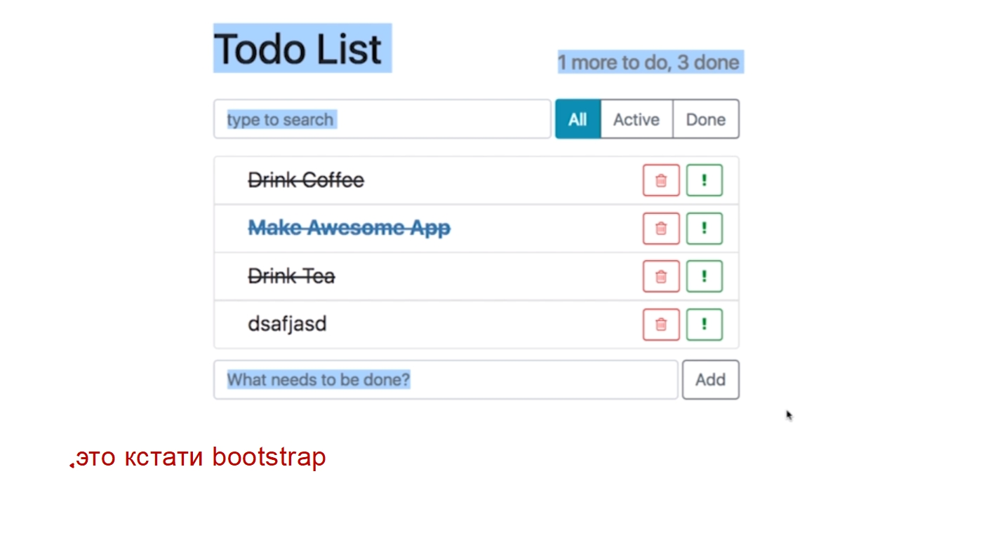
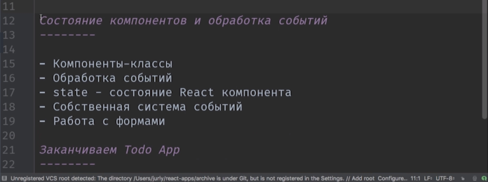
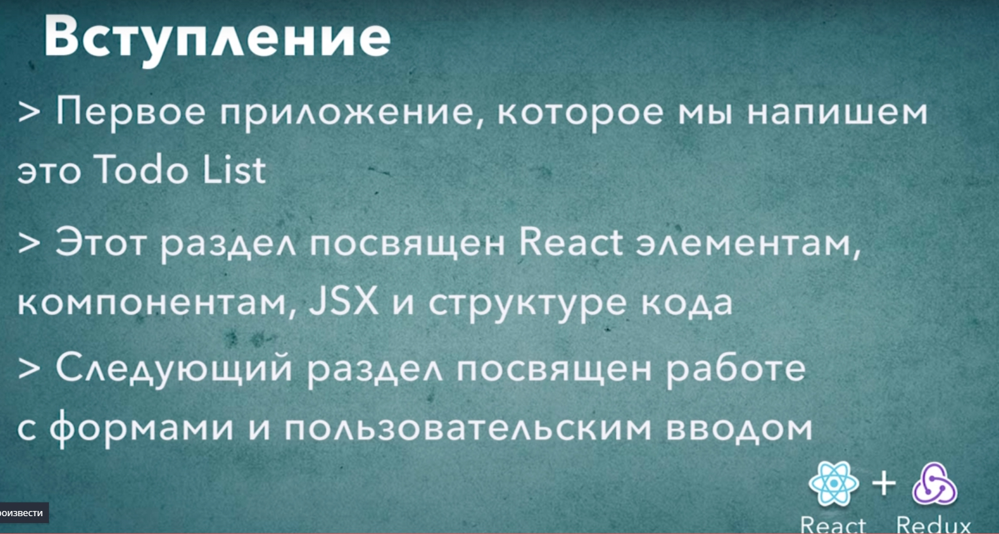

# Каким будет наше первое приложение

Вот простое приложение

Todo List. 

С первого взгляда это просто приложение. Но оно позволяет раскрыть процентов 90% возможностей react.
Вот как примерно будет выглядеть код когда мы его допишем. И затем мы пройдемся по плану как мы бцдем писать это приложение.
Для того что бы написать это приложение нам понадобится 7-мь react компонентов.

Компонент app это наш компонент обертка который просто собирает остальные все шесть компонентов вместе. Т.е. фактически 6-ть компонентов  плюс компонент менеджер **app** который всеми ими управляет.
Код в компонентах в большинстве будет не очень большим

В этом компоненте 42 строки кода. И как видите большинство функций выглядят не очень сложно.

План. 

Этот раздел посвящен основан react

мы посмотрим детально как работает синтаксис JSX. Мы поговорим о компонентах и элементах. Мы создадим протатип этого приложения, но мы не будем давать пользователю что-то изменять, отмечать дела как выполненные или добавлять новые элементы в список. Все это мы добавим в следующем разделе. В конце этого блока мы посмотрим как подключить css. 

c bootstrap наше приложение начнет выглядеть существенно симпатичнее и аккуратнее.

А следующий раздел

Состояние компонентов и обработка событий. Он уже как раз посвящен тому что бы дать пользователю редактировать  состояние приложения. 
Мы научимся обрабатывать клики. Мы научимсяч обрабатывать события ввода чего-нибудь в форму. Мы поговорим о том что такое состояние react компонентов и как впринципе в приложении надо управлять состоянием т.е. внутренними данными этого приложения.

У react есть свой собственный подход  к управлению состоянием. Т.е. после следующего раздела наше с вами приложение станет интерактивным и им можно будет пользоваться

