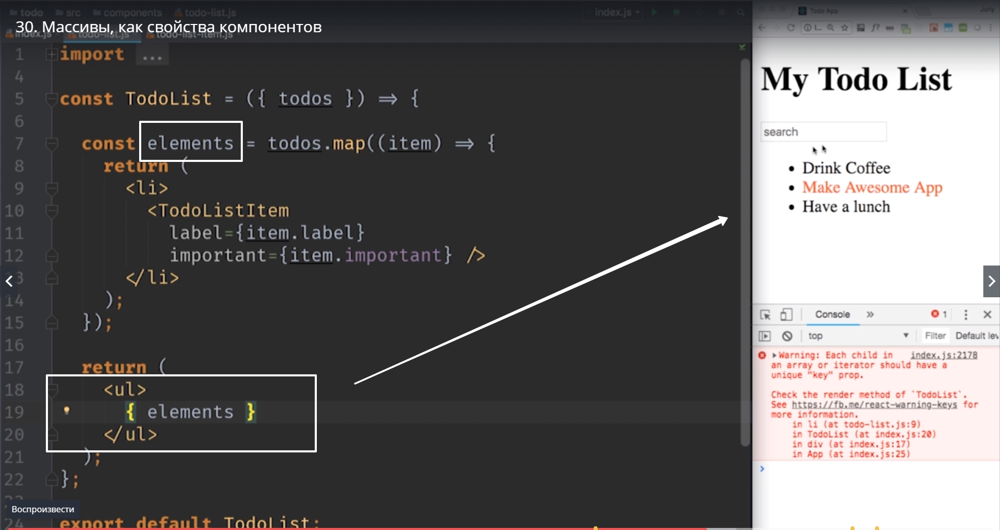

# Массивы как свойства компонентов

В этом видео мы будем использовать spread оператор для объектов.
Давайте посмотрим вместе на компонент **TodoList**.


Он отображает наш список дел, основной блок в приложении. Но сейчас он сам решает какие именно данные нужно отображать.
В реальном приложении данные могут приходить к примеру с сервера или из какого-нибудь источника данных. Поэтому компоненту который отображает TodoList совершенно не обязательно знать откуда эти данные приходят и куда они уходят. Будет правильнее скомпонировать этот элемент так, что бы он отвечал только за отображение списка. А значит этот элемент должен получать данные для списка дел в качестве из одного из своих свойств. Одного из **props** которые мы сейчас заполним.

Поместим наш список дел на самый-самый верхний уровень в компонент App. В главный компонент который создает наш пользовательский интерфейс.
И поскольку в наших элементов которые мы собираемся отображать есть какая-то внутренняя структура, то будет вполне логично если каждый элемент списка дел будет представлен отдельным объектом.

```
//App

import...

const App = () => {;

const TodoData[
    {label: 'Drink Coffee', important:false},
    {label: 'Make Awesome App', important:true},
    {label: 'Have a lunch', important:false}

];

return(
    <div>
    <AppHeader />
    <SearchPanel />
    <TodoList />
    <div/>
);
};

ReactDOM.render(<App/>,document.getElement.ById('root'));

```
Cоздаем вот такую структуру данных TodoData она будет массивом [], в котором будет несколько элементов{}.

Таким образом данные для нашего списка дел храняться на самом верхнем уровне в компоненте App. Только компонент App d действительности знает откуда беруться эти данные. т.е. если в какой-то момент мы захотим изменить нашу логику и получать эти данные с сервера. Нам нужно будет переписать только App. Все остальные компоненты не будут затронуты поскольку они будут получать готовые данные.
Теперь поскольку мы знаем что в качестве свойств можно передавать абсолютно все что угодно. Мы можем в качестве свойства передать и сам массив который мы только что создали.

Передадим его скажем в < TodoList/>


Назовем это свойство **todos ={}** Не забываем про фигурные скобки, а не кавычки. Если поставим кавычки то передадим строку. А мы хотим передать массив, по этому ставим {} и передаем значение массива{todoData}.


.

Теперь переходим в todo-list.js и сделаем так что бы мы с этим свойством что-то делали. 
мы не будем использовать объект props


Вместо этого сразу используем синтаксис деструктуризации. Достанем свойство todos


И теперь будет логичным использовать этот todos где-нибудь в коде.
Давайте напишем сначала очень наивный код. И скажем что в первом элементе label будет массив с нулевым индексом [0]. Ну а значение important vs тоже достанем таким же способом.


И второй элемент у нас будет точно таким же как первый, только вместо нулевого индекса мы будем использовать индекс 1.


Соответственно этот код работает  и мы можем передавать массив и работать с массивом в качестве свойства react компонента. 

Но конечно этот код выглядит мягко говоря не красиво. Мы просто по индексу получаем доступ к данным. А что если в этом массиве нет например первого идекса? Так как быть в таком случае?

Для того что бы улючшить этот код мы сейчас используем еще одну возможность JSX которую мы пока что не рассматривали.
Мы уже знаем что используя фигурные скобки мы можем вставлять другие элементы внутрь JSX кода.


Браузер обновился и как видите это абсолютно валидный синтаксис.

Но мы можем вставлять не только один единственный элемент как в примере выше. Мы можем вставлять внутрь JSX, используя {}, массив элементов. 
Давайте посмотрим как это будет работать. Удаляем код объекта firstEl и начнем писать его заново. Назовем наш массив **elements**. B так для каждого элемента массива todos


мы создадим один JSX элемент. мы говорим todos.map((item)=>{}) item это наш todoItem который мы работаем. Копируем наш кусок разметки. Не забываем обернуть в круглые скобки т.к. у нас наш JSX код занимает несколько строк.


И так теперь внутри lable пишем {item.lable}




Что мы видим? Все элементы нашего Todo списка отресовались и видны на нашей странице. Единственна проблема Warning в консоли


Так и должно быть позже посмотрим как избавится.

И так давайте еще раз вместе посмотрим как работает этот код.
Мы создали массив elements


Элементы этого массива это JSX элементы 


которые мы создаем внутри функции map


Мы берем каждый элемент массива todos. А массив todos у нас определен в **index.js**  в **App** самом верху иерархии компонентов и для каждого элемента этого массива 


мы создаем соответствующий JSX элемент


Затем использую фигурные скобки


мы просто добавляем все элементы поочередно нашего onOrder листа.

А теперь небольшая вишенка на торте. Вот этот код который мы только что написали можно написать еще проще.
Дело в том что JSX поддерживает spread оператор для объекта. Напомню. Spread оператор позволяет разложить наш объект на коллекцию ключей и значений. И в JSX когда имена свойств компонентов совпадают с именама свойств объекта которые мы используем.


А у нас это как раз наш случай label называется точно также внутри объекта item


important в свою очередь точно так же называется внутри объекта item


В место того что бы перечислять каждое свойство. Можно заменить этот блок кода


на вот такое компактное маленькое выражение. **{...item}**. 


Это означает взять каждое свойство из объекта item и передать его в качестве атрибута, вместе со значением в TodoListItem


