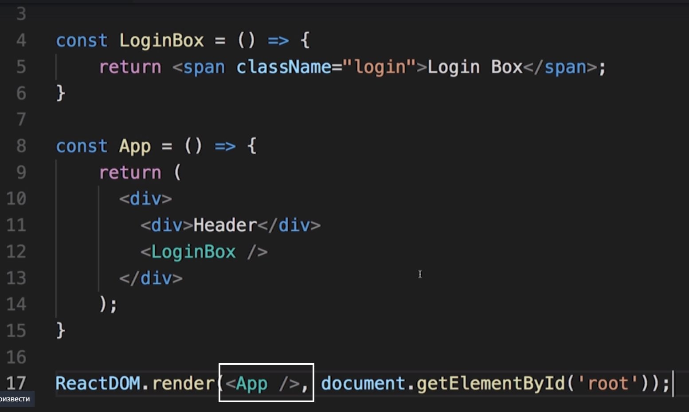

# Code Review

В последних видео мы посвятили уйму времени JSX и React компонентами. 
Смотрим код и находим ошибки.

1. мы не можем возвращать два корневых элемента. Нам нужно их во что-то обернуть, какой-нибудь родительский элемент,< div> например.

2. Смотрим на < loginBox/>. Мы написали с маленькой буквы. react посчитает что это обычный html тег и даже не будет пытаться исполнить эту функцию. Для того что бы починить эту проблему меняем на заглавную.

И раз мы о нем начали говорить давайте посмотрим на этот код

3. Нужно использовать **className** а не **class**

4. Нехватало импорта самой библиотеки.

 

 5. Вторым параметром указываем в куда react должен отрендерить наш элемент.
   
   

Вторым аргументом передаем **document.getElementById('')**. И тут уже будет зависить какой мы используем html шаблон. В нашем шаблоне это **root**

И еще одна ошибка, в качестве первого аргумента мы должны передать react элемент. App это не элемент, это Функция которая является react компонентом. 
Что бы сделать из нее элемент нам нужно сделать из нее вот такой вот тег.

