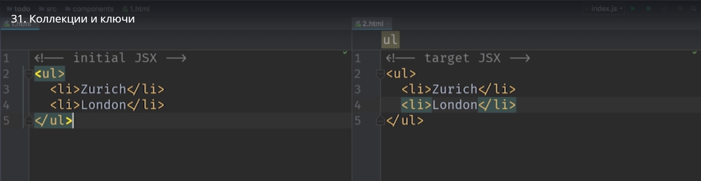
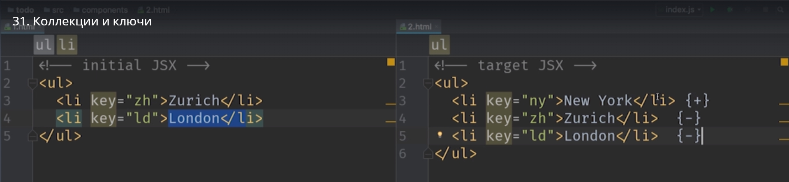

# Коллекции и ключи

Давайте попробуем разобраться с тем предупреждением которое появилось в нашем проекте когда мы начали использовать массив в JSX

Напомню, это предупреждение появилось после того как мы написали вот этот блок кода

Мы вынесли элементы нашего списка в отдельный массив

и затем мы использовали этот массив в нашей JSX разметке

Для начала мы уберем это предупреждение и посмотрим что от нас хочет react. Мы разберем почему react ведет себя таким образом и почему он выдает нам такое предупреждение в консоли.

И так, когда мы вставляем в JSX массив элементов,

react хочет что бы у каждого элемента т.е. в нашем коде,у каждого **li** лист item-a, который мы создаем для каждого элемента todo-list

был уникальный ключ, свойство **key**.

Для того что бы избавится от этого предупреждения вот в этом месте кода нужно добавить свойство key и применить к этому свойству уникальный индификатор, уникальный в рамках этой коллекции.

В реальных приложениях чаще всего вы будете получать данные с сервера. И те данные которые вы будете получать, чаще всего будут уже содержать какой-нибуть индификатор. Например id в базе данных. Но в нашем маленьком приложении мы конечно не работаем с базой данных, мы работаем с обычным массивом, поэтому мы добавим id вручную и затем вручную их поддерживать.

Теперь давайте вернемся в todo-list.js

теперь у нас снова предупреждение react edblbk что мы используем не уникальные id. Есть два child-а  с одинаковым ключом

Давайте присвоим все же настоящий уникальный ключик.

Предупреждение ушло и наша консоль снова чистая. Теперь мы знаем как убрать это предупреждение. Но хотелось бы разобраться зачем react нужен этот key ключ. **И причина тут производительность**.
Каждый раз когда react  рендерит приложение он пытается определить какие именно элементы изменились в DOM дереве и обновить только эти части приложения. 
Процесс поиска изменений в DOM дереве называется **reconceletion алгоритм**.

Давайте посмотрим как этот алгоритм будет работать на примере простых списков с названиями городов.
Давайте представим что у react есть такая задачка. У нас есть блок JSX кода. Это список в которм содержаться два города.

Затем еще в список добавляется еще один элемент с названием города

Что в этот момент происходит? и какие шаги будет предпринимать react что бы обновить html страницу? React пойдет по элементам этих списков один за другим и будет их поочередно между собой сравнивать. Когда react  дойдет до последнего элемента он обнаружит. что в левом списке больше нет элемента, а вот в правом списке появился элемент **< li>New York< li/>** и react поймет что минимальный способ обновить нашу страницу это просто добавить один новый элемент. 
Теперь давайте такую же картинку нарисуем только для другого кейса. Предположим что у нас есть список, только вместо того что бы добавлять элемент в конец мы добавим его в начало.

Что сдесь произойдет? React начнет снова смотреть на элементы один за другим. Соответственно первый элемент мы сравним с первым элементом нового списка. Они одинаковы? НЕТ! Поэтому этот элемент нужно обновить.
 Далее сравнивает второй элемент. И снова не совпадает. И соответственно 3-го элемента нет в старом списке. Его тоже нужно обновить.

 

 React  попытается применить свой умный алгоритм для того что бы минимизировать обновления DOM дерева. Ему придеться перерисовать весь список.
 А теперь представте что внутри этого списка могут быть не такие простые элементы. Внутри этого списка могут быть сложные компоненты, сложные элементы которые содержат большие блоки html кода. 
 Соответственно при таком подходе, сравнивать элементы один с другим, просто по очереди, react рискует сделать очень много лишней работы.
 А теперь давайте посмотрим на кейс когда у нас есть уникальные ключи.

 

 Логика react теперь изменится. Он не будет последовательно сравнивать элементы 1-й с 1-ым, 2-й со 2-ым. Вместо этого react  будет использовать эти самые key для того что бы сопоставлять эти элементы между собой. 

 Как же сработает react? В первую очередь у первого элемента нет аналогичного элемента в старом списке с **key = "ny"**

 

 Поэтому react скажет  этот элемент мы должны будем обновить.

 

 Затем react  посмотрит на второй элемент с **key ="zh"**  В Старом списке есть элемент с таким ключом

 

 и эти элементы одинаковые. Соответственно react  поймет что это элемент обнавлять не нужно.
 И точно так же для третьего элемента.

 

 Таким образом с помощью ключей react поймет что самый простой способ перейти от старого списка к новому, обновить страницу, это просто добавить в начало одну html ноду.
 

 **Кстати если вы будете игнороровать Warning и не будуте передовать ни каких ключей, то react проставит по умолчанию ключи по очереди.**

 

 Алгоритм будет именно таким как мы говорили раньше.

 **Еще один вывод который мы должны с вами сделать из этого что нет ни какого смысла использовать в качестве ключей индекс элемента в массиве, потому что по умолчанию react именно так и работает. Если мы проставим индекс мы избавимся от предупреждения, но мы не получим ту производительность за которую бореться react.**

 В действительности такой подход с индексом можно использовать, но только в том случае когда элементы в вашем списке не меняют свой порядок и кроме того элементы добавляются только в конец. Тогда индексы будут работать. 

 Но для простоты можно запомнить что использовать индекс ключа не стоит. Чаще всего это плохая практика.

 Теперь возвращаемся к нашему коду. Хорошо держать свой код в чистоте и передавать в компоненты только те свойства с которыми эти компоненты реально работают. а мы сейчас передаем одно лишнее свойсво id

 

 1. -й возможный вариант это возвращение старого синтаксиса т.е. перечислить только те свойства которые нам реально надо.

Но это не красиво!!! мы снова возвращаемся к нашему длинному коду. Вот этот синтаксис очень нравится

Когда мы просто передаем все значения из item.

Как же можно сохранить этот синтаксис и тем немение убрать из item-а значения id.

Если вы помните как работает синтаксис деструктуризации. И то мы можем достать id  из объекта вот таким образом

Таким образом мы из item мы получим id и сохраним его в константу.

Но у синтаксиса деструктуризации есть еще одна возможность. Это rest параметр. Можно добавить еще один параметр в который войдут все те свойства объекта которые небыли деструктурированы в этом выражении

А для нас это все свойства кроме id. Если мы вторым параметром укажем **itemProps** то в нем будут все свойства кроме свойства id.

Теперь id  не будут передаваться в TodoListItem.

