# Cоздаем пустой react проект

create react app  создает проект с небольшим стартовым кодом, но наша цель научиться писать  react приложение с ноля. По этому мы создадим новый проект, Затем удалим весь тот код который мы не писали сами и убедимся что проект работает и готов что бы мы сами начали писать наше react приложение.

Запускаем утилиту **create-react-app**. Она должна быть у нас уже установлена. Если по какой-то причине create-react-app e нас не установлен выполните **npm install -g create-react-app**.
Теперь создаем новое приложение **create-react-app** и затем передаем название приложения которое мы будем делать (todo).

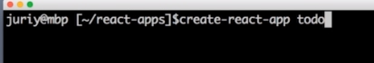

Зачем использовать **create-react-app** вместо того что бы просто открыть пустую папку и начать создавать проект абсолютно с ноля? 
Все очень просто. **create-react-app** даст нам правильно настроеный **Bable** и **WebPack** со всеми необходимыми библиотеками и дополнительными инструментами которые готовы к работе с react кодом.
Кончно мы можем настроить все эти инструменты самостоятельно и в более поздних блоках этого курса мы посмотрим как это делается.

После создания проекта заходим в папку **cd и указываем путь** и в этой папке запускаем **npm start**.
Если все сработало корректно то npm start  соберет и запустит то самое маленькое react приложение которое идет вместе с create-react-app.

Открывается браузер.

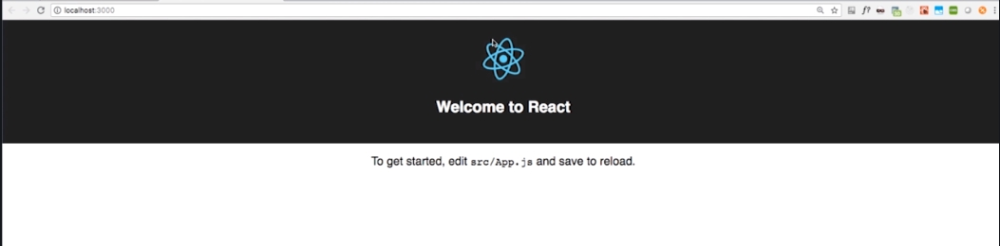

Вот тот самый минимальный код который шед вместе с create-react-app. 
А теперь мы почистим этот проект так что бы там небыло того кода который писали не мы. Что бы весь код был наш собственный и мы точно знали что делает каждая строчка и каждый файл.
В нашем проекте две папки. 

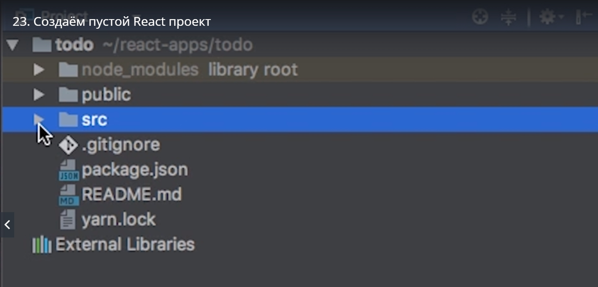

первая папка называется src

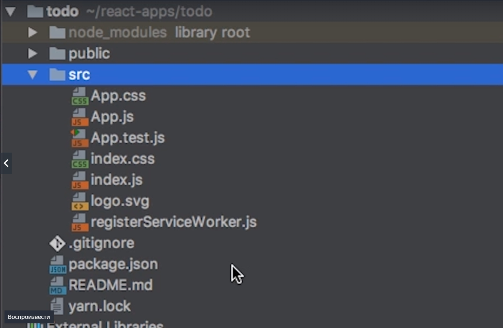

и здесь лежит исходный код всего того что относится к приложению.
Вторая папка называется **public**  и сдесь находятся статические ресурсы. HTML файл который мы будем использовать для того что бы отобразить наше приложение. **favicon.ico** - это иконка по умолчанию и **manifest.json** - это файл который необходим для **android девайсов.** 

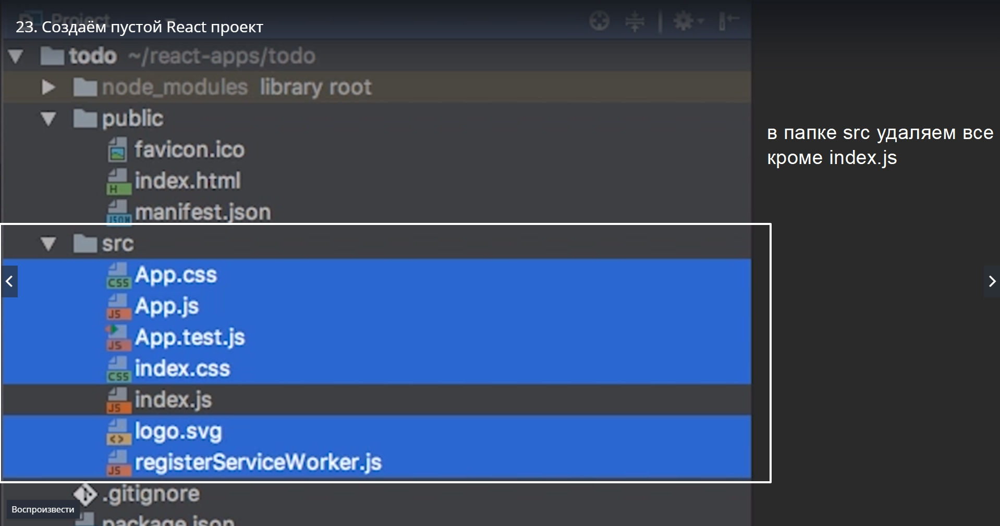

index.js оставляем потому что он нам нужен. Это будет самый главный файл с которого начинается наше приложение и если мы удалим и его то у нас не будет приложения.

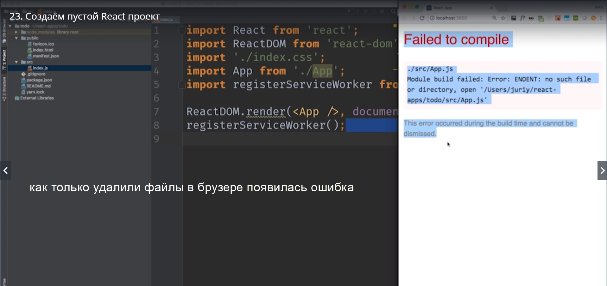

Это потому что index.js  пытается загрузить один из тех файлов которые только что удалили.

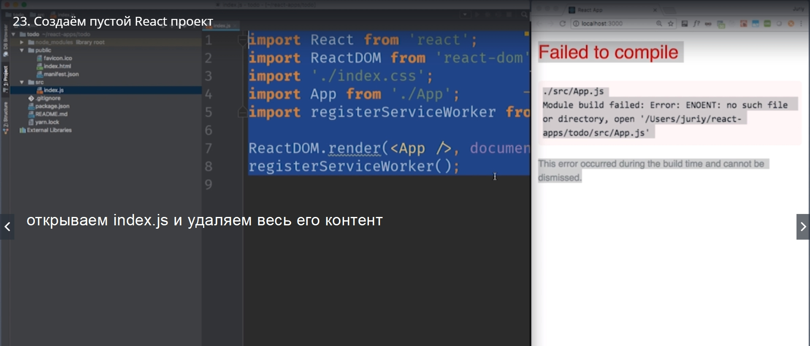

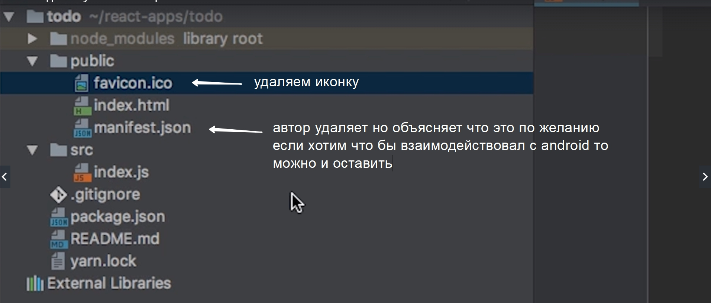

Далее **редактируем index.html**. Оставляем meta с viewport поскольку это деректива которая рассказывает как рендерить наше приложение на мобильных девайсах.
Все остальное до title удаляем.

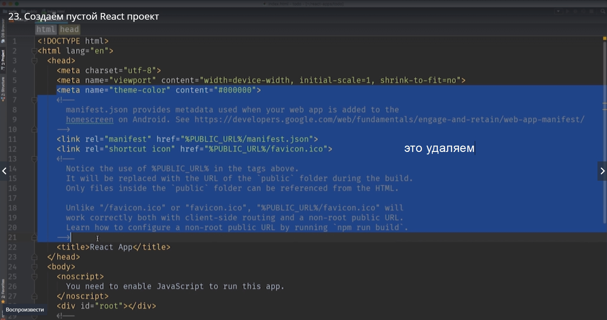

В title  сразу меняем на название нашего приложения **Todo App**.
**noscripn** нужен для того что бы потдержать те браузеры в которых выключен JS. Поскольку это учебный проект мы можем его удалить. И большой блок коментария что делает этот скрипт нам тоже не нужен. Приводим к такому виду.

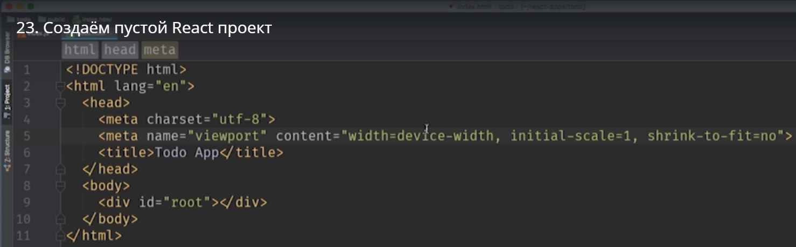

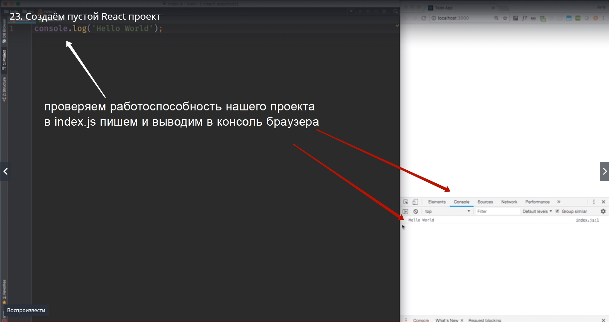

Наше приложение работает хоть и react сдесь нет. Ведь мы его удалили. Но приложение работает и как только мы будем добавлять новый код в index.js оно будет обновляться и отображать изменения на нашей странице.

Смотрим дальше что мы можем удалить.
**gitignore** этот файл мы используем для того если мы захотим поделиться нашим кодом.
**package.json** это очень важный файл в котором хранятся все зависимости нашего проекта

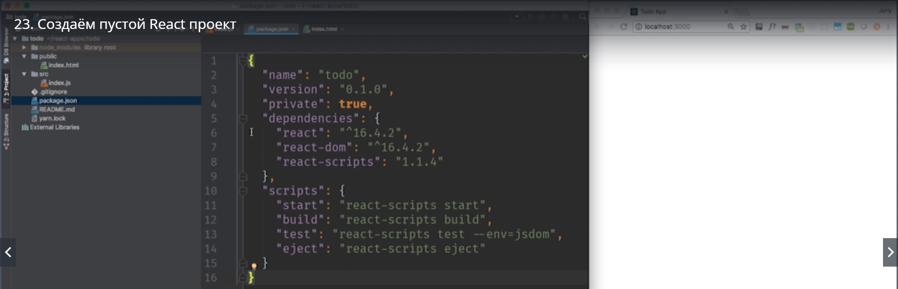

Удалять этот файл ни в коем случае не нужно.

Теперь посмотрим на **readme.md**.

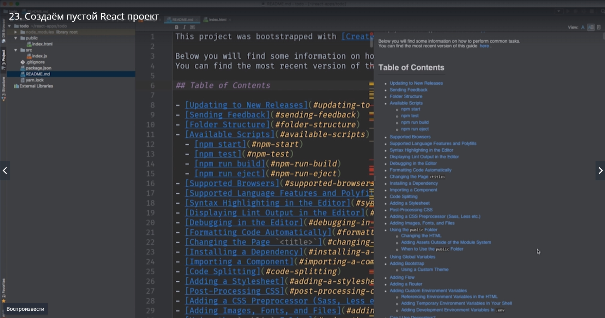

На данном этапе его содержимое нам не нужно. Поэтому его можно смело удалить или очистить. Вместо этого можно написать свой собственный текст.
Следующий файл это **yarn.lock** этот файл будет нужен если вы в качестве **Package** менеджера используете **yarn**  а не **npm**.

 В этом курсе мы будем пользоваться npm по-этому yarn.lock нам тоже не нужен.

И так в нашем проекте осталось 5-ть файлов.

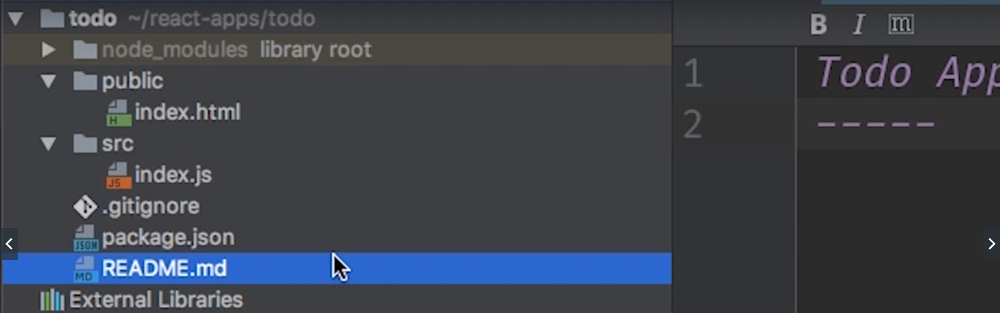

Два из этих файлов index.html  и index.js относятся непосредственно к нашему проекту. Мы будем их редактировать.
Gitignore необходим для гита.
package.json описывает зависимости нашего проекта и скрипты которые мы можем исполнять в консоли.

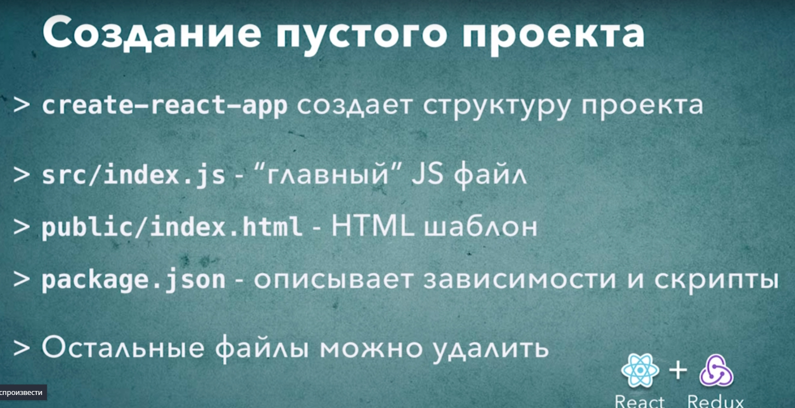
 

