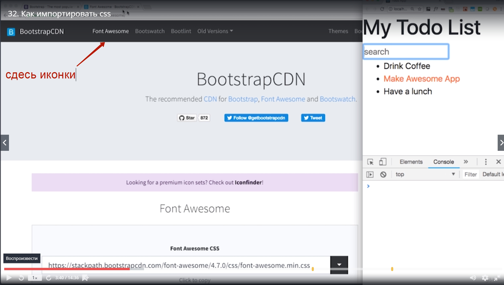
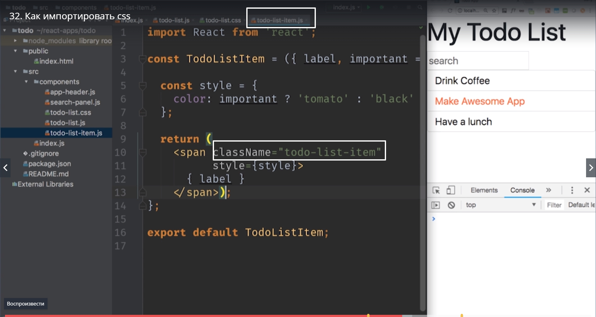
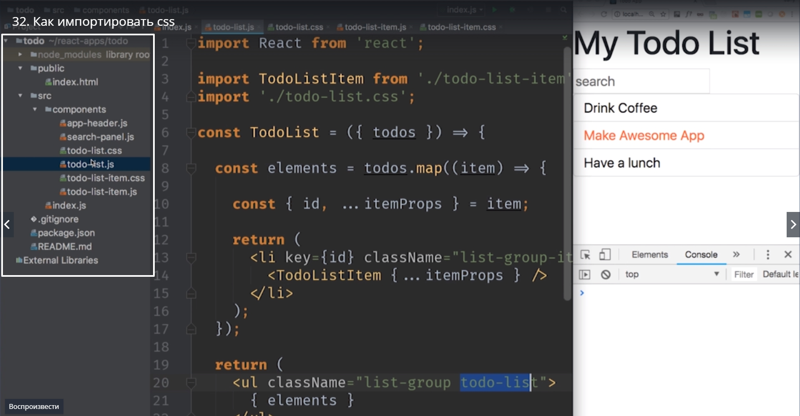

# как подключить css

Пора сделать наше маленькое todo приложение намного более симпатичным. 
Для того что бы достичь такого результата 

мы посмотрим как подключить bootstrap. Это OpenSorse библиотека front-end компонентов которая позволяет делать вот такие симпатичные контролы.
Мы посмотрим как написать свой собственный css. Как связать код компонентов с соответствующим css. B в конце концов мы добавим все компоненты которых пока что не хватает на нашем интерфейсе.

Пока что эти компоненты не будут ничего делать. К примеру форма добавления новых todo item работать не будет

В финальной версии приложения она все-таки заработает. 

Давайте подключим bootstrap. Yf  понадобится его css. Есть несколько способов подключения к проекту. Самый простой способ это через СDN. т.е. мы не будем устанавливать локально.
Вместо этого мы добавим маленькую ссылку в html шаблон для нашего проекта. как только пользователь будет заходить на страничку нашего приложения его браузер будет автоматически скачивать css botstrap и делать приложение немного симпотичнее. 

Зайдя на страницу вы увидите **Quick Start**.
[https://www.bootstrapcdn.com/](https://www.bootstrapcdn.com/) и в этом блоке будет несколько ссылок. Найдите ссылку которая называется **Сomplete css**. Копируем эту ссылку.
В нашем проекте заходим в папку **public**

 

И там находится единственный файл index.html. Это тот самый html файл с которого начинается загрузка нашего приложения. т.е. если мы добавим в этот файл какой-нибудь сss он буудет доступен в нашем приложении.

После обновления в браузере мы видим как поменялись шрифты и отступы. Это значит что наш css работает.
Вернемся на [https://www.bootstrapcdn.com/](https://www.bootstrapcdn.com/) в меню ищем 
**Font Awesome** Второй css файл который нам понадобится на немного более поздних фазах этого курса. **Font Awesome** это набор иконок. Это шрифт только вместо букв в нем находяться иконки. И если мы захотим добавить симпатичные иконки к нашему приложению.

Или восклицательного знака который делает item  выжным.

Для того что бы достать эти иконки с **Font Awesome** заходим и копируем ссылку

И точно так же как для bootstrap css мы добавим css для **Font Awesome**.

Теперь у нас два css файла которые подгружаются с внешних серверов.

Мы готовы к тому что бы начать писать свой собственный css. Теперь у нас есть fraem work  который мы можем использовать. Мы можем добавлять собственные кастомные классы  к нашим компонентам. Botstrap сделает так что бы наши компоненты красиво и правильно отображались на веб-странице.
Заходим в todo-list.js

И добавим немного стилей нашему основному элементу списку дел.

Для начало добавим **className = "list-group"**

Это css класс который оределен в Bootstrap. Как мы видим внешний вид сразу изменился. У на пропали маркеры списка.

Теперь наш todo-list  изменился.

Пишем css. Назначаем еще один css  класс нашему order листу. Это наш собственный css класс который не определен bootstrap. Мы будем использовать его для того что бы отделить стили нашего конкретного todo списка, todo  листа от всех остальных стилей, всех остальных списков которые могут быть.

И следующий вопрос. А куда же нам поместить css в котором мы определим правила для нашего сласса?

И конечно мы може поступить так. Мы можем зайти в папку public создать файл main.css и начать туда писать весь css код  нашего приложения. Но у этого подхода есть существенный минус. Если наше приложение будет существенно большим, элементов в нем будет существенно много, то работать с одним css файлом который описываем все компоненты  будет не удобно.

Намного удобнее будет хранить css для каждого компонента в отдельном файле который будет называться точно так же как и сам компонент.
Например если у нас есть **todo-list.js**. Давайте рядом сним создадим файл **todo-list.css**.

В этот файл добавим немного css  кода который относится только к этому компоненту.

Но пока что этот файл не подключен к проекту.

Для того что бы использовать эти css определения нам нужно импортировать todo-list.css в в одном из JS файлов. И выглядеть это будет вот так. 
Давайте зайдем в **todo-list.js** и под **import...** напишем

этот код может показаться довольно не обычным. Мы берем JS файл и испортируем туда css. CSS  это не JS код. Как же это все будет работать??
Все дело в том что мы используем WebPack для того что бы собрать наш проект. WebPack это тот самый инструмент который у нас запущен на фоне

для того что бы наш браузер вовремя обновлялся. И WebPack проходясь по нашим файлам может находить эти модули

WebPack умеет работать не только с JS но еще и с css. WebPack знает что если в вашем JS afqkt встречается вот такой вот **import './todo-list.css'** и вы импортируете не другой JS а  css, его нужно обработать подругому. Извлечь код из css файла и вставить его на страницу.

В react  проектах типичный pattern шаблон называть css файлы точно так же как назыаются файлы с компонентами.
Для того что бы работать с css нам было немного удобнее мы будем следовать такому простому правилу. Каждый корневой JSX элемент который мы возвращаем из компонента, будет содержать класс точно такой же как и название компонента.

Соответственно в todo-list  будет class  todo-list. У todo-list-item class todo-list- item.

 И следуя такому же принципу мы добавим новый сss файл 

 

 и не забудем импортировать его в нашем JS файле

 

 Как вы видите у нас выстраивается pattern работы с файлами. 

 

 Один компонент в одном файле, один css файл для одного компонента который называется точно так же как и файл с JS. И вконце концов корневой элемент имеет точно такое же название как элемент файла

 

 С css Справляемся сами т.к. курс не об этом.
 После стилизации автора возвращаемся в код и смотрим какие изменения он внес.

 

 В этом проекте css  совсем не сложный. В большинстве файлов всего несколько строк которые изменяют всего пару параметров. А некоторые файлы вообще пустые. Создаются они для того что бы у каждого компонента был свой css  файл в который мы позже можем добавлять правила.

 Давайте пройдемся по приложению сверху вниз и посмотрим что изменилось.

 В App Header добавился еще один блок.

 

Сдесь мы будем показывать сколько еще элементов в списке нам осталось сделать, и сколько уже сделано. Как мы видим он не привязан к конкретным числам, он просто отображает случайные числа, но мы обязательно сделаем так что бы он работал. 
В верхней панели добавился новый компонент который я назвал **item-status-filter**

Это фильтр который позволит вам отобразить все элементы, только активные, или только выполненные.
Это отдельный компонент

И как видите сдесь html очень простой. Сдесь всего лишь 3-ри кнопки у которых есть class ="btn" btn-info для той кнопки которая сейчас активна. И btn-online-secondary для тех кнопок которые сейчас не активны.

todo-list не изменился. А вот todo-list-item мы добавили две кнопки

одна кнопка для удаления, вторая для того что бы модно было помечать как важный.

И вот кстати вот таким вот образом мы будем выделять наш важный элемент. Выделять его более жирным шрифтом и делать его темно-синим

И с точки зрения разметки у нас добавилось еще две кнопки с правильными классами и вот сдесь мы используем **Font Awesome**

fa-exclamation это та иконки которая добовляет восклицательный знак.

 

 мы можем скачать файлы для этого урока. Второй сделать самим.

 