# JSX

Давайте немного детальнее посмотрим на то как работает этот синтаксис. 
И так мы уже знаем что **JSX** похож на **HTML**. И в JSX  можно использовать как обычные html теги так и имена react компонентов.
Если JSX код занимает несколько строк, то его нужно взять в круглые скобки. А для кода который занимает только одну строку круглые скобки не обязательны.
Блок JSX кода 

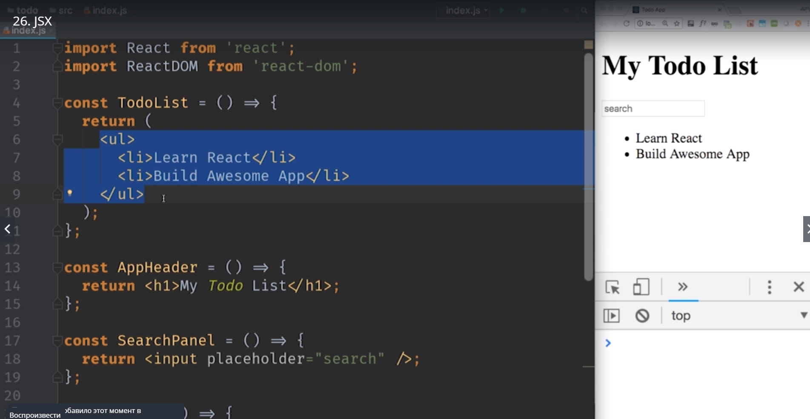

создает react  компонент. JSX код превращается в вызов функции react-create-element. По-этому корнем JSX фрагмента должен быть один элемент т.е. создать вот такой элемент

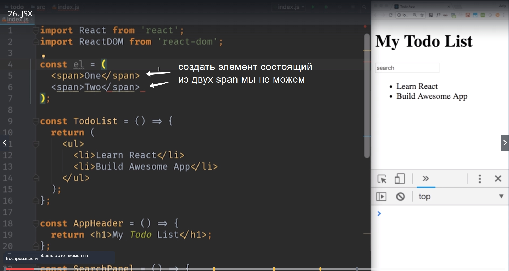

Для того что бы создать такую конструкцию ее нужно обернуть в какой-нибудь родительский элемент

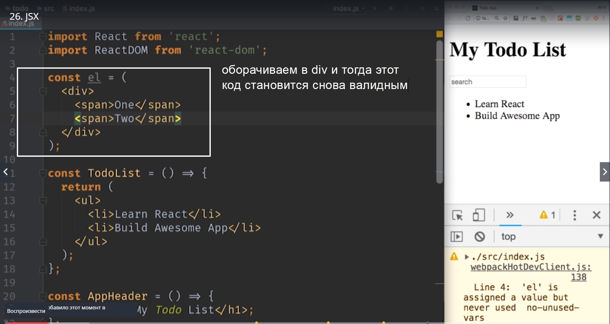

JSX похож на html, но он умеет куда больше чем html. 
JSX  умеет к примеру использовать JS выражения и их значения. Для того что бы их использовать достаточно обернуть в фигурные скобки.

Возьмем один из наших компонентов и посмотрим как это работает.

```
import React from 'react';
import ReactDOM from 'react-dom';

const TodoList = () =>{
    const items = ['Learn React', 'Build Awesome App'];
    return(
        <ul>
        <li>{items[0]}<li/>
        <li>{items[1]}<li/>
        </ul>
    );
};
const AppHeader = () =>{
    return<h1>My Todo List<h1/>;
};
const SearchPanel = () =>{
    return <input placeholder="serch"/>;
}

```

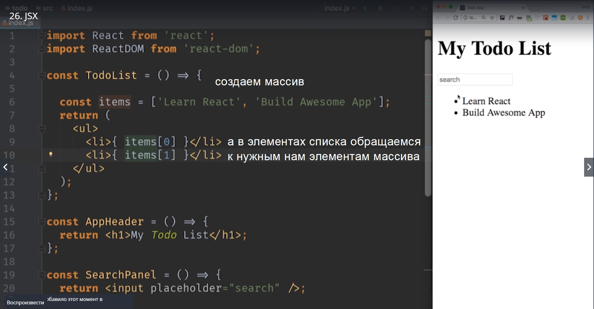

Можно использовать не только переменные но и
результаты вызова функции. Например мы решили добавить span с текущем выводом времени.

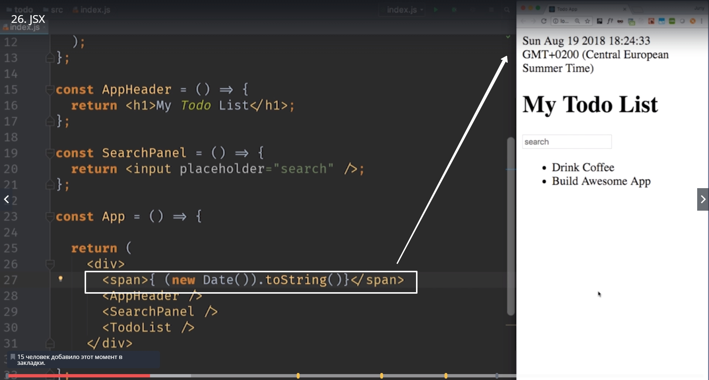

При помощи **{}** мы можем вставлять одни react элементы в другие. Как это выглядет? К примеру у нас есть какой-то react елемент, назовем его **loginBox**

```
// продолжение кода

const App = () => {
    const loginBox = <span>Login in please<span/>;
return (
    <div>
    {loginBox} // и как только страница обновится он отрендерится так как будто эта разметка  span стояла непосредственно сдесь
    <sapn>{(new Date()).toString()}<span/>
    <AppHeader/>
    <SearchPanel/>
    <TodoList/>
    <div/>
);
};

```

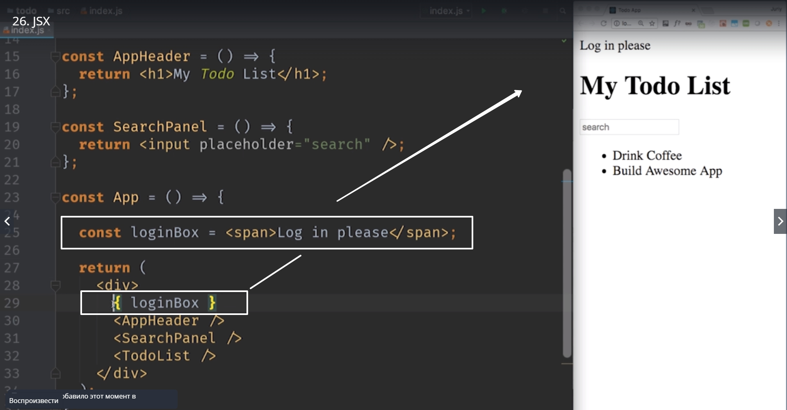

Кстати таким образом вставлять можно только react  элементы. Если вы попробуете вставить какой-нибудь другой объект например **new Date** и будете рассчитывать что что-то получится

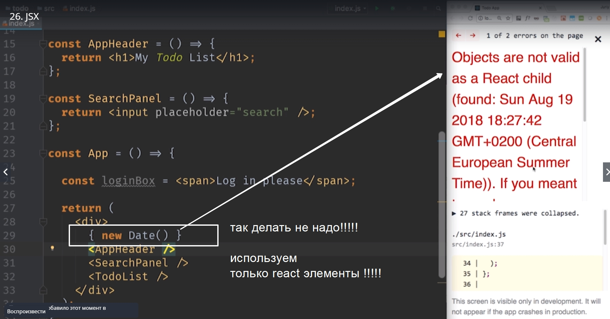

Можно использовать react элементы, строки, числа, Булево значение.

Обратите внимание на разницу в синтаксисе. Если бы **loginBox**  это был бы компонент, то мы бы его добавили точно так же как другие компоненты **< LoginBox/>**. Но поскольку **loginBox** это react элемент мы добавляем его через **{loginBox}.**

Еще одно полезное свойство, если значение в фигурных скобках **null** или **undefined**, то для  для react это не будет ошибкой. Этот блок будет попросту проигнорирован.


И используя это свойство мы можем вставлять кусочки логики прямо в JSX. 
Давайте представим что у нас есть константа **const   isLoggedIn = true;** Которая говорит залогинен наш пользователь или нет. 
Предположим что мы хотим отображать  на странице **loginBox** только для тех пользователей которые не залогинены.
Мы можем написать внутри его , **loginBox**, фигурных скобок выражение, **{isLoggetIn ? }**
? - это тернарный if, тернарный оператор. Если пользователь залогинен мы ничего не будем отображать **null**, если не залогинен то loginBox.

```
// продолжение кода

const App = () => {

     const isLoggedIn =  true;
     const loginBox = <span>Login in please<span/>;
return (
   
    <div>
    {isLoggedIn ? null : loginBox} 
    <sapn>{(new Date()).toString()}<span/>
    <AppHeader/>
    <SearchPanel/>
    <TodoList/>
    <div/>
);
};

```

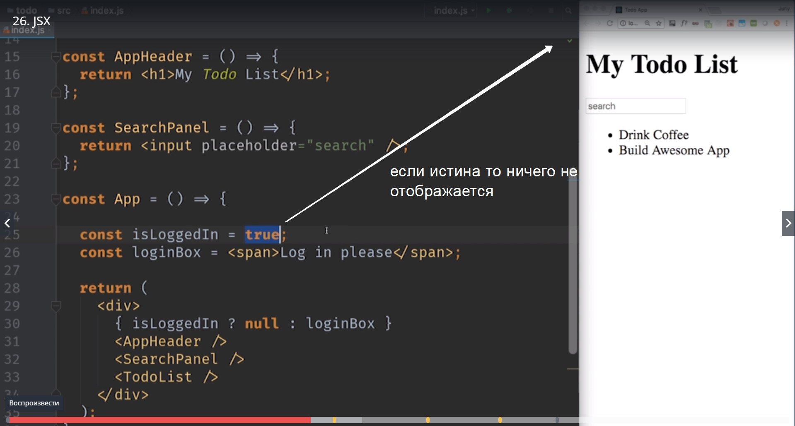


Если мы меняем на ложь то видим

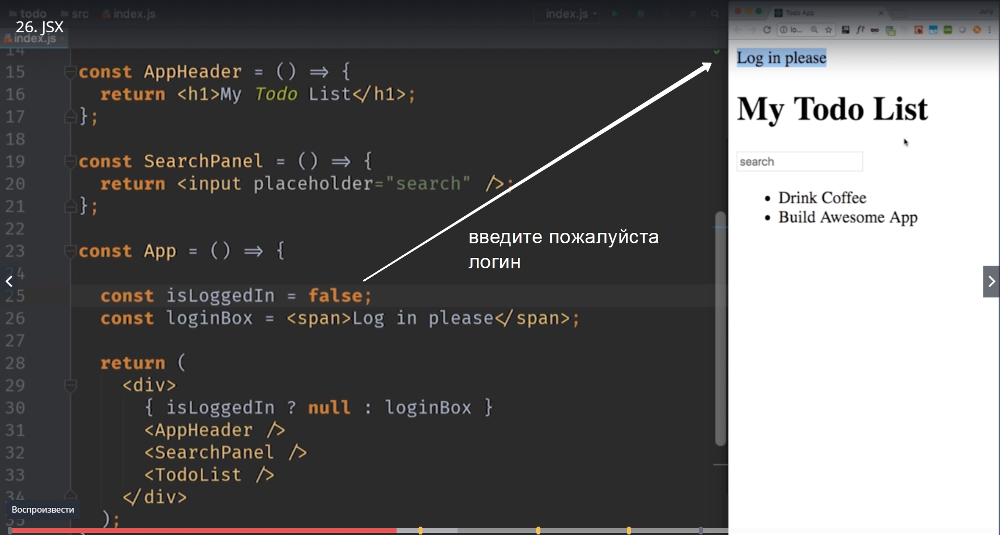

Ну и конечно мы можем расширить этот пример. Скажем у нас есть **сonst welcomBox = < span>Welcom Back< span/>**. И в зависимости от переменной **isLoggedIn** либо **welcomBox** или **loginBox**

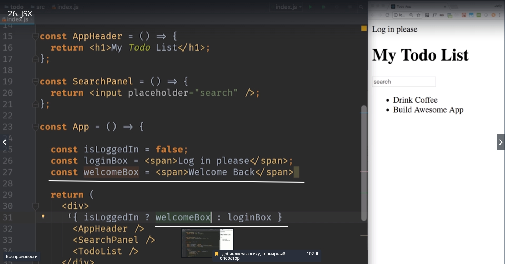

Таким образом мы прямо в JSX вставлять куски логики которые позволяют отображать или скрывать компонент в зависимости от значения переменных.

Но с логикой в JSX  нужно знать меру. Небольшая логика вроде такого тернарного оператора **{isLoggedIn ? null : loginBox}** это абсолютно нормально. НО если сдесь **{isLoggedIn ? null : loginBox}** начинают появляются более сложные выражения, скорее всего стоит переместить эту логику туда где ее легче писать т.е. в JS.

Кстати кроме undefined и null значение true и false  тоже будут полностью проигнорированы, т.е. никаких объектов отображаться внутри фигурных скобок не будет.

Мы с вами рассмотрели как можно использовать фигурные скобки для того что бы создавать child элементы. 
НО фигурные скобки еще можно использовать для того что бы передавать значения атрибутов. К примеру у нас есть атрибут placeholder = "search". Если мы хотим  по какой-то причине вынести значение этого атрибута в переменную или константу.

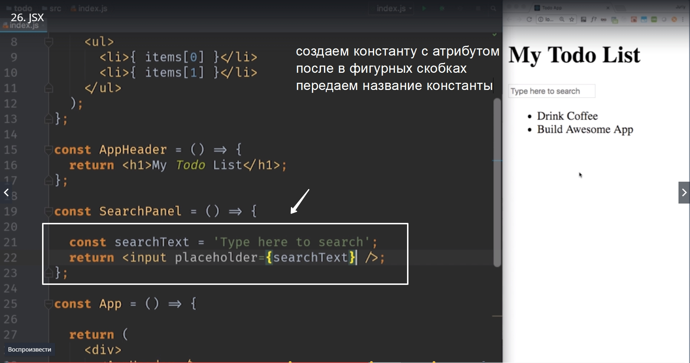

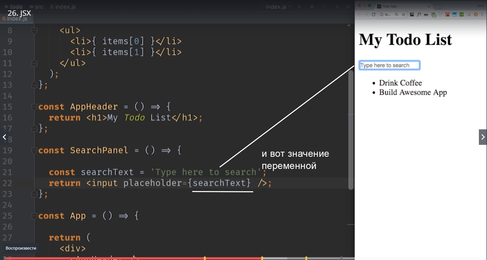

Атрибуты в react  терминологии называются **свойствами** или **properties**. B для значений свойств не расспостраняются такие же ограничения как для значений child  элементов. 
Помните мы не могли передать объект в качестве child элементов, когда мы пробовали это сделать то у нас выдавалась ошибка. 

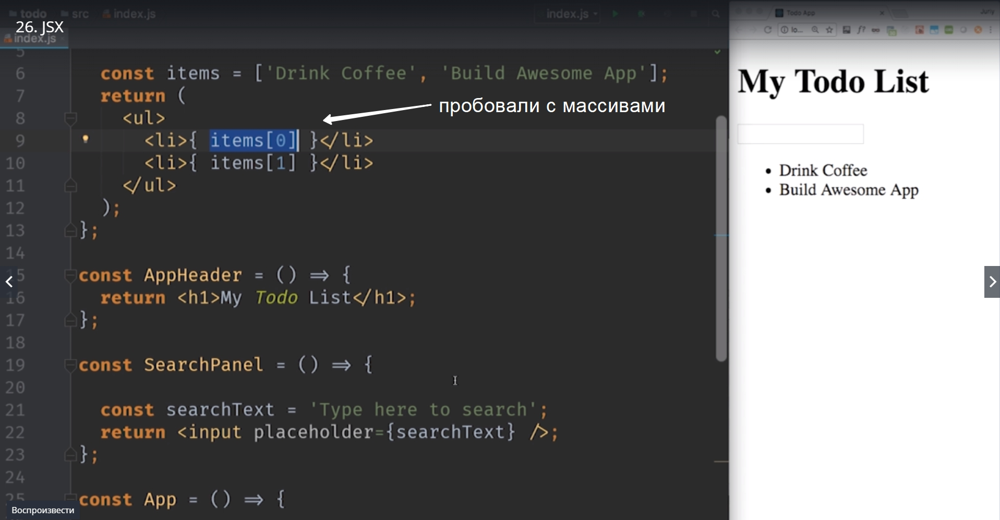

В качестве значения атрибута мы можем передавать совершенно все что угодно. Для обычных html тегов это не имеет смысла поскольку любой html тег так или иначе ожидает получить строку в качестве значения своего атрибута.

А вот передавать какие-нибудь значения внутрь ваших кастомных компонентов имеет огромный смысл. Например мы могли бы передать в TodoList Кастомный properties свойства items и в качестве items передать массив тех элементов которые мы хотим отобразить

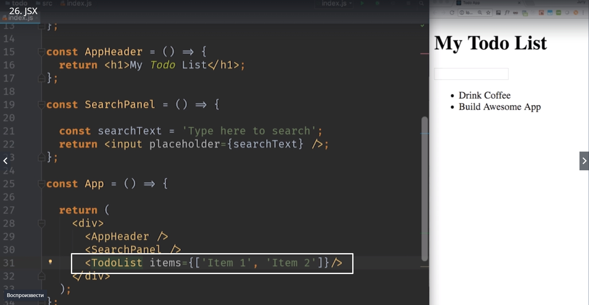

пока что мы не знаем как использовать значение вот таких вот свойств в наших собственных компонентах, но скоро научимся. С точки зрения JSX это абсолютно валидный синтаксис.

В html свойства можно писать как угодно, можно писать маленькими буквами, можно писать большими буквами, но в JSX правила немного строгие, для html тегов названия атрибутов нужно писать **camel case - ом** с маленькой буквы т.е. **autoComplete =""** Вот таким образом с маленькой буквы и сеждое последующее слово с большой

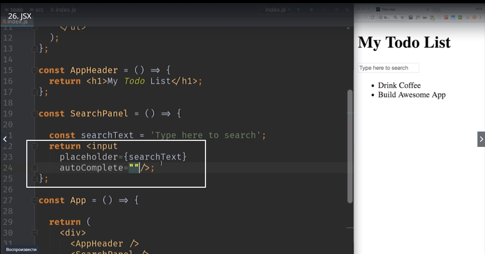

Еще один пример.

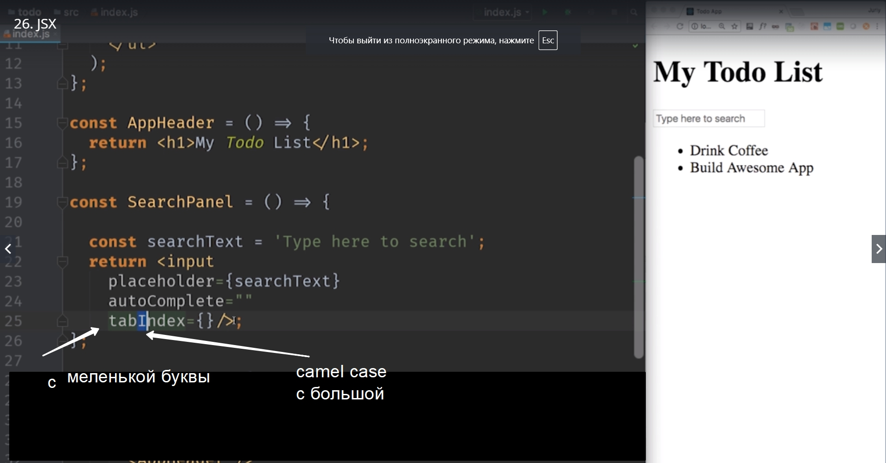


Некоторые привычные html атрибуты называются немного иначе в JSX. И таих примеров всего 2-ва.

1. -й пример это атрибут class в html. В JSX нужно писать **className = ""** для того что бы получить тот же эфект.
2. -й такой переименованый атрибут это атрибут **for**. Он как правило ставится на lable для того что бы указать к какому html элементу этот lable относится. В JSX он называется **htmlFor**.

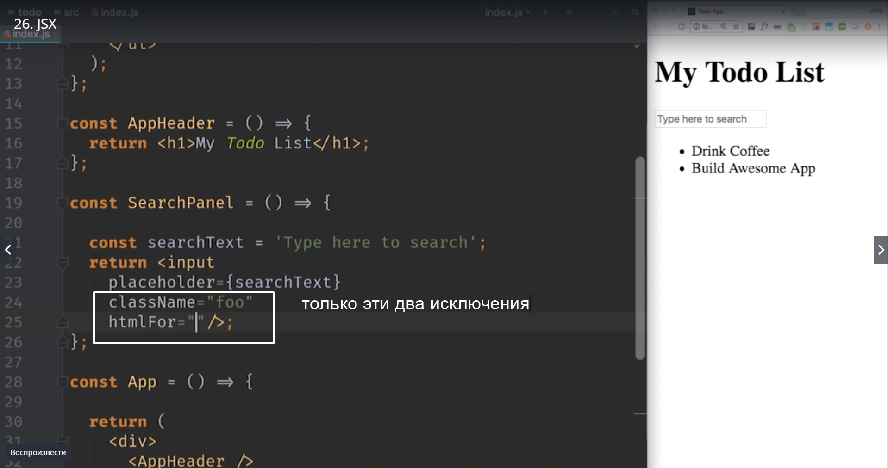

Только эти два исключения. Все остальные атрибуты называются точно так же как в html только с использованием camel case  верхнего регистра.

Хочу еще раз обратить ваше внимание на этот атрибут **className = ""** вместо class это очень типичная ошибка.

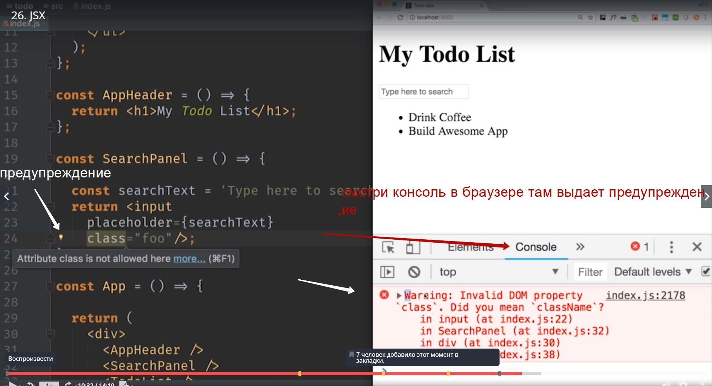

В ошибке говорится о неправильном свойства DOMclass. Вы может быть имели className.

Давайте теперь посмотрим как можно какому-нибудь элементу, например input передать какой-нибудь стиль. Для того что бы это сделать нам нужно передать объект который описывает свойства css свойства которое мы хотим установить на этом элементе. 
создаем объект **searchStyle{fontSize: 25px};** 

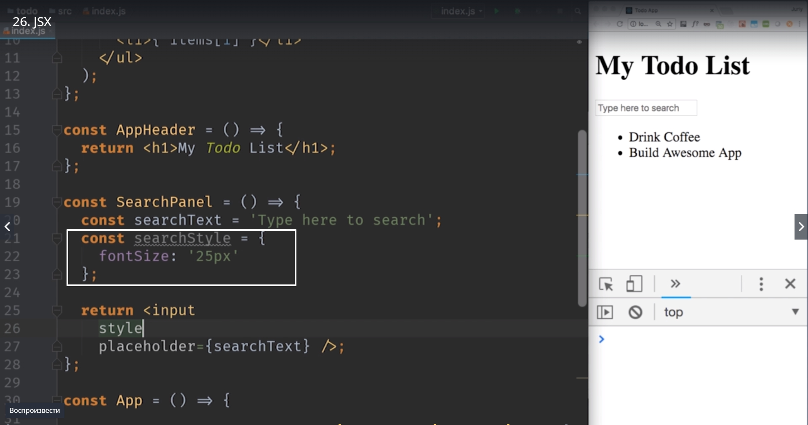

И затем этот объект передаем в качестве стиля в input. Обратите внимание что используем не кавычки и название объекта, иначе мы просто передадим слово "searchStyle" в качестве стиля что не будет иметь вообще ни какого смыла. Нужно использовать фигурные скобки для того что бы передать сам объект. React получит значение из этого объекта.

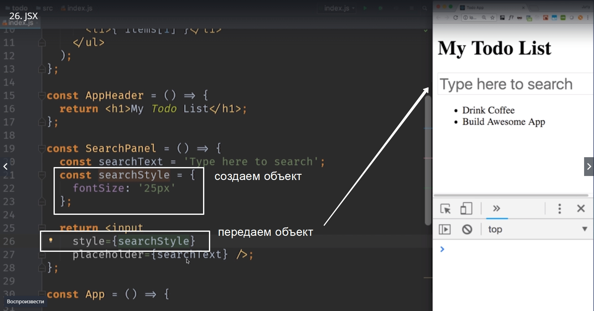

Как видите размер нашего searchBox изменился.

Конечно на практике вы будете jxtym редко использовать стили непосредственно inline на компонентах. Чаще всего всего вы будете оперировать className,  и использовать css классы для того что бы манипулировать внешним видом ваших компонентов.

Еще несколько полезных особенностей JSX. Если в свойстве не передать значение то по умолчанию оно **true**

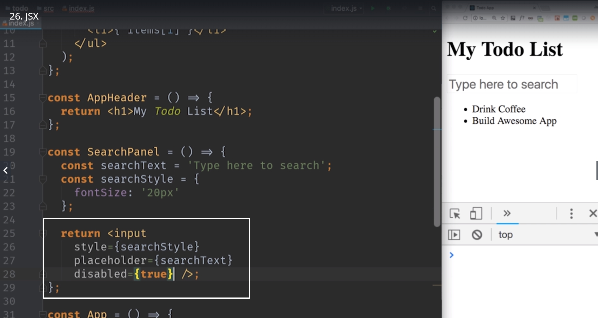

И последнее свойство JSX  это то что html по умолчанию ескейпится т.е. он становится нормальной строкой, которая нормально отобразится в браузере. 
Давайте скажем что мы получаем какое-нибудь значение с сервера. И каким-то образом, кто-то на сервер злоумышленник взял и поставил строку в которой есть script который делает что-то противное.

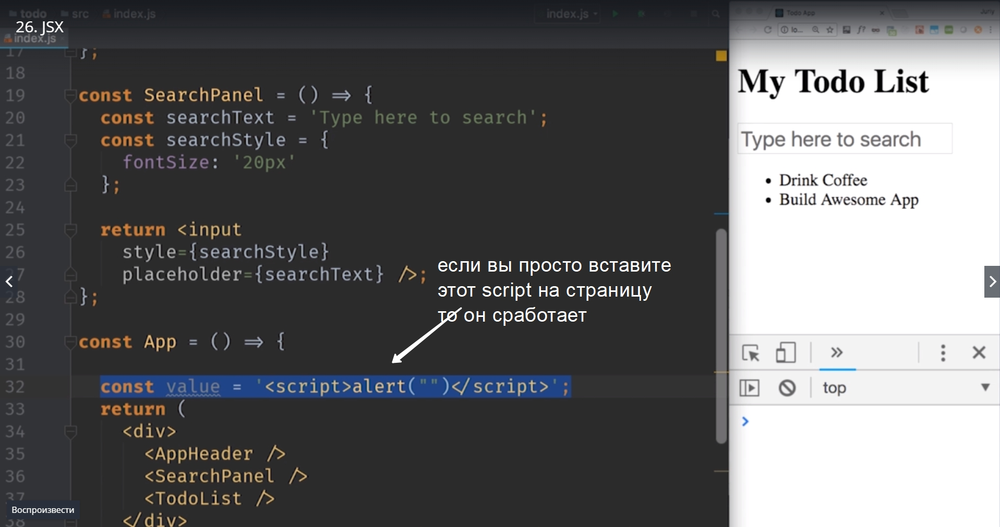

Но если вы используйте эту строку в JSX

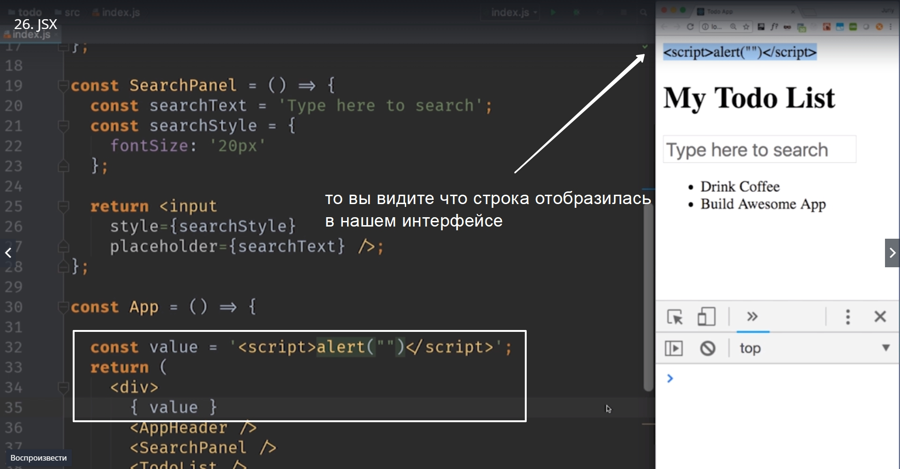

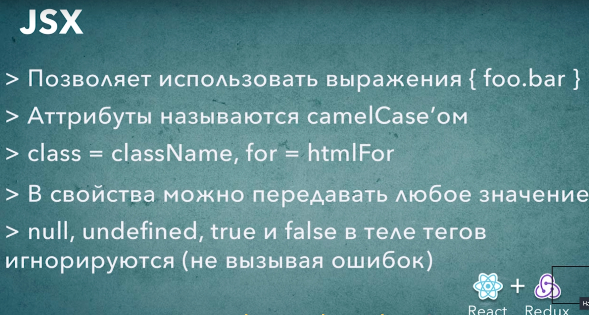
