#   Props свойства компонентов                   
Мы будем использовать синтаксис диструктуризиции и спред оператор для объектов.
Как и в обычные html элементы в react компоненты можно передавать свойства которые будут определять как элемент будет выглядеть или что он будет отображать. 
Давайте например пойдем в **Todo-list.js** в наш список дел. В < li>TodoListItem label =""< li/> мы могли бы передать свойство label ="" которое определяло что именно будет отображать этот TodoListItem к примеру Dreank Coffee.  А во втором item поставим Build React App.

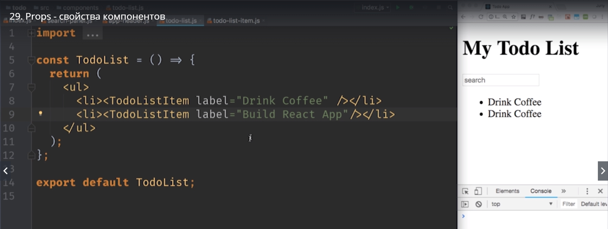

Теперь давайте перейдем в сам компонент **todo-list-item.js** и посмотрим как получить значение этого свойства. 

Что бы получить значение из нашего компонента todo-list-item.js мы можем использовать объект **Props**. Этот объект передается в каждую функцию компонент в качестве первого параметра

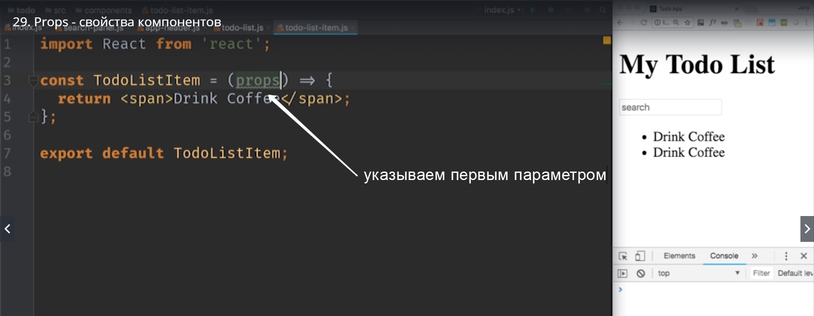

Конечно вы можете назвать его по своему, но типичное название для этого объекта именно **props**. Теперь у вас есть props а внутри этого props  будут названия тех свойств которые мы передали.

Давайте теперь используем эту строку в нашей JSX разметке так что бы мы не всегда выводили Drink Coffee,  а выводили разные значения в зависимости от того что мы передали.

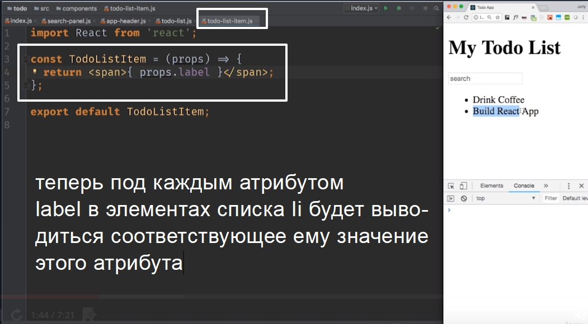

мы получили свойство **label** из объекта **props**, а передали мы его в **todo-list.js**.

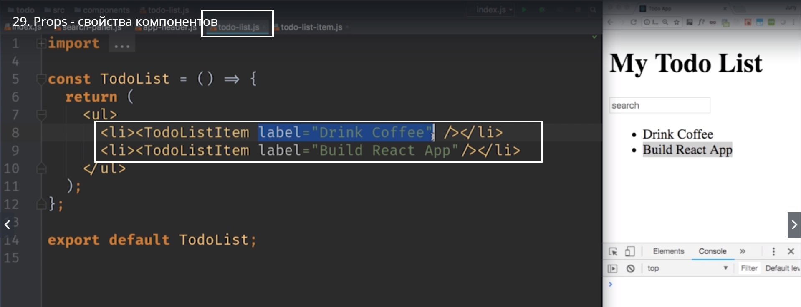

Этот код внутри todo-list-item.js  можно сделать еще проще. Если мы вспомним про синтаксис диструктуризации. 
>Помните мы можем достать значение сразу  из объекта который передается в качестве аргумента функции. Для этого мы окружаем его фигурными скобками, и пишем название свойства которое мы хотим достать. Соответсвенно Внутри функции у нас появится переменная с названием label и props мы можем убрать.

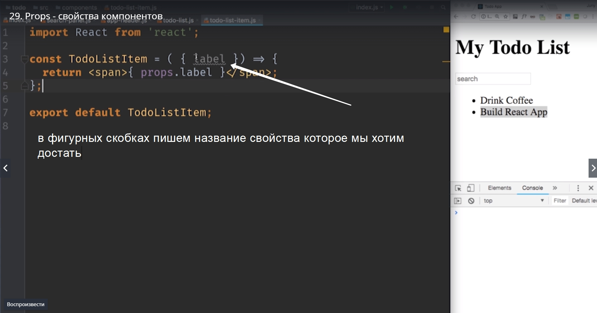

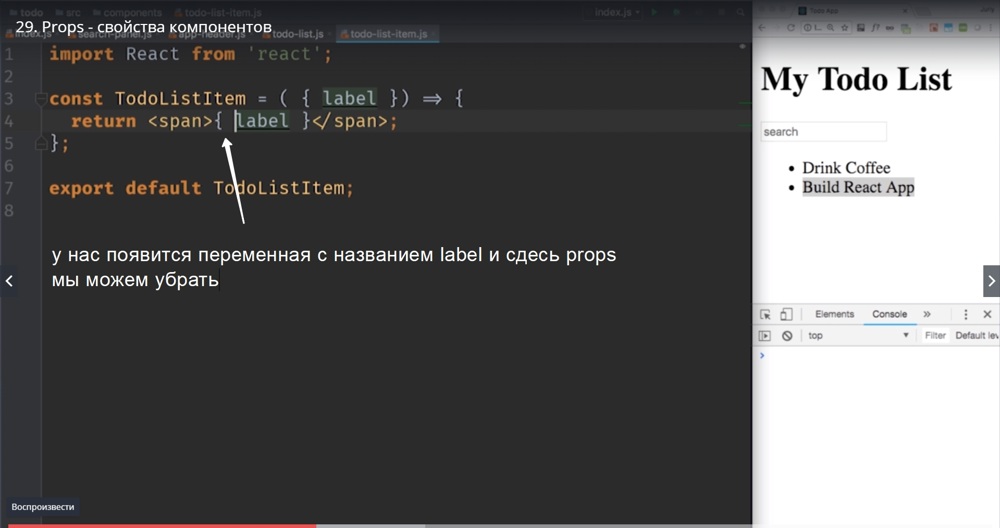

Давайте добавим еще одно свойство к нашему todo-list-item.js который будет менять внешний вид нашего компонента. К примеру если элемент списка будет отмечен как **important** Как важный, то мы выделим текст цветом.

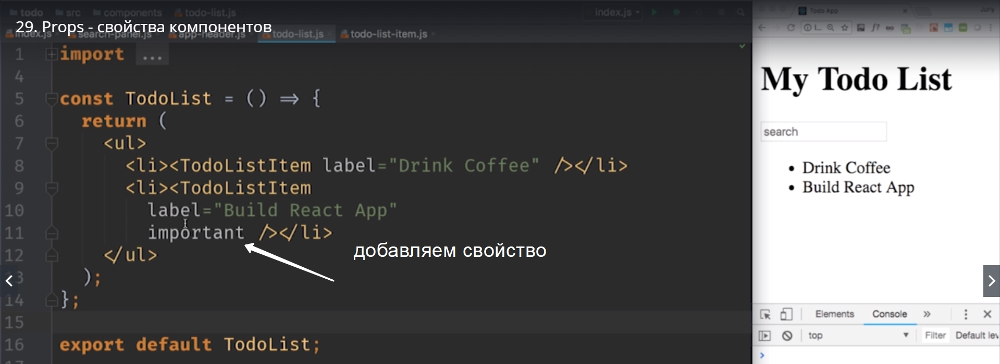

если помните урок по JSX Когда мы передаем свойства, но не передаем для него значения то значение по умолчанию будет **true**

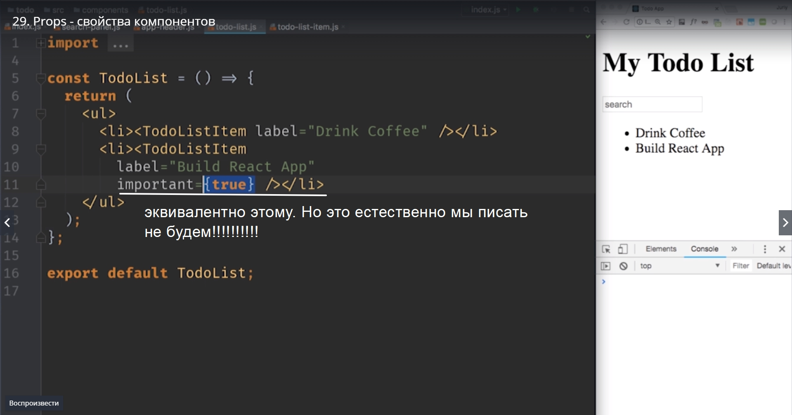

Но мы конечно это писать не будем что бы сделать наш код немного более лаконичным.

И так со стороны todo-list-item.js давайте мы добавим  important в список того что мы дестректурируем и сразуже давайте присвоим ему значение по умолчанию что бы было понятно, если мы не передаем important  вообще то по умолчанию ложь false.

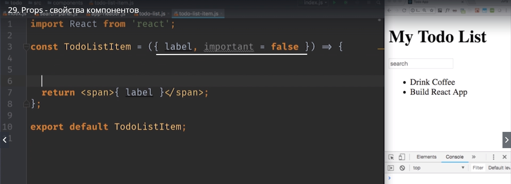

Давайте теперь немного поработаем со стилем нашего компонента и заодно вспомним как работают css стили в react. 

```
//todo-list-items.js

import React from 'react';

const TodoListItem = ({label,important = false}) =>{
    const liStyle = {
        colot: impotant ? 'tomato' : 'black'
    };
    return: <span>{label}<span/>
};
exportdefault TodoListItems;

```

Cоздаем объект **liStyle** и у этого объекта будет одно свойство. = {color: important ? 'tomato' : 'black'} Это свойство будет зависить от important, если (?) important у нас true, то важный цвет у нас будет tomato а если ( : ) это обычный item, то цвет у нас будет black.
И не забываем что нужно передать liStyle в наш span.

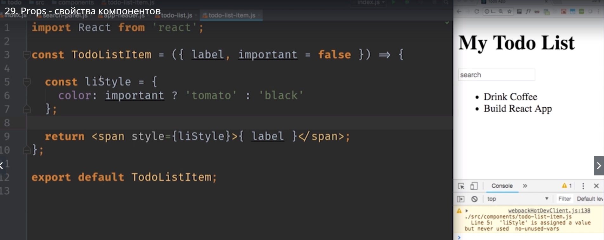

На самом деле это не liStyle это span. По этому давайте переименуем название константы

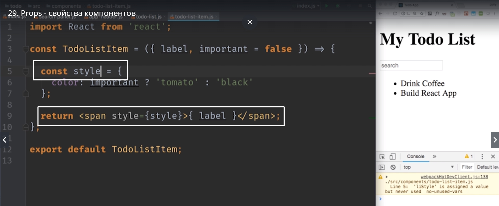

И передадим эту константу в свойства span.

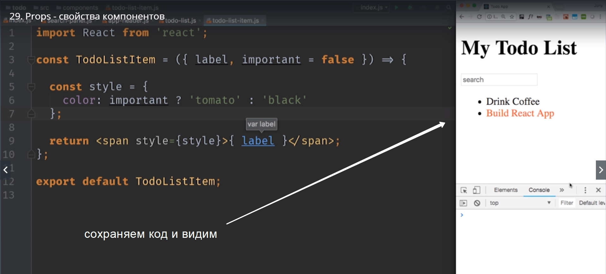

Теперь наш todo-list-item становится более похож на полноценный компонент. Он не просто возвращает куски разметки, но и содержит немного логики.

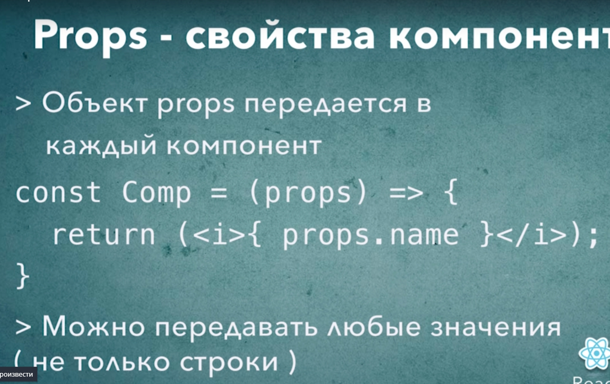