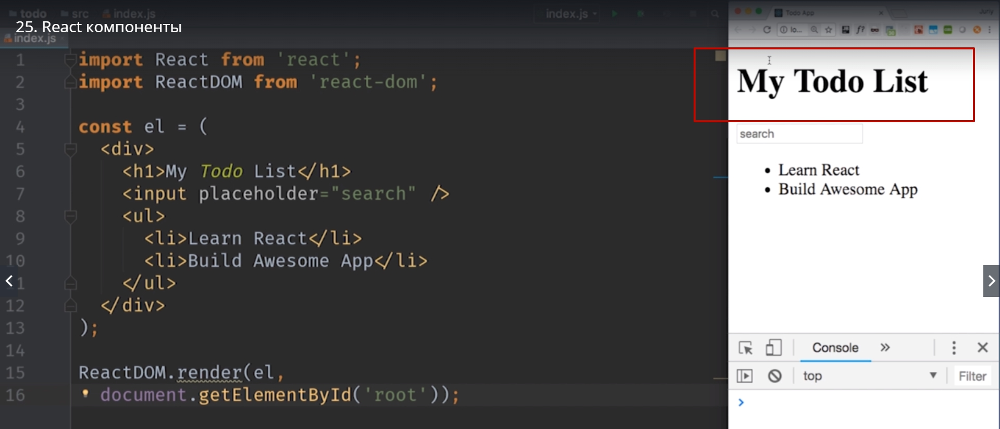
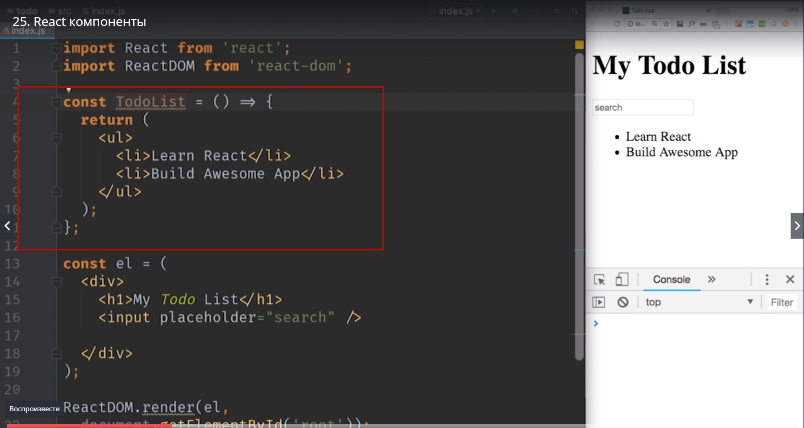
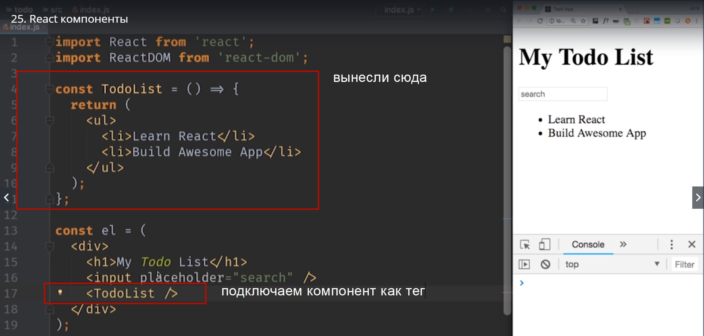
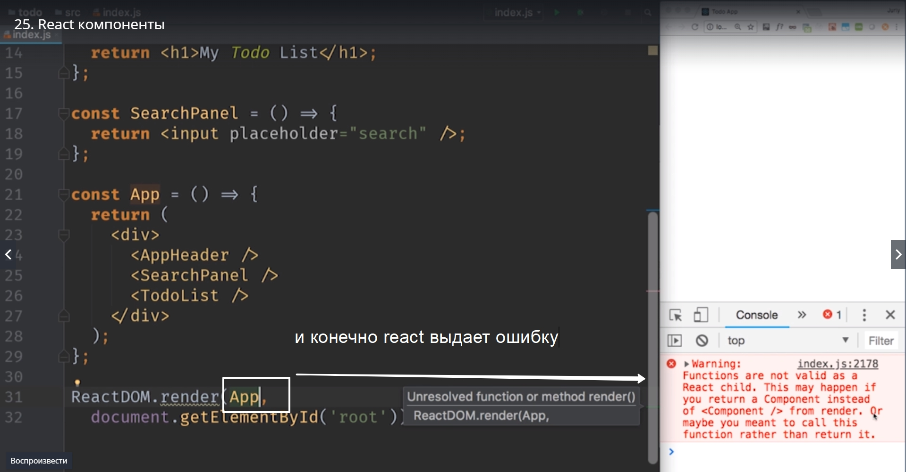
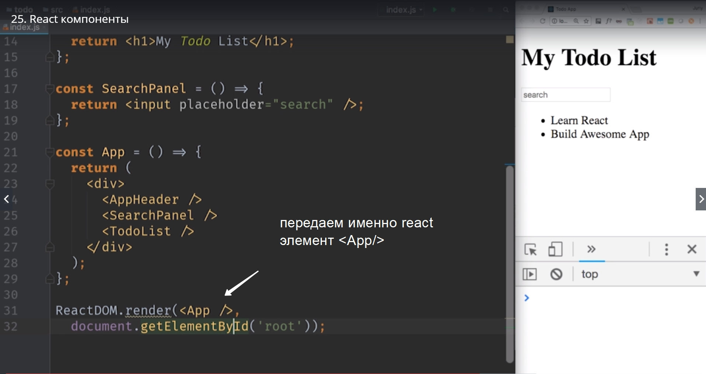

# react  компоненты

В этом видео мы будем использовать синтаксис **arrow функций** Функций стрелок.
Пользовательские интерфейсы состоят из компонентов.

Компоненты это независимые блоки пользовательского интерфейса, которые могут иметь свое собственное поведение. Взять хотя бы наше простое приложение которое мы делаем.

Заголовок может считаться отдельным компонентом



Панель поиска тоже отличный претендент на то что бы стать отдельным компонентом. Ведь она тоже выполняет свою маленькую независимую функцию.
Но и конечно сам сисок дел можно так же рассмотреть как отдельный компонент приложения.
В react реализовать компонент достаточно просто. Достаточно создать функцию которая возвращает react элемент.
Для начала вынесем в отдельный компонент наш список дел. Для того что бы это сделать создаем функцию **TodoList** и это будет **arrow** ae кция из которой мы вернем **return** JSX. Который превратиться в react элемент.

```
import React from 'react';
import ReactDOM from 'react-dom';

const TodoList = () => {
    return(
        <ul>
        <li>Learn React</li>
        <li>Build Awesome App</li>
        </ul>
    );
};

const el = (
    <div>
    <h1>My Todo List</h1>
    <input placeholder ='search'/>
    </div>
);

ReactDOM.render(el, document.getElementById('root'));


```




Dj  наш первый react компонент. Теперь имя этого компонента ,**TodoList**, можно использовать в JSX так как буд-то это отдельный кастомный HTML тег.



Как видим ничего не сломалось.

Повторим этот процесс и вынесем еще пару компонентов. К примеру заголовок h1  отличный кандидат на то что бы стать компонентом. 
Создаем еще одну функцию **AppHeader** которая возвращает react элемент. **сonst AppHeader = () =>{return();};**


```
import React from 'react';
import ReactDOM from 'react-dom';

const TodoList = () => {
    return(
        <ul>
        <li>Learn React</li>
        <li>Build Awesome App</li>
        </ul>
    );
};

const AppHeader = () =>{
    return(
      <h1>My Todo List</h1>  
    );
};

const el = (
    <div>
    <AppHeader/> // подключаем компонент
    <input placeholder ='search'/>
    <TodoList/> // подключаем компонент
    </div>
);

ReactDOM.render(el, document.getElementById('root'));


```

Если бы мы писали более сложное приложение то компонент header могбы быть более сложным. Но для нашего проекта более чем достаточно.

Так теперь input. Назовем этот компонент **SearchPanel**. и сократим запись.

```
import React from 'react';
import ReactDOM from 'react-dom';

const TodoList = () => {
    return
        <ul>
        <li>Learn React</li>
        <li>Build Awesome App</li>
        </ul>;
};

const AppHeader = () =>{
    return <h1>My Todo List</h1>;
};

const SearchPanel = () =>{
    return <input placeholder="search"/>;
}

const el = (
    <div>
    <AppHeader/> // подключаем компонент
    <SearchPanel/>
    <TodoList/> // подключаем компонент
    </div>
);

ReactDOM.render(el, document.getElementById('root'));


```

Замечательно, мы разбили наше приложение на 3-ри независимых компонента. И теперь если нам придется переиспользовать эти компоненты в других частях приложения или менять их, нам сделать это будет намного проще.

и теперь в любом месте приложения где нам нужно поместить разметку для того что бы создать **SearchPanel**, вместо того что бы каждый раз копировать одинаковый кусок JSX  кода мы можем использовать тег который мы создали **< SearchPanel/>**.

Ну и теперь логичным следующим шагом будет сказать что на самом деле все наше приложение можно тоже рассмотреть как отдельный компонент.
Давайте вынесем этот блок кода

```
 <div>
    <AppHeader/> // подключаем компонент
    <SearchPanel/>
    <TodoList/> // подключаем компонент
    </div>


```

в свой собственный отдельный компонент. и назовем этот компонент **App** от слова **aplication**.

```
import React from 'react';
import ReactDOM from 'react-dom';

const TodoList = () => {
    return
        <ul>
        <li>Learn React</li>
        <li>Build Awesome App</li>
        </ul>;
};

const AppHeader = () =>{
    return <h1>My Todo List</h1>;
};

const SearchPanel = () =>{
    return <input placeholder="search"/>;
}

const App = () =>{
return <div>
    <AppHeader/> // подключаем компонент
    <SearchPanel/>
    <TodoList/> // подключаем компонент
    </div>;
};


ReactDOM.render(App, document.getElementById('root'));
// и сдесь еще проще говорим что рендерим компонент App вместо переменной el

```

Незабудьте что ReactDOM.render В качестве своего первого аргумента принимает именно элемент а не компонент. 

**Начинающие разработчики пытаются передать в ReactDOM.render название компонента которое они будут рендерить функцию компонент** 





Обратите внимание, все наши компоненты которые мы создали мы назвали с большой буквы. Это не только сodeConvention  это требование самого react. Таким образом react  отличает наши собственные компоненты от обычных HTML тегов. Все что начинается с маленькой буквы будет интерпритироватся react  как обычный HTML тег. С большой буквы будут интерпретироваться как кастомные компоненты которые react будет пытаться найти.
Возможно сейчас кажется что мы переусердствали с разбивкой приложения на такие мелкие части. Некоторые компоненты состоят из одной строки.
Я руководствуюсь двумя принципами.
1. Если можно представить сценарий когда кусочек интерфейса можно использовать еще где-то, если он выполняет отдельную независимую функцию, то это скорее всего отдельный компонент.
2. Если код компонента становится очень большим то скорее всего его стоит разбить на более мелкие компоненты. Тут принцип точно такой же как для обычных функций и классов в программировании. Если функция становится слижком большой и сложной, время вынести часть логики в отдельную функцию.И компоненты работают абсолютно по тем же правилам.
   
В react  компоненты могут намного больше чем возвращать react элемент т.е. блок JSX кода. React  компоненты могут обладать собственным поведением. Они могут реагировать на события и создавать,генерировать события.