# React элементы

В этом уроке мы будем использовать **JS модули** и переменные **let** и **const**.
React элементы это самый маленький кирпичек на основании которого строятся любые приложения.
1. -е что мы сделаем это подключим библиотеки **react** и **react DOM**.
   
```
import React from 'react';
import ReactDOM from 'react-dom';

```

Теперь мы можем создать react элемент. Мы будем использовать JSX тот самый язык который позволяет использовать и миксовать JS код и разметку для того что бы создать наш react элемент.

```
import React from 'react';
import ReactDOM from 'react-dom';

сonst el = <h1>Hello Word</h1>

```

И последним шагом мы используем reactDOM  для того что бы отрендерить этот элемент на странице.


Первым параметром, смотри ниже, мы передаем сам элемент который мы хотим отрендерить, а вторым аргументом мы должны передать элемент на странице в который мы хотим поместить наш Hello Word. И если вы помните то в нашем проекте есть файл под названием index.html. Это html шаблон который мы будем использовать в нашем приложении. И внутри этого шаблона есть div у которого id ="root". Вот именно в этот div мы и будем рендерить наш новый react элемент.

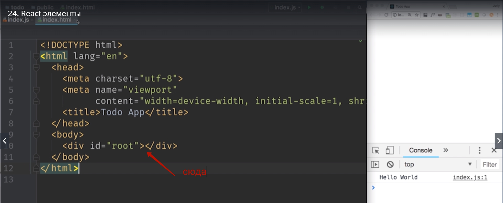


```
import React from 'react';
import ReactDOM from 'react-dom';

сonst el = <h1>Hello Word</h1>

React.DOM.render(el,
 document.getElementById('root'));

```

Смортите, как только мы сохраняем файл браузер обновляется и показывает.

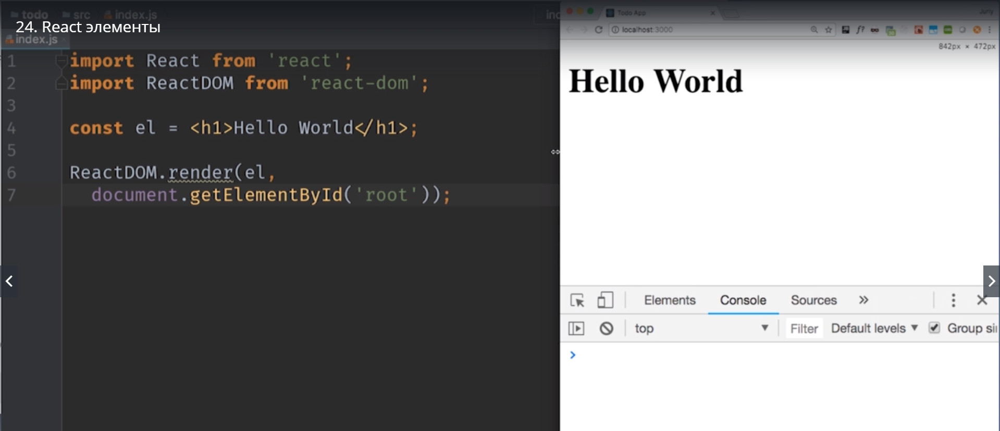

Браузер у нас смотрит на **localhost:3000**, а на фоне должно быть запущена консоль в которой работает команда **npm start** внутри папки с проектом

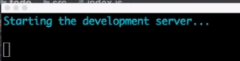

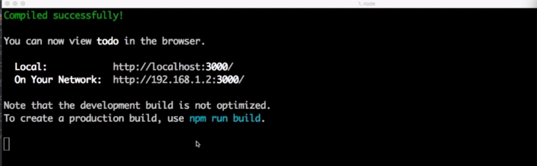

и именно благодаря этой команде которая запущена на фоне. Она мониторит что файлы изменились и обновляет браузер.

Давайте разберемся что же произошло в этих 4-х строках кода.
С импортами все понятно. Мы подключаем две библиотеки. 
Затем идет блок JSX кода. Конечно этот код это не JS поэтому браузер не сможет использовать этот код в таком виде в каком он есть. Но у нас есть инструмент который называется **Bable** который превращать этот JSX код в обычный JS. 

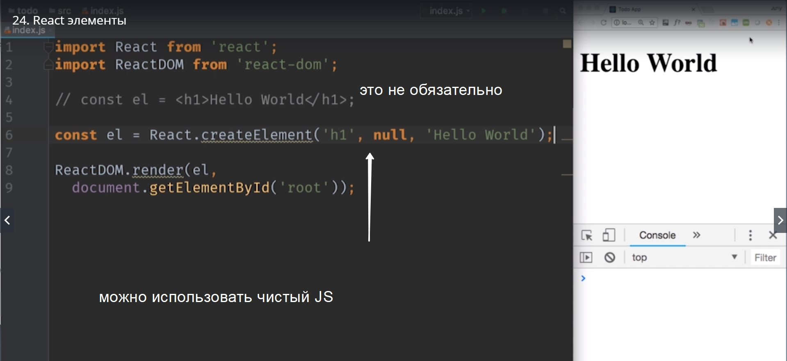

И именно так обрабатывает этот код Bable. Каждый раз когда мы сохраняем файл наш сборщик проекта WebPack, который у нас запущен в фоне


он слушает изменения в нашем проекте. Он замечает что файл изменился. WebPack запускает Bable  который превращает JSX в обычный JS.

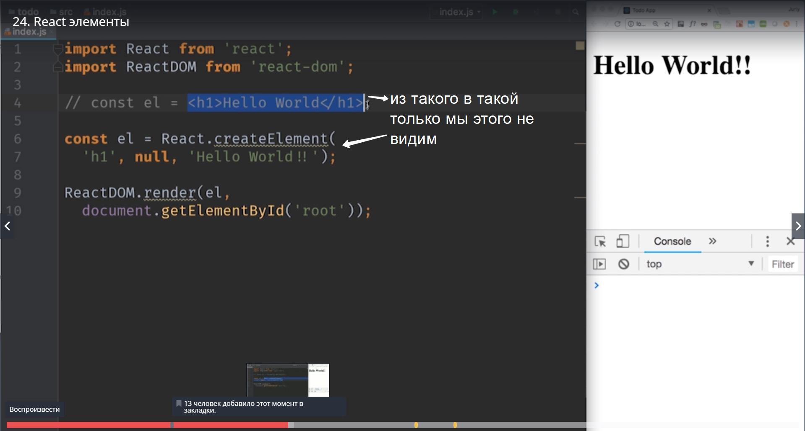

И затем WebPack шлет команду браузеру что нужно обновиться.

Мы можем писать react проект не используя JSX вообще, но его удобнее использовать чем писать код вот чисто в JS стиле.

Мы видили что этот блок кода 

```
 <h1>Hello Word</h1>;

```

Превращается в вызов метода **React.createElement** а он в свою очередь создает маленький легковесный объект, **мы его сохранили в переменной el**.

Давайте попробуем вывести в консоль наш объект.

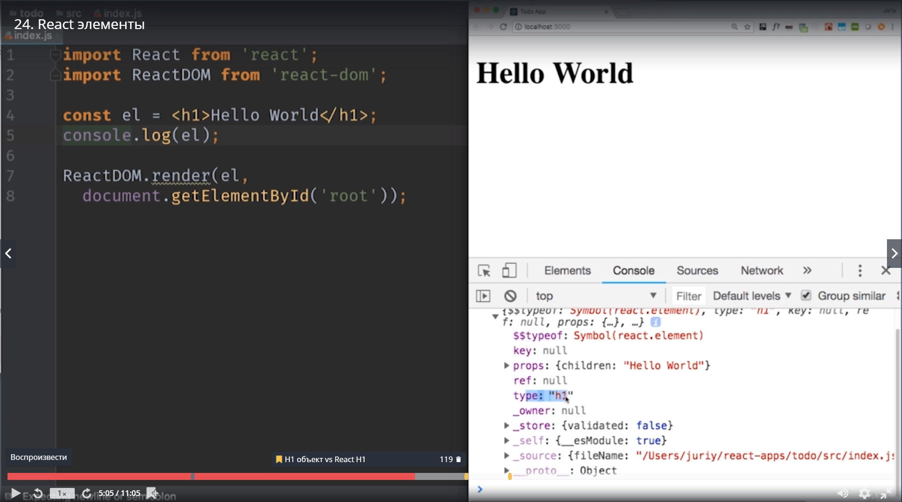

Здесь есть пара свойств которые в действительности используются props type и тд.
И так это обычный JS объект с очень маленьким набором свойств.
И особенно это становится заметным если мы сравним его с стандартным объектом который создает внутри себя браузер для того что бы держать элемент h1.
B смотрите не хватает окна консоли что бы показать.

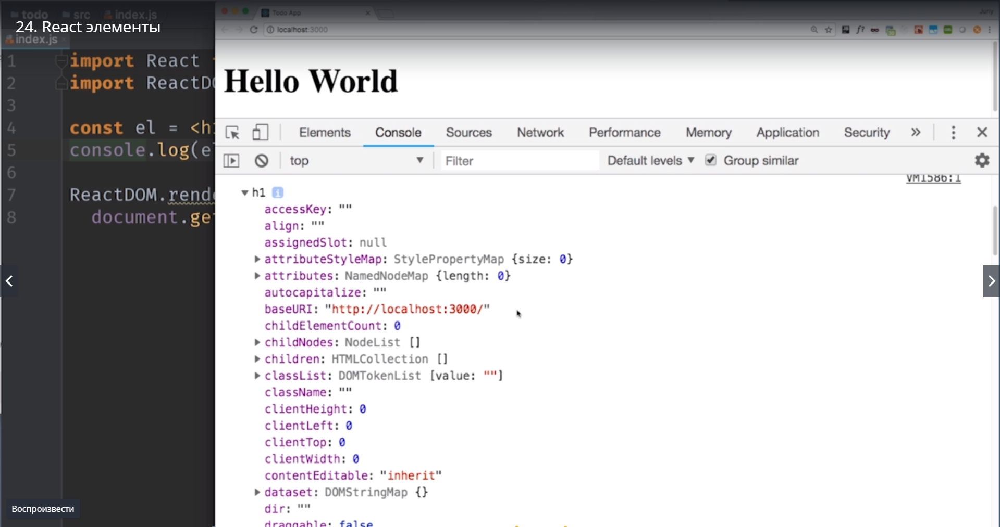

Эта техника, использовать легковесные объекты которые описывают элементы на странице, назвается vershinalDom(Вроде так). Благодаря этому подходу реакт работает так быстро.

В последней строке мы вызываем **ReactDOM.render**

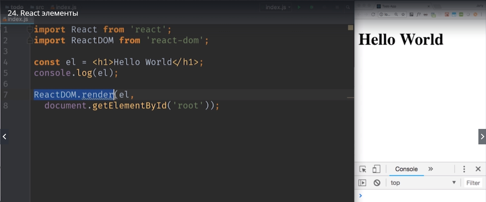

В нашем примере этот метод превращает react  элемент в настоящие объекты которые можно отобразить на странице.
На самом деле эта функция делает на много больше.

Давайте попробуем создать элемент немного посложнее.
Как на счет того что бы отобразить список дел и начать создавать наше приложение.
В JSX если блок кода состоит из нескольких строк, то его нужно поместить в круглые скобки.

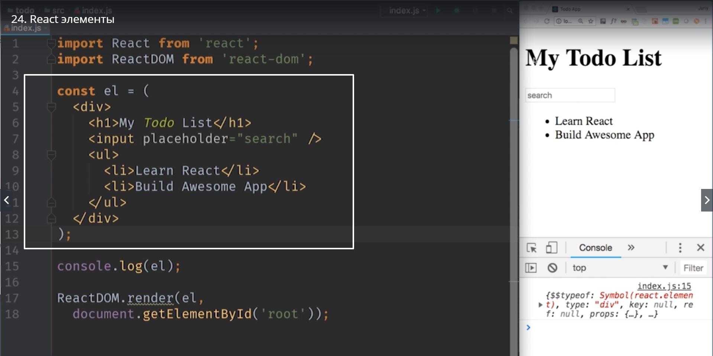

```
import React from 'react';
import ReactDOM from 'react-dom';

сonst el = (
    <div>
     <h1>My Todo List</h1>
      <input placeholder ="search"/>
       <ul>
        <li>Learn React</li>
        <li>Build Awesome App</li>
       </ul>
    </div>
)

React.DOM.render(el,
 document.getElementById('root'));

```

Теперь это начинает быть похожим на настоящее приложение. Мы создали элемент внутри которого есть другие элементы. Мы создали дерево элементов.

Еще один странный момент, мы подключили библиотеку React,  но мы не используем ее нигде в коде. Зачем же тогда она нужна?

Удаляем наш импорт с React и смотрим.

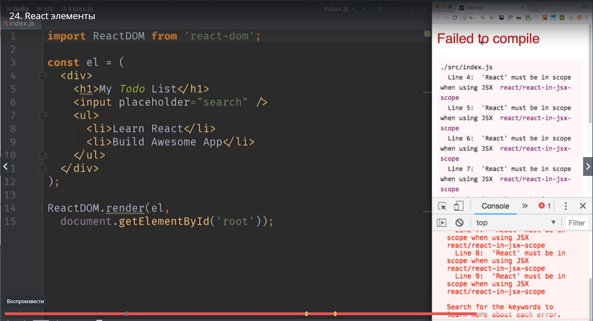

Ошибка **Filed to compile**. Все очень просто. Помните, перед тем как наш код дойдет до браузера, Bable должен преобразовать его в эквивалентный JS код.
Эквивалентный JS код выглядит вот так

```

React.createElement('h1', null, 'Hello Word');

```

Как видите уже тут в преображенном коде, который создаст для нас Bable используется библиотека react. Соответственно в любом месте где мы используем JSX мы должны импортировать react. 
Регистр тоже имеет значение при подключении библиотеки React. React обязательно должен писаться с большой буквы. Иначе сгенерирует ошибку.

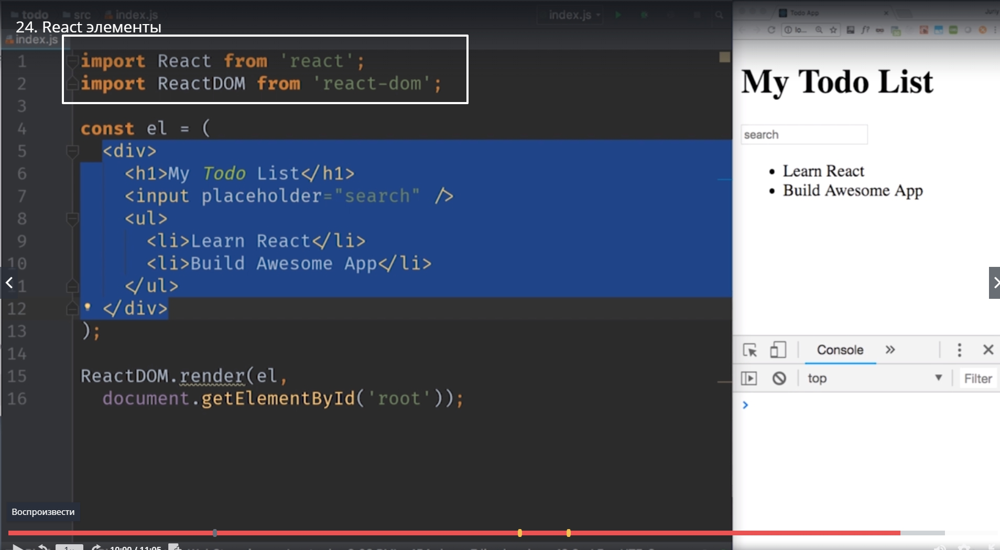

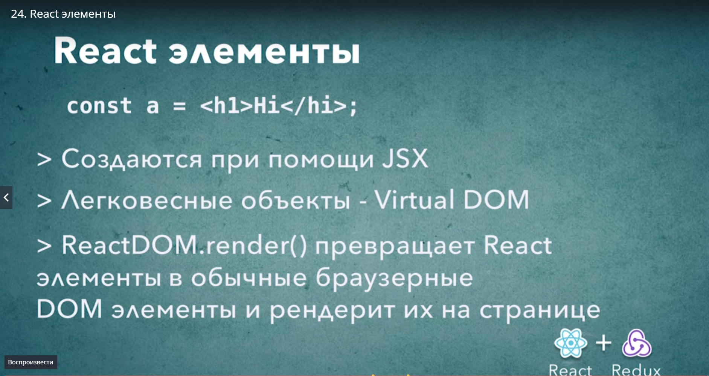