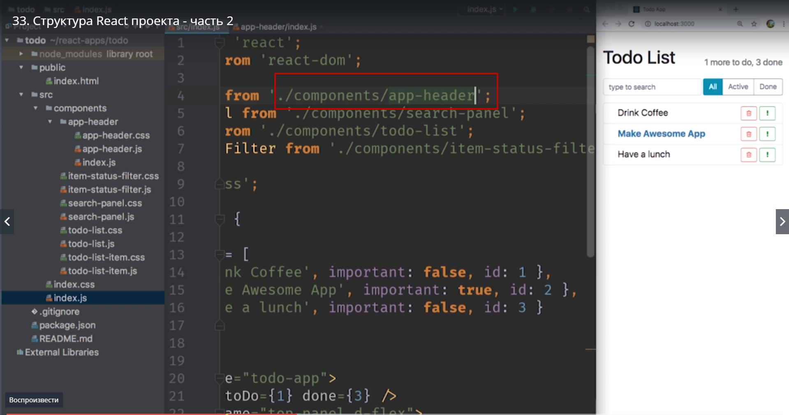
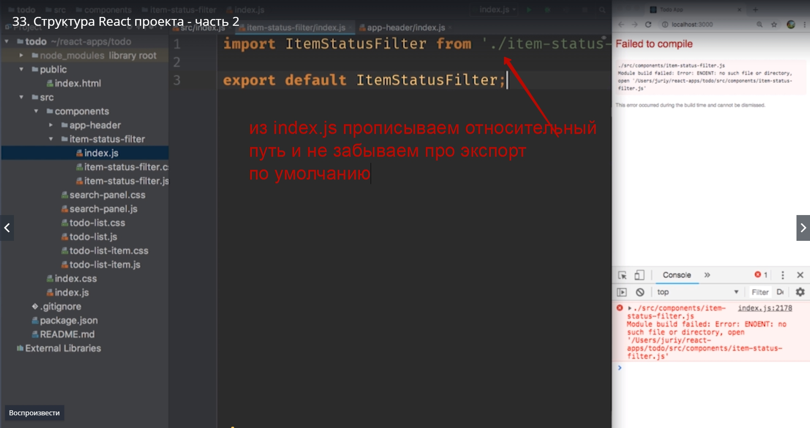
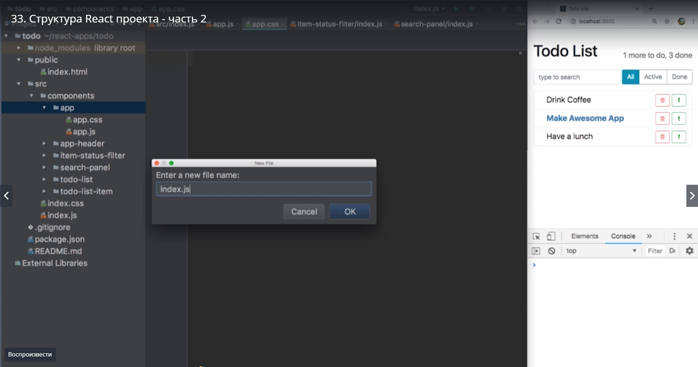

# Структура react проекта-2

Мы еще немного поработаем над структуройй нашего проекта  и еще на один шаг приблизим ее к той структуре которая используется в крупных комерческих проектах. 

Но чем же нам может не нравиться текущая структура. Ведь у нас уже у каждого компонента есть свой собственный файл и кроме того css для каждого компонента.

Дело в том что это только два файла которые описывают структуру нашего компонента. В реальном проекте есть еще как минимум один файл. Это **unitest** для компонента.

Но и кроме того для корректной работы компонента могут требоваться другие файлы. К примеру иконки. Мы можем хранить дополнительные ресурсы возле компонента. И теперь становится ясно что хранить все эти ресурсы в одной папке может быть не удобно.
По этому для каждого компонента создаем собственную папку. Папки так же называем как компонент. При этом не забываем обновить ссылки в файлах.
Но не нравится писать в каждом import одинаковое название папки и компонента. 


Хотелось бы писать названия компонентов в import 1-н раз. 
Мы можем сделать что бы компонент импортировался прямо из папки.

В WebPack есть механизм. Если WebPack видит что мы импортируем не файл а папку, внутри этой папке WebPack попробует найти файл который называется **index.js** и если этот файл существует, то это будет default импорт который будет использовать WebPack.

Создаем файл


И в этом файле мы сделаем такую штуку. Мы импортируем AppHeader из нашего файла который наззззывается AppHeader. 

```
import AppHeader from './app-header';

```

И затем сразу же мы его экспортируем default экспортом


Теперь поскольку у нас есть index.js. В нашем главном файле который тоже называется index.js


vs можем два раза не писать, а просто указать путь к папке.



Сохраняем наш файл. Убедимся что наше приложение не сломалось, и в нашей консоли нет никаких ошибок. Заметьте когда вы будете делать этот рефакторинг может случится что мы получим ошибку о том что файл не найден. В таком случае просто перезагрузите тот скрип который загружен у нас  на фоне


Иногда бывает что WebPack  не очень хорошо срабатывает когда мы добавляем новые папки или удаляем существующие. Не всегда это изменение корректно обрабатывается. Просто перезапустите dev server  **npm start** если вы видите какие то странные ошибки. Как правило это поможет вернуть проект в нормальное состояние.

Давайте проделаем это для одного компонента и создадим для него отдельную папку.





WebPack не подхватил эти изменения. Поэтому перезагружаем devserver


Далее проводим рефакторинг для всех оставшихся компонентов.


Последнее маленькое изменение. Пожалуй вынесем компонент App


который стал намного больше после того как мы добавили структуру данных со списком дел.


Этот компонент стал достаточно большим что бы поместить его в отдельный файл. Повторим нашу процедуру.


И в папке создадим нужные файлы.




Переносим весь код со всеми импортами в папку App


Все что мы делаем это получаем App из его соответствующей папки


Таким образом структура нашего **components** визуально стало существенно проще и теперь для каждого  компонента у нас еть отдельная папка. И мы четко видим где находятся все ресурсы которые необходимы для корректной работы.


