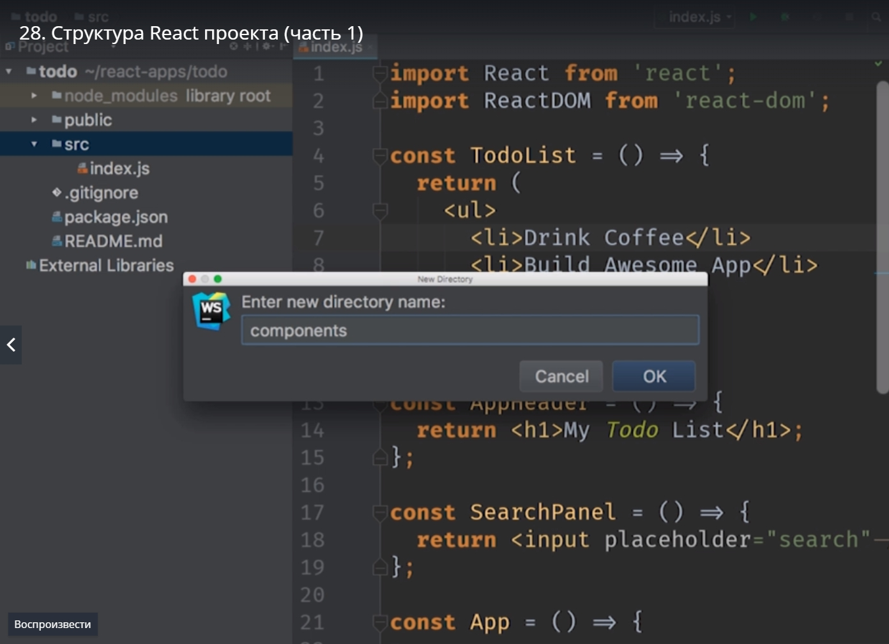
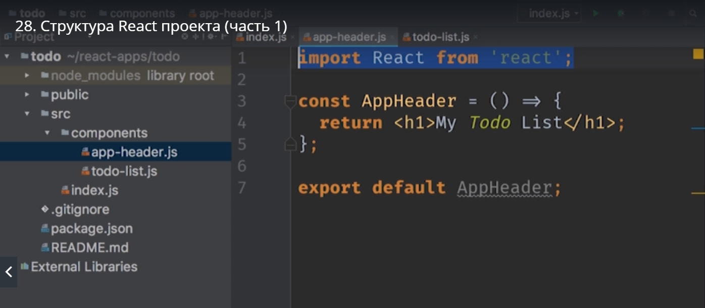

# Структура react проекта.

Все компоненты которые мы написали пока что живут в одном файле index.js. Но конечно же такой проект не массштабируется.
Давайте начнем выносить наши коипоненты в отдельные файлы.
На этом этапе может показаться зачем держать целый файл ради одного компонента? Взять хотя бы AppHeader который состоит из одной строки.

Но такая структура работает очень хорошо в крупных проектах. Один файл, один компонент - это типичный паттерн организации кода для react приложения. 
Давайте и в нашем проекте организуем код так же.

В первую очередь добавляем в папку **src** папку **сomponents**.

Потому что в react приложении кроме компонентов могут быть и другие сущности. Мы хотим что бы наш проект был аккуратным и хорошо структурированным. Поэтому все компоненты пойдут в папку **components**. И сдесь мы начнем создавать новые js файлы и называть компоненты.
Первый компонент будет **todo-list.js**

В мире react нет единого convention  как конкретно называть те файлы в которых будут находится компоненты. Этот convention называется key bap keys.Как будто кусочки названия нанизаны на палочку.
Есть другой convention называть файл как компонент **TodoListitem**

Мы будем использовать первый вариант.

**Не копируем а вырезаем и вставляем в todo-list.js**. И поскольку это JS vj уль нам нужно не забыть написать **export default Todolist;**

И точно так же поступаем с остальными компонентами.

Оставшийса компонент это SearchPanel. Компонент App оставляем в index.js поскольку это самый главный компонент который просто собирает структуру приложения вместе.

Таким образом мы немного улучшили структуру нашего проекта. На ошибку пока не обращаем внимания, потому что мы вынесли компоненты в отдельные файлы, но мы пока не используем эти файлы в нашем основном коде. 
Давайте пока это исправим. Импортируем все наши компоненты. Когда мы импортируем файлы мы указываем относительный путь, и не обязательно указывать расширения не обязательно.

Последний аспект который нужно исправить это разбить **todo-list.js** на два независимых компонента. Todo-list который будет отвечать за всю коллекцию наших item-ов. И отдельно вынести компонент todo-list-item.

и так поехали

Почему сдесь мы возвращаем span а не лист item т.е. li. Все очень просто. мы сделаем компоненты не только не зависимыми друг от друга на сколько мы можем. 
Если бы мы так же написали в теге li, то этот код мы могли бы использовать только с order листом т.е. ul другим html документом.
Через span мы делаем его более не зависимым. Если вдруг мне нужно будет отобразить list-item не в списке, а в каком-нибудь другом контексте. То мы сможем сделать это без проблем html останетсявалидным.
И соответсвенно нам нужно импортировать новый элемент.

Единственная проблема которую мы сейчас получим это то что что все Todo-list-item-ы будут одинаковыми.

Смотрите ошибку.

Смотрите теперь у нас есть два item-а каждый из которых говорит drink coffee

